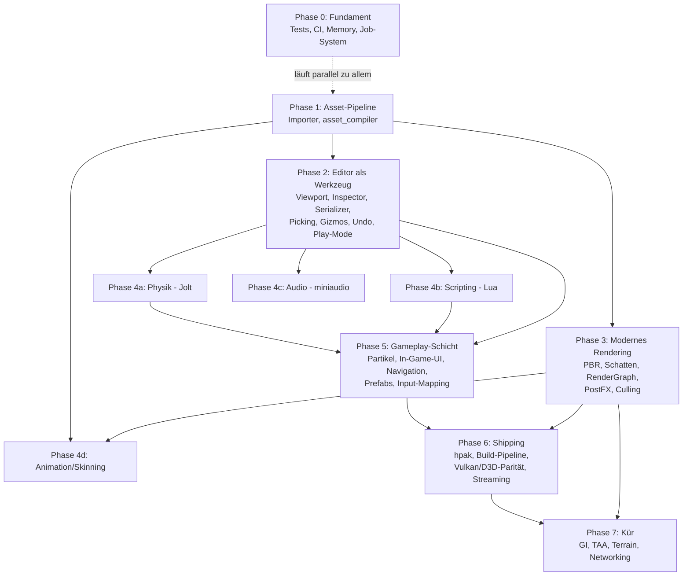

# Horizon Engine — Masterplan zur vollwertigen Engine

Stand: 12. Juni 2026. Ersetzt die Meilenstein-Sicht der ROADMAP.md durch einen
vollständigen Plan bis zur „modernen Engine auf Augenhöhe" (Referenzrahmen:
Unity/Godot-Featureset, nicht Unreal-AAA).

---

## Ist-Zustand (was schon fertig ist)

| Bereich | Status |
|---|---|
| Core: Window, App-Loop, Input, Logger, ContentManager, .hasset-Format | ✅ |
| UUID-Persistenz im META-Chunk (v2) | ✅ |
| Erster Render-Pfad: ECS-Welt → sichtbares Mesh auf GL **und** Metal (CommandBuffer, RenderWorld, RenderExtractor, Kamera) | ✅ |
| Editor-Shell: Hub, Docking, Outliner, Content Browser | ✅ |
| Backend-Gerüste GL/Metal/Vulkan/D3D11/D3D12 | ✅ Alle 5 zeichnen Szene + Directional-Schatten; GL+Metal auf macOS verifiziert (inkl. HDR/Tonemapping), D3D11/D3D12/Vulkan auf Windows validiert (HDR dort noch offen) |
| Asset-Importer (Texture/Mesh/Material/Audio), asset_compiler, Packer | 🔴 Stubs |
| SceneSerializer | 🔴 nur Name + Hierarchie |
| RenderGraph, RenderPass, RenderResourceManager, GPUMemoryAllocator | 🔴 leer |
| Memory (Ref\<T\>, Allocatoren) | 🔴 leer |
| Physik, Scripting, Audio, Animation, Partikel, Navigation, In-Game-UI | 🔴 fehlen komplett |
| Tests, CI, Profiling | 🔴 fehlen |

---

## Abhängigkeitsgraph (Phasen)

Kernaussage: **Asset-Pipeline (P1) ist der Flaschenhals** — Editor-Ausbau,
Rendering-Features und Animation hängen alle daran. Die vier 4er-Blöcke sind
untereinander unabhängig und parallelisierbar.

---

## Phase 0 — Fundament (Querschnitt, sofort startbar, läuft nebenher)

Keine Abhängigkeiten; jede Woche ein bisschen davon.

| # | Aufgabe | Hängt ab von | Details |
|---|---|---|---|
| 0.1 | **Test-Gerüst** (doctest oder Catch2) | — | Zuerst: SlotMap, HAsset-Roundtrip, SceneSerializer-Roundtrip, ContentManager |
| 0.2 | **CI** GitHub-Actions-Matrix (macOS + Windows, später Linux) | 0.1 | Build + Tests pro PR; verhindert Backend-Drift |
| 0.3 | **`Ref<T>`** (intrusiver Refcount) + Einsatz im ContentManager | — | Voraussetzung für Asset-Unloading (6.4) und GPU-Eviction (3.7) |
| 0.4 | **Job-System** (Thread-Pool, parallel_for, Abhängigkeits-Handles) | — | Voraussetzung für parallele Extraction (3.8), Async-Loading (6.4), Physik-Threading |
| 0.5 | **Profiling-Hooks**: Tracy vendoren, Frame-/Zone-Marker | — | Früh einbauen ist billig, nachrüsten teuer |
| 0.6 | **Aufräumen**: doppelte glm-Kopie (vendored + FetchContent) auf eine Quelle | — | klein |
| 0.7 | **Debug-Draw-API** (Linien, Wireframe-AABBs, Text im Viewport) | Render-Pfad ✅ | Hilft jeder späteren Phase (Physik-Collider, Frustum, NavMesh sichtbar machen) |

---

## Phase 1 — Asset-Pipeline end-to-end (kritischer Pfad)

**Ziel:** glTF/PNG rein → .hasset raus → Content Browser → Szene.
Blockiert P2 (man braucht Assets zum Editieren), P3 (PBR braucht Texturen/Materialien)
und P4d (Skelette kommen aus dem Mesh-Import).

| # | Aufgabe | Hängt ab von | Details |
|---|---|---|---|
| 1.1 | **TextureImporter** | — | stb_image (liegt schon im vendor) → PIXL/TXMI-Chunks; Mipmap-Generierung gleich mitmachen |
| 1.2 | **MeshImporter** | — | cgltf vendoren (header-only); VERT/INDX/NORM/TEXC + MREF; Tangenten gleich mitberechnen (PBR braucht sie) |
| 1.3 | **MaterialImporter** | 1.1 | JSON → MTRL-Chunk; glTF-Materialien (metallic/roughness) aus 1.2 übernehmen |
| 1.4 | **asset_compiler verdrahten** | 1.1–1.3 | Verzeichnis-Walk, Endung → Importer, Inkrementalität per mtime |
| 1.5 | **Editor-Import**: Button + Drag&Drop in den Content Browser | 1.4 | ruft die Importer-Lib direkt auf, nicht das CLI |
| 1.6 | **Textur-Kompression** (BCn/ASTC, z. B. via bc7enc o. ä.) | 1.1 | kann nach hinten rutschen, aber vor Shipping (P6) nötig |
| 1.7 | **AudioImporter** (PCMD-Chunks, WAV/OGG via dr_libs/stb_vorbis) | — | unabhängig; wird erst in P4c konsumiert |

**DoD:** Heruntergeladenes glTF-Modell mit Texturen importieren und im Editor gerendert sehen.

---

## Phase 2 — Editor wird Werkzeug

**Ziel:** Szene bauen, speichern, laden, abspielen — ohne Code anzufassen.
Braucht P1 (Assets zum Platzieren); 2.1–2.2 können sofort parallel zu P1 starten.

| # | Aufgabe | Hängt ab von | Details |
|---|---|---|---|
| 2.1 | **Szenen-Viewport offscreen** (FBO/MTLTexture → `ImGui::Image`) | Render-Pfad ✅ | Renderer-API `SetRenderTarget(w,h)` + `GetViewportTexture()`; Resize-Handling |
| 2.2 | **SceneSerializer vervollständigen** | — | alle Komponenten (Transform, Mesh, Material, Light, Camera, RigidBody, Script, Transform2D) + Binary-Pfad; Versionierung beibehalten |
| 2.3 | **Inspector-Panel** | 2.2 sinnvoll | Komponenten anzeigen/editieren, Add/Remove-Menü; Reflection-Mini-Makro lohnt sich hier schon |
| 2.4 | **Outliner-Ausbau** | — | Entity anlegen/löschen/umbenennen, Reparenting per Drag&Drop, Selektion ↔ Inspector |
| 2.5 | **Picking** (ID-Buffer-Pass; Entity-ID im RenderObject existiert) | 2.1 | Klick im Viewport selektiert |
| 2.6 | **Gizmos** (ImGuizmo vendoren) | 2.1, 2.5 | Translate/Rotate/Scale + Snap |
| 2.7 | **Undo/Redo** (Command-Pattern auf Komponentenebene) | 2.3 | Toolbar-Icons existieren schon |
| 2.8 | **Play-in-Editor** | 2.2 | Welt-Snapshot in Memory-Buffer bei Play, Restore bei Stop |
| 2.9 | **Editor-Kamera-Komfort** | 2.1 | Orbit/Fly-Modus, Focus-on-Selection (F), Grid im Viewport |

**DoD:** Szene zusammenklicken, speichern, Editor neu starten, weitermachen, Play drücken.

---

## Phase 3 — Modernes Rendering

Reihenfolge nach Sichtbarkeit pro Aufwand. Braucht P1 für Materialien/Texturen;
3.1 und 3.3 gehen sofort.

| # | Aufgabe | Hängt ab von | Details |
|---|---|---|---|
| 3.1 | **FrustumCuller + RenderSorter** | Render-Pfad ✅ | Header existieren, AABB.h liegt in Core/Math; Culling → Sorting → Submit |
| 3.2 | **Shader-Cross-Compile** ausbauen | — | `glslc → SPIR-V → SPIRV-Cross → MSL/HLSL` im shader_compiler; beendet handgeschriebene MSL-Duplikate und ist Voraussetzung für Vulkan/D3D-Parität (6.2) |
| 3.3 | **Beleuchtung**: Blinn-Phong → **PBR** (metallic/roughness) | 1.2/1.3 für echte Materialien | LightData als Uniform-Block; Punkt-, Spot-, Directional-Lights |
| 3.4 | **RenderGraph + Pass-System aktivieren** | 3.1 | GeometryPass → PostProcessPass als erste Knoten; .cpp sind leer, Header + Design-Doc existieren |
| 3.5 | **Schatten**: Directional mit einer Cascade → CSM | 3.4 | danach Punkt-/Spotlicht-Schatten |
| 3.6 | **HDR + Tonemapping** als erster PostProcess-Pass | 3.4 | danach Bloom |
| 3.7 | **RenderResourceManager + GPUMemoryAllocator** | 0.3 | Budget + LRU-Eviction, `onHandleUsed`-Hook beim Draw |
| 3.8 | **Instancing + parallele Extraction** | 3.1, 0.4 | instanceCount im DrawCall existiert schon |
| 3.9 | **Skybox + IBL** (Environment-Map, Irradiance/Prefilter) | 3.3 | macht PBR erst „modern aussehend" |
| 3.10 | **Transparenz-Pass** (sortiertes Alpha-Blending) | 3.1, 3.4 | OIT ist Kür (P7) |
| 3.11 | **Anti-Aliasing**: FXAA zuerst | 3.6 | TAA ist Kür (P7) |
| 3.12 | **SSAO** | 3.4 | optionaler, aber sichtbarer Gewinn |

**DoD:** PBR-Szene mit Schatten, HDR, Skybox bei stabilen Frametimes; Frustum-Culling messbar via Tracy.

---

## Phase 4 — Engine-Systeme (vier unabhängige, parallelisierbare Blöcke)

Alle brauchen P2.2 (Serializer, damit Komponenten persistiert werden) und
profitieren von P2.8 (Play-Mode zum Testen).

### 4a — Physik
| # | Aufgabe | Hängt ab von | Details |
|---|---|---|---|
| 4a.1 | **Jolt Physics** integrieren (FetchContent) | 2.2, 2.8 | gegen RigidBodyComponent; fixedUpdate-Hook im GameLoop existiert |
| 4a.2 | Collider-Komponenten (Box/Sphere/Capsule/Mesh) + Debug-Draw | 4a.1, 0.7 | |
| 4a.3 | Raycasts/Queries als Engine-API | 4a.1 | braucht Scripting (4b) später als Konsument |
| 4a.4 | Character-Controller | 4a.1 | |
| 4a.5 | 2D-Physik (Box2D) — optional, wenn Catania es braucht | 2.2 | Transform2D existiert schon |

### 4b — Scripting
| # | Aufgabe | Hängt ab von | Details |
|---|---|---|---|
| 4b.1 | **Lua via sol2**, ScriptComponent-Lifecycle (onStart/onUpdate) | 2.2, 2.8 | Enums sind vorbereitet |
| 4b.2 | Engine-API-Binding (Entity, Transform, Input, Spawn/Destroy) | 4b.1 | |
| 4b.3 | Hot-Reload von Scripts im Play-Mode | 4b.1 | |
| 4b.4 | Script-Properties im Inspector (exportierte Variablen) | 4b.1, 2.3 | |
| 4b.5 | C#/.NET-Hosting — später oder nie | 4b.2 | erst evaluieren, wenn Lua nicht reicht |

### 4c — Audio
| # | Aufgabe | Hängt ab von | Details |
|---|---|---|---|
| 4c.1 | **miniaudio** + AudioSource/AudioListener-Komponenten | 1.7, 2.2 | |
| 4c.2 | 3D-Spatialization, Attenuation | 4c.1 | |
| 4c.3 | Mixer/Bus-System (Music/SFX-Gruppen, Lautstärke) | 4c.1 | |

### 4d — Animation
| # | Aufgabe | Hängt ab von | Details |
|---|---|---|---|
| 4d.1 | Skelett + Skinning-Daten im MeshImporter (glTF-Skins) | 1.2 | neue Chunks im .hasset-Format |
| 4d.2 | GPU-Skinning (Bone-Matrizen als Uniform/Storage-Buffer) | 4d.1, 3.3 | |
| 4d.3 | AnimationClip-Playback + AnimatorComponent | 4d.1, 2.2 | |
| 4d.4 | Blending + State-Machine (einfacher Animator-Graph) | 4d.3 | |
| 4d.5 | Property-Animation (Transform/Material animieren, für Cutscenes/UI) | 4d.3 | |

---

## Phase 5 — Gameplay-Schicht

Macht aus „Renderer + Systeme" eine Engine, in der man ein Spiel *baut*.

| # | Aufgabe | Hängt ab von | Details |
|---|---|---|---|
| 5.1 | **Prefabs** (Entity-Hierarchie als Asset, Instanzen + Overrides) | 2.2 | enormer Workflow-Gewinn, früh in P5 machen |
| 5.2 | **Input-Mapping** (Actions/Axes statt Roh-Keys, Gamepad) | — | Scripting (4b.2) konsumiert es |
| 5.3 | **Partikelsystem** (CPU-Sim zuerst, instanziertes Rendering) | 3.8 | GPU-Sim ist Kür |
| 5.4 | **In-Game-UI-Runtime** (Canvas, Text via MSDF/stb_truetype, Buttons, Anchoring) | Render-Pfad ✅ | nicht ImGui — das ist Editor-only |
| 5.5 | **Navigation**: Recast/Detour-NavMesh-Baking + Agenten | 4a.1 | |
| 5.6 | **Szenen-Streaming/Additive-Load** (mehrere Szenen gleichzeitig) | 2.2 | |
| 5.7 | **Event-/Messaging-System** für Gameplay-Code | 4b.2 | |

---

## Phase 6 — Shipping & Plattform-Reife

| # | Aufgabe | Hängt ab von | Details |
|---|---|---|---|
| 6.1 | **hpak-Packaging**: HpakWriter + KeyDerivation implementieren, asset_compiler → Packer-Kette, GameApplication lädt aus .hpak | 1.4 | SerializeFormat::Binary-Pfad |
| 6.2 | **Vulkan-Backend auf Parität** (Draw-Pfad, danach D3D12; D3D11 ggf. streichen) | 3.2, 3.4 | Linux-Support hängt hieran |
| 6.3 | **„Build Game"-Pipeline im Editor**: Standalone-Export (Executable + .hpak) pro Plattform | 6.1 | |
| 6.4 | **Async-Asset-Streaming** (Lade-Jobs, Platzhalter-Assets, Unloading via Ref\<T\>) | 0.3, 0.4 | |
| 6.5 | **Crash-Reporting scharf schalten** (CrashHandler existiert), Logging in Datei | — | |
| 6.6 | **Linux-Window/Input-Pfad** testen + CI-Leg | 0.2, 6.2 | |
| 6.7 | **Doku**: Getting-Started, Script-API-Referenz | 4b.2 | spätestens wenn jemand Zweites die Engine benutzt |

**DoD:** Ein Knopf im Editor erzeugt ein lauffähiges, ausliefbares Spiel-Binary mit gepackten, komprimierten Assets — auf macOS und Windows.

---

## Phase 7 — Kür (nach Bedarf, von Catania getrieben)

Kein fester Plan — einzeln ziehen, wenn das Spiel es verlangt:

- **TAA** und/oder **OIT** (Order-Independent Transparency)
- **Global Illumination** (Probes/DDGI-light) und **SSR**
- **LOD-System** + Impostors
- **Terrain** + Vegetation/Foliage
- **GPU-Partikel**
- **Networking** (Replikation) — nur falls Catania Multiplayer wird
- **Virtual Texturing / Bindless** — nur bei nachgewiesenem Bedarf

---

## Empfohlene Reihenfolge der nächsten 5 Arbeitsschritte

> **Status 12.06.2026:** Alle 5 Schritte sind umgesetzt. ✅

1. ✅ **TextureImporter + MeshImporter** (1.1–1.5) — stb_image + cgltf, dazu Material-
   und Audio-Importer (dr_wav), asset_compiler-CLI mit mtime-Inkrementalität und
   UUID-Stabilität bei Re-Imports. Editor: „Import"-Kontextmenü im Content
   Browser + „Add to Scene" für Mesh-Assets. **Dazu:** GL- und Metal-Backend
   lösen `meshAssetId` jetzt wirklich auf (Upload on first sight, Basecolor-
   Textur über Material-Kette); der hartkodierte Würfel ist nur noch Fallback.
2. ✅ **Offscreen-Viewport** (2.1) — `SetViewportSize`/`GetViewportTexture` in der
   Renderer-API, GL-FBO + Metal-Offscreen-Pass, andockbares „Scene"-Fenster
   mit HiDPI-Handling und Resize.
3. ✅ **SceneSerializer vervollständigt** (2.2) — alle 8 Komponenten, JSON- und
   Binary-Pfad (CBOR derselben Struktur), Version 1.1, abwärtskompatibel.
4. ✅ **Test-Gerüst + CI** (0.1, 0.2) — doctest mit 14 Test-Cases (SlotMap,
   HAsset-Roundtrip, ContentManager-UUID-Persistenz, Serializer-Roundtrips),
   GitHub-Actions-Matrix macOS + Windows in `.github/workflows/ci.yml`.
5. ✅ **Inspector + Outliner-CRUD** (2.3, 2.4) — Details-Panel mit allen
   Komponenten-Editoren + Add/Remove-Component; Outliner mit Selektion,
   Create/Rename/Delete und Drag&Drop-Reparenting (zyklensicher via
   `HorizonWorld::reparentEntity`, rekursives `destroyEntity`).

> **Bugfix 13.06.2026:** Editor-Crash beim Viewport-Resize behoben (Use-after-free:
> `EnsureViewportTarget` gab die alte MTLTexture frei, während die ImGui-Drawlist
> desselben Frames sie noch referenzierte → SIGSEGV in `setFragmentTexture:`).
> Fix: Retired-Texture-Graveyard, Freigabe erst 3 Frames später (GL + Metal).
> Regression-Hook: `HE_VIEWPORT_RESIZE_STRESS=1` ändert die Viewport-Größe
> jeden Frame — damit verifiziert.

> **Status 13.06.2026:** Auch die zweite Top-5-Runde ist umgesetzt. ✅

1. ✅ **Picking** (2.5) — als CPU-Ray-AABB-Test statt ID-Buffer (bewusste
   Abweichung: backend-unabhängig, und die AABB-Infrastruktur in
   `Core/Math/AABB.h` braucht das Culling sowieso). Klick im Scene-Viewport
   selektiert das nächstgelegene Objekt, Klick ins Leere deselektiert.
   ID-Buffer-Picking kann später für Pixel-Präzision nachgerüstet werden.
2. ✅ **Gizmos** (2.6) — ImGuizmo v1.92.5 vendored
   (`src/HE_Editor/vendor/imguizmo/`). Translate/Rotate/Scale per W/E/R,
   World→Local-Rückrechnung über die Parent-Matrix.
3. ✅ **Play-in-Editor** (2.8) — Play/Stop-Button verdrahtet:
   CBOR-Snapshot bei Play, `HorizonWorld::clear()` + Restore bei Stop.
4. ✅ **FrustumCuller + RenderSorter** (3.1) und **Blinn-Phong** (3.3) —
   Gribb/Hartmann-Frustum gegen Welt-AABBs (Backends verfeinern mit echten
   Mesh-Bounds), Sortierung Mesh-gruppiert + front-to-back; bis zu 8 Lichter
   (Directional/Point/Spot mit Range-Attenuation und Spot-Kegel) auf GL und
   Metal, Fallback-Headlight für Szenen ohne Lichter.
5. ✅ **Undo/Redo** (2.7) — Snapshot-basiert (`EditorUndo`, CBOR-Weltzustand,
   max. 64 Einträge) statt feingranularer Commands: deckt alle Operationen
   einheitlich ab (Create/Delete/Reparent/Rename/Komponenten-Edits/Gizmo).
   Cmd/Ctrl+Z, Shift+Cmd+Z bzw. Ctrl+Y, Footer-Buttons mit Disabled-State.
   Bekannte Einschränkung: Selektion geht bei Undo verloren (Entity-Handles
   werden remapped).

Stand der Tests: 23 doctest-Cases (zusätzlich: AABB/Frustum/Sorter, EditorUndo,
Play-Mode-Zyklus), alle grün.

> **Status 13.06.2026 (Forts.):** Editor-Kamera (2.9) umgesetzt. ✅

**Editor-Kamera (2.9)** — Vollwertige Scene-View-Kamera (`EditorCamera`,
`src/HE_Editor/EditorCamera.{h,cpp}`) im Unity-Stil:
- **Alt+LMB** orbit um den Pivot, **MMB** pan, **Mausrad** dolly, **RMB**
  Fly-Look mit **WASDQE** (Shift = schneller), **F** = Focus-on-Selection.
- Architektur: `EditorCameraOverride` (view + Position + fov/near/far) liegt in
  `Renderer/IRenderer.h` (Core). Der Editor schiebt sie pro Frame über
  `IRenderer::SetEditorCamera`; der `RenderExtractor` nutzt sie statt der
  Szenen-`CameraComponent` und baut die Projektion mit dem Backend-Aspect, sodass
  Bild, Gizmo und Picking-Strahl exakt übereinstimmen (GL + Metal verdrahtet).
- Im Play-Mode wird der Override deaktiviert → die Spiel-Kamera der Szene zählt.
- **Grid** über `ImGuizmo::DrawGrid` auf der Welt-XZ-Ebene, Toggle „Show Grid"
  in den Quick Settings (persistiert). Gizmo/Picking sind während Navigation
  bzw. bei gedrücktem Alt unterdrückt.
- Tests: 4 neue doctest-Cases (`tests/test_editorcamera.cpp`) für Default-
  Framing, Dolly, Orbit-Radius-Erhalt und Focus → jetzt **27 Cases, alle grün**.

> **Status 13.06.2026 (Forts.):** Szene speichern/laden im Editor umgesetzt. ✅

**Szene speichern/laden im Editor** — Save/Load auf den komplettierten
SceneSerializer (JSON) gelegt:
- File-Menü: **New Scene**, **Open Scene…**, **Save Scene** (Cmd/Ctrl+S),
  **Save Scene As…** (Shift+Cmd/Ctrl+S); SDL-Datei-Dialoge (`.hescene`-Filter,
  Start im `Content`-Ordner). Tastatur-Shortcuts global im Editor.
- Szenenwechsel per **Doppelklick** auf eine `.hescene` im Content Browser.
- Der gemeinsame async-Datei-Slot (`pendingFileReady/Result`) wird über eine
  `PendingFileOp`-Intent-Enum für Projekt-Öffnen / Szene-Öffnen / Szene-Speichern
  disambiguiert; bei „Save As" wird die `.hescene`-Endung erzwungen.
- `EditorApplication` trackt `m_currentScenePath` + `m_savedRevision`; der
  Fenstertitel zeigt „Projekt — Szene [*]" (Dirty-Marker). Dirty-Erkennung über
  einen Revisions-Zähler in `EditorUndo` (bumpt bei push/undo/redo). Beim Öffnen
  einer Szene wird der Play-Mode verlassen, Undo-History geleert, Selektion
  zurückgesetzt; `New Scene` leert die Welt auf den Root.

> **Status 13.06.2026 (Forts.):** RenderGraph-Grundlage (3.4) aktiviert. ✅

**RenderGraph aktivieren (3.4)** — Das Pass-System ist scharf geschaltet und
beide Backends submitten jetzt darüber (technische Grundlage zuerst, Features
bauen darauf auf):
- `CommandBuffer`/`RenderGraph`/`RenderPass` (vorher leere Stubs) implementiert.
  `DrawCall` trägt jetzt `meshAssetId`/`entityId`/`lod` (+ die künftigen
  RenderHandle-Felder), sodass das Backend ohne RenderWorld-Zugriff replayen kann.
- **GeometryPass** wandelt die gecullten + sortierten sichtbaren Objekte in
  DrawCalls. GL und Metal bauen pro Frame `m_renderGraph.execute(world, sorted,
  m_cmds)` und replayen `m_cmds.drawCalls()` statt direkt über `sortedIndices`
  zu iterieren — Mesh-Auflösung per UUID bleibt im Backend, das die Rolle von
  `IRenderDevice::submit` übernimmt (kein voller RHI-Umbau nötig).
- **ShadowPass**/**PostProcessPass** sind deklariert, aber bewusst inert: sie
  brauchen Render-Target-Plumbing (Depth-Target aus Licht-POV für 3.5,
  Offscreen-HDR-Target + Fullscreen-Pass für 3.6), das der reine CPU-seitige
  CommandBuffer noch nicht modelliert → Folgeschritt.
- Tests: 4 neue doctest-Cases (`tests/test_rendergraph.cpp`) für DrawCall-
  Reihenfolge/Payload, Out-of-range-Skip, Buffer-Reset pro Frame und inerte
  Passes → jetzt **31 Cases, alle grün**.

> **Status 13.06.2026 (Forts.):** D3D11/D3D12/Vulkan auf Szenen-Draw-Parität
> gebracht (Option „erst Parität, dann Targets"). ✅ **Achtung: unverifiziert** —
> keines der drei baut auf dieser macOS-Maschine (D3D = `if(WIN32)`, Vulkan =
> kein SDK), daher sorgfältig-aber-blind und auf Windows / mit Vulkan-SDK zu
> validieren. GL+Metal + 31 Tests unverändert grün.

**D3D11/D3D12/Vulkan Szenen-Draw (P6-Parität vorgezogen):** Alle drei nutzen jetzt
denselben `extractor→cull→sort→RenderGraph→GeometryPass→DrawCall`-Pfad wie GL/Metal,
zeichnen also beleuchtete Geometrie statt nur Clear. Gemeinsam: interleaved
pos3+normal3+uv2, Mesh-Upload on first sight aus dem ContentManager, Cube-Fallback,
Blinn-Phong (8 Lichter), Editor-Kamera-Override, Tiefenpuffer.
- **D3D11** (`d3dcompiler`, HLSL zur Laufzeit): inkl. Basecolor-Texturen.
- **D3D12** (Root-CBVs + PSO, Upload-Heaps statt Staging): Flat-Color, Texturen
  als TODO (DEFAULT-Heap-Upload + Descriptor-Tables zu fehleranfällig blind).
- **Vulkan** (Push-Constants + per-frame-UBO, GLSL→SPIR-V via glslc, Clip-Fix für
  Y/Tiefe): Flat-Color, Texturen TODO; `.spv` müssen nach `<exe>/Shaders/` deployen.

> **Status 13.06.2026 (Forts.):** Render-Target-Abstraktion im RenderGraph
> (Seam) steht. ✅

**Render-Target-Abstraktion (Fundament):** `RenderTarget.h` definiert
backend-agnostisch `RenderTargetDesc`/`RenderPassIO` (Format RGBA8/RGBA16F/Depth,
Größe Viewport/Fixed, Ein-/Ausgabe-Targets, `kBackbufferTarget = 0`).
`RenderPass::describe()` deklariert das Ziel eines Passes (GeometryPass →
Backbuffer; ShadowPass → 2048²-Depth; PostProcessPass → Backbuffer + SceneColor-
Input). `RenderGraph::execute(world, sorted, PassSink)` ruft pro Pass den Backend-
Sink `(pass, io, cmds)` — der bindet das Ziel und replayt. **Alle fünf Backends**
nutzen jetzt den Sink (GL+Metal verifiziert, D3D/Vulkan blind/mechanisch),
verhaltensneutral: heute rendert nur GeometryPass in den Backbuffer. Die
eigentliche Offscreen-Target-Allokation (FBO/MTLTexture/RTV-DSV/VkImage-Pool)
landet mit dem ersten Feature, das sie braucht (ShadowPass/HDR), wo auch die
Sampling-Shader entstehen. 2 neue Tests (Per-Pass-Dispatch + `describe()`) →
**33 Cases, alle grün**.

> **Status 13.06.2026 (Forts.):** ShadowPass (3.5) auf **allen 5 Backends**.
> GL (`e7779e0`) + Metal (`0387987`) kompilier-verifiziert; D3D11 (`2cff0fe`),
> D3D12 (`e782dad`), Vulkan (`0d5583f`) blind/unverifiziert. ✅

**ShadowPass (3.5) — OpenGL:** Directional-Schatten via 2048²-Depth-Map. Shared:
`RenderWorld.shadow` (lightVP/dir/enabled), Extractor fittet ein Ortho-Frustum um
die Szene; `ShadowPass` zeichnet die sichtbare Geometrie depth-only, GeometryPass
sampelt die Map (Slope-Bias). GL rendert ShadowPass → Map → GeometryPass über den
Sink. Pro Backend ist der lightVP an dessen NDC/Tiefen-Konvention angepasst
(GL z×0.5+0.5; Metal/D3D clipFix z 0..1 + V-Flip; Vulkan clipFix Y+z). Metal und
Vulkan rendern die Depth-Map in einem eigenen Pass/Encoder vor der Szene; D3D11/
D3D12 wechseln das Rendertarget im Sink. **D3D11/D3D12/Vulkan unverifiziert** —
nicht baubar hier, auf Zielplattform prüfen.

> **Status 14.06.2026:** D3D11/D3D12/Vulkan auf Windows validiert + HDR/Tonemapping
> (3.6) auf GL+Metal umgesetzt und visuell verifiziert. ✅

**D3D/Vulkan-Validierung (Windows):** Der User hat die zuvor blind geschriebenen
D3D11/D3D12/Vulkan-Pfade (Szenen-Draw + ShadowPass) auf seinem Windows-PC gebaut
und visuell validiert (Commits `b037bbb`, `f96cb82`; Referenz-Screenshots in
`_shots/{opengl,d3d11,d3d12,vulkan}.png`). Damit sind alle 5 Backends für den
Stand „Szene + Directional-Schatten" verifiziert.

**Headless-Capture-Harness (Validierungs-Infrastruktur):** Neue
`IRenderer::CaptureViewport(rgba,w,h)` (RGBA8, top-row-first) — implementiert in
GL (`glReadPixels` + Flip) und Metal (Blit Private→Managed-Textur + `getBytes`,
BGRA→RGBA). Der Editor besitzt einen env-gesteuerten Frame-Dump
(`HE_DUMP_PATH`/`HE_DUMP_QUIT`): rendert die Szene in `OnInit` offscreen in fester
Größe, schreibt ein BMP und beendet sich — **vor** dem gepacten Main-Loop, der bei
verdecktem Fenster (macOS Occlusion/App-Nap) sonst einfriert. Umgeht die fehlende
Screen-Recording-Berechtigung von `screencapture`. Nebenbei: Metal-`EncodeFrame`
so umgebaut, dass ShadowMap + Offscreen-Szene **vor** `nextDrawable` encodiert
werden (Offscreen-Viewport rendert jetzt auch ohne verfügbares Drawable).

**HDR + Tonemapping (3.6) — GL + Metal:** GeometryPass rendert in ein RGBA16F-
SceneColor-Target; ein neuer `PostProcessPass` macht einen Fullscreen-Tonemap
(ACES filmic + sRGB-Gamma, Exposure 1.0) auf den Backbuffer/Viewport.
- **GL**: `m_hdrFBO` (RGBA16F + Depth-RBO), Fullscreen-Triangle via `gl_VertexID`
  (leeres VAO), Tonemap-Programm. Graph = Shadow→Geometry(→HDR)→PostProcess.
- **Metal**: Scene-Pipeline auf `RGBA16Float` umgestellt, Tonemap-Pipeline
  (`kTonemapMSL`, Out=BGRA8). Szene→HDR-Target, dann Tonemap→Viewport-Textur
  (Editor) bzw. →Drawable (Game/Direkt). UV-Flip im Tonemap-VS (Metal top-origin).
- **Bewusst backend-lokal**: die gemeinsame `GeometryPass::describe()` bleibt
  unverändert (sonst würden die Windows-validierten D3D/Vulkan-Sinks brechen).
  GL/Metal hängen `PostProcessPass` nur in ihren eigenen Graphen ein und routen im
  Sink über `io.inputCount`/`io.inputs[0]==kSceneColorTarget`. D3D/Vulkan
  unangetastet → **HDR dort = nächster (blinder) Port**, auf Windows zu machen.
- Visuell verifiziert (GL == Metal, identisches Bild): ausgefressene Highlights
  rollen jetzt filmisch ab, Gamma hebt die Mitten, Schatten/Struktur erhalten.
- 33 doctest-Cases weiterhin grün (RenderGraph/Passes unverändert).

> **Status 14.06.2026 (Forts.):** Material-Inspector (Top-5 #2) auf GL+Metal
> umgesetzt + Preferences-Fenster fertig verdrahtet. ✅

**Material-Inspector (Top-5 #2) — GL + Metal:** Das `MaterialComponent` wirkt
jetzt tatsächlich aufs Rendering (vorher ignoriert — der Texturpfad kam allein
aus dem im Mesh eingebetteten Material). Neuer Datenfluss:
- **Shared/neutral:** `RenderObject` und `DrawCall` tragen ein `materialAssetId`;
  der `RenderExtractor` liest das optionale `MaterialComponent` (`try_get`), die
  `GeometryPass` kopiert es in den DrawCall. Rein additiv → D3D11/D3D12/Vulkan
  kompilieren unverändert und ignorieren das Feld (noch kein Override dort).
- **GL + Metal:** neuer per-Material-Texturcache (Key = Material-UUID), eigene
  `ResolveMaterialTexture`. Im GeometryPass-Loop gewinnt eine gesetzte
  Material-Override-Textur über die Mesh-eigene; greift auch auf den Fallback-
  Würfel. Cache-Invalidierung über die neue `IRenderer::InvalidateMaterial(UUID)`
  (Default-No-op; GL deferred-delete in DrawScene wo der Context current ist,
  Metal über den Retired-Texture-Friedhof).
- **ContentManager:** `getMaterialMutable(UUID)` für In-Editor-Bearbeitung;
  Edits am gemeinsam genutzten Cache-Objekt sind sofort sichtbar, `saveAsset`
  persistiert sie.
- **Inspector (Details-Panel):** Material-Slot als Drop-Target (Content-Browser
  liefert jetzt eine `HE_ASSET_PATH`-Drag-Source für alle `.hasset`), „Clear",
  editierbarer Shader-Pfad + Textur-Slots (Text + je Drop-Target für Texturen +
  Entfernen + „+ Texture Slot"), „Save Material". Edits wirken live (Invalidate),
  Save schreibt auf Platte. Undo-Snapshot bei Zuweisung/Clear.
- **Verifiziert:** 34 doctest-Cases grün (neuer GeometryPass-Material-Test);
  GL+Metal-Build sauber; Headless-Dump = Szene rendert unverändert (kein Regress
  im umgebauten Draw-Loop). Drag&Drop-UI + Textur-Override-Bild = interaktiv vom
  User zu bestätigen.
- **KNOWN LIMITATION:** Eine gesetzte `materialAssetId` löst nach **Szenen-
  Reload** erst wieder auf, wenn das Material in den ContentManager geladen ist
  (heute nur on-demand beim Drag&Drop). Es gibt noch keinen Bulk-Preload/Asset-
  Registry (UUID→Pfad) — betrifft genauso Mesh-UUIDs und gehört zu P6 (6.4
  Asset-Streaming). In-Session funktioniert alles.
- **HDR auf D3D/Vulkan (Top-5 #1) bleibt offen** (blinder Windows-Port).

**Preferences-Fenster (Edit ▸ Preferences / Ctrl+,):** Das vorhandene, aber nie
aufgerufene `DrawPreferencesWindow` ist jetzt in `RenderEditor` verdrahtet +
Ctrl/Cmd+,-Shortcut. Enthält UI-Font-Scale, Show-Grid, Editor-Kamera-Speed,
VSync, Content-Browser-Optionen; Werte in `EditorConfig`, persistiert in
config.json.

**Nächste Schritte (Top 5):**

1. **HDR + Bloom auf D3D11/D3D12/Vulkan** (blind, auf Windows zu validieren) —
   analog GL/Metal: RGBA16F-SceneColor + Tonemap/Bloom-PostProcess in den Sinks.
2. ✅ **Material-Inspector** — erledigt (GL+Metal, s.o.).
3. ✅ **Save-Prompt bei ungesicherten Änderungen** — erledigt (s.u.).
4. ✅ **Bloom** (3.6 Forts.) — erledigt (GL+Metal, s.u.).
5. ✅ **PBR-Skalare (3.3)** + **Bloom-Toggle in den Preferences** — erledigt (s.u.).
6. ✅ **Skybox + IBL (3.9)** — erledigt (GL+Metal, prozedurale Sky, s.u.).

Faustregel für die Parallelisierung danach: eine Person/ein Strang auf dem
kritischen Pfad P1 → P2 → P5 → P6, Rendering (P3) und je ein P4-Block laufen
daneben her.

> **Status 14.06.2026 (Forts.):** Save-Prompt bei ungesicherten Änderungen
> umgesetzt. ✅ (backend-unabhängig — reine Editor-Logik, hier auf GL+Metal
> baubar; 34 Tests grün, Headless-Dump unverändert.)

**Save-Prompt („Unsaved Changes") — alle szenenverwerfenden Aktionen gegated:**
Ein einheitlicher Guard fängt jede Aktion ab, die die aktuelle Szene verwerfen
würde, solange der Dirty-Marker (`m_undo.revision() != m_savedRevision`) aktiv
ist, und zeigt einen modalen **Save / Don't Save / Cancel**-Dialog.
- **Gegatete Aktionen** (`enum GuardedAction` in `EditorUI.cpp`): New Scene,
  Open Scene… (Menü **und** Content-Browser-Doppelklick auf `.hescene`),
  Open Project, Close Project, Exit sowie der **OS-Fensterschließen-Pfad**
  (Fenster-X / Cmd+Q / `SDL_EVENT_QUIT`). Zentrale Helfer `requestGuarded()` /
  `runGuardedAction()`: bei sauberer Szene läuft die Aktion sofort, bei Dirty
  wird sie gestasht und das Modal geöffnet.
- **Save-Logik:** Hat die Szene einen Pfad → synchroner Save, dann läuft die
  gestashte Aktion sofort. Ist sie *Untitled* → async Save-As-Dialog; das
  gemeinsame Datei-Ergebnis-Handling (`PendingFileOp::SaveScene`) führt die
  Aktion nach erfolgreichem Schreiben über `s_guardSaveThenAct` aus. „Don't
  Save" verwirft, „Cancel"/Escape bricht ab.
- **OS-Close-Veto (Core-Hook):** `Window::PollEvents` setzt `m_shouldClose`
  *bevor* die Event-Callback läuft, daher neue `Window::CancelClose()` (inline,
  setzt das Flag zurück). `EditorApplication::OnEvent` fängt das
  Schließen des **Hauptfensters** (Window-ID-Check; ImGui-Sekundärviewports
  bleiben unberührt) bei Dirty + geladenem Projekt ab, ruft `CancelClose()` und
  setzt `m_exitRequested` (über `AppContext` an die UI gereicht) → die UI macht
  daraus einen `GuardedAction::Quit`. Im Headless-Dump-Modus (`HE_DUMP_PATH`)
  ist der Veto deaktiviert. Die „Quit"-Aktion beendet sauber über
  `Application::Quit()` (`m_running=false`).
- **Backend-unabhängig:** reine Editor/Core-Logik, kein Renderer-Touch — D3D/
  Vulkan kompilieren unverändert mit. Das Modal selbst (Interaktion) ist headless
  nicht prüfbar → vom User interaktiv zu bestätigen.

> **Status 14.06.2026 (Forts.):** Bloom (3.6 Forts.) auf GL+Metal umgesetzt und
> verifiziert. ✅ (GL- und Metal-Headless-Dump **byte-identisch**, md5 gleich;
> 34 Tests grün.)

**Bloom (3.6 Forts.) — GL + Metal:** Highlights jenseits einer Soft-Knee-Schwelle
glühen jetzt. Pipeline pro Frame nach der GeometryPass (HDR-SceneColor RGBA16F),
vor dem Tonemap-Composite:
1. **Bright-Pass** — extrahiert pro Pixel den Anteil über `threshold` (COD-Soft-
   Knee, Hue erhalten) in ein **halb aufgelöstes** RGBA16F-Target.
2. **Separable Gauss-Blur** — 9-Tap, 10 Ping-Pong-Pässe (5 horizontal + 5
   vertikal) zwischen zwei Half-Res-Targets; gerade Anzahl endet in `bloom[0]`.
3. **Composite** — der Tonemap-Shader sampelt zusätzlich die Bloom-Textur und
   addiert sie (`bloomStrength`) **vor** Exposure/ACES/Gamma.
- Konstanten (backend-lokal identisch): threshold 1.0, knee 0.5, strength 0.6.
  Immer an (wie HDR/Tonemap, kein Toggle) — Toggle/Preferences später möglich.
- **GL** (`OpenGLRenderer`): zwei Half-Res-FBOs (`m_bloomFBO/Color[2]`),
  `kBloomBrightFS`/`kBloomBlurFS` (reusen die Fullscreen-Triangle-VS via
  `gl_VertexID`), `RenderBloom()` läuft im `PostProcessPass`-Sink, Tonemap-FS um
  `uBloom`/`uBloomStrength` erweitert (Bloom auf Texture-Unit 1).
- **Metal** (`MetalRenderer`): zwei Half-Res-Private-RGBA16F-Texturen,
  `kBloomMSL` (`fsVertex`+`brightFragment`+`blurFragment`), `EncodeBloom(cmdBuf)`
  (je Pass ein eigener Encoder) **vor** `EncodeTonemap`; `tonemapFragment` um
  Bloom-Textur (Slot 1) + `float2(exposure,bloomStrength)` erweitert. UV-1:1-
  Mapping derselben Fullscreen-VS-Konvention wie Tonemap.
- **Verifiziert:** GL- und Metal-Headless-Dump des ShadowValidation-Würfels sind
  **byte-identisch** (md5 `d379dc50…`), sichtbarer warmer Glow an hellen Kanten
  vs. scharfe Kanten ohne Bloom. **D3D/Vulkan = nächster blinder Windows-Port**
  (zusammen mit dem noch offenen HDR-Port dort).

> **Status 14.06.2026 (Forts.):** PBR-Skalare (3.3) + Bloom-Toggle in den
> Preferences umgesetzt, GL+Metal verifiziert. ✅

**PBR-Material-Skalare (3.3) — GL + Metal:** `MaterialAsset` trägt jetzt
`baseColor[3]` / `metallic` / `roughness` (an den MTRL-Chunk angehängt,
rückwärtskompatibel via `readPOD`-Tail; `MaterialImporter` liest optionale
JSON-Felder). Backend-Auflösung wie bei den Texturen: neue
`ResolveMaterialParams(uuid,…)` liest die Skalare aus dem ContentManager pro
Draw (RenderObject/DrawCall/Extractor **unverändert** → D3D/Vulkan kompilieren
weiter, ignorieren die Skalare). Beleuchtung (GL `kUnlitFS` == Metal
`fragmentMain`): `albedo = (hasTex ? tex*baseColor : baseColor)`; Metallic-
Roughness-Split: `diffuse = albedo*(1-metallic)`, `specColor = mix(0.04,albedo,
metallic)`, `shininess = mix(128,8,roughness)`, `specScale = mix(0.5,0.03,
roughness)` — billiger PBR-Ersatz für Blinn-Phong, identisch auf beiden Backends.
Default ohne Material: baseColor = weiß (textiert) bzw. Flat-Tan (untextiert),
metallic 0 / roughness 0.5 → bestehende Szenen unverändert (Headless-Dump
**byte-identisch** zum Vor-PBR-Stand). Inspector: „Surface"-Abschnitt mit
Base-Color-Picker + Metallic/Roughness-Slidern (live, da der Renderer das geteilte
MaterialAsset pro Frame liest; „Save Material" persistiert). Positiv verifiziert
über einen Temp-Default (grün + metallic=1 → dunkler grüner Würfel) — Uniform-Pfad
greift. **D3D/Vulkan = nächster blinder Port.**

**Bloom-Toggle (Preferences):** Neue `IRenderer::BloomSettings`
(enabled/threshold/intensity) + `SetBloomSettings` (Default-No-op; GL+Metal
implementiert: setzen `m_bloomEnabled`/`m_bloomThreshold`/`m_bloomStrength`, bei
disabled wird der Bright-/Blur-Pass übersprungen → Glow aus). `EditorConfig`
(BloomEnabled/Threshold/Intensity, in config.json persistiert) + Preferences-
Sektion (Checkbox + 2 Slider, disabled wenn aus). `EditorApplication::OnRender`
pusht die Settings pro Frame; der Headless-Dump pusht sie ebenfalls (in `OnInit`),
respektiert also die Pref. **Verifiziert:** BloomEnabled=false reproduziert exakt
das No-Bloom-Bild (59599 Byte Diff zum Bloom-an, identisch zur No-Bloom-Baseline).
34 Tests grün.

> **Status 15.06.2026:** Skybox + IBL (3.9) auf GL+Metal umgesetzt und verifiziert. ✅

**Skybox + Image-Based Lighting (3.9) — GL + Metal:** Prozedurale analytische Sky
(noch keine Environment-Map/HDR-Asset-Pipeline nötig) als Hintergrund **und** als
Ambient-Quelle — macht PBR „modern".
- Geteilte `skyColor(dir, sunDir)`-Funktion (GLSL == MSL): Horizont→Zenit-Gradient
  + Boden + Sonnenscheibe (`pow(s,350)*6`, blüht im HDR) + Halo. `sunDir` = Richtung
  zur Sonne (erstes Directional-Light, sonst Default-Hochsonne); im Backend pro
  Frame berechnet.
- **Skybox-Pass:** Fullscreen-Dreieck am Far-Plane in das **HDR-Target** (vor der
  Szene, ohne Depth-Write → Szene zeichnet darüber); rekonstruiert pro Pixel den
  Welt-Strahl aus `inverse(viewProj)`. Da im HDR-Target, blüht die Sonne über Bloom
  und durchläuft Tonemapping. GL: `m_skyProgram` (`kSkyVS`/`kSkyFS`), `glDepthMask
  (FALSE)` + Depth-Test aus. Metal: `m_skyPipeline` (`kSkyMSL`), `EncodeSky` mit
  `m_noDepthState` vor `EncodeScene`s Objekt-Loop (Scene-Pipeline danach neu gesetzt).
- **IBL-Ambient** (ersetzt den flachen `0.08*albedo`-Floor, GL `kUnlitFS` == Metal
  `fragmentMain`): Diffus = `skyColor(N)*diffuseColor`, Specular = `skyColor(reflect
  (-V,N) → roughness-bent toward N)*specColor`. Metalle spiegeln jetzt sichtbar den
  Himmel, Schattenseiten bekommen gerichtetes Himmelslicht statt Schwarz. `sunDir`
  via SceneUniforms (Metal) bzw. `uSunDir` (GL).
- **Verifiziert:** Headless-Dump zeigt Sky-Hintergrund + IBL-Ambient + intakte
  Schatten; GL und Metal **visuell identisch** (99,8 % byte-gleich, max Byte-Diff 43
  / Mittel 2,61 — GPU-Präzision im nichtlinearen Gradient/`pow(350)`, kein Logik-
  Unterschied; flache Szenen vorher waren byte-identisch, weil ohne diese Mathematik).
  34 Tests grün. **D3D/Vulkan = nächster blinder Windows-Port.**
- **Nächste IBL-Stufe (später):** echte Environment-Cubemap/HDR laden + Irradiance/
  Prefilter-Precompute + BRDF-LUT (statt analytischer Sky); Skybox aus geladener
  Umgebung.

> **Status 15.06.2026 (Forts.):** Skybox ausgebaut — sonnenstand-getriebene
> Atmosphäre (Tag↔Sonnenuntergang↔Nacht) + `skyColor`-DRY-Refactor. ✅ (GL+Metal)

**Skybox-Ausbau — atmosphärischer, sonnenstand-getriebener Himmel + DRY:**
- **DRY-Refactor:** `skyColor()` lag in 4 Shadern dupliziert → jetzt EIN geteilter
  Snippet pro Backend (`kSkyFuncGLSL` / `kSkyFuncMSL`), via Marker `//#SKYFUNC#`
  beim Pipeline-Build injiziert (`injectSkyFunc`/`injectSkyMSL`; GL in beide FS,
  Metal in Scene-/Shadow-/Sky-Library). **Falle:** der Marker muss ALLEIN auf der
  Zeile stehen (Resttext nach `//#SKYFUNC#` wird nach dem Replace zu ungültigem
  Shadercode → stiller Crash/Exit-1 ohne Log).
- **Atmosphäre:** Stimmung folgt der Sonnen-Elevation `sunDir.y`: `day =
  smoothstep(-0.10,0.10,sunY)`, `dusk` peakt nahe Horizont. Zenit/Horizont aus
  Tag/Nacht-Paletten geblendet, Horizont bei Dämmerung warm (0.95,0.45,0.22).
  Horizont-gewichteter Gradient `pow(1-y,2.5)`, weiche Boden-Übergabe über
  `smoothstep(0,-0.25,dir.y)`, warmer Sonnen-Tint nahe Horizont + scharfe
  Sonnenscheibe `pow(s,1800)*14` (blüht). Sonne hoch → klarer Blauverlauf; tief
  → Orange-Sonnenuntergang inkl. warmem IBL-Ambient auf den Schattenseiten.
- **Verifiziert:** Default-Sonne (sunDir.y≈0.8, via Diagnose-Dump ermittelt) =
  schöner Tageshimmel; Temp-Tiefsonne = korrekter Sonnenuntergang (Objekte warm
  angestrahlt). GL==Metal visuell identisch (0,17 % Byte-Diff, max 43/Mittel 2,71
  = Präzision im nichtlinearen Gradient). 34 Tests grün. **D3D/Vulkan = blinder
  Port.**
