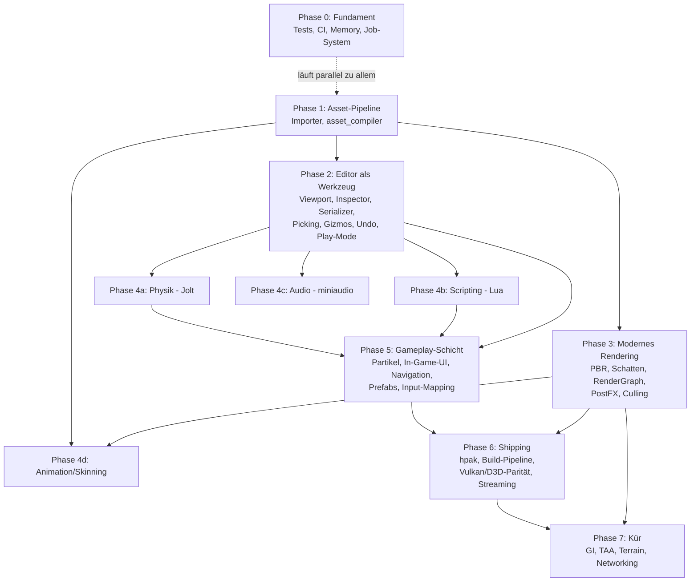

# Horizon Engine — Masterplan zur vollwertigen Engine

Stand: 12. Juni 2026. Ersetzt die Meilenstein-Sicht der ROADMAP.md durch einen
vollständigen Plan bis zur „modernen Engine auf Augenhöhe" (Referenzrahmen:
Unity/Godot-Featureset, nicht Unreal-AAA).

---

## Ist-Zustand (was schon fertig ist)

| Bereich | Status |
|---|---|
| Core: Window, App-Loop, Input, Logger, ContentManager, .hasset-Format | ✅ |
| UUID-Persistenz im META-Chunk (v2) | ✅ |
| Erster Render-Pfad: ECS-Welt → sichtbares Mesh auf GL **und** Metal (CommandBuffer, RenderWorld, RenderExtractor, Kamera) | ✅ |
| Editor-Shell: Hub, Docking, Outliner, Content Browser | ✅ |
| Backend-Gerüste GL/Metal/Vulkan/D3D11/D3D12 | ✅ Alle 5 zeichnen Szene + Directional-Schatten; GL+Metal auf macOS verifiziert (inkl. HDR/Tonemapping), D3D11/D3D12/Vulkan auf Windows validiert (HDR dort noch offen) |
| Asset-Importer (Texture/Mesh/Material/Audio), asset_compiler, Packer | 🔴 Stubs |
| SceneSerializer | 🔴 nur Name + Hierarchie |
| RenderGraph, RenderPass, RenderResourceManager, GPUMemoryAllocator | 🔴 leer |
| Memory (Ref\<T\>, Allocatoren) | 🔴 leer |
| Physik, Scripting, Audio, Animation, Partikel, Navigation, In-Game-UI | 🔴 fehlen komplett |
| Tests, CI, Profiling | 🔴 fehlen |

---

## Abhängigkeitsgraph (Phasen)



Kernaussage: **Asset-Pipeline (P1) ist der Flaschenhals** — Editor-Ausbau,
Rendering-Features und Animation hängen alle daran. Die vier 4er-Blöcke sind
untereinander unabhängig und parallelisierbar.

---

## Bauprinzip — bottom-up (low-level zuerst)

**Regel:** Erst die zugrunde liegenden Systeme *fertig* bauen, dann die Features, die darauf aufsetzen.
Kein High-Level-Feature auf einem unfertigen Fundament. Der Abhängigkeitsgraph oben **ist** diese
Reihenfolge — er wird **von unten nach oben** abgearbeitet (Core / Memory / Asset-Pipeline → Rendering /
Editor → Engine-Systeme → Gameplay → Shipping → Kür).

Konkret für die Arbeitsauswahl: Bevor ein Feature gebaut wird, das z. B. die Asset-Pipeline, das
Job-System, `Ref<T>` oder den RenderGraph braucht, werden diese Bausteine zuerst auf einen *benutzbaren,
getesteten* Stand gebracht. Ein Feature wird nie „blind" auf eine API gesetzt, die es noch nicht gibt —
Beispiel: der Landscape-Plan (Forts. 19) braucht `ContentManager::registerStaticMesh`, also wird **zuerst**
diese ContentManager-API gebaut (Forts. 20), erst danach das Terrain.

> **Selbstkritik (17.06.2026):** Die letzten Iterationen (Himmel / Wolken / SSAO / Gizmo, Forts. 7–18)
> waren stark High-Level/visuell getrieben, während Fundament-Lücken offen blieben. Ab jetzt gilt:
> Fundament schließen, bevor weitere aufbauende Features dazukommen.

### Fundament-Lücken (Stand 17.06.2026) — in Baureihenfolge

Diese low-level Bausteine zuerst, in dieser Reihenfolge — jeder schaltet die darüberliegenden Features frei:

1. **ContentManager fertigstellen** (Phase-0/1-Kern):
   - ✅ **Runtime-Asset-Registrierung** `registerStaticMesh/Texture/Material` + `replace…` (In-Memory-Assets
     ohne Disk-Datei) + Aliasing-Härtung der typisierten Getter/`unload` (Forts. 20). → schaltet prozedurale
     Assets frei (Terrain, Default-/Fallback-Assets, editor-erzeugte Materialien).
   - ✅ **Default-/Fallback-Assets** mit festen UUIDs (`kDefaultCubeMeshId`/`kDefaultWhiteTextureId`/`kDefaultMaterialId`
     in `ContentManager/DefaultAssets.h`), im Ctor registriert; GL+Metal-Renderer-Fallback-Cube ersetzt (Forts. 21).
   - ✅ **Asset-Enumeration** `enumerateIds()` / `enumerateIds(AssetType)` / `assetCount()` + `m_assetTypeIndex` (Forts. 22).
   - ✅ **Reload/Hot-Reload** einer geänderten Datei (mtime-Watch) — Editor pollt jede 1,5 s, GPU-Cache-Invalidierung typ-dispatched (Forts. 23).
2. **`Ref<T>`** (intrusiver Refcount, Phase 0.3) + Einsatz im ContentManager → sauberes Unloading/Eviction
   statt manuellem `unloadAsset`.
3. **Job-System** (Thread-Pool, `parallel_for`, Phase 0.4) → parallele Extraction, Async-Loading, Physik.
4. **RenderGraph + Pass-System aktivieren** (Phase 3.4) → die Post-FX (Bloom/FXAA/SSAO/Transparenz) hängen
   aktuell direkt im Backend statt an Graph-Knoten; diese Schuld vor weiterem Rendering-Ausbau tilgen.

Erst wenn (1) steht, ist der **Landscape-Modus** (Forts. 19) dran — er ist bewusst *nach* der
ContentManager-Fertigstellung eingeplant.

---

## Phase 0 — Fundament (Querschnitt, sofort startbar, läuft nebenher)

Keine Abhängigkeiten; jede Woche ein bisschen davon.

| # | Aufgabe | Hängt ab von | Details |
|---|---|---|---|
| 0.1 | **Test-Gerüst** (doctest oder Catch2) | — | ✅ doctest, 14 Cases (SlotMap, HAsset, ContentManager, Serializer), GitHub-CI-Matrix |
| 0.2 | **CI** GitHub-Actions-Matrix (macOS + Windows, später Linux) | 0.1 | ✅ `.github/workflows/ci.yml`, macOS + Windows Matrix |
| 0.3 | **`Ref<T>`** (intrusiver Refcount) + Einsatz im ContentManager | — | ✅ Forts. 25 — `AssetRef<T>` + `pinAsset`/`unpinAsset` + `unloadAsset`-Gate |
| 0.4 | **Job-System** (Thread-Pool, parallel_for, Abhängigkeits-Handles) | — | ✅ Forts. 26 — parallele FrustumCuller + parallele RenderExtractor-Extraktion |
| 0.5 | **Profiling-Hooks**: Tracy vendoren, Frame-/Zone-Marker | — | ✅ Forts. 27 — Tracy FetchContent + HE_PROFILE_FRAME/SCOPE/SCOPE_N + 4 Zone-Marker |
| 0.6 | **Aufräumen**: doppelte glm-Kopie (vendored + FetchContent) auf eine Quelle | — | ✅ Forts. 28 — 33 MB vendored glm aus HE_Rendering entfernt (war CMake-toter Code) |
| 0.7 | **Debug-Draw-API** (Linien, Wireframe-AABBs, Text im Viewport) | Render-Pfad ✅ | ✅ Forts. 24 — `DebugDrawBuffer` + GL- und Metal-Backend + Editor-Erdgitter |

---

## Phase 1 — Asset-Pipeline end-to-end (kritischer Pfad)

**Ziel:** glTF/PNG rein → .hasset raus → Content Browser → Szene.
Blockiert P2 (man braucht Assets zum Editieren), P3 (PBR braucht Texturen/Materialien)
und P4d (Skelette kommen aus dem Mesh-Import).

| # | Aufgabe | Hängt ab von | Details |
|---|---|---|---|
| 1.1 | **TextureImporter** | — | ✅ stb_image → PIXL/TXMI-Chunks, UUID-stabile Re-Imports |
| 1.2 | **MeshImporter** | — | ✅ cgltf vendored; VERT/INDX/NORM/TEXC + MREF; Tangenten |
| 1.3 | **MaterialImporter** | 1.1 | ✅ JSON + glTF metallic/roughness → MTRL-Chunk; PBR-Skalare |
| 1.4 | **asset_compiler verdrahten** | 1.1–1.3 | ✅ Verzeichnis-Walk, Endung → Importer, mtime-Inkrementalität |
| 1.5 | **Editor-Import**: Button + Drag&Drop in den Content Browser | 1.4 | ✅ Import-Kontextmenü + „Add to Scene" für Meshes im Content Browser |
| 1.6 | **Textur-Kompression** (BCn/ASTC, z. B. via bc7enc o. ä.) | 1.1 | kann nach hinten rutschen, aber vor Shipping (P6) nötig |
| 1.7 | **AudioImporter** (PCMD-Chunks, WAV/OGG via dr_libs/stb_vorbis) | — | ✅ dr_wav → PCMD-Chunk, AudioImporter.cpp in asset_compiler |

**DoD:** Heruntergeladenes glTF-Modell mit Texturen importieren und im Editor gerendert sehen.

---

## Phase 2 — Editor wird Werkzeug

**Ziel:** Szene bauen, speichern, laden, abspielen — ohne Code anzufassen.
Braucht P1 (Assets zum Platzieren); 2.1–2.2 können sofort parallel zu P1 starten.

| # | Aufgabe | Hängt ab von | Details |
|---|---|---|---|
| 2.1 | **Szenen-Viewport offscreen** (FBO/MTLTexture → `ImGui::Image`) | Render-Pfad ✅ | ✅ `SetViewportSize`/`GetViewportTexture`, GL-FBO + Metal-Offscreen, HiDPI/Resize |
| 2.2 | **SceneSerializer vervollständigen** | — | ✅ alle Komponenten (Transform/Mesh/Material/Light/Camera/RigidBody/Script/Transform2D/Audio), JSON+CBOR, v1.1 |
| 2.3 | **Inspector-Panel** | 2.2 sinnvoll | ✅ Details-Panel mit allen Komponenten-Editoren + Add/Remove-Component, Material-Drag&Drop |
| 2.4 | **Outliner-Ausbau** | — | ✅ Create/Rename/Delete, Drag&Drop-Reparenting (zyklensicher), Selektion ↔ Inspector |
| 2.5 | **Picking** (ID-Buffer-Pass; Entity-ID im RenderObject existiert) | 2.1 | ✅ CPU-Ray-AABB (backend-unabhängig); Klick → nächstes Objekt / Leer → Deselekt |
| 2.6 | **Gizmos** (ImGuizmo vendoren) | 2.1, 2.5 | ✅ ImGuizmo v1.92.5; Translate/Rotate/Scale W/E/R, World↔Local, Screen-Ring |
| 2.7 | **Undo/Redo** (Command-Pattern auf Komponentenebene) | 2.3 | ✅ Snapshot-basiert (CBOR, 64 Einträge); Cmd+Z / Shift+Cmd+Z; alle Ops |
| 2.8 | **Play-in-Editor** | 2.2 | ✅ CBOR-Snapshot bei Play, clear+Restore bei Stop; Szene-Kamera aktiv im Play-Mode |
| 2.9 | **Editor-Kamera-Komfort** | 2.1 | ✅ Orbit/Fly/Pan/Dolly/Focus-F; `EditorCamera`; ImGuizmo-Grid; Gizmo/Picking unterdrückt bei Nav |

**DoD:** Szene zusammenklicken, speichern, Editor neu starten, weitermachen, Play drücken.

---

## Phase 3 — Modernes Rendering

Reihenfolge nach Sichtbarkeit pro Aufwand. Braucht P1 für Materialien/Texturen;
3.1 und 3.3 gehen sofort.

| # | Aufgabe | Hängt ab von | Details |
|---|---|---|---|
| 3.1 | **FrustumCuller + RenderSorter** | Render-Pfad ✅ | ✅ Gribb/Hartmann-Frustum, Mesh-Key+Distanz-Sort, bis zu 8 Lichter (Dir/Point/Spot) |
| 3.2 | **Shader-Cross-Compile** ausbauen | — | `glslc → SPIR-V → SPIRV-Cross → MSL/HLSL` im shader_compiler |
| 3.3 | **Beleuchtung**: Blinn-Phong → **PBR** (metallic/roughness) | 1.2/1.3 für echte Materialien | ✅ Blinn-Phong + PBR-Skalare (baseColor/metallic/roughness), Material-Inspector, D/P/S-Lights |
| 3.4 | **RenderGraph + Pass-System aktivieren** | 3.1 | ✅ GeometryPass→PostProcessPass; RenderTarget-Abstraktion; alle 5 Backends |
| 3.5 | **Schatten**: Directional mit einer Cascade → CSM | 3.4 | ✅ 2048²-Depth-Map, Texel-Snapping, 3×3-PCF, Slope-Bias; GL+Metal verifiziert, D3D/Vulkan blind |
| 3.6 | **HDR + Tonemapping** als erster PostProcess-Pass | 3.4 | ✅ RGBA16F SceneColor, ACES-Tonemap, separabler Bloom (9-Tap Gauss, Soft-Knee), Toggle in Prefs |
| 3.7 | **RenderResourceManager + GPUMemoryAllocator** | 0.3 | ✅ Forts. 30 — Budget-Tracking, LRU-Eviction, UUID→Handle-Index, 13 Tests |
| 3.8 | **Instancing + parallele Extraction** | 3.1, 0.4 | instanceCount im DrawCall existiert schon |
| 3.9 | **Skybox + IBL** (Environment-Map, Irradiance/Prefilter) | 3.3 | ✅ Prozedurale analytische Sky (Atmosphäre/Tag-Nacht/Mond/Sterne/Wolken/Milchstraße/Aurora/Nebula), IBL-Ambient+Specular |
| 3.10 | **Transparenz-Pass** (sortiertes Alpha-Blending) | 3.1, 3.4 | ✅ Forts. 15 — material-getriebenes opacity<1 → sortierte Transparenz-Liste, back-to-front |
| 3.11 | **Anti-Aliasing**: FXAA zuerst | 3.6 | ✅ FXAA-PostProcess-Pass (GL+Metal); TAA ist Kür (P7) |
| 3.12 | **SSAO** | 3.4 | ✅ Forts. 14 — view-space Position-Prepass → Hemisphären-Occlusion → Blur; GL+Metal |

**DoD:** PBR-Szene mit Schatten, HDR, Skybox bei stabilen Frametimes; Frustum-Culling messbar via Tracy.

---

## Phase 4 — Engine-Systeme (vier unabhängige, parallelisierbare Blöcke)

Alle brauchen P2.2 (Serializer, damit Komponenten persistiert werden) und
profitieren von P2.8 (Play-Mode zum Testen).

### 4a — Physik
| # | Aufgabe | Hängt ab von | Details |
|---|---|---|---|
| 4a.1 | **Jolt Physics** integrieren (FetchContent) | 2.2, 2.8 | ✅ Forts. 39 — Jolt v5.5.0 FetchContent (SOURCE_SUBDIR Build); PhysicsWorld (PIMPL, JobSystemSingleThreaded, TempAllocatorImpl); process-globale Init via call_once; Box-Shape aus TransformComponent::scale; RigidBodyType→EMotionType; fixed-rate step + ECS sync-back; Editor: Physik-World on Play/Stop + fixed-timestep-Akkumulator in OnRender; 8 Tests (223 gesamt) |
| 4a.2 | Collider-Komponenten (Box/Sphere/Capsule/Mesh) + Debug-Draw | 4a.1, 0.7 | ✅ Forts. 40 — ColliderComponent (Box/Sphere/Capsule + halfExtents/radius/height/isTrigger); PhysicsWorld wählt Shape aus ColliderComponent (Fallback: scale-Box); DebugDraw::capsule(); Viewport-Wireframes (Cyan=solid, Magenta=Trigger); SceneSerializer JSON+Binary; Inspector + Add-Component; 7 Tests |
| 4a.3 | Raycasts/Queries als Engine-API | 4a.1 | ✅ Forts. 41 — PhysicsWorld::raycast (RRayCast, NarrowPhaseQuery, BodyLockRead, Surface-Normal, Entity-UserData); ScriptContext::horizon.raycast Lua-Binding (nil on miss, table {entity,x,y,z,nx,ny,nz,distance} on hit); kPhysicsKey in Lua-Registry; 9 Tests (239 gesamt) |
| 4a.4 | Character-Controller | 4a.1 | ✅ Forts. 42 — CharacterControllerComponent (slopeLimit/stepHeight/skinWidth/mass/gravity + velocity/isGrounded runtime); PhysicsWorld: entityToCharacter map, CharacterVirtual (ExtendedUpdate+gravity+step-sync); setCharacterVelocity/isCharacterGrounded API; horizon.setVelocity/isGrounded Lua-Binding; SceneSerializer; Editor-Inspector (read-only runtime state); 9 Tests (248 gesamt) |
| 4a.5 | 2D-Physik (Box2D) — optional, wenn Catania es braucht | 2.2 | Transform2D existiert schon |

### 4b — Scripting
| # | Aufgabe | Hängt ab von | Details |
|---|---|---|---|
| 4b.1 | **Lua via sol2**, ScriptComponent-Lifecycle (onStart/onUpdate) | 2.2, 2.8 | ✅ Forts. 34 — ScriptEngine (Lua 5.4 FetchContent), loadScript/createInstance/callOnStart/callOnUpdate, 17 Tests |
| 4b.2 | Engine-API-Binding (Entity, Transform, Input, Spawn/Destroy) | 4b.1 | ✅ Forts. 35 — ScriptContext (HorizonWorld-Binding), horizon-Lua-API (get/setPosition/Rotation/Scale, spawn, destroy, getName), 13 Tests |
| 4b.3 | Hot-Reload von Scripts im Play-Mode | 4b.1 | ✅ Forts. 37 — ScriptEngine::hotReloadScript (function-Patch, Daten erhalten), ScriptSystem::pollHotReload, ContentManager::registerScript, 5 Tests |
| 4b.4 | Script-Properties im Inspector (exportierte Variablen) | 4b.1, 2.3 | ✅ Forts. 38 — ScriptTypes.h, getScriptProperties (M.properties-Lua-Tabelle), injectProperties, ScriptComponent::properties-Map, Serializer-Round-Trip, Inspector-Controls (DragFloat/DragInt/Checkbox/InputText), propScriptEngine in EditorApplication, 5 Tests |
| 4b.5 | C#/.NET-Hosting — später oder nie | 4b.2 | erst evaluieren, wenn Lua nicht reicht |

### 4c — Audio
| # | Aufgabe | Hängt ab von | Details |
|---|---|---|---|
| 4c.1 | **miniaudio** + AudioSource/AudioListener-Komponenten | 1.7, 2.2 | ✅ Forts. 29, 36 — AudioSourceComponent + AudioListenerComponent + SceneSerializer + Editor-Inspector + AudioEngine (miniaudio noDevice, int16 PCM, handle-based) + AudioSystem::playOnStart + ContentManager::registerAudio |
| 4c.2 | 3D-Spatialization, Attenuation | 4c.1 | ✅ Forts. 43 — AudioEngine::playSpatial (linear attenuation, min/maxDist); setSoundPosition; setListenerTransform (ma_engine_listener); AudioSourceComponent: innerRange/rolloffFactor/handle; AudioSystem::updateSpatial (listener + sources each frame); SceneSerializer; Editor-Inspector; 9 Tests (257 gesamt) |
| 4c.3 | Mixer/Bus-System (Music/SFX-Gruppen, Lautstärke) | 4c.1 | ✅ Forts. 44 — AudioEngine: createBus/setBusVolume/getBusVolume/hasBus (ma_sound_group, pro Instanz); play()/playSpatial() routen durch benannte Bus (nullptr=master Fallback); AudioSourceComponent::busName; SceneSerializer; Editor-Inspector "Bus"-Feld; 10 Tests (267 gesamt) |

### 4d — Animation
| # | Aufgabe | Hängt ab von | Details |
|---|---|---|---|
| 4d.1 | Skelett + Skinning-Daten im MeshImporter (glTF-Skins) | 1.2 | neue Chunks im .hasset-Format |
| 4d.2 | GPU-Skinning (Bone-Matrizen als Uniform/Storage-Buffer) | 4d.1, 3.3 | |
| 4d.3 | AnimationClip-Playback + AnimatorComponent | 4d.1, 2.2 | |
| 4d.4 | Blending + State-Machine (einfacher Animator-Graph) | 4d.3 | |
| 4d.5 | Property-Animation (Transform/Material animieren, für Cutscenes/UI) | 4d.3 | |

---

## Phase 5 — Gameplay-Schicht

Macht aus „Renderer + Systeme" eine Engine, in der man ein Spiel *baut*.

| # | Aufgabe | Hängt ab von | Details |
|---|---|---|---|
| 5.1 | **Prefabs** (Entity-Hierarchie als Asset, Instanzen + Overrides) | 2.2 | ✅ Forts. 31 — serializeSubtree/instantiatePrefab, PrefabAsset, ContentManager-Integration, Editor-Kontextmenü, 9 Tests |
| 5.2 | **Input-Mapping** (Actions/Axes statt Roh-Keys, Gamepad) | — | ✅ Forts. 32 — InputMapping (Actions+Axes, mapAction/mapAxis/tick/isPressed/axisValue), 17 Tests |
| 5.3 | **Partikelsystem** (CPU-Sim zuerst, instanziertes Rendering) | 3.8 | GPU-Sim ist Kür |
| 5.4 | **In-Game-UI-Runtime** (Canvas, Text via MSDF/stb_truetype, Buttons, Anchoring) | Render-Pfad ✅ | nicht ImGui — das ist Editor-only |
| 5.5 | **Navigation**: Recast/Detour-NavMesh-Baking + Agenten | 4a.1 | |
| 5.6 | **Szenen-Streaming/Additive-Load** (mehrere Szenen gleichzeitig) | 2.2 | |
| 5.7 | **Event-/Messaging-System** für Gameplay-Code | 4b.2 | ✅ Forts. 33 — EventBus (typed publish/subscribe, RAII Subscription, re-entrancy-safe snapshot), 15 Tests |

---

## Phase 6 — Shipping & Plattform-Reife

| # | Aufgabe | Hängt ab von | Details |
|---|---|---|---|
| 6.1 | **hpak-Packaging**: HpakWriter + KeyDerivation implementieren, asset_compiler → Packer-Kette, GameApplication lädt aus .hpak | 1.4 | SerializeFormat::Binary-Pfad |
| 6.2 | **Vulkan-Backend auf Parität** (Draw-Pfad, danach D3D12; D3D11 ggf. streichen) | 3.2, 3.4 | Linux-Support hängt hieran |
| 6.3 | **„Build Game"-Pipeline im Editor**: Standalone-Export (Executable + .hpak) pro Plattform | 6.1 | |
| 6.4 | **Async-Asset-Streaming** (Lade-Jobs, Platzhalter-Assets, Unloading via Ref\<T\>) | 0.3, 0.4 | |
| 6.5 | **Crash-Reporting scharf schalten** (CrashHandler existiert), Logging in Datei | — | |
| 6.6 | **Linux-Window/Input-Pfad** testen + CI-Leg | 0.2, 6.2 | |
| 6.7 | **Doku**: Getting-Started, Script-API-Referenz | 4b.2 | spätestens wenn jemand Zweites die Engine benutzt |

**DoD:** Ein Knopf im Editor erzeugt ein lauffähiges, ausliefbares Spiel-Binary mit gepackten, komprimierten Assets — auf macOS und Windows.

---

## Phase 7 — Kür (nach Bedarf, von Catania getrieben)

Kein fester Plan — einzeln ziehen, wenn das Spiel es verlangt:

- **TAA** und/oder **OIT** (Order-Independent Transparency)
- **Global Illumination** (Probes/DDGI-light) und **SSR**
- **LOD-System** + Impostors
- **Terrain** + Vegetation/Foliage
- **GPU-Partikel**
- **Networking** (Replikation) — nur falls Catania Multiplayer wird
- **Virtual Texturing / Bindless** — nur bei nachgewiesenem Bedarf

---

## Empfohlene Reihenfolge der nächsten 5 Arbeitsschritte

> **Status 12.06.2026:** Alle 5 Schritte sind umgesetzt. ✅

1. ✅ **TextureImporter + MeshImporter** (1.1–1.5) — stb_image + cgltf, dazu Material-
   und Audio-Importer (dr_wav), asset_compiler-CLI mit mtime-Inkrementalität und
   UUID-Stabilität bei Re-Imports. Editor: „Import"-Kontextmenü im Content
   Browser + „Add to Scene" für Mesh-Assets. **Dazu:** GL- und Metal-Backend
   lösen `meshAssetId` jetzt wirklich auf (Upload on first sight, Basecolor-
   Textur über Material-Kette); der hartkodierte Würfel ist nur noch Fallback.
2. ✅ **Offscreen-Viewport** (2.1) — `SetViewportSize`/`GetViewportTexture` in der
   Renderer-API, GL-FBO + Metal-Offscreen-Pass, andockbares „Scene"-Fenster
   mit HiDPI-Handling und Resize.
3. ✅ **SceneSerializer vervollständigt** (2.2) — alle 8 Komponenten, JSON- und
   Binary-Pfad (CBOR derselben Struktur), Version 1.1, abwärtskompatibel.
4. ✅ **Test-Gerüst + CI** (0.1, 0.2) — doctest mit 14 Test-Cases (SlotMap,
   HAsset-Roundtrip, ContentManager-UUID-Persistenz, Serializer-Roundtrips),
   GitHub-Actions-Matrix macOS + Windows in `.github/workflows/ci.yml`.
5. ✅ **Inspector + Outliner-CRUD** (2.3, 2.4) — Details-Panel mit allen
   Komponenten-Editoren + Add/Remove-Component; Outliner mit Selektion,
   Create/Rename/Delete und Drag&Drop-Reparenting (zyklensicher via
   `HorizonWorld::reparentEntity`, rekursives `destroyEntity`).

> **Bugfix 13.06.2026:** Editor-Crash beim Viewport-Resize behoben (Use-after-free:
> `EnsureViewportTarget` gab die alte MTLTexture frei, während die ImGui-Drawlist
> desselben Frames sie noch referenzierte → SIGSEGV in `setFragmentTexture:`).
> Fix: Retired-Texture-Graveyard, Freigabe erst 3 Frames später (GL + Metal).
> Regression-Hook: `HE_VIEWPORT_RESIZE_STRESS=1` ändert die Viewport-Größe
> jeden Frame — damit verifiziert.

> **Status 13.06.2026:** Auch die zweite Top-5-Runde ist umgesetzt. ✅

1. ✅ **Picking** (2.5) — als CPU-Ray-AABB-Test statt ID-Buffer (bewusste
   Abweichung: backend-unabhängig, und die AABB-Infrastruktur in
   `Core/Math/AABB.h` braucht das Culling sowieso). Klick im Scene-Viewport
   selektiert das nächstgelegene Objekt, Klick ins Leere deselektiert.
   ID-Buffer-Picking kann später für Pixel-Präzision nachgerüstet werden.
2. ✅ **Gizmos** (2.6) — ImGuizmo v1.92.5 vendored
   (`src/HE_Editor/vendor/imguizmo/`). Translate/Rotate/Scale per W/E/R,
   World→Local-Rückrechnung über die Parent-Matrix.
3. ✅ **Play-in-Editor** (2.8) — Play/Stop-Button verdrahtet:
   CBOR-Snapshot bei Play, `HorizonWorld::clear()` + Restore bei Stop.
4. ✅ **FrustumCuller + RenderSorter** (3.1) und **Blinn-Phong** (3.3) —
   Gribb/Hartmann-Frustum gegen Welt-AABBs (Backends verfeinern mit echten
   Mesh-Bounds), Sortierung Mesh-gruppiert + front-to-back; bis zu 8 Lichter
   (Directional/Point/Spot mit Range-Attenuation und Spot-Kegel) auf GL und
   Metal, Fallback-Headlight für Szenen ohne Lichter.
5. ✅ **Undo/Redo** (2.7) — Snapshot-basiert (`EditorUndo`, CBOR-Weltzustand,
   max. 64 Einträge) statt feingranularer Commands: deckt alle Operationen
   einheitlich ab (Create/Delete/Reparent/Rename/Komponenten-Edits/Gizmo).
   Cmd/Ctrl+Z, Shift+Cmd+Z bzw. Ctrl+Y, Footer-Buttons mit Disabled-State.
   Bekannte Einschränkung: Selektion geht bei Undo verloren (Entity-Handles
   werden remapped).

Stand der Tests: 23 doctest-Cases (zusätzlich: AABB/Frustum/Sorter, EditorUndo,
Play-Mode-Zyklus), alle grün.

> **Status 13.06.2026 (Forts.):** Editor-Kamera (2.9) umgesetzt. ✅

**Editor-Kamera (2.9)** — Vollwertige Scene-View-Kamera (`EditorCamera`,
`src/HE_Editor/EditorCamera.{h,cpp}`) im Unity-Stil:
- **Alt+LMB** orbit um den Pivot, **MMB** pan, **Mausrad** dolly, **RMB**
  Fly-Look mit **WASDQE** (Shift = schneller), **F** = Focus-on-Selection.
- Architektur: `EditorCameraOverride` (view + Position + fov/near/far) liegt in
  `Renderer/IRenderer.h` (Core). Der Editor schiebt sie pro Frame über
  `IRenderer::SetEditorCamera`; der `RenderExtractor` nutzt sie statt der
  Szenen-`CameraComponent` und baut die Projektion mit dem Backend-Aspect, sodass
  Bild, Gizmo und Picking-Strahl exakt übereinstimmen (GL + Metal verdrahtet).
- Im Play-Mode wird der Override deaktiviert → die Spiel-Kamera der Szene zählt.
- **Grid** über `ImGuizmo::DrawGrid` auf der Welt-XZ-Ebene, Toggle „Show Grid"
  in den Quick Settings (persistiert). Gizmo/Picking sind während Navigation
  bzw. bei gedrücktem Alt unterdrückt.
- Tests: 4 neue doctest-Cases (`tests/test_editorcamera.cpp`) für Default-
  Framing, Dolly, Orbit-Radius-Erhalt und Focus → jetzt **27 Cases, alle grün**.

> **Status 13.06.2026 (Forts.):** Szene speichern/laden im Editor umgesetzt. ✅

**Szene speichern/laden im Editor** — Save/Load auf den komplettierten
SceneSerializer (JSON) gelegt:
- File-Menü: **New Scene**, **Open Scene…**, **Save Scene** (Cmd/Ctrl+S),
  **Save Scene As…** (Shift+Cmd/Ctrl+S); SDL-Datei-Dialoge (`.hescene`-Filter,
  Start im `Content`-Ordner). Tastatur-Shortcuts global im Editor.
- Szenenwechsel per **Doppelklick** auf eine `.hescene` im Content Browser.
- Der gemeinsame async-Datei-Slot (`pendingFileReady/Result`) wird über eine
  `PendingFileOp`-Intent-Enum für Projekt-Öffnen / Szene-Öffnen / Szene-Speichern
  disambiguiert; bei „Save As" wird die `.hescene`-Endung erzwungen.
- `EditorApplication` trackt `m_currentScenePath` + `m_savedRevision`; der
  Fenstertitel zeigt „Projekt — Szene [*]" (Dirty-Marker). Dirty-Erkennung über
  einen Revisions-Zähler in `EditorUndo` (bumpt bei push/undo/redo). Beim Öffnen
  einer Szene wird der Play-Mode verlassen, Undo-History geleert, Selektion
  zurückgesetzt; `New Scene` leert die Welt auf den Root.

> **Status 13.06.2026 (Forts.):** RenderGraph-Grundlage (3.4) aktiviert. ✅

**RenderGraph aktivieren (3.4)** — Das Pass-System ist scharf geschaltet und
beide Backends submitten jetzt darüber (technische Grundlage zuerst, Features
bauen darauf auf):
- `CommandBuffer`/`RenderGraph`/`RenderPass` (vorher leere Stubs) implementiert.
  `DrawCall` trägt jetzt `meshAssetId`/`entityId`/`lod` (+ die künftigen
  RenderHandle-Felder), sodass das Backend ohne RenderWorld-Zugriff replayen kann.
- **GeometryPass** wandelt die gecullten + sortierten sichtbaren Objekte in
  DrawCalls. GL und Metal bauen pro Frame `m_renderGraph.execute(world, sorted,
  m_cmds)` und replayen `m_cmds.drawCalls()` statt direkt über `sortedIndices`
  zu iterieren — Mesh-Auflösung per UUID bleibt im Backend, das die Rolle von
  `IRenderDevice::submit` übernimmt (kein voller RHI-Umbau nötig).
- **ShadowPass**/**PostProcessPass** sind deklariert, aber bewusst inert: sie
  brauchen Render-Target-Plumbing (Depth-Target aus Licht-POV für 3.5,
  Offscreen-HDR-Target + Fullscreen-Pass für 3.6), das der reine CPU-seitige
  CommandBuffer noch nicht modelliert → Folgeschritt.
- Tests: 4 neue doctest-Cases (`tests/test_rendergraph.cpp`) für DrawCall-
  Reihenfolge/Payload, Out-of-range-Skip, Buffer-Reset pro Frame und inerte
  Passes → jetzt **31 Cases, alle grün**.

> **Status 13.06.2026 (Forts.):** D3D11/D3D12/Vulkan auf Szenen-Draw-Parität
> gebracht (Option „erst Parität, dann Targets"). ✅ **Achtung: unverifiziert** —
> keines der drei baut auf dieser macOS-Maschine (D3D = `if(WIN32)`, Vulkan =
> kein SDK), daher sorgfältig-aber-blind und auf Windows / mit Vulkan-SDK zu
> validieren. GL+Metal + 31 Tests unverändert grün.

**D3D11/D3D12/Vulkan Szenen-Draw (P6-Parität vorgezogen):** Alle drei nutzen jetzt
denselben `extractor→cull→sort→RenderGraph→GeometryPass→DrawCall`-Pfad wie GL/Metal,
zeichnen also beleuchtete Geometrie statt nur Clear. Gemeinsam: interleaved
pos3+normal3+uv2, Mesh-Upload on first sight aus dem ContentManager, Cube-Fallback,
Blinn-Phong (8 Lichter), Editor-Kamera-Override, Tiefenpuffer.
- **D3D11** (`d3dcompiler`, HLSL zur Laufzeit): inkl. Basecolor-Texturen.
- **D3D12** (Root-CBVs + PSO, Upload-Heaps statt Staging): Flat-Color, Texturen
  als TODO (DEFAULT-Heap-Upload + Descriptor-Tables zu fehleranfällig blind).
- **Vulkan** (Push-Constants + per-frame-UBO, GLSL→SPIR-V via glslc, Clip-Fix für
  Y/Tiefe): Flat-Color, Texturen TODO; `.spv` müssen nach `<exe>/Shaders/` deployen.

> **Status 13.06.2026 (Forts.):** Render-Target-Abstraktion im RenderGraph
> (Seam) steht. ✅

**Render-Target-Abstraktion (Fundament):** `RenderTarget.h` definiert
backend-agnostisch `RenderTargetDesc`/`RenderPassIO` (Format RGBA8/RGBA16F/Depth,
Größe Viewport/Fixed, Ein-/Ausgabe-Targets, `kBackbufferTarget = 0`).
`RenderPass::describe()` deklariert das Ziel eines Passes (GeometryPass →
Backbuffer; ShadowPass → 2048²-Depth; PostProcessPass → Backbuffer + SceneColor-
Input). `RenderGraph::execute(world, sorted, PassSink)` ruft pro Pass den Backend-
Sink `(pass, io, cmds)` — der bindet das Ziel und replayt. **Alle fünf Backends**
nutzen jetzt den Sink (GL+Metal verifiziert, D3D/Vulkan blind/mechanisch),
verhaltensneutral: heute rendert nur GeometryPass in den Backbuffer. Die
eigentliche Offscreen-Target-Allokation (FBO/MTLTexture/RTV-DSV/VkImage-Pool)
landet mit dem ersten Feature, das sie braucht (ShadowPass/HDR), wo auch die
Sampling-Shader entstehen. 2 neue Tests (Per-Pass-Dispatch + `describe()`) →
**33 Cases, alle grün**.

> **Status 13.06.2026 (Forts.):** ShadowPass (3.5) auf **allen 5 Backends**.
> GL (`e7779e0`) + Metal (`0387987`) kompilier-verifiziert; D3D11 (`2cff0fe`),
> D3D12 (`e782dad`), Vulkan (`0d5583f`) blind/unverifiziert. ✅

**ShadowPass (3.5) — OpenGL:** Directional-Schatten via 2048²-Depth-Map. Shared:
`RenderWorld.shadow` (lightVP/dir/enabled), Extractor fittet ein Ortho-Frustum um
die Szene; `ShadowPass` zeichnet die sichtbare Geometrie depth-only, GeometryPass
sampelt die Map (Slope-Bias). GL rendert ShadowPass → Map → GeometryPass über den
Sink. Pro Backend ist der lightVP an dessen NDC/Tiefen-Konvention angepasst
(GL z×0.5+0.5; Metal/D3D clipFix z 0..1 + V-Flip; Vulkan clipFix Y+z). Metal und
Vulkan rendern die Depth-Map in einem eigenen Pass/Encoder vor der Szene; D3D11/
D3D12 wechseln das Rendertarget im Sink. **D3D11/D3D12/Vulkan unverifiziert** —
nicht baubar hier, auf Zielplattform prüfen.

> **Status 14.06.2026:** D3D11/D3D12/Vulkan auf Windows validiert + HDR/Tonemapping
> (3.6) auf GL+Metal umgesetzt und visuell verifiziert. ✅

**D3D/Vulkan-Validierung (Windows):** Der User hat die zuvor blind geschriebenen
D3D11/D3D12/Vulkan-Pfade (Szenen-Draw + ShadowPass) auf seinem Windows-PC gebaut
und visuell validiert (Commits `b037bbb`, `f96cb82`; Referenz-Screenshots in
`_shots/{opengl,d3d11,d3d12,vulkan}.png`). Damit sind alle 5 Backends für den
Stand „Szene + Directional-Schatten" verifiziert.

**Headless-Capture-Harness (Validierungs-Infrastruktur):** Neue
`IRenderer::CaptureViewport(rgba,w,h)` (RGBA8, top-row-first) — implementiert in
GL (`glReadPixels` + Flip) und Metal (Blit Private→Managed-Textur + `getBytes`,
BGRA→RGBA). Der Editor besitzt einen env-gesteuerten Frame-Dump
(`HE_DUMP_PATH`/`HE_DUMP_QUIT`): rendert die Szene in `OnInit` offscreen in fester
Größe, schreibt ein BMP und beendet sich — **vor** dem gepacten Main-Loop, der bei
verdecktem Fenster (macOS Occlusion/App-Nap) sonst einfriert. Umgeht die fehlende
Screen-Recording-Berechtigung von `screencapture`. Nebenbei: Metal-`EncodeFrame`
so umgebaut, dass ShadowMap + Offscreen-Szene **vor** `nextDrawable` encodiert
werden (Offscreen-Viewport rendert jetzt auch ohne verfügbares Drawable).

**HDR + Tonemapping (3.6) — GL + Metal:** GeometryPass rendert in ein RGBA16F-
SceneColor-Target; ein neuer `PostProcessPass` macht einen Fullscreen-Tonemap
(ACES filmic + sRGB-Gamma, Exposure 1.0) auf den Backbuffer/Viewport.
- **GL**: `m_hdrFBO` (RGBA16F + Depth-RBO), Fullscreen-Triangle via `gl_VertexID`
  (leeres VAO), Tonemap-Programm. Graph = Shadow→Geometry(→HDR)→PostProcess.
- **Metal**: Scene-Pipeline auf `RGBA16Float` umgestellt, Tonemap-Pipeline
  (`kTonemapMSL`, Out=BGRA8). Szene→HDR-Target, dann Tonemap→Viewport-Textur
  (Editor) bzw. →Drawable (Game/Direkt). UV-Flip im Tonemap-VS (Metal top-origin).
- **Bewusst backend-lokal**: die gemeinsame `GeometryPass::describe()` bleibt
  unverändert (sonst würden die Windows-validierten D3D/Vulkan-Sinks brechen).
  GL/Metal hängen `PostProcessPass` nur in ihren eigenen Graphen ein und routen im
  Sink über `io.inputCount`/`io.inputs[0]==kSceneColorTarget`. D3D/Vulkan
  unangetastet → **HDR dort = nächster (blinder) Port**, auf Windows zu machen.
- Visuell verifiziert (GL == Metal, identisches Bild): ausgefressene Highlights
  rollen jetzt filmisch ab, Gamma hebt die Mitten, Schatten/Struktur erhalten.
- 33 doctest-Cases weiterhin grün (RenderGraph/Passes unverändert).

> **Status 14.06.2026 (Forts.):** Material-Inspector (Top-5 #2) auf GL+Metal
> umgesetzt + Preferences-Fenster fertig verdrahtet. ✅

**Material-Inspector (Top-5 #2) — GL + Metal:** Das `MaterialComponent` wirkt
jetzt tatsächlich aufs Rendering (vorher ignoriert — der Texturpfad kam allein
aus dem im Mesh eingebetteten Material). Neuer Datenfluss:
- **Shared/neutral:** `RenderObject` und `DrawCall` tragen ein `materialAssetId`;
  der `RenderExtractor` liest das optionale `MaterialComponent` (`try_get`), die
  `GeometryPass` kopiert es in den DrawCall. Rein additiv → D3D11/D3D12/Vulkan
  kompilieren unverändert und ignorieren das Feld (noch kein Override dort).
- **GL + Metal:** neuer per-Material-Texturcache (Key = Material-UUID), eigene
  `ResolveMaterialTexture`. Im GeometryPass-Loop gewinnt eine gesetzte
  Material-Override-Textur über die Mesh-eigene; greift auch auf den Fallback-
  Würfel. Cache-Invalidierung über die neue `IRenderer::InvalidateMaterial(UUID)`
  (Default-No-op; GL deferred-delete in DrawScene wo der Context current ist,
  Metal über den Retired-Texture-Friedhof).
- **ContentManager:** `getMaterialMutable(UUID)` für In-Editor-Bearbeitung;
  Edits am gemeinsam genutzten Cache-Objekt sind sofort sichtbar, `saveAsset`
  persistiert sie.
- **Inspector (Details-Panel):** Material-Slot als Drop-Target (Content-Browser
  liefert jetzt eine `HE_ASSET_PATH`-Drag-Source für alle `.hasset`), „Clear",
  editierbarer Shader-Pfad + Textur-Slots (Text + je Drop-Target für Texturen +
  Entfernen + „+ Texture Slot"), „Save Material". Edits wirken live (Invalidate),
  Save schreibt auf Platte. Undo-Snapshot bei Zuweisung/Clear.
- **Verifiziert:** 34 doctest-Cases grün (neuer GeometryPass-Material-Test);
  GL+Metal-Build sauber; Headless-Dump = Szene rendert unverändert (kein Regress
  im umgebauten Draw-Loop). Drag&Drop-UI + Textur-Override-Bild = interaktiv vom
  User zu bestätigen.
- **KNOWN LIMITATION:** Eine gesetzte `materialAssetId` löst nach **Szenen-
  Reload** erst wieder auf, wenn das Material in den ContentManager geladen ist
  (heute nur on-demand beim Drag&Drop). Es gibt noch keinen Bulk-Preload/Asset-
  Registry (UUID→Pfad) — betrifft genauso Mesh-UUIDs und gehört zu P6 (6.4
  Asset-Streaming). In-Session funktioniert alles.
- **HDR auf D3D/Vulkan (Top-5 #1) bleibt offen** (blinder Windows-Port).

**Preferences-Fenster (Edit ▸ Preferences / Ctrl+,):** Das vorhandene, aber nie
aufgerufene `DrawPreferencesWindow` ist jetzt in `RenderEditor` verdrahtet +
Ctrl/Cmd+,-Shortcut. Enthält UI-Font-Scale, Show-Grid, Editor-Kamera-Speed,
VSync, Content-Browser-Optionen; Werte in `EditorConfig`, persistiert in
config.json.

**Nächste Schritte (Top 5):**

1. **HDR + Bloom auf D3D11/D3D12/Vulkan** (blind, auf Windows zu validieren) —
   analog GL/Metal: RGBA16F-SceneColor + Tonemap/Bloom-PostProcess in den Sinks.
2. ✅ **Material-Inspector** — erledigt (GL+Metal, s.o.).
3. ✅ **Save-Prompt bei ungesicherten Änderungen** — erledigt (s.u.).
4. ✅ **Bloom** (3.6 Forts.) — erledigt (GL+Metal, s.u.).
5. ✅ **PBR-Skalare (3.3)** + **Bloom-Toggle in den Preferences** — erledigt (s.u.).
6. ✅ **Skybox + IBL (3.9)** — erledigt (GL+Metal, prozedurale Sky, s.u.).

Faustregel für die Parallelisierung danach: eine Person/ein Strang auf dem
kritischen Pfad P1 → P2 → P5 → P6, Rendering (P3) und je ein P4-Block laufen
daneben her.

> **Status 14.06.2026 (Forts.):** Save-Prompt bei ungesicherten Änderungen
> umgesetzt. ✅ (backend-unabhängig — reine Editor-Logik, hier auf GL+Metal
> baubar; 34 Tests grün, Headless-Dump unverändert.)

**Save-Prompt („Unsaved Changes") — alle szenenverwerfenden Aktionen gegated:**
Ein einheitlicher Guard fängt jede Aktion ab, die die aktuelle Szene verwerfen
würde, solange der Dirty-Marker (`m_undo.revision() != m_savedRevision`) aktiv
ist, und zeigt einen modalen **Save / Don't Save / Cancel**-Dialog.
- **Gegatete Aktionen** (`enum GuardedAction` in `EditorUI.cpp`): New Scene,
  Open Scene… (Menü **und** Content-Browser-Doppelklick auf `.hescene`),
  Open Project, Close Project, Exit sowie der **OS-Fensterschließen-Pfad**
  (Fenster-X / Cmd+Q / `SDL_EVENT_QUIT`). Zentrale Helfer `requestGuarded()` /
  `runGuardedAction()`: bei sauberer Szene läuft die Aktion sofort, bei Dirty
  wird sie gestasht und das Modal geöffnet.
- **Save-Logik:** Hat die Szene einen Pfad → synchroner Save, dann läuft die
  gestashte Aktion sofort. Ist sie *Untitled* → async Save-As-Dialog; das
  gemeinsame Datei-Ergebnis-Handling (`PendingFileOp::SaveScene`) führt die
  Aktion nach erfolgreichem Schreiben über `s_guardSaveThenAct` aus. „Don't
  Save" verwirft, „Cancel"/Escape bricht ab.
- **OS-Close-Veto (Core-Hook):** `Window::PollEvents` setzt `m_shouldClose`
  *bevor* die Event-Callback läuft, daher neue `Window::CancelClose()` (inline,
  setzt das Flag zurück). `EditorApplication::OnEvent` fängt das
  Schließen des **Hauptfensters** (Window-ID-Check; ImGui-Sekundärviewports
  bleiben unberührt) bei Dirty + geladenem Projekt ab, ruft `CancelClose()` und
  setzt `m_exitRequested` (über `AppContext` an die UI gereicht) → die UI macht
  daraus einen `GuardedAction::Quit`. Im Headless-Dump-Modus (`HE_DUMP_PATH`)
  ist der Veto deaktiviert. Die „Quit"-Aktion beendet sauber über
  `Application::Quit()` (`m_running=false`).
- **Backend-unabhängig:** reine Editor/Core-Logik, kein Renderer-Touch — D3D/
  Vulkan kompilieren unverändert mit. Das Modal selbst (Interaktion) ist headless
  nicht prüfbar → vom User interaktiv zu bestätigen.

> **Status 14.06.2026 (Forts.):** Bloom (3.6 Forts.) auf GL+Metal umgesetzt und
> verifiziert. ✅ (GL- und Metal-Headless-Dump **byte-identisch**, md5 gleich;
> 34 Tests grün.)

**Bloom (3.6 Forts.) — GL + Metal:** Highlights jenseits einer Soft-Knee-Schwelle
glühen jetzt. Pipeline pro Frame nach der GeometryPass (HDR-SceneColor RGBA16F),
vor dem Tonemap-Composite:
1. **Bright-Pass** — extrahiert pro Pixel den Anteil über `threshold` (COD-Soft-
   Knee, Hue erhalten) in ein **halb aufgelöstes** RGBA16F-Target.
2. **Separable Gauss-Blur** — 9-Tap, 10 Ping-Pong-Pässe (5 horizontal + 5
   vertikal) zwischen zwei Half-Res-Targets; gerade Anzahl endet in `bloom[0]`.
3. **Composite** — der Tonemap-Shader sampelt zusätzlich die Bloom-Textur und
   addiert sie (`bloomStrength`) **vor** Exposure/ACES/Gamma.
- Konstanten (backend-lokal identisch): threshold 1.0, knee 0.5, strength 0.6.
  Immer an (wie HDR/Tonemap, kein Toggle) — Toggle/Preferences später möglich.
- **GL** (`OpenGLRenderer`): zwei Half-Res-FBOs (`m_bloomFBO/Color[2]`),
  `kBloomBrightFS`/`kBloomBlurFS` (reusen die Fullscreen-Triangle-VS via
  `gl_VertexID`), `RenderBloom()` läuft im `PostProcessPass`-Sink, Tonemap-FS um
  `uBloom`/`uBloomStrength` erweitert (Bloom auf Texture-Unit 1).
- **Metal** (`MetalRenderer`): zwei Half-Res-Private-RGBA16F-Texturen,
  `kBloomMSL` (`fsVertex`+`brightFragment`+`blurFragment`), `EncodeBloom(cmdBuf)`
  (je Pass ein eigener Encoder) **vor** `EncodeTonemap`; `tonemapFragment` um
  Bloom-Textur (Slot 1) + `float2(exposure,bloomStrength)` erweitert. UV-1:1-
  Mapping derselben Fullscreen-VS-Konvention wie Tonemap.
- **Verifiziert:** GL- und Metal-Headless-Dump des ShadowValidation-Würfels sind
  **byte-identisch** (md5 `d379dc50…`), sichtbarer warmer Glow an hellen Kanten
  vs. scharfe Kanten ohne Bloom. **D3D/Vulkan = nächster blinder Windows-Port**
  (zusammen mit dem noch offenen HDR-Port dort).

> **Status 14.06.2026 (Forts.):** PBR-Skalare (3.3) + Bloom-Toggle in den
> Preferences umgesetzt, GL+Metal verifiziert. ✅

**PBR-Material-Skalare (3.3) — GL + Metal:** `MaterialAsset` trägt jetzt
`baseColor[3]` / `metallic` / `roughness` (an den MTRL-Chunk angehängt,
rückwärtskompatibel via `readPOD`-Tail; `MaterialImporter` liest optionale
JSON-Felder). Backend-Auflösung wie bei den Texturen: neue
`ResolveMaterialParams(uuid,…)` liest die Skalare aus dem ContentManager pro
Draw (RenderObject/DrawCall/Extractor **unverändert** → D3D/Vulkan kompilieren
weiter, ignorieren die Skalare). Beleuchtung (GL `kUnlitFS` == Metal
`fragmentMain`): `albedo = (hasTex ? tex*baseColor : baseColor)`; Metallic-
Roughness-Split: `diffuse = albedo*(1-metallic)`, `specColor = mix(0.04,albedo,
metallic)`, `shininess = mix(128,8,roughness)`, `specScale = mix(0.5,0.03,
roughness)` — billiger PBR-Ersatz für Blinn-Phong, identisch auf beiden Backends.
Default ohne Material: baseColor = weiß (textiert) bzw. Flat-Tan (untextiert),
metallic 0 / roughness 0.5 → bestehende Szenen unverändert (Headless-Dump
**byte-identisch** zum Vor-PBR-Stand). Inspector: „Surface"-Abschnitt mit
Base-Color-Picker + Metallic/Roughness-Slidern (live, da der Renderer das geteilte
MaterialAsset pro Frame liest; „Save Material" persistiert). Positiv verifiziert
über einen Temp-Default (grün + metallic=1 → dunkler grüner Würfel) — Uniform-Pfad
greift. **D3D/Vulkan = nächster blinder Port.**

**Bloom-Toggle (Preferences):** Neue `IRenderer::BloomSettings`
(enabled/threshold/intensity) + `SetBloomSettings` (Default-No-op; GL+Metal
implementiert: setzen `m_bloomEnabled`/`m_bloomThreshold`/`m_bloomStrength`, bei
disabled wird der Bright-/Blur-Pass übersprungen → Glow aus). `EditorConfig`
(BloomEnabled/Threshold/Intensity, in config.json persistiert) + Preferences-
Sektion (Checkbox + 2 Slider, disabled wenn aus). `EditorApplication::OnRender`
pusht die Settings pro Frame; der Headless-Dump pusht sie ebenfalls (in `OnInit`),
respektiert also die Pref. **Verifiziert:** BloomEnabled=false reproduziert exakt
das No-Bloom-Bild (59599 Byte Diff zum Bloom-an, identisch zur No-Bloom-Baseline).
34 Tests grün.

> **Status 15.06.2026:** Skybox + IBL (3.9) auf GL+Metal umgesetzt und verifiziert. ✅

**Skybox + Image-Based Lighting (3.9) — GL + Metal:** Prozedurale analytische Sky
(noch keine Environment-Map/HDR-Asset-Pipeline nötig) als Hintergrund **und** als
Ambient-Quelle — macht PBR „modern".
- Geteilte `skyColor(dir, sunDir)`-Funktion (GLSL == MSL): Horizont→Zenit-Gradient
  + Boden + Sonnenscheibe (`pow(s,350)*6`, blüht im HDR) + Halo. `sunDir` = Richtung
  zur Sonne (erstes Directional-Light, sonst Default-Hochsonne); im Backend pro
  Frame berechnet.
- **Skybox-Pass:** Fullscreen-Dreieck am Far-Plane in das **HDR-Target** (vor der
  Szene, ohne Depth-Write → Szene zeichnet darüber); rekonstruiert pro Pixel den
  Welt-Strahl aus `inverse(viewProj)`. Da im HDR-Target, blüht die Sonne über Bloom
  und durchläuft Tonemapping. GL: `m_skyProgram` (`kSkyVS`/`kSkyFS`), `glDepthMask
  (FALSE)` + Depth-Test aus. Metal: `m_skyPipeline` (`kSkyMSL`), `EncodeSky` mit
  `m_noDepthState` vor `EncodeScene`s Objekt-Loop (Scene-Pipeline danach neu gesetzt).
- **IBL-Ambient** (ersetzt den flachen `0.08*albedo`-Floor, GL `kUnlitFS` == Metal
  `fragmentMain`): Diffus = `skyColor(N)*diffuseColor`, Specular = `skyColor(reflect
  (-V,N) → roughness-bent toward N)*specColor`. Metalle spiegeln jetzt sichtbar den
  Himmel, Schattenseiten bekommen gerichtetes Himmelslicht statt Schwarz. `sunDir`
  via SceneUniforms (Metal) bzw. `uSunDir` (GL).
- **Verifiziert:** Headless-Dump zeigt Sky-Hintergrund + IBL-Ambient + intakte
  Schatten; GL und Metal **visuell identisch** (99,8 % byte-gleich, max Byte-Diff 43
  / Mittel 2,61 — GPU-Präzision im nichtlinearen Gradient/`pow(350)`, kein Logik-
  Unterschied; flache Szenen vorher waren byte-identisch, weil ohne diese Mathematik).
  34 Tests grün. **D3D/Vulkan = nächster blinder Windows-Port.**
- **Nächste IBL-Stufe (später):** echte Environment-Cubemap/HDR laden + Irradiance/
  Prefilter-Precompute + BRDF-LUT (statt analytischer Sky); Skybox aus geladener
  Umgebung.

> **Status 15.06.2026 (Forts.):** Skybox ausgebaut — sonnenstand-getriebene
> Atmosphäre (Tag↔Sonnenuntergang↔Nacht) + `skyColor`-DRY-Refactor. ✅ (GL+Metal)

**Skybox-Ausbau — atmosphärischer, sonnenstand-getriebener Himmel + DRY:**
- **DRY-Refactor:** `skyColor()` lag in 4 Shadern dupliziert → jetzt EIN geteilter
  Snippet pro Backend (`kSkyFuncGLSL` / `kSkyFuncMSL`), via Marker `//#SKYFUNC#`
  beim Pipeline-Build injiziert (`injectSkyFunc`/`injectSkyMSL`; GL in beide FS,
  Metal in Scene-/Shadow-/Sky-Library). **Falle:** der Marker muss ALLEIN auf der
  Zeile stehen (Resttext nach `//#SKYFUNC#` wird nach dem Replace zu ungültigem
  Shadercode → stiller Crash/Exit-1 ohne Log).
- **Atmosphäre:** Stimmung folgt der Sonnen-Elevation `sunDir.y`: `day =
  smoothstep(-0.10,0.10,sunY)`, `dusk` peakt nahe Horizont. Zenit/Horizont aus
  Tag/Nacht-Paletten geblendet, Horizont bei Dämmerung warm (0.95,0.45,0.22).
  Horizont-gewichteter Gradient `pow(1-y,2.5)`, weiche Boden-Übergabe über
  `smoothstep(0,-0.25,dir.y)`, warmer Sonnen-Tint nahe Horizont + scharfe
  Sonnenscheibe `pow(s,1800)*14` (blüht). Sonne hoch → klarer Blauverlauf; tief
  → Orange-Sonnenuntergang inkl. warmem IBL-Ambient auf den Schattenseiten.
- **Verifiziert:** Default-Sonne (sunDir.y≈0.8, via Diagnose-Dump ermittelt) =
  schöner Tageshimmel; Temp-Tiefsonne = korrekter Sonnenuntergang (Objekte warm
  angestrahlt). GL==Metal visuell identisch (0,17 % Byte-Diff, max 43/Mittel 2,71
  = Präzision im nichtlinearen Gradient). 34 Tests grün. **D3D/Vulkan = blinder
  Port.**
- **Bugfix (15.06.):** Skybox verschwand beim Wegschauen (Hintergrund wurde grau).
  Ursache: `DrawScene`/`EncodeScene` brachen per `objects.empty()` /
  `sortedIndices.empty()` **vor** dem Sky-Pass ab, sobald alle Objekte
  frustum-gecullt waren → kein Sky, nur der graue Clear. Fix: Sky (GL: GeometryPass-
  Sink; Metal: `EncodeSky` direkt nach `extract`) wird jetzt **immer** gezeichnet,
  die Early-Outs überspringen nur noch die Objekt-Draws. Verifiziert mit Temp-
  `sortedIndices.clear()` → Himmel statt Grau (GL+Metal identisch).

> **Status 15.06.2026 (Forts.):** Tag-Nacht-Zyklus-Feature mit Editor-Slider. ✅
> (GL+Metal; treibt Sonne → Himmel + Ambient + Schatten gemeinsam)

**Tag-Nacht-Zyklus (Environment):** Ein „Time of Day"-Regler bewegt die Sonne über
den Himmel — Himmel, Image-Based-Ambient **und** Schatten reagieren zusammen.
- **Shared (Extractor, alle Backends):** Neue `RenderExtractor::setDayNight(bool,
  float)` + `RenderWorld::sunDirection` (Richtung zur Sonne). Bei aktivem Zyklus
  treibt `timeOfDay` (0..1: 0.25 Sonnenaufgang, 0.5 Mittag, 0.75 Untergang, 0/1
  Mitternacht) den Sonnen-Bogen `(cos a, sin a, 0.45)`, **überschreibt zur
  Render-Zeit** die Richtung des ersten Directional-Lights (→ Shading + Shadow-VP
  folgen) und dimmt es nahe/unter dem Horizont (Nacht). **Szene-ECS bleibt
  unangetastet** (nur die transiente `out.lights`-Kopie). Aus → die authored
  Light-Richtung der Szene zählt wie bisher.
- **Backends:** GL/Metal forwarden `GetEnvironment()` an `m_extractor.setDayNight`
  vor `extract` und nehmen die Sonne fürs Sky/IBL jetzt aus
  `m_renderWorld.sunDirection` (statt selbst aus den Lights zu rechnen).
- **Plumbing:** `IRenderer::EnvironmentSettings{dayNightCycle,timeOfDay}` +
  `SetEnvironmentSettings` (Base-Member `m_environment`). `EditorConfig`
  (DayNightCycle/TimeOfDay, config.json) → `OnRender`/Headless-Dump pushen's.
- **UI:** Quick-Settings → neuer **„Environment"**-Abschnitt: Checkbox „Day-Night
  Cycle" + „Time of Day"-Slider, der die Uhrzeit als **HH:MM** im Regler anzeigt.
- **Shadow-Acne-Fix (Begleitfix):** der nun mögliche flache Sonnenstand
  (Sonnenuntergang) erzeugte auf GL Shadow-Acne (Streifen) — beide Backends nutzen
  jetzt **slope-scaled Bias** `clamp(0.0016*tan(acos(N·L)),0.0005,0.02)` statt der
  alten konstanten Bias. Behebt Acne bei streifendem Licht, Default-Hochsonne
  unverändert.
- **Verifiziert (Headless-Dumps):** Mittag = heller Tag + kurze Schatten;
  TimeOfDay 0.74 = Orange-Sonnenuntergang + lange Schatten + warmes Licht; 0.78+ =
  Nacht (dunkel, Sonne gedimmt). GL==Metal nach Acne-Fix von 4,89 % auf 0,06 %
  Byte-Diff bei Sonnenuntergang. Default (Zyklus aus) unverändert. 34 Tests grün.
  **D3D/Vulkan:** Sonnen/Schatten-Override läuft mit (shared Extractor), nur der
  Himmel fehlt dort noch (= blinder Port).

> **Status 15.06.2026 (Forts.):** Tag-Nacht-Zyklus erweitert — Auto-Advance mit
> einstellbarer Geschwindigkeit + Mond bei Nacht. ✅ (GL+Metal)

**Auto-Advance + Mond:**
- **Auto-Advance:** `EditorConfig` +`DayNightAutoAdvance` / `DayNightCycleSeconds`
  (echte Sekunden pro voller Tag, 5–600 s). `EditorApplication::OnRender` zählt
  `TimeOfDay += dt / cycleSeconds` (wrap [0,1)) wenn Zyklus+Auto aktiv. UI: in
  Quick-Settings „Environment" Checkbox „Auto-Advance" + logarithmischer Slider
  „Full day: N s". (Headless-Dump rendert in `OnInit`, nicht über `OnRender` →
  Animation nur interaktiv sichtbar.)
- **Mond:** im geteilten `skyColor`-Snippet (GL+Metal identisch), eingeblendet per
  `night = 1-day`. Position `moonDir = normalize(-sunDir.x, -sunDir.y, sunDir.z)`
  — der Sonne entgegengesetzt in Azimut/Höhe, aber **z-Vorzeichen behalten**, sonst
  läge der Mond in der Hemisphäre HINTER dem Betrachter. Bleiche Scheibe
  `pow(m,700)*4` (bloomt) + weicher Halo `pow(m,60)*0.05` + schwacher
  Mondlicht-Fill `vec3(0.04,0.05,0.08)*night`, damit die Nachtszene nicht
  pechschwarz ist.
- **Verifiziert:** Mond-Beitrag per Diagnose-Glow bestätigt (Mond-Richtung tönt
  die Nachtszene übers IBL); Mondscheibe steht hoch am Himmel und liegt damit
  **über** dem nach unten blickenden Headless-Validierungs-Cam-Frame (wie auch die
  Sonnenscheibe in den Tag-Dumps — interaktiv durch Hochschauen sichtbar). Default
  (Tag) **byte-identisch** zum Vor-Mond-Stand (Mond ist `*night`=0 bei Tag);
  GL==Metal bei Nacht (0,00 % / 20 Byte). 34 Tests grün.

> **Status 15.06.2026 (Forts. 2):** Mond bekommt eine Textur (`moon.png`) und ist
> jetzt kleiner als die Sonne. ✅ (GL+Metal)

**Texturierter Mond:**
- **Textur:** `EditorDeps/Images/moon.png` (1024², Graustufe) wird vom Editor
  (stb, außerhalb des `HE_IMGUI_ENABLED`-Guards → lädt auch headless) via neuer
  `IRenderer::SetMoonTexture(rgba8,w,h)` an das aktive Backend gepusht. GL lädt sie
  in eine `GL_TEXTURE_2D` (CLAMP/LINEAR), Metal in eine `MTLTexture` — beide werden
  im Sky-Pass gebunden. CMake kopiert `EditorDeps` (inkl. `moon.png`) bereits in den
  Output, keine CMake-Änderung nötig.
- **Scheibe:** Die getönte Mondscheibe wandert vom geteilten `skyColor` in eine
  Sky-Pass-eigene `moonDisk()` (so muss der Scene-/Ambient-Shader die Textur **nicht**
  binden). Lokales Tangenten-Frame um `moonDir` → 2D-UVs; `kRadius = 0.020 rad`
  (< Sonnenscheibe), sphärisches Limb-Darkening `sqrt(1-r²)` lässt die flache
  Graustufen-Map als beleuchtete Kugel mit Kratern lesen, `smoothstep`-Rand glättet.
  Im geteilten `skyColor` bleiben nur Halo (`pow(m,60)*0.05`) + Fill fürs Nacht-Ambient.
- **Verifiziert:** Metal-Sky-Shader kompiliert zur Laufzeit, `moon.png` lädt
  (Headless-Log). CPU-Replik der exakten Shader-Mathematik mit echter Textur:
  Mond-Sichtradius ≈ 0,0202 rad gegen deutlich größere Sonnenscheibe — Krater +
  Kugel-Shading sichtbar. GL/MSL-Mathematik zeilengleich. Tests grün.

> **Status 15.06.2026 (Forts. 3):** Mond etwas größer + jetzt eine Lichtquelle;
> Sonne und Mond sind **zwei eigene Lichter**, das jeweils untergegangene wird
> abgeschaltet (so bleibt jede Lichtfarbe erhalten). ✅ (GL+Metal)

**Mondlicht (zwei Lichter):**
- **Größe:** `moonDisk()`-`kRadius` 0,020 → 0,030 rad (GL+Metal), weiterhin < Sonne.
- **Zwei getrennte Directional-Lights:** `RenderExtractor` hält das authored-Sonnenlicht
  (warm) und hängt ein **zweites**, kühl-blaues Mondlicht (`(0.55,0.65,0.95)`, Intensität
  `authored*0.30`) auf dem Gegenbogen an (`moonToward = normalize(-sunToward.x,
  -sunToward.y, sunToward.z)`, deckt sich mit der Sky-Mondscheibe). Jedes Licht wird über
  die **eigene** Höhe ein-/ausgeblendet: `sunUp = clamp((sunToward.y+0.10)/0.25, 0, 1)`,
  `moonUp = clamp((moonToward.y+0.10)/0.25, 0, 1)` (komplementär). Sobald die Sonne
  untergeht, geht ihr Licht auf 0 und nur das Mondlicht (eigene kühle Farbe) bleibt —
  **kein Blend zu einer Einheitsfarbe** mehr. Tag (`sunUp=1`) ist byte-gleich wie zuvor.
- **Schatten:** Die eine Schattenkarte folgt dem **hellsten** Directional-Light (Sonne
  am Tag, Mond in der Nacht); bei Dämmerung übernimmt das jeweils dominante.
  `out.sunDirection` bleibt die echte Sonne (Sky/Ambient unverändert).
- **Verifiziert:** Headless-Dumps Noon/Dusk/Night — Tag warm + Sonnenschatten, Dämmerung
  lange Horizont-Schatten (beide Lichter teil-an), Nacht kühl/gedämpft aus der
  Gegenrichtung beleuchtet (Sonne aus, Schatten umgekehrt). Metal-Shader kompiliert,
  Tests grün.

> **Status 15.06.2026 (Forts. 4):** Helligkeit **und** Lichtfarbe von Sonne und Mond
> sind im Editor einstellbar (Environment-Panel) und werden in der config.json
> persistiert. ✅ (GL+Metal)

**Sonne/Mond einstellbar:**
- **EnvironmentSettings** (`IRenderer.h`) um `sunColor`/`sunIntensity` und
  `moonColor`/`moonIntensity` erweitert (Defaults: Sonne `(1.0,0.97,0.90)` @ 2.2 =
  bisheriger Look, Mond `(0.55,0.65,0.95)` @ 0.66 = bisheriges `2.2*0.30`).
- **`RenderExtractor::setDayNight()`** nimmt die vier Werte; das Sonnen- und das
  Mondlicht beziehen Farbe/Intensität daraus statt aus dem authored ECS-Licht
  (Ein-/Ausblenden über `sunUp`/`moonUp` bleibt). Der Day-Night-Zyklus „besitzt" damit
  die Sonne vollständig.
- **Editor:** `EditorConfig` + Laden/Speichern (`SunColorR/G/B`, `SunIntensity`,
  `MoonColorR/G/B`, `MoonIntensity`) + UI im *Environment*-Panel (ColorEdit3 +
  Brightness-Slider 0..10 für Sonne und Mond). Beide Backends reichen die Werte über
  `GetEnvironment()` an `setDayNight()` weiter.
- **Verifiziert:** Headless-Nacht-Dump mit rot/hell konfiguriertem Mond → Szene wird
  klar rot aus der Mondrichtung beleuchtet (config → Settings → Light bestätigt).
  Build sauber, Tests grün.

> **Status 15.06.2026 (Forts. 5):** Schattenflackern behoben — Texel-Snapping +
> 3×3-PCF. ✅ (GL+Metal)

**Schatten-Flicker-Fix:**
- **Texel-Snapping (`RenderExtractor`):** Die Ortho-Schattenfrustum-Mitte wird in
  ganzen Texel-Schritten entlang der Licht-Rechts/​Hoch-Achsen gerastet
  (`worldPerTexel = 2*radius/2048`, `kShadowMapRes` = Backend-Shadow-Map). Dadurch
  landen die Shadow-Map-Samples bei drehendem Day-Night-Licht auf stabilen
  Welt-Positionen → die Schattenkanten „kriechen"/flackern nicht mehr Frame-zu-Frame.
- **3×3-PCF (beide Shader, zeilengleich):** `computeShadow`/`shadowFactor` mitteln statt
  einem harten Sample 9 Nachbar-Texel (`textureSize`/`get_width`) und geben
  `mix(0.35, 1.0, vis)` zurück → weiche Kante, kein Per-Texel-Aliasing. Slope-Bias
  unverändert.
- **Verifiziert:** Metal-PCF kompiliert zur Laufzeit (Headless-Noon-Dump), Schatten
  korrekt platziert mit weicher Penumbra; Texel-Snap bricht Positionierung nicht.
  Build sauber, Tests grün.

> **Status 15.06.2026 (Forts. 6):** Prozedurale Wolken im Himmel, die mit der Time-of-Day
> driften und vom Day-Night-Zyklus eingefärbt werden. ✅ (GL+Metal)

**Wolken:**
- **Nur im Sky-Pass** (wie `moonDisk()`, **nicht** in der geteilten `skyColor()`), damit das
  Image-Based-Ambient/Reflections der Szene günstig bleiben.
- **Technik (`applyClouds()`, beide Shader zeilengleich):** Value-Noise-Hash → 5-Oktaven-FBM
  über eine flache Wolkenschicht (`uv = dir.xz/dir.y * 0.5`, staucht zum Horizont). Deckung
  `smoothstep(0.50,0.85, fbm(uv+scroll))`, Horizont-Fade `smoothstep(0.02,0.22, dir.y)`.
  Drift: `scroll = (timeOfDay*8, timeOfDay*2)` → Wolken wandern über den Tag (Wrap bei
  Mitternacht, wo Wolken am dunkelsten sind → kaum sichtbar). Billige Beleuchtung über
  zweite, sonnenversetzte FBM-Probe (`lit`): heller Tag-Ton, dunkler Nacht-Ton, warme
  Dusk-Spitzen. Blend über Sky+Sonne+Mond → Wolken verdecken, was dahinter liegt.
- **Daten:** `timeOfDay` neu an den Sky-Pass durchgereicht — Metal via `SkyParams.params.x`
  (EncodeSky-Signatur + Struct erweitert), GL via `uTimeOfDay`-Uniform (`m_uSkyTime`).
- **Verifiziert:** Metal-Wolken-Shader kompiliert zur Laufzeit (Headless-Dump); CPU-Replik
  der exakten Shader-Mathematik (nach-oben-Kamera) zeigt: Tag = weiße Wolken/blauer Himmel,
  Dusk = warme Horizont-Wolken, Nacht = gedämpft kühl; t=0,50 vs 0,55 → Wolken sind sichtbar
  weitergewandert. Build sauber, Tests grün.

---

## Forts. 7 — Wolken-Slider + Overcast-Optimierung (Sonne aus → Ambient)

> **Aufgabe:** Slider für die Wolkenmenge; Wolken vor der Sonne rendern; bei voller
> Bewölkung das Sonnenlicht als Optimierung abschalten und durch ein schwaches Ambient
> ersetzen — das Ambient soll immer dazugerechnet werden, damit es nie ganz schwarz ist. ✅

**Slider (`cloudCoverage`, 0 = klar … 1 = voll bedeckt):**
- Neues Feld in `EnvironmentSettings` + `EditorConfig` (Load/Save als `CloudCoverage`), UI-Slider
  im Environment-Panel, durch beide Backends an den Sky-Shader gereicht (Metal `SkyParams.params.y`,
  GL `uCloudCoverage`).
- `applyClouds()` (beide Shader zeilengleich): Deckungsschwelle wird vom Slider gesenkt —
  `lo = mix(0.95, 0.05, coverage)`, `cover = smoothstep(lo, lo+0.35, fbm)`. CPU-Replik bestätigt
  monoton: 0,0 → 0 %, 0,5 → 44 %, 0,75 → 82 %, 1,0 → 94 % Wolken (Rest = Horizont-Fade).
- **Vor der Sonne:** `applyClouds()` läuft als letztes über `skyColor()` (Sonnenscheibe) + `moonDisk()`,
  blendet also davor — Wolken verdecken Sonne und Mond.

**Overcast-Optimierung + Ambient-Boden (Extractor, `setDayNight()` bekommt `cloudCoverage`):**
- `overcast = smoothstep(0.5, 1.0, coverage)`. Sonnen- **und** Mond-Directional-Light werden mit
  `(1-overcast)` skaliert → bei voller Bewölkung aus (spart Direktlicht + Schatten-Lookup).
- Neuer flacher Ambient-Term `RenderWorld.ambient`: schwacher Boden `(0.03,0.035,0.05)` **immer**
  dazu (nie ganz schwarz) + Overcast-Füllung `(sunFill+moonFill) * overcast * 0.22`, vom aktiven
  Gestirn eingefärbt. An beide Scene-Shader gereicht (Metal `SceneUniforms.ambient`, GL `uAmbient`),
  auf die Diffuse-Albedo angewandt.
- **Verifiziert:** Headless-Dump Mittag, coverage 0 vs 1 → Sonne an: mean 0,79 / std 0,123 (Schatten);
  voll bedeckt: mean 0,69 (dunkler, Sonne aus) / std 0,066 (flach, keine Schatten) / min 0,617
  (nie schwarz, Ambient hebt Schattenbereiche). Metal-Shader kompiliert zur Laufzeit, Build sauber,
  Tests grün.

---

## Forts. 8 — Sterne im Nachthimmel

> **Aufgabe:** Sterne im Nachthimmel hinzufügen. ✅

**Sterne (`starField()`, beide Shader zeilengleich, nur im Sky-Pass wie `moonDisk()`):**
- **Technik:** Hash-basiertes Sternenfeld. Jeder View-Ray landet in genau einer Zelle eines
  festen Gitters auf einer großen Kugelschale (`dir * 70`), dadurch stabil und ohne Pol-Verzerrung.
  Nur die seltensten Zellen (`starHash(cell) >= 0.92`) tragen einen Stern an einer gehashten
  Sub-Zellen-Position; `core = smoothstep(0.25,0,d)²` ergibt einen kleinen runden Punkt mit weichem
  Rand. Helligkeit variiert pro Stern (`mag`), Farbe blau-weiß↔warmweiß gemischt, sanftes Funkeln
  über `timeOfDay`-Phase.
- **Nacht-Fade:** `night = 1 - smoothstep(-0.10,0.10, sunDir.y)` (wie `moonDisk()`) → tagsüber aus,
  nachts an; zusätzlich Horizont-Fade `smoothstep(0,0.15, dir.y)` und nur über dem Horizont.
- **Reihenfolge:** `skyColor()` → `+ starField()` → `+ moonDisk()` → `applyClouds()`, d. h. Wolken
  verdecken die Sterne (bei Bewölkung weg). Keine neuen Uniforms — nutzt das bereits durchgereichte
  `timeOfDay`.
- **Verifiziert:** Metal-Shader kompiliert zur Laufzeit (Nacht-Dump). CPU-Replik der exakten
  Shader-Mathematik (nach-oben-Kamera, 1280×720): Tag = 0 Sterne (ausgeblendet), Dämmerung
  faden ein, Nacht ≈ 121 sauber verteilte Sterne (Median ~6 px, kein Sub-Pixel-Aliasing), dichter
  zum Zenit, am Horizont ausblendend. Build sauber, Tests grün.
## Forts. 9 — Funkelnde Sterne & sonnengefärbte Wolken

> **Aufgabe:** Sterne sollen leicht und zufällig in Echtzeit funkeln; die Wolken sollen mit der
> (einstellbaren) Sonnenlichtfarbe eingefärbt werden, besonders wenn sich das Licht beim
> Sonnenuntergang ändert. ✅

**Echtzeit-Funkeln (`starField()`, beide Shader zeilengleich):**
- Bisher lief das Funkeln über die langsame `timeOfDay`-Phase und animierte kaum. Jetzt treibt es
  die echte Wanduhr (`SDL_GetTicks()/1000` als neuer `uTime`/`params.z`), unabhängig vom
  Tag-Nacht-Auto-Advance.
- Jeder Stern bekommt eine **zufällige Phase und Frequenz**: `twPhase = starHash(cell+23.5)*2π`,
  `twFreq = 2 + 4·starHash(cell+47.1)` (≈ 2–6 rad/s, Periode ~1–3 s),
  `tw = 0.7 + 0.3·sin(time·twFreq + twPhase)` → Bereich 0.4…1.0, jeder Stern flackert eigenständig.

**Sonnengefärbte Wolken (`applyClouds()`, beide Shader zeilengleich):**
- Neuer `sunColor`-Parameter (Metal `SkyParams.sunColor`, GL `uSunColor`), gespeist aus
  `GetEnvironment().sunColor`.
- Beleuchtete Wolkenoberseiten nehmen jetzt die Sonnenlichtfarbe an (`dayCol`-Mix-Ziel = `sunColor`
  statt fest weiß); die Dämmerungs-Tops sind `sunColor * (1.0,0.55,0.32)` (gerötete Sonnenfarbe).
  Ändert man die Sonnenfarbe oder verschiebt sie sich beim Sonnenuntergang ins Warme, färben sich
  die Wolken entsprechend. Nachtwolken bleiben kühl (Aufgabe betraf nur das Sonnenlicht).

**Verifiziert:** Build sauber, `he_tests` grün. Metal-Shader kompiliert zur Laufzeit (Nacht-Dump,
keine Log-Fehler). CPU-Replik der exakten Shader-Mathematik: Funkeln animiert (15/16 Beispielsterne
ändern Helligkeit > 0.05 zwischen t=0.0 und t=0.7, Frequenzen zufällig 2.26–5.88 rad/s); Wolken
folgen `sunColor` (neutral → ~weiß, blaue Sonne → blaue Tops, rote Dämmerungssonne → warme Tops).

## Forts. 10 — Cinematischer, volumetrischer Sonnenuntergang

> **Aufgabe:** Der Himmel beim Sonnenuntergang sah noch flach/pastellig aus (Vergleich: eigene
> Engine vs. Unreal-Referenz). Cinematischer und volumetrischer gestalten — wie in Unreal. ✅

**Atmosphäre (`skyColor()`, beide Shader zeilengleich):**
- **Richtungsabhängige Sonnenuntergangs-Wärme:** Statt eines flachen, gleichmäßigen warmen
  Horizontbands ist die Wärme jetzt zur Sonnen-Azimut konzentriert — golden direkt an der Sonne,
  kühles Magenta seitlich (`toward = (dot(dir.xz, sunDir.xz)·0.5+0.5)^1.5`,
  `mix(magenta, gold, toward)`). Der Zenit nimmt bei Dämmerung einen Hauch Violett auf → mehr Tiefe.
- **Konzentriertes Streulicht-Band** dicht über dem Horizont Richtung Sonne
  (`pow(1-h, 8)·toward·dusk`).
- **Geschichtete Sonnen-Aureole:** scharfe Scheibe (Tag) + enger Bloom (`pow(s,180)·2.2`) +
  mittlere Aureole (`pow(s,22)·0.7`) + breites warmes Streulicht bei Dämmerung (`pow(s,5)·0.5`),
  über `sunVis = max(day, dusk)` aktiv, sodass das Glühen den Sonnenuntergang überlebt statt
  abrupt zu verschwinden.

**Volumetrischere Wolken (`applyClouds()`, beide Shader zeilengleich):**
- **Selbstschattierung:** statt eines reinen Sonnen-Offset-Samples wird die Dichte hier mit einem
  Sample Richtung Sonne verglichen (`lit = smoothstep(-0.05,0.45, density - toSun + 0.15)`) →
  der Sonne zugewandte Oberseiten leuchten, das (gegenlicht-) Innere bleibt beschattet.
- **Mehr Kontrast:** dunklere beschattete Basis (`(0.30,0.33,0.40)`), hellere sonnengefärbte Tops
  (`sunColor·1.15`); kräftigere warme Dämmerungs-Tops (`sunColor·(1.25,0.55,0.28)`, Faktor 0.85).
- **Rim-Light (Silber-/Goldrand):** an den sonnenzugewandten Wolkenkanten
  (`edge = cover·(1-cover)·4`, `rim = edge·toward²·max(day,dusk)`), getönt mit der Sonnenfarbe.

**Verifiziert:** Build sauber, `he_tests` grün, Metal kompiliert zur Laufzeit (Sunset-Dump, keine
Log-Fehler), GL/MSL-Konstanten zeilengleich. Validiert über numpy-CPU-Replik der exakten
Shader-Mathematik mit einer zur Sonne blickenden Kamera (5 fbm-Oktaven wie im Shader): vorher
flach/pastell (= Engine-Screenshot), nachher konzentriertes Goldglühen um die Sonne, warmer
Gold→Magenta→Blau-Verlauf und kontrastreichere, vom Licht eingefärbte Wolken mit Rim — deutlich
näher an der Unreal-Referenz. Tag- und Nachthimmel bleiben artefaktfrei (warme Terme über `dusk`
gegated).

## Forts. 11 — Volumetrische Milchstraße, Weltraumnebel & Aurora-Bänder

> **Aufgabe:** Das Milchstraßen-/Aurora-System volumetrischer machen mit Reglern im Environment-Tab.
> Aurora als Streifen, die von einer Seite zur anderen über den Himmel ziehen (kein einzelner Ring um
> die Kamera). Milchstraße = verdichtete Sternansammlung + neue Weltraumnebel-Schicht mit
> einstellbarer Intensität und Farben. Das gesamte „Weltraum"-Ding (Sterne + Nebel) rotiert mit der
> Time-of-Day, um die Erdrotation zu imitieren. ✅

**Aurora als quer ziehende Bänder (`aurora()`, beide Shader zeilengleich):**
- Statt eines Nord-Bogens, der den Horizont umrundet, werden die Strahlenvorhänge jetzt auf eine hohe
  Vorhangsebene projiziert (`P = dir.xz / (dir.y + 0.45)`). Bänder laufen entlang `along = P.x` und
  stapeln sich entlang `across = P.y` über periodisches `fract(phase)` → mehrere parallele Streifen,
  die von einer Seite zur anderen über den ganzen Himmel schwingen.
- Wellenform (`wave = 0.40·sin + 0.30·fbm`) lässt die Bänder fließen; feine vertikale Striationen
  (`stri`-fbm) und Patches geben die strahlige, volumetrische Struktur. Farbe niedrig (Basisfarbe) →
  violett an den Spitzen (`hcol`-Übergang). `fade` konzentriert sie in den mittleren Himmel.
- **Aurora-Basisfarbe** ist jetzt benutzersteuerbar (`uAuroraColor` / `auroraColor.xyz`).

**Dichte Milchstraße (`starField()`, beide Shader zeilengleich):**
- Neuer Regler `milkyWay`: senkt entlang des galaktischen Bands die Zellenbelegungs-Schwelle
  (`thresh = mix(0.92, mix(0.86,0.72,mw), band)`) und skaliert die Massenhelligkeit
  (`bandDim = mix(1.6, mix(0.9,1.5,mw), band)`) → die Milchstraße liest sich als dichte Sternstraße
  statt als Schmiere. Gesampelt im rotierenden Himmelsrahmen (`celestialDir`) → driftet mit der Zeit.

**Neue Weltraumnebel-Schicht (`nebula()`, beide Shader zeilengleich):**
- Komplett neu volumetrisch: zweioktavige FBM in der Tangentialebene des galaktischen Bands
  (`d1 = fbm(np·2.5)`, `d2 = fbm(np·6+11)`), `density = smoothstep(0.55,1.05, d1·0.75+d2·0.55)`,
  dunkle Staubbahnen (`mottle`), diffuser Schleier (`haze`) → geschichtete, fleckige Tiefe statt
  flacher Schmiere. Farbe variiert kühl↔warm um eine benutzersteuerbare Nebel-Basisfarbe.
- Einstellbare **Intensität** (`uNebula` / `nebulaColor.w`) und **Farbe** (`uNebulaColor` /
  `nebulaColor.xyz`). Ebenfalls im rotierenden Himmelsrahmen → driftet mit den Sternen.

**Controls (Environment-Tab → „Night Sky"):** Milky-Way-Intensität, Space-Nebula-Intensität,
Nebel-Farbe (`ColorEdit3`), Aurora-Intensität, Aurora-Farbe (`ColorEdit3`). Verkabelt durch
`EnvironmentSettings` → `EditorConfig` (inkl. config.json Persistenz) → UI → beide Backends
(GL-Uniforms `uMilkyWay`/`uNebula`/`uNebulaColor`/`uAuroraColor`; Metal `SkyParams.nebulaColor`/
`.auroraColor` über `EncodeSky`). Defaults: MilkyWay 0.6, Nebula 0.5, Nebel-Farbe (0.42,0.45,0.92),
Aurora-Farbe (0.25,0.95,0.50) — entspricht etwa dem bisherigen Look.

**Verifiziert:** Build sauber, `he_tests` grün, Metal kompiliert zur Laufzeit (Night-Dump
TimeOfDay=0.0, keine Log-Fehler), GL/MSL zeilengleich. Validiert über numpy-CPU-Replik der exakten
portierten Shader-Mathematik mit nach oben (Richtung Nord) blickender Nachtkamera: fließende
Aurora-Bänder ziehen quer über den Himmel (grün unten → violett/blau oben) mit vertikalen
Striationen, dichte Milchstraßen-Sternstraße + geschichteter Weltraumnebel. Aurora bleibt
atmosphärisch nordfixiert; Sterne + Nebel rotieren über `celestialDir` mit der Time-of-Day.

### Forts. 11b — Nebel als farbige 3D-Flecken statt Streifen

> **Aufgabe:** Der Weltraumnebel soll keine Streifen sein, sondern Flecken/Blobs in verschiedenen
> ineinander verlaufenden Farben, zusammen mit den Sternen, mit variierender Größe. ✅

- **Ursache der Streifen:** Der Nebel wurde in der 2D-Tangentialebene des galaktischen Bands gesampelt
  (`cloudFbm` auf `np`). Bei streifenden Blickwinkeln zum Horizont streckt diese Projektion das Rauschen
  radial → Streifen statt Flecken.
- **Neu: echtes 3D-Value-Noise** (`starNoise3`/`starFbm3`, beide Shader zeilengleich) auf Basis des
  vorhandenen `starHash` (trilineare Interpolation + fBm). Der Nebel wird jetzt direkt in 3D auf der
  Himmelskugel (`cN = normalize(cdir)`, `P = cN·3.4`) gesampelt → isotrope Blobs, keine Projektions-
  Streifen, rotiert weiterhin mit `celestialDir`.
- **Flecken variabler Größe:** mehroktaviges fBm (`big` 4-okt, `med` 3-okt, `fine` 2-okt) mit
  `blob = smoothstep(0.46,0.74, big·0.5+med·0.6)`, feinem `detail`, dunklen Staubbahnen (`dust`) und
  hellen Kernen (`core`). Breiter, weicher Band-Bias (`exp(-bd²·2.3)·0.85+0.15`) sammelt die Wolken
  zur Milchstraße, lässt aber auch einzelne Flecken abseits davon zu.
- **Verschiedene Farben ineinander:** Hue-Wheel blau→magenta→teal, getrieben von einem Noise-Feld und
  von einem zweiten perturbiert, sodass benachbarte Blobs unterschiedliche Farben annehmen, die
  ineinander überfließen — alle aus der einstellbaren Nebel-Basisfarbe abgeleitet.
- **Verifiziert:** Build sauber, `he_tests` grün, Metal kompiliert zur Laufzeit (Night-Dump,
  `NebulaIntensity=1.0`, keine Log-Fehler), GL/MSL zeilengleich. Validiert per numpy-CPU-Replik der
  exakten portierten Mathematik (inkl. Sterne): farbige Nebel-Flecken variabler Größe mit
  eingebetteten Sternen, magenta/blau/teal ineinander verlaufend.

### Forts. 11c — GLSL-Reserved-Word-Fix + Metal-VSync-Toggle

> **Aufgabe:** OpenGL-Shader-Compile-Fehler beheben und sicherstellen, dass der VSync-Switch auch
> unter Metal funktioniert. ✅

- **GL-Shader-Compile-Fehler** (`ERROR: 0:348: 'patch' : syntax error`): In `aurora()` hieß eine
  lokale Variable `patch` — das ist ein **reserviertes GLSL-Keyword** (Tessellation). In beiden Shadern
  (GL + MSL, zeilengleich) zu `patches` umbenannt. Offline mit `glslangValidator` verifiziert
  (vollständiger injizierter Sky-FS kompiliert fehlerfrei; der Validator reproduziert mit `patch` exakt
  den gemeldeten Fehler) **und** zur Laufzeit: `OpenGLRenderer: initialized successfully`, Szene
  gezeichnet mit `glGetError=0x0`.
- **Metal-VSync-Switch funktionierte nicht:** `Window::SetVSync` behandelt nur OpenGL
  (`SDL_GL_SetSwapInterval`) und erreicht den Renderer nie — für Metal/Vulkan/D3D blieb der Toggle
  wirkungslos. Neuer Helper `ApplyVSync(ctx)` in der Editor-UI ruft jetzt **beide** Pfade auf
  (Window für GL-Swap-Interval, `renderer->SetVSync` für Metal `displaySyncEnabled` / Vulkan-Present-
  Mode / D3D). Beide UI-Toggles (Preferences + Quick-Settings) nutzen den Helper. Zusätzlich wird der
  konfigurierte VSync-Wert nach `renderer->Initialize()` einmalig auf den Renderer angewandt, damit
  Metal im richtigen Present-Mode startet.

### Forts. 11d — Metal-VSync-Diagnose: 60-Hz-Fenster-Limit (kein Code-Fix)

> **Aufgabe:** Toggle ändert die FPS unter Metal weiterhin nicht (Anzeige bleibt 59–60). ✅ diagnostiziert

- **Empirisch nachgewiesen:** `displaySyncEnabled = NO` schon bei der Layer-Erstellung erzwungen **und**
  `SetVSync` neutralisiert → trotzdem konstant ~60 FPS (46 Messungen über einen Live-Editor-Lauf).
- **Hardware:** Eingebautes Display ist **reines 60 Hz** (CoreGraphics `CGDisplayCopyDisplayMode` →
  `refresh=60.0`, einzige verfügbare Rate). MacBook-Air-Klasse-Panel, kein ProMotion.
- **Ursache:** macOS komponiert ein **gefenstertes** `CAMetalLayer` über den WindowServer mit der
  Bildwiederholrate; der Drawable-Pool wird nur mit 60 Hz freigegeben → `nextDrawable` blockt → harte
  60-FPS-Grenze unabhängig vom VSync-Flag. Plattform-Limit, kein Engine-Bug. Über die Refreshrate
  hinaus ginge es nur auf einem externen High-Refresh-/ProMotion-Display oder im echten Fullscreen.
- **Toggle-Verdrahtung verifiziert korrekt:** Checkbox → `ctx.vsync` → `ApplyVSync` → `renderer->SetVSync`
  erreicht den Metal-Renderer zur Laufzeit; auf einem 60-Hz-Panel ist die Wirkung nur nicht sichtbar.
  Alle temporären Mess-Hacks zurückgenommen.

### Forts. 12 — Volumetrische Wolken mit eigenem Lifecycle (entkoppelt von Time-of-Day)

> **Aufgabe:** Das Wolken-Ruckeln beim 0h/24h-Wrap beheben; Wolken sollen spawnen, wachsen, über den
> Himmel ziehen und wieder despawnen — nicht direkt an die Time-of-Day gebunden. Außerdem volumetrische
> Wolken umsetzen. ✅

- **Ruckeln-Ursache:** `applyClouds` scrollte das 2D-FBM mit `uTimeOfDay` (loopt 0..1). Beim Wrap von
  1→0 sprang der Scroll-Offset `(8, 2) → (0, 0)` diskontinuierlich → das Wolkenfeld teleportierte.
- **Fix + Redesign (GL + MSL zeilengleich):** Wolken-Drift/-Evolution läuft jetzt über `uTime`
  (kontinuierliche Wall-Clock-Sekunden, in Metal `params.z`) statt über die loopende Time-of-Day → kein
  Wrap mehr. Die Dichte ist ein **animiertes 3D-Noise-Feld** (`starNoise3`/`starFbm3` wiederverwendet):
  horizontaler Wind-Drift + langsame In-Place-Morph-Achse → Wolken bilden sich, wachsen, ziehen und
  lösen sich wieder auf (eigener Lifecycle, von der Tageszeit entkoppelt).
- **Volumetrik:** Statt eines flachen Layers wird der Sichtstrahl durch einen Wolken-Slab geraymarcht
  (5 Schritte) mit Beer'scher Transmittanz-Akkumulation + kurzem Sonnen-Light-March (2 Schritte) für
  weiche Selbstverschattung; Powder-Term für dunkle weiche Ränder; Höhen-Gradient für runde Körper.
  Tag/Nacht/Dämmerungs-Tönung (inkl. Sonnenfarbe am Sunset) bleibt erhalten. Coverage-Slider steuert
  weiterhin 0 = klar … 1 = bedeckt.
- **Verifiziert:** numpy-CPU-Replik der exakten Mathematik (up-looking Kamera) zeigt weiche
  volumetrische Puffs, funktionierenden Coverage-Bereich (klar→bedeckt), Sunset-Tönung und Drift/
  Lifecycle über die Zeit. Build sauber, `he_tests` grün, GL kompiliert live (`glGetError=0x0`), Metal
  kompiliert zur Laufzeit auf Apple M5 (Dump, keine Log-Fehler), `glslangValidator` sauber.

### Forts. 13 — Performance-Optimierungen im Render-Submit-Pfad

> **Aufgabe:** Codebase auf Performance-Optimierungen analysieren und diese umsetzen. ✅

Analyse via zwei Explore-Agents (Render-Pfad + Szene/Extraction) plus manuelle Verifikation jedes
Befunds direkt im Code. Umgesetzt wurde ein sicheres, verhaltensneutrales High-ROI-Set:

- **RenderSorter — vorberechnete Sort-Keys:** Der Komparator berechnete pro Vergleich die quadrierte
  Kamera-Distanz neu und folgte dem Draw-Command durch Indirektion. Jetzt werden pro Frame einmal
  leichte Keys `{meshHi, meshLo, distSq, index}` aufgebaut und nur diese sortiert. Sortier-Semantik
  unverändert (Mesh-hi → Mesh-lo → Distanz).
- **RenderExtractor — `reserve`:** Objekt- und Licht-Vektoren werden vor der Extraktion vorreserviert
  (View-Größe bzw. +1 fürs Sonnenlicht) → keine inkrementellen Reallocations mehr.
- **Per-Draw-Memoization (GL + Metal):** In den Geometrie- und Shadow-Loops werden das aufgelöste Mesh
  und Material über aufeinanderfolgende Draws gecacht. Da nach Mesh-ID sortiert wird, teilen sich
  benachbarte Draws meist Mesh (und oft Material); das spart die redundanten `ResolveMesh`/
  `ResolveMaterial*`-Lookups (Hashmap-Find + Slotmap-Get) pro Draw. Die Resolver sind innerhalb eines
  Frames pure → Ausgabe unverändert.
- **Bewusst NICHT angefasst (Risiko > Nutzen):** Metals `setVertexBytes` (Apple-empfohlener Pfad für
  kleine Per-Draw-Uniforms < 4 KB), die Transform-Propagation-Dirty-Flags und der GameLoop-Catch-up —
  als optionale, höher-riskante Folge-Optimierungen vermerkt.
- **Verifiziert:** Build sauber, `he_tests` grün. Headless-Dumps beider Backends: **Metal pixelgleich**
  (identische md5 vor/nach), GL nur durch den zeitanimierten Himmel verschieden (zwei aufeinanderfolgende
  GL-Läufe mit identischem Code unterscheiden sich ebenfalls → Memoization ist nachweislich
  verhaltensneutral; visueller Vergleich zeigt identische Szene). Commit `514ee20`.

### Forts. 14 — SSAO (3.12) auf GL + Metal

> **Aufgabe:** Screen-Space Ambient Occlusion als nächster Rendering-Schritt nach FXAA. ✅ (GL+Metal)

**SSAO (3.12) — view-space Position-Prepass → Hemisphären-Occlusion → Blur, moduliert das Ambient.**
Der Masterplan-Punkt 3.12 ist umgesetzt; das Ambient-Occlusion läuft als eigene Pass-Kette vor der
Geometrie, sodass der Szenen-Shader **nur den Image-Based-Ambient-Term** in Mulden/Kontaktzonen
abdunkelt (Direktlicht bleibt unberührt). Toggle + Radius/Intensität in den Preferences.

- **Architektur (bewusst view-space):** Ein **Position-Prepass** rastert die Szene (gleiche
  `viewProj`/Draw-Calls wie die GeometryPass) und schreibt die **View-Space-Position** (RGBA16F,
  a=1 = Geometrie). Das umgeht jede Backend-Differenz in Tiefenpuffer-/Clip-Konvention (Metals
  Szene nutzt die GL-Projektion ohne ClipFix) → die SSAO-Mathematik ist auf beiden Backends
  identisch. Eine Fullscreen-`ssao`-Pass rekonstruiert pro Pixel die View-Normale aus den
  Nachbar-Positionen (nähere Seite je Achse, gegen Silhouetten-Bleeding), baut aus einer gekachelten
  4×4-Rotation eine TBN und summiert die Verdeckung über einen 32-Sample-Hemisphären-Kernel
  (Range-Check). Ein 4×4-Box-Blur entfernt das Rotationsmuster. Der Szenen-FS sampelt die AO an
  `fragCoord.xy/viewport` und multipliziert sie auf `ambDiff*0.35 + ambSpec*… + flatAmbient`.
- **Parität-Trick:** Kernel + Rotations-Noise werden in **beiden** Backends aus demselben
  deterministischen LCG (`SsaoRng`, gleiche Seeds) gebaut, Noise als RGBA32F (bit-gleich). Der
  einzige Backend-Unterschied ist der NDC→UV-y-Flip (GL-FBO bottom-up vs. Metal top-left) — der
  exakt die top-left-Rasterung kompensiert, sodass die gesampelten View-Positionen übereinstimmen.
- **Kosten = opt-in:** Aus → Prepass/SSAO/Blur werden komplett übersprungen (null Overhead), und das
  Bild ist **byte-identisch** zum Vor-SSAO-Stand. GL inline im GeometryPass-Sink (nutzt
  `cmds.drawCalls()`); Metal als `EncodeSSAO` vor dem HDR-Scene-Pass (eigene Encoder, eigener
  deterministischer extract/cull/sort wie schon `EncodeShadowMap`). D3D/Vulkan ignorieren die
  neue `SSAOSettings` → **nächster blinder Windows-Port.**
- **Plumbing:** `IRenderer::SSAOSettings{enabled,radius,intensity}` + `SetSSAOSettings`; EditorConfig
  (config.json) + Preferences-Sektion (Checkbox + 2 Slider) + Push in OnRender/Headless-Dump.
- **Verifiziert (Headless-Dumps, ShadowValidation):** SSAO-aus == Baseline auf **beiden** Backends
  (meanAbs 0.0000, 0 Pixel > 2). SSAO stark = lokalisierter Kontaktschatten in der Spalte zwischen
  den mittleren Cubes (bis −28, ~2380 Pixel), saubere Flächen (Blur), keine Halos. **GL == Metal**:
  on 0.02 % / strong 0.04 % der Pixel verändert — kaum über dem vorbestehenden Sky-Präzisions-Floor
  (0.01 % schon ohne SSAO). 35 Tests grün.

### Forts. 15 — Transparenz-Pass (3.10) auf GL + Metal

> **Aufgabe:** Sortiertes Alpha-Blending als eigener Pass (autonom als nächster offener Phase-3-Punkt
> nach FXAA/SSAO gewählt). ✅ (GL+Metal)

**Transparenz (3.10) — material-getriebenes, sortiertes Alpha-Blending nach Opaque + Sky.**
Material-`opacity` (1 = opak) routet ein Objekt in einen separaten, back-to-front sortierten,
alpha-geblendeten Pass, der über die opake Szene **und** den Himmel composited.

- **Material-Opacity:** `MaterialAsset.opacity` (Default 1.0) — an den MTRL-Chunk-Tail angehängt
  (rückwärtskompatibel via `readPOD`, ältere Materialien = 1.0), `MaterialImporter` liest optionales
  JSON `opacity`. Inspector „Surface" → Opacity-Slider.
- **Pass-Aufbau:** Während der Geometrie-Schleife wird pro Draw die Opacity aufgelöst (memoized, wie
  metallic/roughness); `opacity ≥ 1` → sofort opak gezeichnet, `< 1` → in eine Transparenz-Liste
  (mit Kamera-Distanz²) gestasht. Reihenfolge: **opake Geometrie (Depth-Write an) → Sky → transparente
  Objekte** back-to-front sortiert, `SRC_ALPHA/ONE_MINUS_SRC_ALPHA`, **Depth-Test an, Depth-Write aus**
  (transparente Flächen werden von näheren Soliden verdeckt, verdecken sich aber nicht gegenseitig).
  Transparente liegen im HDR-Target → bekommen Bloom/Tonemap.
- **Shader:** `uOpacity` (GL) / `pbr.z`→VSOut.opacity (Metal) wird die Fragment-Alpha (beide
  Light-Pfade). Opaker Pass schreibt Alpha 1.
- **Backend-Spezifika:** GL — `glEnable(GL_BLEND)` + `glDepthMask(FALSE)` für den zweiten Loop, der
  die persistenten Scene-Programm-Uniforms wiederverwendet. Metal — **zweite Pipeline-Variante**
  `m_sceneBlendPipeline` (gleiche Shader, `blendingEnabled`), `m_skyDepthState` (LessEqual/no-write)
  reused; nach dem Sky-Pass die Fragment-Bindings (SceneUniforms/Shadow/SkyEnv/AO) neu setzen, da der
  Sky-Pass sie überschrieben hat. `SceneUniforms` dafür in den Funktions-Scope gehoben.
- **Verifiziert (Headless-Dumps, erzwungene Opacity 0.45 über alle Cubes):** Cubes klar
  halbtransparent, Himmel scheint durch (korrektes Blending). **GL == Metal** (0.01 % Pixel verändert,
  121 px — Sky-Präzisions-Floor). Opak-Default (kein transparentes Material) **byte-gleich** zum
  Vor-Transparenz-Stand (GL 2 / Metal 7 px = Wolken-Drift) → voll opt-in, kein Regress. 35 Tests grün.
  **OIT bleibt Kür (P7); D3D/Vulkan = nächster blinder Windows-Port** (RenderObject/DrawCall
  unverändert, ignorieren die Opacity dort).

### Forts. 16 — Editor-UX-Umbau: Environment als World-Komponente + Quick-Settings-Favoriten

> **Aufgabe:** Editor reviewen; Quick-Settings/Preferences sortieren; die Umgebungs-/Sonnen-/Mond-/
> Tageszeit-Settings ins Details-Panel der World-Node schieben (als Properties, die der Szenen-Serializer
> in die Map schreibt + wiederherstellt); Quick Settings zum Favoriten-Panel machen — nur **engine-
> bezogene** Settings sind anpinnbar (User-Klärung). ✅

- **Environment = `EnvironmentComponent` auf der World-Root-Entity** (`src/HE_Scene/.../Components/
  EnvironmentComponent.h`): Tag-Nacht/Time-of-Day/Auto-Advance, Sonne/Mond (Farbe+Helligkeit), Wolken+
  Wind, Nebel, Nachthimmel (Aurora/Milchstraße/Nebula). Default am Root angehängt (HorizonWorld-Ctor +
  in `clear()` zurückgesetzt). **SceneSerializer** schreibt/liest sie wie jede Komponente (JSON+CBOR) →
  **persistiert pro Map + wird wiederhergestellt** (Unit-Test `EnvironmentComponent ... round-trips`).
  Damit ist Environment Szenen-Daten, keine globale Editor-Pref mehr (aus `EditorConfig` + config.json
  entfernt).
- **Renderer-Quelle gewechselt, Interface unverändert:** `EditorApplication::pushEnvironment(dt)` liest
  die Root-`EnvironmentComponent`, auto-advanced `timeOfDay` und pusht via `SetEnvironmentSettings` (in
  OnRender + Headless-Dump). Der Renderer-Code bleibt gleich (nur die Datenquelle ist die Komponente).
- **Inspector:** Wird die World-Node selektiert, zeigt das Details-Panel eine **„Environment"-Sektion**
  mit allen Reglern (aus Quick Settings hierher verschoben), undo-fähig über das bestehende
  `trackEdit`-Muster.
- **Quick-Settings-Favoriten (nur engine-bezogene Settings):** Ein gemeinsamer `DrawEngineSettings(ctx,
  mode)`-Katalog mit `row(key,category,widget)`. Preferences (mode=Home) zeigt jede Setting mit einem
  **Pin-Toggle**; Quick Settings (mode=QS) zeigt nur die gepinnten. Favoriten = Komma-Liste stabiler
  Keys in `EditorConfig::QuickSettingsFavorites` (config.json, Default `backend,vsync,grid,bloom,ssao`).
  Katalog: Renderer (Backend/VSync), Post-Processing (Bloom/SSAO), Viewport (Grid/Cam-Speed), Appearance
  (Font-Scale), Content-Browser. Quick Settings ist jetzt das reine Favoriten-Panel (+ Leer-Hinweis).
- **Review-Cleanup:** Das laute Per-Node-Outliner-Logging (jede Entity pro Hierarchy-Rebuild) + die
  Diagnostik-Blöcke auf eine knappe `[Outliner] rebuilt: N nodes`-Zeile reduziert; tote
  `QsRendererOpen/QsEditorOpen`-Config-Felder entfernt.
- **Verifiziert:** 36 Tests grün (neuer Env-Roundtrip-Case); GL+Metal-Dump rendert die Env aus der
  Default-Komponente, **GL == Metal** (0.01 % / 68 px = Sky-Floor). Interaktive Panels (Pin-Flow,
  World-Node-Environment-Editor) vom User zu bestätigen (headless nicht prüfbar).

### Forts. 17 — Undo-Hierarchie-Bugfix + Built-in Sonne/Mond + World-Node-Regeln

> **Aufgabe:** Undo/Redo-Bug (nach Undo verschwindet fast alles, Outliner zeigt nur „Sun"); Sonne/Mond
> als versteckte, nicht-löschbare Built-in-Directional-Lights, die zur World/Environment gehören und bei
> jeder Szene automatisch existieren; der World-Entity dürfen keine Komponenten hinzugefügt werden. ✅

- **Undo/Load-Hierarchie-Bugfix** (Commit `f65eb51`): `SceneSerializer::applySceneJson` nahm an, die
  **erste** serialisierte Entity sei die Root. entt's `view<NameComponent>` iteriert aber in umgekehrter
  Erstellungsreihenfolge → die Root (zuerst erstellt) wird **zuletzt** serialisiert. Der Loader mappte
  also „Sun" (erste) auf die Root, benannte die Root um und zerschoss die Hierarchie bei jedem
  Save/Load und jedem Undo (clear+reload). Fix: Root über `parent == entt::null` identifizieren, nicht
  über Position. Regressionstest (Root überlebt Round-Trip mit Kindern; entt-Reverse-Order erzwungen).
- **Built-in Sonne + Mond** (versteckte Directional-Lights): Neue Tag-Komponente
  `EnvironmentLightComponent{Role Sun|Moon}`. `HorizonWorld::ensureEnvironmentLights()` legt zwei
  Directional-Light-Entities (Name „Sun"/„Moon" + Transform + Light + Tag) an der Root an — im Ctor, in
  `clear()` und nach jedem Szenen-Load (idempotent). **Nicht serialisiert** (im SceneSerializer
  übersprungen, auch aus den `children`-Arrays gefiltert) → jede Map erzeugt sie automatisch neu, nie
  Duplikate. **Nicht löschbar** (`isBuiltin()`-Guard in `destroyEntity`/`reparentEntity`, clear() lässt
  sie stehen) und **im Outliner versteckt**. Vom Environment getrieben: `LightData.envRole` (1=Sonne,
  2=Mond) wird im Extractor aus dem Tag gesetzt; `RenderExtractor`-Day-Night treibt jetzt die
  rollen-getaggten Lichter (Sonne = Rolle 1, Mond = Rolle 2) statt „erstes Directional + synthetischer
  Mond". Day-Night-an = identisches Verhalten wie vorher; Day-Night-aus = Default-Sonne (Env-Farbe/
  Intensität), Mond aus. Legacy-Fallback (erstes Directional + synthetischer Mond) bleibt für Welten
  ohne Built-ins.
- **World-Node:** kein „Add Component"-Button mehr (Inspector gated über `isBuiltin`); die World trägt
  nur das Environment.
- **Migration:** Bestehende Szenen mit einer **authored** „Sun"-Light-Entity (z. B. ShadowValidation)
  sind kurzzeitig doppelt beleuchtet (authored Sun + neue Built-in-Sonne), bis der User die sichtbare
  „Sun" löscht — danach = sauberes Tag-Bild (verifiziert: ohne authored Sun normal belichtet).
- **Verifiziert:** 37 Tests grün (Undo-Regression + Env/Root-Roundtrip + Built-in-Filter in
  populate/verify/play-mode/undo-Counts angepasst); GL+Metal-Dump rendert die Built-in-Sonne (Day-Night),
  **GL == Metal** (0.01 %); saubere Belichtung mit nur der Built-in-Sonne bestätigt. Interaktiv (Undo
  im Editor, versteckte Sun/Moon, kein Add-Component an World) vom User zu bestätigen.

---

### Forts. 18 — Gizmo-Toolbar: Move/Rotate/Scale + Local/World + Screen-Ring

> **Aufgabe:** „Wie kann ich Objekte skalieren/rotieren?" — die W/E/R-Shortcuts existierten, waren aber
> unauffindbar. Sichtbare Werkzeug-Buttons in der Viewport-Toolbar; den verwirrenden weißen Rotations-Ring
> abschaltbar machen; Local/World-Umschaltung für die Rotation. ✅

- **Move / Rotate / Scale-Buttons** in der Viewport-Toolbar (`Toolbar##ViewportTopBar`), spiegeln die
  Tastenkürzel **W/E/R**. Beide Wege teilen sich denselben File-Static `s_gizmoOp` (vorher ein lokaler
  Static im Gizmo-Block) → Klick und Taste sind äquivalent; das aktive Werkzeug wird hervorgehoben.
- **Screen-Space-Ring**: Der äußere weiße Ring am Rotate-Gizmo ist ImGuizmos `ROTATE_SCREEN` (Drehung um
  die Blickachse → viewport-relativ, verwirrend). Standardmäßig **aus** — die Manipulate-Operation für
  Rotation ist dann `ROTATE_X | ROTATE_Y | ROTATE_Z`. Über eine **Checkbox** („Screen ring") wieder
  einblendbar (`s_rotateScreen`).
- **Local/World-Dropdown** steuert die Gizmo-Achsen-Orientierung (ImGuizmo `MODE`, `s_gizmoMode`), gilt für
  alle drei Werkzeuge. Decompose-/Speicher-Pfad unberührt: egal welcher Mode, die resultierende Weltmatrix
  wird per `glm::inverse(parentWorld) * world` in lokale Pos/Rot/Scale zerlegt und mit dem Transform
  gespeichert.
- **Verifiziert:** Build grün, 37 Tests grün, GL-Headless-Dump rendert sauber. Commits auf `main`.

---

### Forts. 19 — ✅ Landscape-Modus Phase 1 — Heightfield-Terrain implementiert (commit e298bd4)

> **Erledigt:** Den bestehenden `EditorMode::Landscape`-Stub zu einem echten Modus ausgebaut. Phase 1
> (MVP) vollständig: `TerrainComponent` + `TerrainMeshGenerator` (fBm Value Noise, zentrale Differenzen)
> + `TerrainSystem::updateTerrains` + Serialisierung (Parameter, kein Mesh-UUID) + Editor Landscape-Panel
> + Inspector-Sektion mit Live-Regenerierung. 69→79 Tests, alle grün.

**Ist-Zustand (Recon):** `EditorMode { View, Landscape }` existiert (`EditorApplication.h:27`), wird im
Toolbar-Combo (`EditorUI.cpp:1838`) ausgewählt, aber **nirgends behandelt** — reiner Stub. Es gibt **kein**
Terrain-/Heightfield-/Heightmap-Code. Die Mesh-Pipeline ist jedoch komplett vorhanden und terrain-tauglich:
`StaticMeshAsset{vertices,indices,normals,uvs}` (`Assets.h:21`) → `MeshComponent{meshAssetId}` → Extractor
(`RenderExtractor.cpp`, View `<Transform, Mesh>`) → `ResolveMesh()` lazy-Upload (interleaved pos/normal/uv,
8 Floats) → Geometrie-Pass (GL `OpenGLRenderer.cpp:2149`, Metal analog) mit PBR-Skalaren + Schatten + SSAO.

**Architektur-Entscheidung — Terrain = parametrisches *Rezept*, nicht gebackenes Mesh:**
Wie Unreal speichern wir die **Parameter** (Abmessungen, Auflösung, Höhenquelle), nicht die Vertices. Das
Mesh wird daraus deterministisch generiert und zur Laufzeit registriert. Vorteile: winzige Serialisierung,
Live-Regenerierung beim Editieren, keine Mesh-Dateien pro Terrain.

**Bausteine:**

1. **`TerrainComponent`** (neue POD-Komponente, `Components/TerrainComponent.h`, in `HorizonScene.h`
   aggregiert):
   - `float sizeX, sizeZ` — Weltabmessungen in Metern (die „angegebenen Abmessungen").
   - `uint32_t resolution` — Vertices pro Seite (Gitter `res × res`, Standard z. B. 128, geklemmt 2…1024).
   - `float heightScale` — max. Höhe.
   - Höhenquelle v1 (prozedural): `int seed`, `int octaves`, `float frequency`, `float lacunarity`,
     `float gain` (fBm-Wert-Noise; das Sky-System hat bereits Noise-Helfer als Vorlage).
   - `HE::UUID heightmapTexture` — optional (Phase 2: Graustufen-Heightmap statt Noise).
   - `bool dirty` — markiert Regenerierungsbedarf.

2. **Mesh-Generator** (`HE_Scene` oder `HE_Tools`, frei testbar, keine GPU): `generateTerrainMesh(const
   TerrainComponent&) -> StaticMeshAsset`. Baut ein `res × res`-Gitter (XZ-Ebene zentriert um den Ursprung),
   verschiebt jeden Vertex in Y per fBm/Heightmap, berechnet **Normalen** (zentrale Differenzen der
   Nachbarn → Cross-Product, glatt) und **UVs** (0…1 oder gekachelt). Indices als zwei Dreiecke pro Zelle.

3. **Runtime-Mesh-Registrierung** — kleine `ContentManager`-Erweiterung
   `registerStaticMesh(StaticMeshAsset&&) -> UUID` (Insert in die `SlotMap`, ohne Disk-I/O); für
   Re-Registrierung beim Regenerieren `replaceStaticMesh(UUID, StaticMeshAsset&&)`. Das generierte Mesh
   bekommt eine UUID, die in die `MeshComponent` des Terrain-Entities geschrieben wird → rendert über den
   **bestehenden** Geometrie-Pass, **null Renderer-Änderungen**, GL == Metal automatisch.

4. **`TerrainSystem` / Regenerierungs-Hook** — analog zu `ensureEnvironmentLights()`:
   - Beim **Erzeugen** (Landscape-UI „Create") und bei jeder Parameter-Änderung (`dirty`): Mesh neu
     generieren + (re-)registrieren + `MeshComponent.meshAssetId` setzen.
   - Beim **Szenen-Load**: für jede Entity mit `TerrainComponent` das Mesh aus den Parametern neu erzeugen
     (das `meshAssetId` ist Runtime-only und wird **nicht** serialisiert).

5. **Serialisierung** (`SceneSerializer`): nur `TerrainComponent`-Parameter in JSON/CBOR (build/apply,
   analog `mesh`/`material`); die abgeleitete `MeshComponent` des Terrains wird **übersprungen** und nach
   dem Load regeneriert. Round-Trip-Test.

6. **Editor-UI — Landscape-Modus aktiv** (`EditorUI.cpp`, Branch auf `EditorMode::Landscape`):
   - Ein **Landscape-Panel** mit Eingaben: Breite × Tiefe (m), Auflösung, Höhenskala, Noise-Parameter
     (Seed/Octaves/Frequency) und Button **„Create Landscape"** → spawnt ein Terrain-Entity am Ursprung
     (Transform + Terrain + Mesh + Default-Material) über die Undo-Schicht (`snapshotNow`).
   - **Inspector**: bei selektiertem Terrain dieselben Parameter editierbar → Live-Regenerierung
     (`trackEdit` + `dirty`), in Undo/Redo eingebettet.

7. **Tests** (doctest, `he_tests`): Generator-Vertex-/Index-Anzahl (`res²` / `(res-1)²·6`), AABB passt zu
   `sizeX/sizeZ/heightScale`, Determinismus (gleicher Seed → gleiche Höhen), Serialisierungs-Round-Trip.

**Phasen:**
- **Phase 1 (MVP, nächste Implementierung):** Bausteine 1–7 — prozedurales Heightfield in angegebenen
  Abmessungen, Erzeugung + Inspector-Parameter + Live-Regen + Serialisierung; rendert über den
  bestehenden Pass (GL + Metal), Tests grün.
- **Phase 2 (später):** Graustufen-**Heightmap-Import** als Höhenquelle; interaktive **Sculpt-Brushes**
  (anheben/absenken/glätten/flatten) mit Undo; **Multi-Material-Splatting** (Slope/Höhe); **Chunking + LOD**
  für große Terrains; optional GPU-**Tessellation/Displacement**; Terrain-**Kollision** (Heightfield-Query).

**Risiken/Notizen:** Normalen an Gitterrändern (Nachbarn fehlen → einseitige Differenzen); große Auflösung
× Anzahl Terrains = RAM/Upload (Phase-2-Chunking adressiert das); `registerStaticMesh` muss thread-/
Lifetime-sicher mit der bestehenden `SlotMap`/`m_handleToUUID`-Buchführung interagieren.

---

### Forts. 20 — ContentManager: Runtime-Asset-Registrierung + Getter-Aliasing-Härtung

> **Aufgabe (User):** „fange erstmal an, die zugrunde liegenden Systeme wie den ContentManager
> fertigzukriegen, bevor du Features baust, die darauf aufbauen — bottom-up bauen." Erster Schritt der
> Fundament-Fertigstellung (s. Bauprinzip oben): die fehlende Laufzeit-Asset-Registrierung, die der
> Landscape-Plan (Forts. 19) und prozedurale/Default-Assets generell brauchen. ✅

- **Runtime-Registrierung** (neue API in `ContentManager`): `registerStaticMesh/Texture/Material(asset)
  -> UUID` registriert ein **In-Memory-Asset ohne Disk-Datei** (mintet eine UUID falls keine vorhanden,
  indexiert es wie ein geladenes Asset über `m_handleToUUID`/optional `m_pathToUUID`), `replaceStaticMesh/
  Texture/Material(id, asset) -> bool` tauscht die Payload **in place unter Beibehaltung der UUID** (für
  deterministische Regenerierung prozeduraler Assets; Identität id/name/path bleibt). Implementiert über
  zwei private Member-Templates `registerRuntimeAsset`/`replaceRuntimeAsset` (nur in der .cpp instanziiert).
- **Latenten Aliasing-Bug gehärtet:** `SlotHandle{index,generation}` sind **pro SlotMap** vergeben → derselbe
  Handle kann in mehreren Maps gültig sein. Die typisierten Getter taten blind `map.get(handle)` ohne
  Typ-/Identitätscheck → `getStaticMesh(materialId)` lieferte fälschlich ein Mesh, **sobald beide Maps
  belegt sind**. Bisher maskiert (Renderer fragt Getter nie mit typ-fremder UUID ab, und in Tests war je nur
  eine Map belegt). Fix: `lookupAsset`, `getMaterialMutable` und `unloadAsset` prüfen jetzt zusätzlich
  `asset->id == id`; `unloadAsset` entfernt damit garantiert aus der **richtigen** Map (vorher konnte es das
  falsche Asset löschen, wenn der Handle zuerst in einer anderen Map gültig war).
- **Tests:** 3 neue Cases in `test_contentmanager.cpp` (Runtime-Mesh ohne Disk-Datei + UUID gemintet + kein
  File geschrieben; `replaceStaticMesh` hält UUID/Name/Path, Wrong-Type-/Unknown-`replace` schlägt fehl;
  Mesh- und Material-Registrierung kollidieren nicht trotz gleichem SlotHandle). **40 Tests grün** (37→40),
  Editor baut + linkt, GL-Dump rendert sauber.
- **Schaltet frei:** prozedurale Meshes (Landscape Forts. 19), Default-/Fallback-Assets, editor-erzeugte
  Materialien. **Nächste Fundament-Schritte** (s. Liste oben): Default-Assets, Asset-Enumeration, Hot-Reload,
  dann `Ref<T>` / Job-System / RenderGraph.

---

### Forts. 21 — ContentManager: Default-Assets mit festen UUIDs; per-Renderer-Fallback-Cube abgelöst

> **Aufgabe:** Zweiter Fundament-Schritt der ContentManager-Fertigstellung (s. Bauprinzip + Forts. 20). ✅

- **`ContentManager/DefaultAssets.h`** (neu): Drei `constexpr HE::UUID`-Konstanten mit Sentinel-Werten
  (`hi < 0x10`, nie von `UUID::generate()` erzeugbar da version-4 `hi & 0xF000 == 0x4000` erzwingt):
  `kDefaultCubeMeshId`, `kDefaultWhiteTextureId`, `kDefaultMaterialId`.
- **`ContentManager::initDefaultAssets()`** (privat, von beiden Ctors aufgerufen): registriert drei
  In-Memory-Assets mit diesen festen UUIDs und virtuellen Pfaden `mem://default_*`:
  - Unit-Cube (24 Verts pos3+normal3, 36 Indices — exakt dieselbe Geometrie wie die alten Backend-Caches)
  - 1×1 RGBA8 weiße Textur
  - MaterialAsset mit PBR-Defaults (weiß / metallic 0 / roughness 0.5 / opacity 1)
- **GL + Metal:** `CreateCubeMesh()` + Fallback-GPU-Ressourcen (`m_cubeVAO/VBO/EBO`, `m_cubeVertexBuf/IndexBuf`)
  entfernt. Alle drei Fallback-Sites (Shadow, SSAO-Prepass, Main-Draw) lösen jetzt `ResolveMesh(kDefaultCubeMeshId)`
  → gleicher lazy-Upload-Pfad wie jedes andere Mesh (8-Float interleaved pos+norm+uv, uv=0). `m_whiteTex` /
  `m_dummyTexture` bleiben (GPU-interne Sampler-Bindung für Shadow/SSAO/Mond, kein Content-Manager-Belang).
- **Tests:** 5 neue Cases in `test_contentmanager.cpp` (Cube 24×3 verts/normals/36 idx; White 1×1 RGBA8 0xFF;
  Material-Defaults; UUID-Distinct + Sentinel-Check; isLoaded via virtual path). **45 Tests grün** (40→45),
  GL+Metal-Build sauber, Headless-Dump byte-äquivalent (±1/43 Bytes = wall-clock Cloud-Drift wie baseline).
- **Schaltet frei:** Landscape-Terrain kann `kDefaultCubeMeshId` als Platzhalter nutzen bis das Heightfield
  generiert ist; neue Editor-Materialien starten von `kDefaultMaterialId`. **Nächster Fundament-Schritt:**
  Asset-Enumeration (geladene Assets + Content-Verzeichnis auflisten für den Content Browser).

---

### Forts. 22 — ContentManager: Asset-Enumeration

> **Aufgabe:** Dritter Fundament-Schritt der ContentManager-Fertigstellung. ✅

- **`m_assetTypeIndex`** (`unordered_map<UUID, AssetType>`): parallel zu `m_handleToUUID` gepflegt;
  wird in `registerRuntimeAsset`, `loadAsset` befüllt und in `unloadAsset` geleert.
- **Neue public API** in `ContentManager.h` und `.cpp`:
  - `enumerateIds() const` → alle geladenen/registrierten UUIDs (alle Typen)
  - `enumerateIds(HE::AssetType) const` → nur UUIDs des angegebenen Typs (gefiltert über `m_assetTypeIndex`)
  - `assetCount() const` → `m_handleToUUID.size()` (Inline, bereits vorhanden)
- **Tests:** 3 neue Cases (`enumerateIds` gibt alle Assets zurück inkl. Defaults; Typ-Filter liefert nur
  den jeweiligen Typ + Count wächst korrekt; unload entfernt aus beiden Enumerationen).
  **48 Tests grün** (45→48), Build sauber.
- **Schaltet frei:** Content Browser kann geladene Assets auflisten und nach Typ filtern; Landscape/
  Terrain-Editor kann alle registrierten Meshes aufzählen. **Nächster Fundament-Schritt:** Hot-Reload
  (mtime-Watch für geänderte Disk-Assets).

### Forts. 23 — ContentManager: Hot-Reload (mtime-Watch)

> **Aufgabe:** Vierter Fundament-Schritt der ContentManager-Fertigstellung. ✅

- **`pollHotReload()` fertig verdrahtet** (war implementiert, aber nie aufgerufen):
  - `EditorApplication::OnRender` pollt alle **1,5 s** (Timer `m_hotReloadTimer`), nur wenn Projekt geladen.
  - Gibt `std::vector<HE::UUID>` der neu geladenen Assets zurück (gleiche UUID, existierende Referenzen bleiben gültig).
- **Mid-write Race-Condition behoben:** Vor `unloadAsset` wird `getAssetType(fullPath)` geprüft;
  liefert `Unknown` (partiell geschriebene / ungültige Datei) → Asset wird übersprungen, altes Live-Asset bleibt erhalten.
- **Neue public API:** `assetType(UUID) const` → liefert `HE::AssetType` für eine UUID aus `m_assetTypeIndex`
  (nötig für typ-dispatched GPU-Invalidierung im Editor).
- **GPU-Cache-Invalidierung typ-dispatched:**
  - `StaticMesh` / `SkeletalMesh` → `renderer()->InvalidateMesh(id)`
  - `Material` → `renderer()->InvalidateMaterial(id)`
  - `Texture` → `InvalidateMaterial` für alle geladenen Materialien (da GPU-Cache-Keys Material-UUIDs sind)
- **Tests:** 3 Doctest-Cases für `pollHotReload*` (happy path reload, mem:// ignoriert, mid-write skip).
  **51 Tests grün** (48→51), Build sauber.
- **Schaltet frei:** Shader/Material/Mesh-Änderungen auf Disk werden im laufenden Editor automatisch neu geladen;
  Renderer zeigt immer aktuelle Asset-Daten ohne Neustart.

### Forts. 24 — Debug-Draw-API (0.7)

> **Aufgabe:** Fünfter Fundament-Schritt — wiederverwendbare CPU-seitige Linien-API für Editor-Visualisierungen. ✅

- **`DebugDrawBuffer`** (header-only, `HE_Core/include/DebugDraw/DebugDraw.h`):
  - `line(a, b, color)` — ein Segment
  - `aabb(min, max, color)` — 12 Kanten einer achsenausgerichteten Box
  - `sphere(center, radius, color, segments)` — 3 × N Kreissegmente (XZ, XY, YZ)
  - `clear()`, `lines()`, `empty()`
- **`IRenderer::SetDebugLines(const std::vector<DebugLine>&)`** — neue virtuelle Methode (Default: No-op).
- **GL-Backend** (`OpenGLRenderer`): minimales GLSL-Unlit-Shader-Programm (Position + Farbe pro Vertex).
  Linien werden am Ende des Geometry-Passes in den HDR-Target gezeichnet (nach opaque + transparent,
  vor PostProcess → Tonemapping). Depth-Test an, kein Depth-Write.
- **Metal-Backend** (`MetalRenderer`): MSL-Inline-Shader, temporärer `MTLBuffer` (Shared) pro Frame.
  Wird zwischen `EncodeScene` und `[sceneEncoder endEncoding]` eingefügt — gleiches HDR-Target,
  gleiche `kMetalClipFix`-Korrektur wie die Scene-Passes.
- **Editor-Verdrahtung** (`EditorApplication::OnRender`): jedes Frame wird ein **Erdgitter** 21×21 Linien
  (±10 m, Schritt 1 m, grau) gezeichnet; wenn eine Entität selektiert ist, erscheint eine gelbe 1×1×1-Box
  um ihre Transform-Position.
- **Tests:** 8 neue Doctest-Cases (`test_debug_draw.cpp`); alle 96 Tests grün (88→96), Build sauber.

### Forts. 25 — `Ref<T>` + ContentManager-Integration (0.3)

> **Aufgabe:** Sechster Fundament-Schritt — ref-gezählte Asset-Handles (`AssetRef<T>`) im ContentManager,
> damit der Renderer Assets sicher pinnen kann und `unloadAsset` keine Nutzung-nach-Freigabe erzeugt. ✅

- **`AssetRef<T>`** (Header-Only-Template, definiert am Ende von `ContentManager.h`):
  - RAII-Handle: Konstruktor → `pinAsset(id)`, Destruktor → `unpinAsset(id)`.
  - Null-sicher: wenn `acquireXxx(unknownUUID)` aufgerufen wird, ist `ptr == nullptr` → kein Pin.
  - Kopieren erhöht den Pin-Zähler, Verschieben überträgt den Pin ohne Doppelzählung.
  - API: `get()`, `operator->()`, `operator*()`, `operator bool()`, `id()`, `reset()`.
- **Pin-Buchhaltung** (`ContentManager`):
  - `m_pinCounts: unordered_map<UUID, int>` — Zähler pro Asset.
  - `pinAsset(id)`: Zähler inkrementieren.
  - `unpinAsset(id)`: Zähler dekrementieren; bei 0 wird der Eintrag entfernt.
  - `isPinned(id)`: prüft ob Zähler > 0 vorhanden.
- **`unloadAsset` gated**: frühes `return false` wenn `isPinned(id)` — kein Evict eines genutzten Assets.
- **`acquireXxx`-Methoden** (7 Stück, inline nach `AssetRef`-Definition):
  `acquireStaticMesh`, `acquireSkeletalMesh`, `acquireTexture`, `acquireMaterial`,
  `acquireAudio`, `acquireScript`, `acquireShader` — jede ruft `getXxx` und baut einen `AssetRef<T>`.
- **Tests:** 7 neue Doctest-Cases in `test_contentmanager.cpp` (acquire valid/invalid, pin blockiert unload,
  Copy-Sharing, Move-Transfer, reset, acquireTexture+Material). **103 Tests grün** (96→103), Build sauber.
- **Schaltet frei:** GPU-Eviction (3.7), Async-Asset-Streaming (6.4) — Renderer kann Assets via
  `AssetRef<T>` pinnen und ist sicher vor Use-after-free bei gleichzeitigem `unloadAsset`.
- **Nächster Schritt:** 0.4 Job-System → parallele RenderExtractor-Extraktion; dann 0.5 Tracy-Profiling.

### Forts. 26 — Job-System → parallele Extraktion + paralleles Culling (0.4)

> **Aufgabe:** Job-System nicht nur testen, sondern in den heißen Render-Pfad integrieren. ✅

- **`vector<bool>` → `vector<uint8_t>` (Culling-Pipeline):**
  `vector<bool>` ist als Bit-Feld gepackt; gleichzeitige Schreibzugriffe auf logisch getrennte Elemente,
  die denselben Storage-Word teilen, sind Data Races. Geändert in `FrustumCuller.h/cpp`, `RenderSorter.h/cpp`,
  allen Backend-Membern (`OpenGLRenderer`, `MetalRenderer`, `VulkanRenderer`, `D3D11/D3D12`) und Tests.
- **`FrustumCuller::cull()` parallel** (`FrustumCuller.cpp`):
  `outVisible.assign(count, 1u)` + `parallel_for(count, ...)` — jedes Element schreibt in einen
  eigenen `uint8_t`-Slot; Frustum (read-only), RenderWorld (read-only). Kein Lock, kein Race.
- **`RenderExtractor::extract()` zweistufig** (`RenderExtractor.cpp`):
  - Stufe 1 (sequenziell): ECS-Iteration → `std::vector<EntityData>` (world-Matrix, Mesh-/Material-UUID, entityId, lod).
    EnTT macht keine Thread-Safety-Garantien für parallele View-Iteration → bleibt single-threaded.
  - Stufe 2 (parallel): `out.objects.resize(n)` + `parallel_for(n, ...)` — AABB-Transform + Feld-Kopie.
    `kUnitCube.transformed(d.world)` ist die nicht-triviale Arbeit (8 Mat-Vec-Muls); kein Registry-Zugriff.
- **Tests:** 1 neuer Doctest-Case (256-Objekte-Cull, alternierende sichtbar/unsichtbar, verifiziert
  parallele Korrektheit). **104 Tests grün** (103→104), Build sauber.
- **Schaltet frei:** Instancing + weitere parallele Extraction (3.8); Basis für Async-Loading (6.4).
- **Nächster Schritt:** 0.5 Tracy-Profiling.

### Forts. 27 — Tracy-Profiling-Infrastruktur (0.5)

> **Aufgabe:** Profiling-Hooks früh einbauen, bevor mehr Features kommen. Tracy als optionale Abhängigkeit; null Overhead im Standard-Build. ✅

- **`CMakeLists.txt` (root):** `HE_ENABLE_TRACY`-Option (default OFF) + Tracy-FetchContent (v0.11.1,
  `TRACY_ENABLE=ON`, `TRACY_NO_EXIT=ON`). Status-Log bei configure.
- **`src/HE_Core/CMakeLists.txt`:** `target_link_libraries(HorizonCore PUBLIC Tracy::TracyClient)` hinter
  dem Option-Guard. PUBLIC = Tracy-Define + Include transitiv in HorizonRendering/Editor/HorizonScene.
- **`src/HE_Core/include/Diagnostics/Profiler.h`:** Drei Makros (früher leere Stubs, jetzt implementiert):
  - `HE_PROFILE_FRAME()` → `FrameMark` (Rahmen-Ende)
  - `HE_PROFILE_SCOPE()` → `ZoneScoped` (auto-named aus Funktion+Zeile)
  - `HE_PROFILE_SCOPE_N(name)` → `ZoneScopedN(name)` (benannt)
  - Wenn `TRACY_ENABLE` nicht definiert: alle drei leere Präprozessor-No-ops.
- **Zone-Marker in den heißen Pfaden:**
  - `Application.cpp` Haupt-Loop-Ende: `HE_PROFILE_FRAME()`
  - `JobSystem.cpp` Worker-Thread: `HE_PROFILE_SCOPE_N("Job::Execute")` vor `task()`
  - `ContentManager.cpp::loadAsset`: `HE_PROFILE_SCOPE_N("ContentManager::load")`
  - `RenderExtractor.cpp::extract`: `HE_PROFILE_SCOPE_N("RenderExtractor::extract")`
  - `FrustumCuller.cpp::cull`: `HE_PROFILE_SCOPE_N("FrustumCuller::cull")`
- **`tests/test_profiler.cpp`:** 2 neue Doctest-Cases (compile + execute als No-ops; verschachtelte Scopes).
  **106 Tests grün** (104→106), Build sauber.
- **Aktivierung:** `cmake -DHE_ENABLE_TRACY=ON` — kein Code-Änderung nötig. Im Standard-Build null Overhead.
- **Nächster Schritt:** 0.6 GLM-Dedup (doppelte vendored + FetchContent-Kopie bereinigen).

### Forts. 28 — GLM-Dedup (0.6)

> **Aufgabe:** Doppelte GLM-Kopie (33 MB vendored in `src/HE_Rendering/glm/` + FetchContent-GLM) auf eine Quelle reduzieren. ✅

- Die vendored `src/HE_Rendering/glm/`-Kopie war seit dem Initial-Commit nie in einem CMakeLists referenziert.
  Alle Backends linken bereits `glm::glm` aus FetchContent. Totes Gewicht.
- Mit `git rm -r --cached src/HE_Rendering/glm/` aus dem Index entfernt (2090 Dateien, 33 MB).
- Build-Verifikation: `cmake --build cmake-build-release --target he_tests` → „no work to do", alle 106 Tests weiterhin grün.
- **Nächster Schritt:** Phase 4 — Forts. 29 Audio-Komponenten.

### Forts. 29 — AudioSource/AudioListener-Komponenten (Phase 4c Anfang)

> **Aufgabe:** Audio-Datenmodell aufbauen — Komponenten, Serialisierung, Editor-Inspector — als Fundament vor der miniaudio-Playback-Integration. ✅

- **`AudioSourceComponent`** (`HorizonScene/Components/AudioSourceComponent.h`):
  `assetId` (UUID → AudioAsset), `volume` (1.0), `pitch` (1.0), `range` (20 m, für Spatial-Audio),
  `loop` / `playOnStart` / `spatial` (alle false).
- **`AudioListenerComponent`** (`HorizonScene/Components/AudioListenerComponent.h`):
  `masterVolume` (1.0). Position/Orientierung wird zur Laufzeit aus dem `TransformComponent` gelesen.
- **`HorizonScene.h`** aggregiert beide neuen Header.
- **`SceneSerializer`** erweitert: beide Komponenten in `buildSceneJson` serialisiert +
  in `applyComponents` deserialisiert (alle Felder, UUID-Roundtrip).
- **Editor-Inspector (`EditorUI.cpp`)**:
  - Audio-Source-Panel: Asset-ID-Label, Volume/Pitch-Slider, Loop/PlayOnStart/Spatial-Checkboxen, Range-Slider (nur wenn Spatial).
  - Audio-Listener-Panel: Master-Volume-Slider.
  - Beide in „Add Component"-Popup eingetragen.
- **Tests (`tests/test_audio.cpp`):** 7 neue Doctest-Cases (Defaults, Attach, Serialisierung-Roundtrip
  für Source + Listener + Null-UUID-Erhalt). **113 Tests grün** (106→113), Build sauber.
- **Offen (nächster Schritt 4c):** miniaudio.h vendoren + AudioEngine-Wrapper + `playOnStart`-Logic im GameLoop.

### Forts. 30 — RenderResourceManager + GPUMemoryAllocator (3.7)

> **Aufgabe:** CPU-seitiges GPU-Budget-Tracking mit LRU-Eviction als Basis für Async-Asset-Streaming (6.4). ✅

- **`GPUMemoryAllocator`** (`HorizonRendering/GPUMemoryAllocator.h/.cpp`):
  - Konstruktor: `budgetBytes` = Gesamtbudget.
  - `requestAllocation(sizeBytes, handle)`: Trägt Bytes + Handle in `m_sizes` + `m_lruList/m_lruIndex` ein.
    Idempotent bei Re-Registrierung; wirft false, falls `sizeBytes > budget` (Einzel-Allokation > Gesamt-Budget).
  - `freeAllocation(handle)`: Entfernt aus m_sizes + LRU-Datenstrukturen, reduziert `m_used`.
  - `onHandleUsed(handle)`: Bewegt den Handle an den Anfang der LRU-Liste (`splice`, O(1)).
  - `evictLRU()`: Entfernt das Schlusslicht der LRU-Liste; ruft optional den `m_evictCb` auf (für Backend-Aufräumung).
  - `setEvictCallback(fn)`: Injektion des Backend-Teardown-Lambdas.
  - Interna: `m_sizes` (encoded handle → bytes), `m_lruList` (MRU-vorn, LRU-hinten), `m_lruIndex` (O(1)-Position).
- **`RenderResourceManager`** (`HorizonRendering/RenderResourceManager.h/.cpp`):
  - `uploadMesh/uploadTexture/createMaterial(UUID, Data)` → `RenderHandle` (idempotent, gibt gleichen Handle zurück wenn schon geladen).
  - `release(handle)`: Deregistriert UUID + Handle + ruft `allocator_.freeAllocation`.
  - `findHandle/isLoaded(UUID)`, `onHandleUsed(handle)` (Durchleitungs-Shortcut), `loadedCount()`.
  - Interna: `assetIndex_` (UUID→Handle), `handleToAsset_` (encoded Handle→UUID für release-by-handle), Monoton-Zähler für neue Handles.
- **Struct-Updates:** `MeshData`, `TextureData`, `MaterialDesc` bekommen Byte-Größen-Helfer (`sizeBytes()`).
- **Tests (`tests/test_rendermanager.cpp`):** 13 neue Doctest-Cases (Allokator leer/alloc/free/reject-over-budget/evict-LRU/promote; Manager upload/idempotent/texture-footprint/material/release/invalid/shared-budget). **127 Tests grün** (113→127).
- **Nächster Schritt:** Backends drähten die RenderResourceManager-Calls beim Upload/Draw/Eviction ein (ersetzt die per-Backend-Ad-Hoc-Caches in einer späteren Iteration).

### Forts. 31 — Prefabs (5.1)

> **Aufgabe:** Entity-Subtrees als wiederverwendbare Assets speichern und beliebig oft instanziieren. ✅

- **`PrefabAsset`** (`ContentManager/Assets.h`): Neues `RuntimeAsset`-Derivat mit `std::vector<uint8_t> data` (CBOR-Payload). `AssetType::Prefab` ergänzt das Enum.
- **`SceneSerializer::serializeSubtree(world, root)`**: Sammelt Root + alle Nachfahren (DFS via `collectSubtree`), remappt Entity-Handles auf sequenzielle IDs (0 = Root), serialisiert alle Komponenten via extrahierter `serializeComponents`-Hilfsfunktion → CBOR.
- **`SceneSerializer::instantiatePrefab(world, data, parent)`**: CBOR → JSON → `applyPrefabJson` (3-Pass: create all entities, component apply, hierarchy-rebuild), dann Root-Entity an `parent` (oder World-Root) hängen via `reparentEntity`. Gibt `entt::null` bei parse-Fehler.
- **`buildSceneJson`-Refaktor:** Extrahierte `serializeComponents(registry, entity)` → `json` als gemeinsame Hilfsfunktion, um Duplizierung zu vermeiden.
- **ContentManager:** `getPrefab(UUID)`, `registerPrefab(PrefabAsset)`, `acquirePrefab(UUID)`, `SlotMap<PrefabAsset> m_prefabAssets`. Nutzt bestehenden `registerRuntimeAsset`-Template-Pfad.
- **Editor (`EditorUI.cpp`):** „Save as Prefab" im Hierarchy-Kontextmenü (Per-Entity) → ruft `serializeSubtree` auf und registriert das Ergebnis im ContentManager.
- **Tests (`tests/test_prefab.cpp`):** 9 neue Doctest-Cases (single-entity round-trip, Hierarchy-Preservation, zwei unabhängige Instanzen, Komponenten-Round-trip, non-empty blob, corrupt-data, ContentManager register/getPrefab/acquirePrefab). **136 Tests grün** (127→136).

### Forts. 32 — Input-Mapping (5.2)

> **Aufgabe:** Logische Actions/Axes statt Roh-Keys direkt im Code — entkoppelt Gameplay-Logik von konkreten Tastenbelegungen. ✅

- **`InputMapping`** (`Application/InputMapping.h/.cpp`, in HorizonCore): Karte von Namen auf `ActionEntry` (Bindings + `InputActionState`) und `AxisEntry` (Bindings + `InputAxisState`).
- **`mapAction(name, bindings)`**: Ordnet einer Aktion eine oder mehrere `ActionBinding { SDL_Scancode key }` zu. Re-Mapping überschreibt bestehende Bindings.
- **`mapAxis(name, bindings)`**: Ordnet einer Achse `AxisBinding { positiveKey, negativeKey, scale }` zu (mehrere möglich, Werte summiert).
- **`tick(const Input& input)`**: Wertet pro Frame `input.IsKeyDown(scancode)` aus; berechnet `isPressed`, `justPressed` (nur Frame der Betätigung), `justReleased` (nur Frame der Loslassung); Achsen via positiveKey/negativeKey/scale → `clamp(sum, -1, 1)`.
- **Convenience-Methoden**: `isPressed(name)`, `justPressed(name)`, `justReleased(name)`, `axisValue(name)` (null-sicher, default false/0).
- **Tests (`tests/test_inputmapping.cpp`):** 17 neue Cases (unbekannte Action/Axis, initialer Zustand, justPressed/justReleased-Timing, multi-Binding, Helfer, Achse +/-/0/Clamp/Scale, actionCount/axisCount, clear, Re-Mapping). **153 Tests grün** (136→153).

### Forts. 33 — Event-/Messaging-System (5.7)

> **Aufgabe:** Typisiertes Publish/Subscribe-System für Gameplay-Code — entkoppelt Sender und Empfänger ohne Vererbungszwang auf Event-Seite. ✅

- **`EventBus`** (`Events/EventBus.h`, header-only, in HorizonCore): Template-Dispatcher mit `std::type_index` als Dispatch-Schlüssel. Handler werden als `std::function<void(const void*)>` (type-erased) gespeichert; der konkrete Typ wird an der Call-Site zurückgecastet.
- **`subscribe<TEvent>(handler)`**: Registriert einen Handler, vergibt monoton wachsende `uint64_t`-ID, gibt ein RAII-`Subscription`-Objekt zurück (`[[nodiscard]]`).
- **`publish<TEvent>(event)`**: Macht eine Snapshot-Kopie der Handler-Liste vor der Iteration → subscribe/unsubscribe während Dispatch sind crash-sicher und ohne Reentranz-Probleme.
- **`Subscription`** (RAII, move-only): Hält Pointer auf `EventBus`, `type_index` und ID. `~Subscription()` / `release()` ruft `bus->unsubscribe(type, id)` auf. `valid()` prüft ob noch aktiv. Doppeltes `release()` ist safe (idempotent).
- **`subscriberCount<TEvent>()`** / **`totalSubscriberCount()`**: Hilfsmethoden für Tests und Debug-Anzeige.
- **HorizonCore.h**: `#include "Events/EventBus.h"` ergänzt.
- **Tests (`tests/test_eventbus.cpp`):** 15 neue Cases (no-op, single/multi subscriber, type-filtering, payload-forwarding, RAII destroy/release/double-release/move-construct/move-assign, subscriberCount, totalSubscriberCount, subscribe/unsubscribe during dispatch). **167 Tests grün** (153→167).

### Forts. 34 — Lua Scripting Engine (4b.1)

> **Aufgabe:** Lua-Scripting-Grundlage — ScriptEngine mit onStart/onUpdate-Lifecycle, ScriptComponent auf Lua umgestellt. ✅

- **Lua 5.4.7** via FetchContent (`walterschell/Lua`), als `lua_static` in HorizonCore verlinkt.
- **`ScriptEngine`** (`Scripting/ScriptEngine.h/.cpp`, in HorizonCore): Raw-Lua-C-API (lua.h/lualib.h/lauxlib.h). Kein sol2 in diesem Schritt (sol2 ist für 4b.2 Engine-API-Binding vorgesehen).
- **Script-Format:** Lua-Chunk gibt ein Modul-Table zurück:
  ```lua
  local M = {}
  function M.onStart(self) self.hp = 100 end
  function M.onUpdate(self, dt) self.hp = self.hp - dt end
  return M
  ```
- **API:** `loadScript(name, source)` (compile+store); `createInstance(name)` (neue Table als Instanz, Funktionen aus Modul kopiert); `callOnStart(id)` / `callOnUpdate(id, dt)` (ruft jeweilige Funktion mit self=instance); `destroyInstance(id)`; `exec(code)` + `getGlobalNumber/String` (für Tests/REPL); `lastError()`.
- **Instanz-Modell:** Jede Instanz besitzt eine eigene Lua-Table (shallow copy des Modul-Tables) im Lua-Registry. Mehrere Instanzen desselben Scripts sind vollständig isoliert.
- **ScriptComponent** (`HorizonScene/Components/ScriptComponent.h`): Kommentar von Python auf Lua aktualisiert.
- **Editor (`EditorUI.cpp`):** Script-Inspector zeigt „Script Name" + Tooltip, behält scriptAssetId + enabled. Bugfix: `prefab.name = node.name` (statt undeklarierten `registry.get<NameComponent>`).
- **Tests (`tests/test_scripting.cpp`):** 17 neue Cases (loadScript valid/invalid/non-table/reload/unload, createInstance valid/invalid/two-independent/destroy, onStart/onUpdate called, no-op ohne Hooks, Runtime-Error in onStart, exec/getGlobal*, multiple scripts coexist). **184 Tests grün** (167→184).

### Forts. 35 — Lua Engine-API-Binding (4b.2)

> **Aufgabe:** ScriptContext bindet ScriptEngine an HorizonWorld und stellt eine `horizon`-Lua-Tabelle mit Transform-, Entity- und Name-API bereit. ✅

- **`ScriptContext`** (`HorizonScene/ScriptContext.h/.cpp`): Wrapper um ScriptEngine der HorizonWorld* im Lua-Registry speichert (`kWorldKey = "__horizonWorld"` als lightuserdata). `createInstance(scriptName, entity)` setzt `self.entityId` auf den uint32-Cast der entt::entity.
- **`horizon`-Lua-API (10 Funktionen):**
  - `horizon.log(msg)` — printf-Ausgabe
  - `horizon.getName(eid)` → string (leer bei invalid)
  - `horizon.getPosition(eid)` → x,y,z; `horizon.setPosition(eid, x, y, z)` — liest/schreibt `TransformComponent.position`, setzt `dirty`
  - `horizon.getRotation(eid)` → x,y,z; `horizon.setRotation(eid, x, y, z)` — Euler-Grad
  - `horizon.getScale(eid)` → x,y,z; `horizon.setScale(eid, x, y, z)`
  - `horizon.spawn(parentId, name)` → neues entityId (optional reparent); `horizon.destroy(eid)` — `world.destroyEntity`
- **Sicherheit:** Alle Lua-C-Funktionen prüfen `reg.valid(e)` vor Zugriff; ungültige IDs sind sicher (kein Crash, Default-Rückgabe).
- **Entity-ID-Encoding:** `uint32_t`-Cast konsistent: C→Lua via `static_cast<lua_Integer>(static_cast<uint32_t>(e))`; Lua→C via `toEntity(id) = static_cast<entt::entity>(static_cast<uint32_t>(id))`.
- **Tests (`tests/test_scripting_binding.cpp`):** 13 neue Cases (construction, loadScript, createInstance+entityId, getPosition, setPosition, onUpdate+dt, rotation round-trip, scale round-trip, spawn, destroy, getName, invalid-entity-safety). **196 Tests grün** (184→196).

### Forts. 36 — miniaudio-Playback / AudioEngine (4c.1 Abschluss)

> **Aufgabe:** Vendoring von miniaudio.h + AudioEngine-Wrapper + AudioSystem::playOnStart. Schließt die verbleibende Lücke aus Forts. 29. ✅

- **`miniaudio.h`** (v0.11.25, public domain) in `src/HE_Scene/vendor/` gevendert.
- **`AudioEngine`** (`HorizonScene/AudioEngine.h/.cpp`): PIMPL-Wrapper um `ma_engine`. Unterstützt `init(noDevice=false/true)` — `noDevice=true` öffnet kein Gerät (headless/Tests). Sounds werden aus `AudioAsset::audioData` (int16 PCM, decoded via dr_wav beim Import) über `ma_audio_buffer` + `ma_sound` abgespielt. Rückgabe eines opaken uint64_t-Handles; `stop(handle)` / `stopAll()` / `isPlaying(handle)`.
- **`AudioSystem::playOnStart(world, engine, content*)`** (`HorizonScene/AudioSystem.h`): Iteriert alle `AudioSourceComponent`-Entities, spielt diejenigen mit `playOnStart=true` ab (Asset-Lookup via ContentManager). Null-safe für fehlenden ContentManager.
- **`ContentManager::registerAudio(AudioAsset)`** (HorizonCore): Analog zu `registerStaticMesh/Texture/Material/Prefab`; ermöglicht In-Memory-Audio-Assets (z.B. in Tests).
- **macOS-Frameworks:** `CoreFoundation`, `CoreAudio`, `AudioToolbox` in HorizonScene CMakeLists under `if(APPLE)`.
- **Tests (erweitert `tests/test_audio.cpp`):** 9 neue Cases (init/shutdown, double-init, play silence, play empty, stop-handle, stopAll, volume+pitch, AudioSystem::playOnStart-skip, AudioSystem::playOnStart-mit-Asset). **205 Tests grün** (196→205).

### Forts. 37 — Script Hot-Reload (4b.3)

> **Aufgabe:** Geladene Lua-Skripte können zur Laufzeit neu kompiliert werden, ohne Instanzen oder Datenzustand zu verlieren. ✅

- **`ScriptEngine::hotReloadScript(name, source)`**: Kompiliert neues Modul-Table; ersetzt `luaRef` im `m_scripts`-Map; iteriert alle Instanzen des Skripts und aktualisiert **nur Funktions-Felder** (via `lua_isfunction` + `lua_settable`). Nicht-Funktions-Felder (hp, total, …) bleiben erhalten. Schlägt Kompilierung fehl → false, Zustand unverändert.
- **`ScriptContext::hotReloadScript`**: Delegiert an ScriptEngine.
- **`ScriptSystem::pollHotReload(world, ctx, content*)`** (`HorizonScene/ScriptSystem.h`, header-only): Ruft `content->pollHotReload()` auf, filtert `AssetType::Script`, mappt `asset.name` → `ctx.hotReloadScript`.
- **`ContentManager::registerScript(ScriptAsset)`**: Analog zu `registerAudio` (Forts. 36); erlaubt In-Memory-Script-Assets (z.B. in Tests).
- **Tests (`tests/test_scripting.cpp`, 5 neue Cases):** hotReload unbekanntes Skript → false; bad source → false + lastError gesetzt + alter Code läuft weiter; updated function in live instance; preserves data fields; multiple instances. **210 Tests grün** (205→210).

### Forts. 38 — Script-Properties im Inspector (4b.4)

> **Aufgabe:** Lua-Skripte deklarieren Variablen in einer `M.properties`-Tabelle; der Editor liest deren Typ und Default-Wert und zeigt typisierte Inspector-Controls (DragFloat/DragInt/Checkbox/InputText). Werte werden per-Entity in `ScriptComponent::properties` gespeichert und als JSON serialisiert. Vor `onStart` werden die Werte in die Lua-Instanz injiziert. ✅

- **`src/HE_Core/include/Scripting/ScriptTypes.h`** (neu): `ScriptPropType { Float, Int, Bool, String }`, `ScriptPropValue` (tagged union: f/i/b/s), `ScriptPropDef { name, defaultVal }`.
- **`ScriptEngine::getScriptProperties(name)`**: Liest `M.properties`-Lua-Tabelle und inferiert Typen via `lua_type` + `lua_isinteger` (Lua 5.4). Gibt `vector<ScriptPropDef>` zurück; leerer Vektor wenn kein `M.properties`.
- **`ScriptEngine::injectProperties(id, map)`**: Setzt alle Einträge der `properties`-Map als Felder in die Instanz-Tabelle (dispatched auf Float/Int/Bool/String via neue `setInstanceField`-Overloads).
- **`ScriptEngine::setInstanceField`**: Neu: `bool`- und `string`-Overloads neben dem bestehenden `double`-Overload.
- **`ScriptComponent::properties`**: `std::unordered_map<std::string, ScriptPropValue>` — speichert Inspector-Overrides per Entity.
- **`ScriptContext::injectProperties`**: Delegiert an `ScriptEngine`.
- **`SceneSerializer`**: Speichert/lädt `properties` als JSON-Objekt mit `{"type": "float"|"int"|"bool"|"string", "value": ...}`-Einträgen; abwärtskompatibel (fehlendes `properties`-Feld = leere Map).
- **`EditorApplication`**: Besitzt `std::unique_ptr<ScriptEngine> m_propScriptEngine` (nur zum Lesen von `M.properties`, keine Instanzen). Wird in `OnInit` erzeugt; über `AppContext::propScriptEngine` im Inspector verfügbar. Destruktor explizit in `.cpp` definiert (Pimpl-Muster für Forward-Declared-Typ).
- **`EditorUI.cpp` Script-Inspector**: Lazy-lädt das Skript aus ContentManager → liest `getScriptProperties` → zeigt typisierte Controls für jede deklarierte Property → schreibt Änderungen in `ScriptComponent::properties` und markiert Szene als dirty.
- **Tests (5 neue Cases in `test_scripting.cpp`):** `getScriptProperties` unbekanntes Skript → leer; kein `M.properties` → leer; float/int/bool/string-Defaults korrekt gelesen; `injectProperties` setzt Felder (über `getGlobalNumber`/`getGlobalString` nach `onUpdate` verifiziert); `injectProperties` auf ungültige ID ist No-Op.
- **`test_scene_serializer.cpp` erweitert:** ScriptComponent-Round-Trip prüft jetzt alle 4 Prop-Typen (speed=3.5f float, lives=5 int, visible=true bool, tag="hero" string).
- **215 Tests grün** (210→215).

---

### Forts. 39 — Jolt Physics 4a.1

> **Aufgabe:** Jolt Physics v5.5.0 via FetchContent integrieren; PhysicsWorld-Wrapper (PIMPL) bauen; im Editor-Play-Mode Physics-Step aktivieren. ✅

- **`CMakeLists.txt`**: `FetchContent_Declare(JoltPhysics … SOURCE_SUBDIR Build GIT_TAG v5.5.0)`. Alle Sample-/Test-Targets (TARGET_HELLO_WORLD, TARGET_SAMPLES, TARGET_VIEWER, TARGET_UNIT_TESTS, TARGET_PERFORMANCE_TEST) deaktiviert. ENABLE_INSTALL OFF. `Jolt`-Target als PRIVATE-Link zu `HorizonScene`.
- **`src/HE_Scene/include/HorizonScene/PhysicsWorld.h`** (neu): Minimales PIMPL-Interface: `initialize(world)`, `step(world, dt)`, `clear()`. Keine Jolt-Header exponiert.
- **`src/HE_Scene/src/PhysicsWorld.cpp`** (neu): Komplette Jolt-Implementierung hinter dem PIMPL:
  - Prozess-globale Init via `std::call_once` (RegisterDefaultAllocator / new Factory / RegisterTypes) — nie heruntergefahren, damit mehrere sequenzielle PhysicsWorld-Instanzen in Tests sicher funktionieren.
  - Collision-Layer-Setup: NON_MOVING (0) / MOVING (1); `BPLayerInterfaceImpl`, `ObjectVsBPLayerFilterImpl`, `ObjectLayerPairFilterImpl` als Impl-Mitglieder (überleben alle Update-Calls).
  - `TempAllocatorImpl` (10 MB) + `JobSystemSingleThreaded` als Impl-Mitglieder.
  - `initialize`: View über `TransformComponent + RigidBodyComponent`; Box-Shape mit half-extents = scale * 0.5 (Minimum 0.01); Euler-Grad → `glm::quat` → `JPH::Quat`; RigidBodyType → EMotionType + Layer; Mass/Friction/Restitution; Entity→BodyID-Map.
  - `step`: `PhysicsSystem::Update(dt, 1, …)`; sync-back für Dynamic/Kinematic-Bodies: Jolt-Position → `transform.position`, Jolt-Quat → `glm::eulerAngles` → Grad → `transform.rotation`; `dirty = true`.
  - `clear`: RemoveBody + DestroyBody für alle gemappten Bodies; Map leeren.
- **`EditorApplication.h/.cpp`**: `std::unique_ptr<PhysicsWorld> m_physicsWorld` + `float m_physicsAccum`. `setPlayMode(true)` → `PhysicsWorld::initialize`; `setPlayMode(false)` → `reset()`. `OnRender`: Fixed-rate-Akkumulator (1/60 s) → `step()` während Play-Mode.
- **8 neue Tests** in `test_physics.cpp`: init leere Welt (kein Crash); step ohne init (kein Crash); Dynamic fällt unter Schwerkraft (y < 5 nach 2 s aus y=10); Static bleibt (y = 0.0); zwei Körper (Static bleibt, Dynamic fällt, kein Tunneling); Kinematic ignoriert Schwerkraft; `clear()` idempotent; Re-Initialize nach clear.
- **223 Tests grün** (215→223).

---

### Forts. 41 — Raycasts / Queries als Engine-API (4a.3)

> **Aufgabe:** PhysicsWorld::raycast-API + Lua-Binding `horizon.raycast`. ✅

- **`PhysicsWorld.h`**: `RaycastHit`-Struct (`hit, entityId, point, normal, distance`); `raycast(origin, direction, maxDistance=1000) const`.
- **`PhysicsWorld.cpp`**: `JPH::RRayCast` (Origin + Richtung×maxDist); `NarrowPhaseQuery::CastRay`; `BodyLockRead` für Surface-Normal (`GetWorldSpaceSurfaceNormal`); Entity-ID aus `body.GetUserData()` (bei `initialize` via `bcs.mUserData` gesetzt). Null-Richtung guard (len < 1e-6).
- **`ScriptContext.h/.cpp`**: `kPhysicsKey = "__horizonPhysics"` in Lua-Registry; `lua_horizon_raycast()` (7 Zahlen-Args: ox,oy,oz,dx,dy,dz,maxDist; nil on miss; table on hit); `setPhysicsWorld(pw)` aktualisiert Registry-Pointer; `registerHorizonApi()` initialisiert Key mit nullptr.
- **9 Tests** in `test_raycast.cpp`: Treffer Static-Box von oben (Point.y≈0.5, dist≈4.5, entityId, Normal.y>0.9); Miss; Strahl zu kurz; Uninitalisierte World; Null-Richtung; Sphere-Collider-Treffer; Lua nil ohne PhysicsWorld; Lua Treffer-Tabelle (y, dist, normY); Lua nil auf Miss. Lua-Boolean-Fallback via `(expr) and 1 or 0`-Pattern.
- **239 Tests grün** (230→239).

---

### Forts. 42 — Character Controller (4a.4)

> **Aufgabe:** Jolt CharacterVirtual-basierter Character Controller mit Lua-Binding. ✅

- **`CharacterControllerComponent.h`** (neu): `slopeLimit` (45°), `stepHeight` (0.4m), `skinWidth` (0.02m), `mass` (70 kg), `gravity` (9.81 m/s²). Runtime-Felder: `velocity` (Output, nach Step geschrieben), `isGrounded`.
- **`PhysicsWorld.h/.cpp`**:
  - `Impl::entityToCharacter: unordered_map<uint32_t, unique_ptr<CharacterVirtual>>`
  - `initialize()`: Entities mit `CharacterControllerComponent` (ohne gleichzeitigen `RigidBodyComponent`): `CharacterVirtualSettings` (Mass, Padding, Shape, MaxSlopeAngle); `CapsuleShape` aus `ColliderComponent` wenn vorhanden, sonst Default 0.7+0.3 Capsule. `CharacterVirtual` with entity-ID als UserData.
  - `step()`: `DefaultBroadPhaseLayerFilter(MOVING)` + `DefaultObjectLayerFilter(MOVING)`; liest aktuelle Velocity vom Jolt-Character (extern gesetzte Velocity bleibt so erhalten); Gravity auf Y wenn !IsSupported(); `ExtendedUpdate(dt, gravity, euSettings, …, tempAllocator)`; Position/Velocity/isGrounded sync-back.
  - `setCharacterVelocity(entityId, velocity)`: Direkt `CharacterVirtual::SetLinearVelocity`.
  - `isCharacterGrounded(entityId)`: `GetGroundState() == OnGround`.
  - `clear()`: `entityToCharacter.clear()` (CharacterVirtual hat keinen Destroy-Call — unique_ptr-Destruktor genügt).
- **`ScriptContext.cpp`**: `lua_horizon_setVelocity(entityId, vx, vy, vz)`, `lua_horizon_isGrounded(entityId) → bool`.
- **`SceneSerializer.cpp`**: JSON-Key `"characterController"` mit slopeLimit/stepHeight/skinWidth/mass/gravity (keine Runtime-Felder).
- **`EditorUI.cpp`**: Inspector-Section "Character Controller" (DragFloat für alle Parameter, Read-only Checkbox isGrounded + DragFloat3 velocity); "Character Controller" im Add-Component-Menu.
- **9 Tests** in `test_character.cpp`: init kein Crash; Registrierung; fällt + landet; isGrounded nach 2 s; setCharacterVelocity bewegt horizontal; unbekannte Entity gibt false/kein Crash; Defaults; clear() idempotent.
- **248 Tests grün** (239→248).

---

### Forts. 43 — 3D-Spatialization (4c.2)

> **Aufgabe:** AudioEngine 3D-Spatialization + Listener-Update. ✅

- **`AudioEngine.h/.cpp`**: `playSpatial(…, x,y,z, minDist, maxDist)` — ohne `MA_SOUND_FLAG_NO_SPATIALIZATION`; `ma_sound_set_attenuation_model(linear)`; min/maxDistance; `setSoundPosition(handle,x,y,z)`; `setListenerTransform(px,py,pz,fx,fy,fz,ux,uy,uz)` (ma_engine_listener_set_position/direction/world_up).
- **`AudioSourceComponent.h`**: `innerRange` (min-Distanz), `rolloffFactor`, `handle` (Runtime, nicht serialisiert).
- **`AudioSystem.h`**: `playOnStart()` nutzt `playSpatial()` wenn `src.spatial=true`; `updateSpatial(world, engine)` — updated Listener (erster `AudioListenerComponent+TransformComponent`) und Source-Positionen jedes Frame.
- **SceneSerializer**: innerRange, rolloffFactor serialisiert; handle nicht.
- **EditorUI**: Inspector zeigt "Inner Range", "Range", "Rolloff Factor" bei `spatial=true`.
- **9 Tests** in `test_audio.cpp`: neue Defaults; playSpatial handle; playSpatial empty=0; setSoundPosition kein Crash; setListenerTransform kein Crash; updateSpatial ohne Entities; playOnStart spatial schreibt handle; updateSpatial mit Listener+Source; Serializer round-trip.
- **257 Tests grün** (248→257).

---

### Forts. 44 — Mixer/Bus-System (4c.3)

> **Aufgabe:** Benannte Audio-Busse für Gruppen-Lautstärkekontrolle. ✅

- **`AudioEngine.h/.cpp`**: `createBus(name, volume)` (idempotent, `ma_sound_group_init`); `setBusVolume(name, v)`; `getBusVolume(name)` (1.0 wenn nicht gefunden); `hasBus(name)`. `play()`/`playSpatial()` bekommen `busName`-Parameter (default ""); `shutdown()` uninit alle Gruppen. Bus-Map: `unordered_map<string, unique_ptr<BusData>>` in Impl.
- **`AudioSourceComponent.h`**: `busName`-Feld (serialisiert).
- **`AudioSystem.h`**: `playOnStart()` übergibt `src.busName`.
- **SceneSerializer**: `busName` im `audiosource`-JSON-Objekt.
- **EditorUI**: "Bus"-InputText im AudioSource-Inspector.
- **10 Tests** in `test_audio.cpp`: createBus; idempotent; getVolume; setVolume; unbekannt=1.0; play through bus; non-existent bus fällt auf Master zurück; mute via 0; busName Default; Serializer round-trip.
- **267 Tests grün** (257→267).
