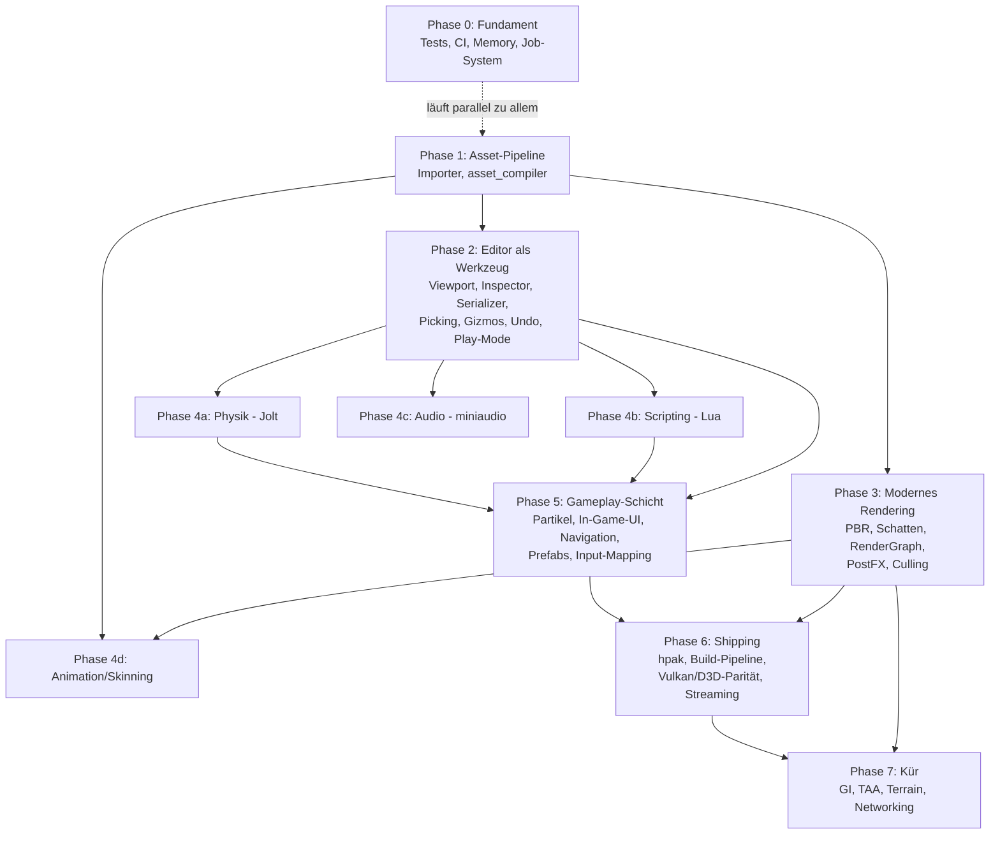

# Horizon Engine — Masterplan zur vollwertigen Engine

Stand: 12. Juni 2026. Ersetzt die Meilenstein-Sicht der ROADMAP.md durch einen
vollständigen Plan bis zur „modernen Engine auf Augenhöhe" (Referenzrahmen:
Unity/Godot-Featureset, nicht Unreal-AAA).

---

## Ist-Zustand (was schon fertig ist)

| Bereich | Status |
|---|---|
| Core: Window, App-Loop, Input, Logger, ContentManager, .hasset-Format | ✅ |
| UUID-Persistenz im META-Chunk (v2) | ✅ |
| Erster Render-Pfad: ECS-Welt → sichtbares Mesh auf GL **und** Metal (CommandBuffer, RenderWorld, RenderExtractor, Kamera) | ✅ |
| Editor-Shell: Hub, Docking, Outliner, Content Browser | ✅ |
| Backend-Gerüste GL/Metal/Vulkan/D3D11/D3D12 | 🟡 GL+Metal zeichnen, Rest nur Clear |
| Asset-Importer (Texture/Mesh/Material/Audio), asset_compiler, Packer | 🔴 Stubs |
| SceneSerializer | 🔴 nur Name + Hierarchie |
| RenderGraph, RenderPass, RenderResourceManager, GPUMemoryAllocator | 🔴 leer |
| Memory (Ref\<T\>, Allocatoren) | 🔴 leer |
| Physik, Scripting, Audio, Animation, Partikel, Navigation, In-Game-UI | 🔴 fehlen komplett |
| Tests, CI, Profiling | 🔴 fehlen |

---

## Abhängigkeitsgraph (Phasen)

Kernaussage: **Asset-Pipeline (P1) ist der Flaschenhals** — Editor-Ausbau,
Rendering-Features und Animation hängen alle daran. Die vier 4er-Blöcke sind
untereinander unabhängig und parallelisierbar.

---

## Phase 0 — Fundament (Querschnitt, sofort startbar, läuft nebenher)

Keine Abhängigkeiten; jede Woche ein bisschen davon.

| # | Aufgabe | Hängt ab von | Details |
|---|---|---|---|
| 0.1 | **Test-Gerüst** (doctest oder Catch2) | — | Zuerst: SlotMap, HAsset-Roundtrip, SceneSerializer-Roundtrip, ContentManager |
| 0.2 | **CI** GitHub-Actions-Matrix (macOS + Windows, später Linux) | 0.1 | Build + Tests pro PR; verhindert Backend-Drift |
| 0.3 | **`Ref<T>`** (intrusiver Refcount) + Einsatz im ContentManager | — | Voraussetzung für Asset-Unloading (6.4) und GPU-Eviction (3.7) |
| 0.4 | **Job-System** (Thread-Pool, parallel_for, Abhängigkeits-Handles) | — | Voraussetzung für parallele Extraction (3.8), Async-Loading (6.4), Physik-Threading |
| 0.5 | **Profiling-Hooks**: Tracy vendoren, Frame-/Zone-Marker | — | Früh einbauen ist billig, nachrüsten teuer |
| 0.6 | **Aufräumen**: doppelte glm-Kopie (vendored + FetchContent) auf eine Quelle | — | klein |
| 0.7 | **Debug-Draw-API** (Linien, Wireframe-AABBs, Text im Viewport) | Render-Pfad ✅ | Hilft jeder späteren Phase (Physik-Collider, Frustum, NavMesh sichtbar machen) |

---

## Phase 1 — Asset-Pipeline end-to-end (kritischer Pfad)

**Ziel:** glTF/PNG rein → .hasset raus → Content Browser → Szene.
Blockiert P2 (man braucht Assets zum Editieren), P3 (PBR braucht Texturen/Materialien)
und P4d (Skelette kommen aus dem Mesh-Import).

| # | Aufgabe | Hängt ab von | Details |
|---|---|---|---|
| 1.1 | **TextureImporter** | — | stb_image (liegt schon im vendor) → PIXL/TXMI-Chunks; Mipmap-Generierung gleich mitmachen |
| 1.2 | **MeshImporter** | — | cgltf vendoren (header-only); VERT/INDX/NORM/TEXC + MREF; Tangenten gleich mitberechnen (PBR braucht sie) |
| 1.3 | **MaterialImporter** | 1.1 | JSON → MTRL-Chunk; glTF-Materialien (metallic/roughness) aus 1.2 übernehmen |
| 1.4 | **asset_compiler verdrahten** | 1.1–1.3 | Verzeichnis-Walk, Endung → Importer, Inkrementalität per mtime |
| 1.5 | **Editor-Import**: Button + Drag&Drop in den Content Browser | 1.4 | ruft die Importer-Lib direkt auf, nicht das CLI |
| 1.6 | **Textur-Kompression** (BCn/ASTC, z. B. via bc7enc o. ä.) | 1.1 | kann nach hinten rutschen, aber vor Shipping (P6) nötig |
| 1.7 | **AudioImporter** (PCMD-Chunks, WAV/OGG via dr_libs/stb_vorbis) | — | unabhängig; wird erst in P4c konsumiert |

**DoD:** Heruntergeladenes glTF-Modell mit Texturen importieren und im Editor gerendert sehen.

---

## Phase 2 — Editor wird Werkzeug

**Ziel:** Szene bauen, speichern, laden, abspielen — ohne Code anzufassen.
Braucht P1 (Assets zum Platzieren); 2.1–2.2 können sofort parallel zu P1 starten.

| # | Aufgabe | Hängt ab von | Details |
|---|---|---|---|
| 2.1 | **Szenen-Viewport offscreen** (FBO/MTLTexture → `ImGui::Image`) | Render-Pfad ✅ | Renderer-API `SetRenderTarget(w,h)` + `GetViewportTexture()`; Resize-Handling |
| 2.2 | **SceneSerializer vervollständigen** | — | alle Komponenten (Transform, Mesh, Material, Light, Camera, RigidBody, Script, Transform2D) + Binary-Pfad; Versionierung beibehalten |
| 2.3 | **Inspector-Panel** | 2.2 sinnvoll | Komponenten anzeigen/editieren, Add/Remove-Menü; Reflection-Mini-Makro lohnt sich hier schon |
| 2.4 | **Outliner-Ausbau** | — | Entity anlegen/löschen/umbenennen, Reparenting per Drag&Drop, Selektion ↔ Inspector |
| 2.5 | **Picking** (ID-Buffer-Pass; Entity-ID im RenderObject existiert) | 2.1 | Klick im Viewport selektiert |
| 2.6 | **Gizmos** (ImGuizmo vendoren) | 2.1, 2.5 | Translate/Rotate/Scale + Snap |
| 2.7 | **Undo/Redo** (Command-Pattern auf Komponentenebene) | 2.3 | Toolbar-Icons existieren schon |
| 2.8 | **Play-in-Editor** | 2.2 | Welt-Snapshot in Memory-Buffer bei Play, Restore bei Stop |
| 2.9 | **Editor-Kamera-Komfort** | 2.1 | Orbit/Fly-Modus, Focus-on-Selection (F), Grid im Viewport |

**DoD:** Szene zusammenklicken, speichern, Editor neu starten, weitermachen, Play drücken.

---

## Phase 3 — Modernes Rendering

Reihenfolge nach Sichtbarkeit pro Aufwand. Braucht P1 für Materialien/Texturen;
3.1 und 3.3 gehen sofort.

| # | Aufgabe | Hängt ab von | Details |
|---|---|---|---|
| 3.1 | **FrustumCuller + RenderSorter** | Render-Pfad ✅ | Header existieren, AABB.h liegt in Core/Math; Culling → Sorting → Submit |
| 3.2 | **Shader-Cross-Compile** ausbauen | — | `glslc → SPIR-V → SPIRV-Cross → MSL/HLSL` im shader_compiler; beendet handgeschriebene MSL-Duplikate und ist Voraussetzung für Vulkan/D3D-Parität (6.2) |
| 3.3 | **Beleuchtung**: Blinn-Phong → **PBR** (metallic/roughness) | 1.2/1.3 für echte Materialien | LightData als Uniform-Block; Punkt-, Spot-, Directional-Lights |
| 3.4 | **RenderGraph + Pass-System aktivieren** | 3.1 | GeometryPass → PostProcessPass als erste Knoten; .cpp sind leer, Header + Design-Doc existieren |
| 3.5 | **Schatten**: Directional mit einer Cascade → CSM | 3.4 | danach Punkt-/Spotlicht-Schatten |
| 3.6 | **HDR + Tonemapping** als erster PostProcess-Pass | 3.4 | danach Bloom |
| 3.7 | **RenderResourceManager + GPUMemoryAllocator** | 0.3 | Budget + LRU-Eviction, `onHandleUsed`-Hook beim Draw |
| 3.8 | **Instancing + parallele Extraction** | 3.1, 0.4 | instanceCount im DrawCall existiert schon |
| 3.9 | **Skybox + IBL** (Environment-Map, Irradiance/Prefilter) | 3.3 | macht PBR erst „modern aussehend" |
| 3.10 | **Transparenz-Pass** (sortiertes Alpha-Blending) | 3.1, 3.4 | OIT ist Kür (P7) |
| 3.11 | **Anti-Aliasing**: FXAA zuerst | 3.6 | TAA ist Kür (P7) |
| 3.12 | **SSAO** | 3.4 | optionaler, aber sichtbarer Gewinn |

**DoD:** PBR-Szene mit Schatten, HDR, Skybox bei stabilen Frametimes; Frustum-Culling messbar via Tracy.

---

## Phase 4 — Engine-Systeme (vier unabhängige, parallelisierbare Blöcke)

Alle brauchen P2.2 (Serializer, damit Komponenten persistiert werden) und
profitieren von P2.8 (Play-Mode zum Testen).

### 4a — Physik
| # | Aufgabe | Hängt ab von | Details |
|---|---|---|---|
| 4a.1 | **Jolt Physics** integrieren (FetchContent) | 2.2, 2.8 | gegen RigidBodyComponent; fixedUpdate-Hook im GameLoop existiert |
| 4a.2 | Collider-Komponenten (Box/Sphere/Capsule/Mesh) + Debug-Draw | 4a.1, 0.7 | |
| 4a.3 | Raycasts/Queries als Engine-API | 4a.1 | braucht Scripting (4b) später als Konsument |
| 4a.4 | Character-Controller | 4a.1 | |
| 4a.5 | 2D-Physik (Box2D) — optional, wenn Catania es braucht | 2.2 | Transform2D existiert schon |

### 4b — Scripting
| # | Aufgabe | Hängt ab von | Details |
|---|---|---|---|
| 4b.1 | **Lua via sol2**, ScriptComponent-Lifecycle (onStart/onUpdate) | 2.2, 2.8 | Enums sind vorbereitet |
| 4b.2 | Engine-API-Binding (Entity, Transform, Input, Spawn/Destroy) | 4b.1 | |
| 4b.3 | Hot-Reload von Scripts im Play-Mode | 4b.1 | |
| 4b.4 | Script-Properties im Inspector (exportierte Variablen) | 4b.1, 2.3 | |
| 4b.5 | C#/.NET-Hosting — später oder nie | 4b.2 | erst evaluieren, wenn Lua nicht reicht |

### 4c — Audio
| # | Aufgabe | Hängt ab von | Details |
|---|---|---|---|
| 4c.1 | **miniaudio** + AudioSource/AudioListener-Komponenten | 1.7, 2.2 | |
| 4c.2 | 3D-Spatialization, Attenuation | 4c.1 | |
| 4c.3 | Mixer/Bus-System (Music/SFX-Gruppen, Lautstärke) | 4c.1 | |

### 4d — Animation
| # | Aufgabe | Hängt ab von | Details |
|---|---|---|---|
| 4d.1 | Skelett + Skinning-Daten im MeshImporter (glTF-Skins) | 1.2 | neue Chunks im .hasset-Format |
| 4d.2 | GPU-Skinning (Bone-Matrizen als Uniform/Storage-Buffer) | 4d.1, 3.3 | |
| 4d.3 | AnimationClip-Playback + AnimatorComponent | 4d.1, 2.2 | |
| 4d.4 | Blending + State-Machine (einfacher Animator-Graph) | 4d.3 | |
| 4d.5 | Property-Animation (Transform/Material animieren, für Cutscenes/UI) | 4d.3 | |

---

## Phase 5 — Gameplay-Schicht

Macht aus „Renderer + Systeme" eine Engine, in der man ein Spiel *baut*.

| # | Aufgabe | Hängt ab von | Details |
|---|---|---|---|
| 5.1 | **Prefabs** (Entity-Hierarchie als Asset, Instanzen + Overrides) | 2.2 | enormer Workflow-Gewinn, früh in P5 machen |
| 5.2 | **Input-Mapping** (Actions/Axes statt Roh-Keys, Gamepad) | — | Scripting (4b.2) konsumiert es |
| 5.3 | **Partikelsystem** (CPU-Sim zuerst, instanziertes Rendering) | 3.8 | GPU-Sim ist Kür |
| 5.4 | **In-Game-UI-Runtime** (Canvas, Text via MSDF/stb_truetype, Buttons, Anchoring) | Render-Pfad ✅ | nicht ImGui — das ist Editor-only |
| 5.5 | **Navigation**: Recast/Detour-NavMesh-Baking + Agenten | 4a.1 | |
| 5.6 | **Szenen-Streaming/Additive-Load** (mehrere Szenen gleichzeitig) | 2.2 | |
| 5.7 | **Event-/Messaging-System** für Gameplay-Code | 4b.2 | |

---

## Phase 6 — Shipping & Plattform-Reife

| # | Aufgabe | Hängt ab von | Details |
|---|---|---|---|
| 6.1 | **hpak-Packaging**: HpakWriter + KeyDerivation implementieren, asset_compiler → Packer-Kette, GameApplication lädt aus .hpak | 1.4 | SerializeFormat::Binary-Pfad |
| 6.2 | **Vulkan-Backend auf Parität** (Draw-Pfad, danach D3D12; D3D11 ggf. streichen) | 3.2, 3.4 | Linux-Support hängt hieran |
| 6.3 | **„Build Game"-Pipeline im Editor**: Standalone-Export (Executable + .hpak) pro Plattform | 6.1 | |
| 6.4 | **Async-Asset-Streaming** (Lade-Jobs, Platzhalter-Assets, Unloading via Ref\<T\>) | 0.3, 0.4 | |
| 6.5 | **Crash-Reporting scharf schalten** (CrashHandler existiert), Logging in Datei | — | |
| 6.6 | **Linux-Window/Input-Pfad** testen + CI-Leg | 0.2, 6.2 | |
| 6.7 | **Doku**: Getting-Started, Script-API-Referenz | 4b.2 | spätestens wenn jemand Zweites die Engine benutzt |

**DoD:** Ein Knopf im Editor erzeugt ein lauffähiges, ausliefbares Spiel-Binary mit gepackten, komprimierten Assets — auf macOS und Windows.

---

## Phase 7 — Kür (nach Bedarf, von Catania getrieben)

Kein fester Plan — einzeln ziehen, wenn das Spiel es verlangt:

- **TAA** und/oder **OIT** (Order-Independent Transparency)
- **Global Illumination** (Probes/DDGI-light) und **SSR**
- **LOD-System** + Impostors
- **Terrain** + Vegetation/Foliage
- **GPU-Partikel**
- **Networking** (Replikation) — nur falls Catania Multiplayer wird
- **Virtual Texturing / Bindless** — nur bei nachgewiesenem Bedarf

---

## Empfohlene Reihenfolge der nächsten 5 Arbeitsschritte

1. **TextureImporter + MeshImporter** (1.1, 1.2) — der Flaschenhals, alles wartet darauf.
2. **Offscreen-Viewport** (2.1) — parallel machbar, sofort sichtbarer Editor-Gewinn.
3. **SceneSerializer vervollständigen** (2.2) — klein, entsperrt Inspector, Play-Mode und alle P4-Blöcke.
4. **Test-Gerüst + CI** (0.1, 0.2) — bevor die Codebasis weiter wächst.
5. **Inspector + Outliner-CRUD** (2.3, 2.4) — danach ist der Editor erstmals ein echtes Werkzeug.

Faustregel für die Parallelisierung danach: eine Person/ein Strang auf dem
kritischen Pfad P1 → P2 → P5 → P6, Rendering (P3) und je ein P4-Block laufen
daneben her.
