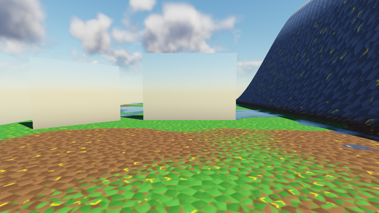
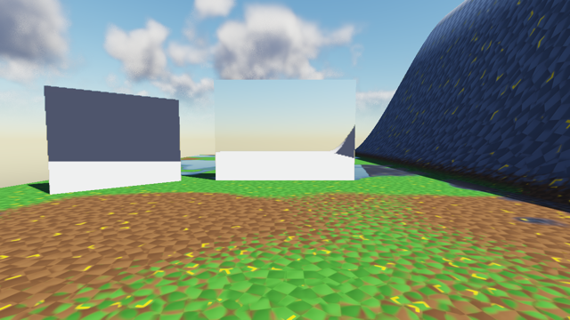
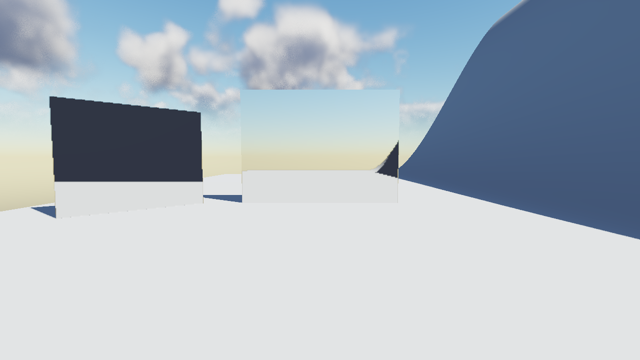

# GI-Reflexionen: Himmel und Auto-Landschaftsmaterial, Ursache (Thema 173, Schritt 1)

Stand: 08.10.2026, MacBook Air (Apple M5), Release-Build `out/build/macos-release` auf dem
Zweig `claude/gi-reflexionen-himmel-und-auto-landschaftsmaterial` (Basis `60c14057`,
release/0.7.0). Gemessen auf **Metal** (HW-Raytracing und SW-BVH, forward und deferred).
OpenGL nur am Quelltext, siehe §4. Noch nichts am Renderer geändert.

## 1. Kurzfassung

| Fall | Ursache | Wo |
|---|---|---|
| (b) Auto-Landschaft spiegelt **weiß** | Die GI-Trefferfarbe kommt aus dem CPU-Fold `matGraphApproxSurface`. Die BaseColor des Auto-Materials hängt an Textur-Array-Samples, die der Fold nicht falten kann. Ergebnis `approxBaseColor = (1, 1, 1)`, `approxLayerCount = 0`. | `MaterialGraph.cpp` `approxFoldNode` (`default: return false`), `foldPin` („linked but unfoldable → keep the defaults“) |
| (a) Himmel im Spiegel | Der Himmel-Fallback **existiert** und greift: Ein Strahl ohne Treffer hat Confidence 0, das Composite behält die SkyEnv-Cubemap. Diese Cubemap ist aber reiner Atmosphären-Himmel **ohne Wolken** und hat unter dem Horizont einen pauschalen Bodenton. Was im Spiegel fehlt, sind also die Wolken (und echtes Gelände bei Fehlschüssen nach unten), nicht die Himmelsfarbe. | `SkyEnvBake.h` (kein Wolkenterm), Metal `giReflRay` Primär-Miss, Composite `envSpec = mix(sky, refl.rgb, refl.a …)` |

Die Landscape-Geometrie ist in der TLAS und in der SW-BVH: Die Strahlen **treffen** das
Terrain, nur die Farbe stimmt nicht. Das zeigt die Kontrolle mit dem weißen
Standard-Terrain-Material (§3): Dort ist der Spiegel so hell wie das Terrain selbst.

## 2. Zeuge

Neu: `HE_DUMP_AUTOLANDMIRROR=1` als Zusatz zum vorhandenen Zeugen `HE_DUMP_AUTOLAND`
(`EditorApplication.cpp`, Thema 158). Er stellt zwei Spiegel (Metall 1, Rauheit 0,05) auf die
Ebene des analytischen Reliefs (y = 300):

- **kamerazugewandt** bei x −40, z −14: Strahlen laufen zurück hinter die Kamera, die untere
  Hälfte trifft die Ebene (Gras/Erde/Pfützen), die obere geht in den Himmel.
- **45° gegiert** bei x −54, z −10: Strahlen laufen nach +x auf den Felshang und das
  Schnee-Plateau.

Die Logzeile nennt den Fold, mit dem ein GI-Treffer auf diesem Terrain schattiert wird:

```
HE_DUMP_AUTOLANDMIRROR mirrors added (landscape GI fold: approxBaseColor 1.000 1.000 1.000, approxLayerCount 0)
```

Aufnahme (macOS, Skript aus Thema 158 mit privatem Config-Ordner, `HE_SKY_TIME=30`, AA/GI-Diffus/
SSAO/SSR aus, forward, sofern nicht anders angegeben):

```
S=scripts/auto-landscape-repro/cap158auto.sh
CAM=(CAMX=-40 CAMY=304 CAMZ=14 PITCH=-4 COVERAGE=0.3)
HE_TAG=-r0    $S /tmp/gi173 1       Metal -- AUTOLANDMIRROR=1 GIREFL=0 $CAM
HE_TAG=-r1    $S /tmp/gi173 1       Metal -- AUTOLANDMIRROR=1 GIREFL=1 $CAM
HE_TAG=-r1def $S /tmp/gi173 1       Metal -- AUTOLANDMIRROR=1 GIREFL=1 RENDERPATH=1 $CAM
HE_GI_FORCE_SW=1 HE_TAG=-r1sw $S /tmp/gi173 1 Metal -- AUTOLANDMIRROR=1 GIREFL=1 $CAM
HE_TAG=-r1    $S /tmp/gi173 builtin Metal -- AUTOLANDMIRROR=1 GIREFL=1 $CAM
```

Zwei Läufe desselben Builds (`-r1`, `-r1b`) sind bitgleich (gleiche md5). Keine `[ERROR]`-Zeile,
4 Draws (7 deferred), der SW-Lauf loggt „software GI path forced“.

## 3. Messung (Metal)

Pixel (sRGB, 1280×720) an fünf festen Stellen:

| Lauf | Spiegel vorn, oben (Himmel) | Spiegel vorn, unten (Ebene) | gegiert, oben (Hang) | gegiert, unten (Ebene) | echter Himmel |
|---|---|---|---|---|---|
| `r0` GIRefl aus | 185,213,223 | 200,195,167 | 223,229,217 | 212,205,174 | 145,190,216 |
| `r1` GIRefl an, HW | 185,213,223 | **239,240,240** | **78,85,108** | **239,240,240** | 145,190,216 |
| `r1def` deferred | 185,213,223 | 238,238,239 | 95,104,117 | 238,238,239 | 145,190,216 |
| `r1sw` SW-BVH | 185,213,223 | 239,240,240 | 78,85,108 | 239,240,240 | 145,190,216 |
| `builtin` (weißes Standard-Terrain), GIRefl an | 185,213,223 | 220,222,222 | 48,54,68 | 220,222,222 | 145,190,216 |

Positionen: vorn oben (640, 220), vorn unten (640, 380), gegiert oben (250, 280), gegiert unten
(250, 390), Himmel (900, 120).





Lesart:

- Das sichtbare Terrain ist grün/braun, sein Spiegelbild **reinweiß** (239). HW, SW-BVH, forward
  und deferred stimmen überein, also liegt es nicht an einem Kernel oder Pfad, sondern an der
  gemeinsamen Eingabe: der Instanzfarbe.
- `builtin` ist die Gegenprobe: Das Standard-Terrain ist selbst weißgrau, sein Spiegelbild auch.
  Strahl, TLAS/BVH, Treffer-Beleuchtung und Composite sind in Ordnung.
- Der Himmel-Anteil des Spiegels ist in **allen** Läufen identisch (185,213,223), mit und ohne
  GIRefl: Das ist die SkyEnv-Cubemap. Der Spiegel zeigt einen glatten Verlauf, der echte Himmel
  direkt daneben hat Wolken.
- Nebenbei: Der gespiegelte Hang (gegiert oben) ist dunkler als der direkt gesehene. Mit
  GI-Diffus aus bekommt ein Treffer nur Sonne × Sichtbarkeit + den flachen Ambient-Boden, kein
  Himmels-IBL wie die direkte Schattierung. Bei der Bewertung „plausible Albedo“ in Schritt 4 mit
  GI-Diffus an messen oder diesen Unterschied einrechnen.

## 4. Ursache im Detail

### 4.1 Auto-Landschaft (b)

Ein GI-Treffer wird pro **Instanz** schattiert. Die Farbe liefert `HE::giInstanceSurface`
(`GiInstanceSurface.cpp`), für Graph-Materialien aus `MaterialAsset::approxBaseColor` (bzw. dem
Parameter-Slot) oder, bei einem `Landscape Layer Blend`, pro Texel aus `GiLandscape`.

Das Auto-Material (`AutoLandscapeMaterial.cpp`) passt in keinen dieser Wege:

1. BaseColor = `Lerp(s3.albedo, s3.albedo × 0,35, waterMask)`, darunter eine Mischkette über
   `TextureArraySample` / `TextureArrayBombSample` (Albedo-Array, Slices Grass/Dirt/Rock/Snow/
   WetGround) mit Masken aus Weltnormale, Welthöhe und FBM. `approxFoldNode` kennt keinen
   Texturknoten (`default: return false; // textures, per-fragment inputs … cannot fold`).
   `foldPin` lässt dann den Vorgabewert stehen: **weiß**.
2. Es gibt keinen `Landscape Layer Blend` und keine Weightmap. Die Layer-Aufteilung im Fold und
   die Per-Texel-Abtastung über `GiLandscape` sind deshalb **nicht anwendbar**, nicht bloß
   fehlerhaft. Der Extraktor (`RenderExtractor.cpp`, Landscape-Tabelle) legt für dieses Terrain
   keinen `GiLandscape`-Eintrag an (`layerCount <= 0 → continue`), `landscapeIndex` bleibt −1.
3. Eine Material-Instanz (wie im Zeugen) übernimmt die `approx*`-Felder vom Eltern-Asset
   (`ContentManager.cpp`, `syncMaterialInstance`), ändert also nichts.

Vorwissen dazu: `docs/auto-landscape-material-textures.md` §10.5 („GI-Näherung …
Rückfallwert statt einer Mischung der Schichtfarben“) und `docs/gi-reflections-plan.md`,
„Offen: Ein Texture Sample auf der BaseColor faltet weiterhin nicht“.

Dieselbe weiße Farbe landet auch im DDGI-Probe-Bounce (gleiche Instanzfarbe), das Terrain
bounct also weiß statt grün.

### 4.2 Himmel (a)

- **Metal HW** (`kGIReflMSL`, `giReflRay`): Primär-Miss → `accum` 0, `conf` 0 → Composite
  behält `skyEnv.sample(Rrough)` (forward: Szenen-Shader-Kaskade; deferred: `kSSRCompositeFS`).
  Sekundär-Miss (Bounce-Loop) sampelt die Cubemap direkt. **Metal SW** (`giReflRaySw`) ebenso.
- **OpenGL** (`kGiReflCS`): Miss → `continue` (Beitrag 0, Confidence 0), Composite im
  Shading-Pass `envSpec = mix(texture(uSkyEnv, Rrough), rr.rgb, rr.a …)` (`kUnlitFS`, Graph-
  Materialien `heLitP` in `MaterialShaderLibrary.cpp`). Kein Bounce-Loop, also auch kein
  Sekundär-Miss. Die Trefferfarbe kommt aus demselben `giInstanceSurface`
  (`OpenGLRenderer.cpp`, Aufruf in `UpdateGIAccel`, `giInsts[].baseColor`), also hat GL
  denselben Fehler (b).
- Die Cubemap (`SkyEnvBake.h`, `AtmoScatterCPU`) ist Rayleigh/Mie/Ozon plus Sonnenscheibe,
  **kein Wolkenterm**; unter dem Horizont ein pauschaler Bodenton (r0, „vorn unten“: 200,195,167).
  Ein Spiegel kann also nie Wolken zeigen, auch nicht auf SSR-Fehlschüssen.

**Offene Frage an die Queen bzw. den Menschen:** Ist mit „reflektiert den Himmel nicht“ gemeint,
dass die Wolken (und ggf. Sterne/Mond) fehlen? Die Himmelsfarbe selbst kommt an. Davon hängt
ab, was Schritt 2 baut.

### 4.3 Nebenbefund: Teil-Miss gewichtet Treffer mit f² (glossy)

Beide Kernel mitteln über die Strahlen eines Pixels, indem Miss-Strahlen 0 zu Farbe **und**
Confidence beitragen (Metal: `sampleOut += float4(accum, conf) / rays`; GL: `outRadiance /
rays, outConf / rays`). Das Composite mischt aber mit Straight-Alpha:
`mix(sky, rgb, a) = sky·(1−f) + f·(f·L)`. Bei Trefferanteil f bekommt der Treffer also das
Gewicht f² statt f, der Rand eines glossy Spiegelbilds zum Himmel hin wird dunkler statt in den
Himmel überzublenden. Die temporale EMA mittelt rgb und a getrennt, also gilt dasselbe für einen
gejitterten Strahl pro Frame. Betrifft nur glossy Lobes (mehrere Strahlen oder Jitter), nicht
den Spiegel mit einem Strahl, und ist nicht der Hauptfehler dieses Themas. Nicht gemessen.
Korrektur wäre `rgb = Σ L / Σ Treffer` (oder Composite mit vormultipliziertem rgb).

### 4.4 OpenGL ist auf dem Mac nicht lauffähig

`m_giSupported = (GLAD_GL_VERSION_4_3 != 0)` (`OpenGLRenderer.cpp`). macOS-GL ist 4.1, also
laufen GI und GI-Reflexionen auf dem Mac unter OpenGL gar nicht; der GL-Spiegel zeigt nur die
Cubemap. Ein GL-Fix lässt sich hier nur offline prüfen (`glslangValidator` über
`"#version 430 core" + kGiTraversalGLSL + kGiReflCS`, wie in `docs/gi-reflections-plan.md`)
und zur Laufzeit erst in der Linux-/Windows-CI.

## 5. Für Schritt 2 und 3

- **Schritt 3 (Albedo):** Ein konstanter Fold reicht nicht, die Farbe hängt am Trefferpunkt
  (Steigung, Höhe). Vorschlag: analog zu `GiLandscape` eine kleine Beschreibung pro
  Auto-Landscape-Instanz (Mittelfarbe je Slice aus dem Albedo-Array, auf der CPU gebacken, plus
  die Parameter Rock Slope/Blend, Snow Height/Blend/Max Slope aus dem Parameter-Block der
  Instanz). Der Kernel rechnet aus Treffer-Normale und -Höhe Fels/Schnee/Boden wie der Graph,
  ohne Texturen, Bombing und Pfützen. Billiger Rückfall, falls das zu viel ist: den Fold für
  `TextureArraySample`/`TextureSample` auf die mittlere Texturfarbe erweitern (eine Farbe für
  das ganze Terrain, besser als Weiß). Beides muss in Metal HW, Metal SW und GL identisch sein.
- **Schritt 2 (Himmel):** Antwort auf die offene Frage in §4.2 abwarten. Wenn Wolken gemeint
  sind: Die Cubemap ist eine CPU-Atmosphären-Bake, Wolken wären ein GPU-Bake der Himmelspass-
  Ausgabe (inkl. Wolken) in eine niedrig aufgelöste Cubemap, genutzt vom Composite und vom
  Sekundär-Miss. Der f²-Nebenbefund (§4.3) gehört sinnvoll in denselben Schritt.
- Zeuge für vorher/nachher: §2, die Werte in §3 sind die Vorher-Zahlen.

## 6. Schritt 2: Himmel im Spiegel (umgesetzt)

Lesart der offenen Frage aus §4.2: Der Schritt verlangt die Himmelsfarbe „passend zu Tageszeit
und Wetter“, also den Himmel, den der Betrachter sieht, mit Wolken. Die Atmosphärenfarbe allein
kam schon an.

**Umsetzung.** Der echte Himmelspass (`skyFragment` auf Metal, `DrawSkyFullscreen`/`kSkyFS`
auf GL, mit Wolken, Wetter, Sternen und Mond) wird in jedem Frame, in dem die GI-Reflexionen
tracen, in eine kleine Cubemap um die Kamera gezeichnet (6 × 128², RGBA16F, ohne Low-Res-
Wolken, deren Puffer liegt im Bildraum). Strahlen ohne Treffer lesen diese Cubemap:

- **Primär-Miss:** Himmelsfarbe mit voller Konfidenz (Metal: `roughFade` des Empfängers, GL: 1).
  Das Composite zeigt damit den Himmel aus dem Trace statt seiner wolkenlosen SkyEnv-Cubemap.
- **Sekundär-Miss** (Bounce-Schleife, nur Metal): liest dieselbe gebackene Cubemap an Slot 8,
  sonst wie bisher SkyEnv. Die Schleife selbst ist unverändert.
- Nebenbei erledigt sich der f²-Fehler aus §4.3 für den Himmelsanteil: Ein Miss ist jetzt ein
  vollwertiges Sample, ein halb danebengehender glossy Lobe mittelt Treffer und Himmel.
- Ohne Sky-Entity (`skyEnabled` aus) oder mit `HE_GIREFL_SKY=0` wird nichts gebacken, und das
  alte Verhalten gilt bitgenau (Messung unten).
- Kein neuer Sampler in den Material-Shadern: Die Cubemap hängt nur an den Compute-Kerneln
  (Metal: Textur 8 statt `m_skyEnvCube`, GL: Unit 9 `uSkyRefl` in `kGiReflCS`).
- Kein FrameKey-Eintrag nötig: Alle Eingaben (Sonne, Environment, Uhr, Kamera) liest der
  Renderer selbst, nichts davon kommt neu aus dem Extraktor.
- Die Seiten-Matrix ist `HE::SkyCubeFaceInvViewProj` (`SkyEnvBake.h`), geprüft in
  `tests/test_culling.cpp` gegen `SkyEnvFaceDirection` für beide Zeilenordnungen (Metal: NDC
  y = +1 in Zeile 0, GL: y = −1).

Kosten: 6 × 128² = 98 304 Himmelspixel pro Frame, etwa ein Zehntel eines 720p-Himmelspasses.

**Messung (Metal, gleicher Zeuge wie §2/§3, `scripts/auto-landscape-repro/ana173sky.py`):**

| Lauf | md5 (BMP) | Spiegel-Himmel Mittel | Luma-Streuung Spiegel-Himmel |
|---|---|---|---|
| vorher `r0` (GIRefl aus) | ce9749e7… | | |
| nachher `r0` (GIRefl aus) | ce9749e7… (gleich) | | |
| vorher `r1` | 01243515… | 199,217,214 | 7,1 |
| nachher `r1`, `HE_GIREFL_SKY=0` | 01243515… (gleich) | 199,217,214 | 7,1 |
| nachher `r1` HW | 383f10d4… | 195,210,208 | **12,5** |
| nachher `r1sw` SW-BVH | 7a942aa9… | 195,210,208 | 12,5 |
| nachher `r1def` deferred | 463ce390… | 193,208,206 | 12,2 |
| echter Himmel (Referenz) | | | 20,7 |

Spiegel-Himmel = Kasten x 500–780, y 190–320 im kamerazugewandten Spiegel; echter Himmel =
gleicher Kasten bei y 20–150. Die Punktwerte aus §3 ändern sich kaum (640,220 liegt zufällig
in einer wolkenlosen Stelle: 185,213,223 → 184,212,222); Terrain-Treffer bleiben weiß, das ist
Schritt 3.


**OpenGL:** gleich gebaut, aber auf dem Mac nicht lauffähig (§4.4). Geprüft: `kGiReflCS` mit
`glslangValidator -S comp` (`#version 430 core` + `kGiTraversalGLSL` + `kGiReflCS`), C++ baut.
Laufzeit erst in der Linux-/Windows-CI.
