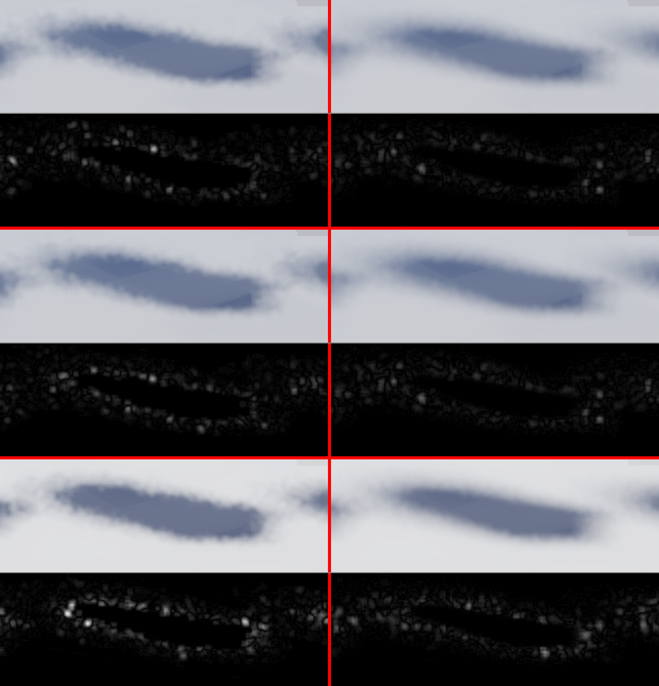

# GI-Schatten: fleckige, wandernde Kanten — Repro und Ursache

Stand 02.10.2026, Zweig `claude/gi-schatten-zerrissen-und-instabil-am-rand-auf-d3d11-d3d12-v`
(Basis `9ed6f816`). Schritt 1 des Themas 131 „GI-Schatten zerrissen und instabil am Rand auf
D3D11/D3D12/Vulkan/OpenGL (nicht Metal)". Analyse mit Hardware-Repro, **kein Engine-Code geändert**.
Gemessen auf NN-WS03 (RTX 4070), Release-Build in einem privaten Baum (`C:/hw131`).
**Der Fix (Schritt 2) mit Vorher/Nachher-Messung steht in §7.**

## Kurzfassung

Bei aktivem GI kommt die Sonnen-Schattenkante **nicht** aus der Shadow-Map und **nicht** aus den
DDGI-Probes, sondern aus einer eigenen Kette: ray-getracte Sonnenmaske, 1 Strahl pro Pixel,
halbe Auflösung, dann Temporal-Akkumulation, dann 3×3-Blur. Diese Maske **ersetzt** die CSM
komplett. Die Kette hat drei Defekte. Das gemeldete Bild entsteht aus 1 und 3 zusammen mit
dem Grundrauschen (1 spp, weißes Rauschen, nur ~10 effektive Frames, 3×3-Blur auf halber
Auflösung). Defekt 2 kommt mit der Laufzeit hinzu.

1. **Größter Einzelhebel im Stand (fleckig, ausgefranst, wechselt jeden Frame):**
   `gi_temporal` clampt die History auf Min/Max der 3×3-Nachbarschaft des **rohen
   1-spp-Signals**. Das Signal ist binär (0/1). Im Halbschatten ist die Nachbarschaft
   regelmäßig zufällig einheitlich (alle 0 oder alle 1). Dann wird die History auf 0 oder 1
   gezogen, und die Akkumulation fängt von vorn an. Dazu kommen der Blend von nur 0.9
   (≈10 effektive Samples), weißes Rauschen aus einem `sin`-Hash und ein Blur von nur 3×3 auf
   halber Auflösung. Zusammen ergibt das genau das Muster aus der Meldung.
   Auf der Hardware belegt: Wird nur der Clamp entfernt, sinkt das p99-Frame-zu-Frame-Flackern
   an der Kante von **8.0 auf 2.9** Graustufen, und das Hochfrequenz-Rauschen geht von 1.10 auf
   0.84 zurück. Das mittlere Flackern sinkt allerdings nur um ~40 % (1.29 → 0.78). Den Clamp zu
   entfernen allein reicht also nicht.
2. **Laufzeitabhängiger Defekt:** Der Jitter-Seed ist ein unbeschränkt wachsender
   `float` (+1 pro GI-Frame). Er läuft ungebremst in `fract(sin(dot(gid + seed·13.37, …))·43758)`.
   Ab Seed ≈ 1e5 kollabiert der Hash auf der GPU. Bei 144 fps sind das ≈ 11.6 min Editor-Laufzeit,
   bei 60 fps ≈ 28 min. Der Kegel-Jitter steht dann still: Der Halbschatten verschwindet, der
   Schatten wird hart, verschoben und um ~10 Graustufen dunkler. Gemessen auf **Vulkan und
   D3D12**, jeweils mit dem HW-RT-Kernel auf NVIDIA (Shader-Tausch ohne Rebuild). Die SW-Kernel
   (D3D11, GL, Vulkan/D3D12 ohne HW-RT) teilen Hash und Seed und sollten sich gleich verhalten,
   gemessen ist das nicht. Andere GPU-Hersteller sind nicht geprüft. Schon bei Seed 2e4
   (≈ 2.3 min @144 fps) ist der Hash messbar degradiert: weniger zeitliche Variation, mehr
   HF-Struktur.
3. **Unter Kamerabewegung verwirft die Reprojektion die History:** Die Positionstoleranz
   (`clamp(0.02·clip.w, 0.01, 0.06)` Welteinheiten gegen die Half-Res-Weltposition) ist so eng,
   dass schon ein Frame mit 0.3° Yaw an der Kante History verwirft. Das p99-Flackern steigt dann
   auf 15.1 (statisch 8.0). Erst ohne Clamp **und** mit gelockerter Toleranz fällt es auf 5.1
   (§3 C). Das ist das „Wandern" beim Bewegen der Editor-Kamera.

**Die gesamte Kette ist auf allen fünf Backends textgleich, Metal eingeschlossen.** Eine
Metal-Abweichung, die erklärt, warum Metal „nicht betroffen" sein soll, steht nicht im Code
(siehe §6). Auf diesem Rechner läuft kein Metal, der Metal-Vergleich ist deshalb reine
Code-Lektüre.

## 1. Die Kette, pro Backend

| Stufe | Vulkan | D3D11/D3D12 | OpenGL 4.3 | Metal |
|---|---|---|---|---|
| Strahl-Kernel SW (CPU-BVH) | `shaders/gi_shadow.comp` | `D3D_Shared/HlslSources.h` `kGiShadowCSHLSL` (Z. 714 ff.) | `OpenGLRenderer.cpp` `kGiShadowCS` (Z. 1907 ff.) | `MetalRenderer.mm` `kGISWMSL` |
| Strahl-Kernel HW | `shaders/gi_shadow_hw.comp` (ray_query) | D3D12: `shaders/gi_shadow_hw.hlsl` (DXR 1.1) | — | `MetalRenderer.mm` `kGIShadowMSL` |
| Hash `giHash2` | `gi_shadow.comp:110`, `gi_shadow_hw.comp:74` | `HlslSources.h:727`, `gi_shadow_hw.hlsl:70` | `OpenGLRenderer.cpp:1917` | `MetalRenderer.mm:2117`, `:3052` |
| Seed `+= 1.0f` (nie zurückgesetzt) | `VulkanRenderer.cpp:9486` | `D3D11Renderer.cpp:3426`, `D3D12Renderer.cpp:7252` | `OpenGLRenderer.cpp:5971` | `MetalRenderer.mm:8258` |
| Temporal + 3×3-Clamp | `shaders/gi_temporal.frag:36-48` | `HlslSources.h:835-846` (`kGiTemporalHLSL`) | `OpenGLRenderer.cpp:2015-2027` | `MetalRenderer.mm:2065-2081` |
| History-Gewicht 0.9 | `VulkanRenderer.cpp:9506` | `D3D11Renderer.cpp:3477`, `D3D12Renderer.cpp:7326` | `OpenGLRenderer.cpp:6008` | `MetalRenderer.mm:8315` |
| 3×3-Blur | `shaders/gi_blur.frag` | `HlslSources.h` `kGiBlurHLSL` | `OpenGLRenderer.cpp` | `MetalRenderer.mm:2087` |
| Halbe Auflösung | `VulkanRenderer.cpp:9468` | `D3D11Renderer.cpp:6052`, `D3D12Renderer.cpp:9628` | `OpenGLRenderer.cpp:10471` | `MetalRenderer.mm:15859` |
| Maske ersetzt CSM, lineares Upsample | `scene.frag:502` | `D3D11Renderer.cpp:796`, `D3D12Renderer.cpp:815` | `OpenGLRenderer.cpp:552` | `MetalRenderer.mm:819` |

Konstanten, Formate und Sampler sind überall gleich: Kegelradius = `GILightRadius` (Default 0.5°),
Bias 0.05, tMin 0.02, History RGBA16F, Maske R16F, Temporal mit Point-Sampler, Upsample im
Scene-Pass linear (D3D11 `giLinearClamp`, D3D12 `uGISampler` s3, Vulkan `m_ssaoSampler` LINEAR,
GL `GL_LINEAR`, Metal `m_linearSampler`). Der SYNC-Kommentar oben in `gi_shadow_hw.comp` führt
alle sieben Kernel-Kopien auf.

## 2. Repro

Witness: `HE_DUMP_SHADOWINSTTEST=1` (Boden + 7 Würfel), `HE_DUMP_GI=1`, `SKYTEST` mit
`TOD=0.35`, Kamera `CAMX=-3 CAMY=3 CAMZ=-5 PITCH=-40` (schaut auf die Schattenreihe), Wolken aus,
1280×720 → Maske 640×360. Skripte liegen in `scripts/gi-shadow-repro/`:
`cap.ps1` (ein Capture, frisches APPDATA, optional Config-Vorlage), `ana.py` (Metriken),
`hashsim.py` (float32-Simulation der Kette).

* **Frame N gegen N+1** = zwei Läufe mit `HE_DUMP_FRAMES=60` und `=61`. Seed und Kette sind
  deterministisch, der Rauschboden (zweimal f60) ist auf Vulkan und D3D11 **exakt 0**. Jede
  f60/f61-Differenz ist also echtes Frame-zu-Frame-Flackern.
* **`GILightRadius`**: Beim Default 0.5° ist der Halbschatten in dieser Einstellung nur
  ~1–2 Masken-Pixel breit. Die Kante sieht weich aus, das Rauschen geht im Blur unter
  (Flackern 0.28). Bei **6°** (Config-Vorlage mit `"GILightRadius": 6.0`) tritt das gemeldete
  Bild deutlich hervor: weich, aber fleckig, ausgefranst und dither-artig.
  **6° ist kein Sonderfall, sondern nur ein Hebel für die Penumbra-Breite in Masken-Pixeln.**
  Die Breite ist ≈ 2·d·tan(r), d = Abstand Verdecker → Empfänger entlang des Lichtstrahls.
  tan 6° / tan 0.5° ≈ 12. Beim Default 0.5° entsteht dieselbe Breite also bei ~12× größerem d
  (die Würfel hier liegen ~1.5–3 m über dem Boden, entsprechend ~20–35 m: Gebäude, Baumkrone,
  Gelände unter tiefer Sonne) oder bei ~12× näherer Kamera. Mit Default-Config ist der Effekt in
  echten Szenen also genauso zu erwarten, nur nicht in dieser kleinen Witness-Szene.
* Metriken (`ana.py`) im Kantenband, d. h. in den Bodenpixeln mit Schattengradient
  (~47 000 px): `flicker` = mittlere |f61−f60| (8-bit-Luminanz) mit p99; `hf` = mittlere
  |Bild − 5×5-Box|, also Hochfrequenz-Rauschen; `L` = mittlere Luminanz.

### 2.1 Alle vier Windows-Backends zeigen es (Stock, 6°)

| Backend (Pfad) | flicker | p99 | hf | L |
|---|---|---|---|---|
| D3D11 (SW-BVH, Compute) | 1.264 | 7.9 | 1.126 | 167.6 |
| D3D12 (DXR 1.1 RayQuery) | 1.283 | 8.0 | 1.104 | 167.3 |
| Vulkan (VK_KHR_ray_query) | 1.287 | 8.0 | 1.102 | 167.3 |
| OpenGL 4.3 (SW, Compute) | 1.755 | 12.0 | 1.404 | 179.4 |

D3D11, D3D12 und Vulkan liegen praktisch gleichauf, und zwar SW- wie HW-Pfad. Das passt zu
textgleichem Code. GL ist am stärksten betroffen und insgesamt heller. Das GL-Delta ist hier
nicht weiter untersucht. Achtung: Ein warmer GL-Program-Binary-Cache in `%APPDATA%` lässt GL
Programme anders bauen; die Captures hier liefen mit frischem APPDATA.

### 2.2 Ursachen-Isolation per Shader-Tausch (Vulkan, 6°)

Deployte `.spv` gegen Varianten getauscht, kein Rebuild. Die Kontroll-Variante (unveränderte
Quelle, selbst kompiliert) ist pixelgleich zum Stock-Deploy. Danach wurden die Originale
zurückkopiert, die MD5 stimmt (`gi_shadow_hw.comp.spv` 7EEC01F9…, `gi_temporal.frag.spv` B4BD06DB…).

| Variante | flicker | p99 | hf | L | Bild |
|---|---|---|---|---|---|
| Stock / Kontrolle | 1.287 | 8.0 | 1.102 | 167.3 | weich, fleckig, ausgefranst, wechselt pro Frame |
| **ohne Neighbourhood-Clamp** (`mix(rawV, hist.a, w)`) | 0.776 | **2.9** | **0.835** | 169.8 | deutlich ruhiger und glatter |
| Seed + 2e4 | 0.914 | 6.1 | 1.363 | 163.2 | Hash beginnt zu degradieren |
| Seed + 1e5 | 0.003 | 0.0 | **2.157** | **157.8** | **hart**, Halbschatten weg, eingefroren |

Bei 0.5° (Default) zeigen sich dieselben Trends, nur kleiner: Stock 0.276 / p99 1.9; ohne Clamp
0.269 / 1.9; Seed + 1e5 → 0.005 / 0.1, hf 3.01 → 3.31.

**D3D12 (DXR, `gi_shadow_hw.cso` per dxc getauscht, Kontrolle byte-gleich zum Deploy):**
Seed + 1e5 → flicker 0.000, hf 2.168, L 157.8. Das ist derselbe Kollaps wie auf Vulkan.
Danach wurde das Original zurückgelegt, die MD5 stimmt (AB790A13…).

### 2.3 Ein Frame Kamerabewegung (Vulkan, 6°)

`HE_DUMP_MBYAWSTEP=0.3`: Die Settle-Frames laufen aus einer um 0.3° zurückgedrehten Pose, nur
der aufgenommene Frame steht an der echten Pose. Das ist genau ein Frame Reprojektion. Gemessen
wird f60 gegen f61 bei gleicher Endpose (nur der Seed unterscheidet sich).

| Temporal-Variante | flicker | p99 | hf |
|---|---|---|---|
| Stock | 2.227 | 15.1 | 1.144 |
| ohne Clamp | 1.447 | 11.1 | 0.886 |
| Toleranz 0.5 statt `clamp(0.02·w, 0.01, 0.06)` | 2.094 | 12.9 | 1.124 |
| ohne Clamp + Toleranz 0.5 | 1.307 | **5.1** | 0.863 |

Statisch lagen dieselben Läufe bei p99 8.0 (Stock) bzw. 2.9 (ohne Clamp). Bei Bewegung verliert
die Kante also History durch **beide** Mechanismen. Erst wenn beide entschärft sind, kommt das
Flackern in die Nähe des statischen Falls. Originale danach zurückgelegt, MD5 geprüft.

### 2.4 Simulation (`hashsim.py`)

float32-Emulation der Kette an einer geraden Kante. Der Clamp verdoppelt den RMS-Fehler gegen
die analytische Penumbra (0.062 gegen 0.028) und erhöht das Flackern um ~40 %, unabhängig vom
Seed. Mit exaktem `np.sin` setzt die Seed-Degradation erst bei ~4e5 sichtbar ein. Die
GPU-`sin` ist für große Argumente deutlich ungenauer, deshalb kollabiert der Hash dort schon bei
1e5 (§2.2). Die Simulation belegt also nur den Clamp-Effekt. Für den Seed gilt der
Hardware-Befund.

## 3. Ursachen im Detail

### A. Neighbourhood-Clamp auf binärem 1-spp-Signal (größter Einzelhebel, alle Backends)

Der Clamp soll Ghosting verhindern, wenn sich der **Verdecker** bewegt (laut Kommentar „Metal
lesson"). Bei 1 Strahl/Pixel ist `raw` aber 0 oder 1. Liegt ein Penumbra-Pixel mit
Sichtbarkeit p vor, sind alle 9 Nachbarn mit Wahrscheinlichkeit ≈ p⁹ + (1−p)⁹ gleich. Bei
p = 0.9 sind das 39 % pro Frame. Dann gilt `nMin == nMax`, die History wird auf 0 bzw. 1 gesetzt
und die Akkumulation beginnt neu. Im äußeren und inneren Halbschatten wird die History so alle
2–3 Frames verworfen. Übrig bleibt nahezu rohes 1-spp-Rauschen, das der 3×3-Blur auf halber
Auflösung nur zu Flecken verschmiert. Die Flecken sind 2 Bildpixel groß (Half-Res, lineares
Upsample), und ihr Muster wechselt jeden Frame (neuer Seed). Daher kommen „zerrissen" und
„wandert".

Verstärkt wird das durch (a) History-Gewicht 0.9 (nur ~10 Frames effektiv, selbst ohne Clamp
bleibt Restrauschen), (b) weißes Rauschen aus `sin`-Hash statt Blue Noise oder
Low-Discrepancy-Folge, (c) Blur nur 3×3 und nicht kantenerhaltend.

### B. Unbeschränkter `float`-Seed im `sin`-Hash (laufzeitabhängig; gemessen: HW-Kernel Vulkan/D3D12 auf NVIDIA, Code in allen Kopien gleich)

`giHash2` rechnet `p = vec2(gid) + seed·13.37`, dann `fract(sin(dot(p, (12.9898, 78.233)))·43758.5453)`.
Das Argument von `sin` wächst linear mit der Laufzeit (Seed 1e5 → ~1.2e8). Ab 2²³ ist das
float32-Ulp ≥ 1 rad. Die GPU-`sin` reduziert solche Argumente nicht genau, und `·43758` verstärkt
den Fehler bis ins Ganzzahlige. Ergebnis auf NVIDIA (Vulkan und D3D12): `xi` ist praktisch
konstant über Frames und Pixel. Alle Strahlen zielen dann in dieselbe Richtung im Kegel, der
Halbschatten verschwindet, der Schatten verschiebt sich (L −10). Weil das langsam einsetzt
(2e4: degradiert, 1e5: kollabiert), sieht die Kante im laufenden Editor mit der Zeit anders aus
als direkt nach dem Start.

Derselbe Hash steckt mit demselben Seed-Muster auch in den **GI-Reflexions-Kernels**
(`OpenGLRenderer.cpp:2381`, `MetalRenderer.mm:3464`, Kopien analog). Ein Fix sollte sie
mitnehmen.

### C. Reprojektion verwirft History bei Bewegung (alle Backends, gleiche Toleranz)

Die Temporal-Pässe vergleichen die Weltposition des aktuellen Pixels mit der in der History
gespeicherten Position am reprojizierten UV (Point-Sampler, Half-Res). Bei flachem Blick auf den
Boden überdeckt ein Masken-Texel mehr Welt als die Toleranz von höchstens 0.06 zulässt. Nach
einer Subpixel-Verschiebung trifft der Point-Lookup den Nachbartexel, `posError > tolerance`,
`w = 0`, und der Pixel startet wieder bei rohem 1-spp. Mit Toleranz 0.5 fällt das p99-Flackern
unter Bewegung (ohne Clamp) von 11.1 auf 5.1 (§2.3). Die enge Toleranz ist aber Absicht: Sie
verhindert Ghosting über Würfelkanten („Metal lesson 58ee312"). Ein Fix braucht deshalb einen
genaueren Test (z. B. Normalen-/Ebenen-Abstand statt Punktabstand, Toleranz relativ zur
Texel-Ausdehnung, bilinearer History-Lookup mit Gewichten pro Tap), nicht nur eine größere Zahl.

### D. Ausgeschlossen

* **DDGI-Probes:** Die Strahlrichtungen sind deterministisch (Oktaeder-Texel,
  `gi_probe.comp:204-205`), es gibt keine Rotation pro Frame. Die Hysterese ist überall 0.92
  (`D3D11Renderer.cpp:3541`, `D3D12Renderer.cpp:7406`, `VulkanRenderer.cpp:9520`,
  `MetalRenderer.mm:8513`, GL über `uRayParams`). Die Probes liefern nur das indirekte Licht.
  Die Sonnenkante kommt allein aus der Maske.
* **CSM-/PCF-Dithering:** Bei GI an wird die CSM gar nicht gelesen (`if GI … else shadowFactor`).
* **TAA:** Die GI-Kette nutzt `viewProjClean`, also ohne Jitter.
* **Sampler/Upsample, Auflösung, Formate, Blend, Seed-Inkrement:** überall identisch (§1).

## 4. Hinweise für den Fix (Schritt 2 ff., hier nicht umgesetzt)

* **Clamp entschärfen:** gegen eine Statistik, die das Rauschen schon enthält (z. B.
  Mittelwert ± k·σ über 5×5 des rohen Signals oder Min/Max des *geblurrten* Rohsignals), oder
  nur clampen, wenn die Verdeckerbewegung erkannt ist. Der reine Wegfall halbiert das Flackern
  schon (§2.2), bringt aber das Occluder-Ghosting zurück, gegen das der Clamp eingeführt wurde.
* **Reprojektion genauer machen statt lockerer** (§3 C): Ebenen-/Normalen-Test oder Toleranz
  relativ zur Texel-Ausdehnung, damit Bewegung History nicht mehr verwirft, ohne das
  Würfelkanten-Ghosting zurückzubringen.
* **Seed beschränken und Hash tauschen:** ganzzahliger Frame-Index modulo Periode (z. B.
  `frame & 1023` als `uint`) in einen Integer-Hash (PCG/Wang), besser Blue Noise oder R2-Folge
  pro Pixel. Das beseitigt Defekt B und senkt nebenbei das Rauschen.
* **Alle sieben Kopien** des Kernels plus die Temporal-Kopien (GLSL-Datei, HLSL, GL-String,
  MSL) gleich ändern. Guard: `tests/test_culling.cpp` „GI kernels: the constants the hand-kept
  copies must share" (vergleicht nur die drei Datei-Kopien).
* **Messlatte:** `scripts/gi-shadow-repro/` bei `GILightRadius` 6°, f60/f61, Kantenband-Metriken
  wie oben. Den Seed-Kollaps prüft man über einen Seed-Offset (Shader-Tausch) oder einen
  künftigen Dump-Knopf für den Start-Seed.

## 5. Grenzen dieser Analyse

* Metal nur per Code verglichen, kein Metal-Lauf (kein Mac an NN-WS03).
* Messungen auf einer GPU (RTX 4070); der Seed-Kollaps nur auf den HW-Kerneln (Vulkan, D3D12).
* Witness bei `GILightRadius` 6° (Äquivalenz zum Default siehe §2), 1280×720.
* Bewegung nur als ein Frame Yaw (0.3°) geprüft, keine längere Kamerafahrt, kein bewegter
  Verdecker.
* GL ist heller und flackert stärker als die anderen drei; nicht untersucht.

## 6. Offene Frage: Warum soll Metal nicht betroffen sein?

Der Metal-Code ist an jeder Stelle der Kette gleich: Kernel, Hash, Seed, Temporal mit
demselben Clamp, Blend 0.9, Half-Res, lineares Upsample. Nach dem Code müsste Metal **Defekt A
genauso** zeigen. Belegen lässt sich keine Erklärung, möglich sind:

1. **Pro-Rechner-Config und Szene:** `GILightRadius` liegt in `%APPDATA%`/`~/Library/…` des
   jeweiligen Rechners. Sichtbar wird der Effekt über die Penumbra-Breite in Masken-Pixeln
   (Radius × Verdecker-Abstand / Kameraabstand, §2). Andere Config oder andere Szene/Kamera auf
   dem Mac können den Unterschied erklären. Bei gleicher Szene, Config und Kamera erklärt das
   **nichts**. Am schnellsten prüfbar: dieselbe Config und Szene auf beiden Rechnern.
2. **Retina-Dichte:** Die 2-Bildpixel-Flecken der Half-Res-Maske sind auf einem 2×-Display
   physisch halb so groß.
3. **Bildrate und Laufzeit (nur Defekt B):** Der Seed wächst pro Frame. 60 Hz auf dem Mac gegen
   144 Hz hier heißt bis zu 2.4× später ins Kollaps-Regime. Ob Apples `sin` für große Argumente
   genauer reduziert, ist ungeprüft.
4. **Spielpfad statt Editor:** Laut Thema 130 fehlen dem D3D/Vulkan-Swapchain-Pfad TAA und Co.
   Wurde Metal im Spiel und Windows im Editor (oder umgekehrt) verglichen, sind die
   Nachbearbeitungen verschieden.

Klären lässt sich das nur auf einem Mac: `scripts/he_shot.py` mit denselben `HE_DUMP_*`-Werten
und `GILightRadius` 6°, f60/f61, dann dieselben Metriken.

## 7. Fix (Schritt 2)

Stand 02.10.2026, gleicher Zweig, gleicher Messbau (`C:/hw131`, Release, RTX 4070). Alle drei
Defekte aus §3 sind behoben, in **jeder** Kopie: 7 Shadow-Kernel, 2 Reflexions-Kernel (GL, Metal)
und 4 Temporal-Pässe. Metal ist textgleich mitgezogen. Auf NN-WS03 war es weder kompiliert noch
gemessen (kein Mac). Inzwischen läuft es auf echter Mac-Hardware sauber, siehe §7.6.

### 7.1 Was geändert ist

| Defekt | Änderung | Dateien |
|---|---|---|
| A: Clamp auf binärem 1-spp-Signal | Die Clamp-Box ist jetzt die Spanne der **3×3-Mittelwerte** des Rohsignals über einen 5×5-Footprint, erweitert um **0.1**. Bisher war es Min/Max der rohen 3×3-Taps. Eine zufällig einheitliche Nachbarschaft setzt die History so nicht mehr auf 0 oder 1 zurück. Wandert ein Verdecker, greift der Clamp weiterhin (§7.3). | `gi_temporal.frag`, `HlslSources.h` (`kGiTemporalHLSL`), `OpenGLRenderer.cpp` (`kGiTemporalFS`), `MetalRenderer.mm` (`giShadowTemporal`) |
| B: unbeschränkter float-Seed im `sin`-Hash | (1) Host: Seed läuft in [0, 1024) um, `HE::NextGIJitterSeed` in `HorizonRendering/GIJitter.h`. Das gilt für alle fünf Backends sowie für die Reflexions-Seeds von GL und Metal. (2) Kernel: `giHash2` = Offset pro Pixel aus einem **PCG3D-Integer-Hash** + **R2-Low-Discrepancy-Schritt** pro Frame (`fract(offset + seed·(0.7549, 0.5698))`). Kein `sin` mehr, also kein Kollaps. Jeder Pixel deckt die Sonnenscheibe über die gemittelten Frames gleichmäßig ab. Reflexions-Samples bekommen über die gehashte Pixel-Id einen eigenen Strom, `giHash2(gid + (0, sIdx·65536), frame)` (bisher `seed + sIdx·7.13`). Ein Seed-Offset würde die R2-Folge nur um eine Fast-Konstante verschieben, die Samples eines Frames lägen dann im Azimut in zwei Keilen. | `gi_shadow.comp`, `gi_shadow_hw.comp`, `gi_shadow_hw.hlsl`, `HlslSources.h`, `OpenGLRenderer.cpp` (2×), `MetalRenderer.mm` (3×), die 5 `*Renderer.{cpp,mm}` (Host) |
| C: Reprojektions-Toleranz zu eng | `tolerance = max(clamp(0.02·w, 0.01, 0.06), min(footprint, 0.5))`. `footprint` ist die Welt-Ausdehnung eines Masken-Texels. Gemessen wird pro Achse der **kleinere** einseitige G-Buffer-Schritt (die andere Seite kann eine andere Fläche sein), genommen wird der größere der beiden Achsen. Der Point-gesampelte History-Texel liegt bis ~0.7 Texel neben der exakten Stelle. Die Toleranz muss also einen Texel abdecken, sonst verwirft schon eine Kameradrehung die History. Die feste Untergrenze von wenigen cm bleibt der Schutz gegen falsche Flächen. | die 4 Temporal-Pässe |

Dazu:
* **Neuer Dump-Knopf `HE_DUMP_TODSTEP`** (Tagesbruchteil, mit `HE_DUMP_SKYTEST`) als Zeuge für
  Verdecker-Bewegung. Die Settle-Frames laufen bei `TOD − step`, die letzten **zwei** Frames bei
  `TOD`. Zwei Frames, weil Vulkans `runGi()` die Szene extrahiert, bevor `DrawScene()` den
  Day-Night-Zustand des Frames setzt (siehe §7.5).
* **Drift-Guard** `tests/test_culling.cpp` „GI kernels: …". Der alte „cone jitter hash" hätte nach
  dem Hash-Tausch ins Leere gegriffen und ist neu formuliert. Zwei neue Subcases kommen dazu:
  (a) jede `giHash2`/`giHash2R`-Definition in **allen sechs Quelldateien**, also auch in den
  eingebetteten String-Kopien, muss der PCG+R2-Hash mit identischen Konstanten sein;
  (b) Toleranz, Footprint, Box-Mittelwert und Slack der vier Temporal-Kopien müssen übereinstimmen.
  Negativkontrolle gegen den committeten Guard (danach `git checkout`): Slack 0.2, ein zusätzliches
  `h.x >>= 1u` und die R2-Konstante 0.6 statt 0.5698 in **einer** Metal-Kopie liefern je einen roten
  Check mit Dateiname und Werten. Grenze: Der Guard kanonisiert Zahlen auf 9 signifikante Stellen,
  eine Änderung in der 10. Stelle sieht er nicht.
  `tests/test_gi_probe_grid.cpp` prüft, dass der Seed umläuft und ganzzahlig bleibt.
* `cap.ps1`: Die Default-Kamera ist jetzt die der Doku (−3/3/−5, Pitch −40). Die erste Fassung hatte
  −18/5/0/0, die Captures aus Schritt 1 liefen per `-Extra` mit der Doku-Kamera. Kontrolle: Mit den
  Original-`.spv` aus Schritt 1 im neuen Build ist das Bild **byte-gleich** zu `vk_r6_ctl_f60`. Dazu
  kommen die Config-Vorlagen `config_r6.json` / `config_r05.json` und `ana_motion.py` (Ghost-Maß
  für Verdecker-Bewegung).

Verifikation der Laufzeit-Shader: Der Build-Schritt „Validating runtime-compiled shader strings"
meldet 105 von 105 grün. Er hat beim ersten Versuch ein `fract` statt `frac` im HLSL gefangen.
Zusätzlich wurden HLSL-Strings (fxc `cs_5_0`/`ps_5_0`), GL-Strings (glslangValidator) und
`gi_shadow_hw.hlsl` (dxc `lib_6_5`) einzeln offline kompiliert. In jedem Capture-Log steht
„GI pipelines built". Die Deploy-Hashes haben sich geändert (`gi_shadow_hw.comp.spv` A42E5FC1,
`gi_temporal.frag.spv` 766427BA, `gi_shadow.comp.spv` 2E0D9679, `gi_shadow_hw.cso` 5581121F).

### 7.2 Vorher/Nachher, statisch (f60 gegen f61, Kantenband, `GILightRadius` 6°)

„Vorher" = Captures aus Schritt 1 (`C:/hw131/cap/*_r6_f6{0,1}.bmp`), „nachher" = `fin_*`. Gleiche
Kamera, gleiche Config, frisches APPDATA, gleiches Band (Referenz = Vorher-f60 des Backends).

| Backend | flicker vorher → nachher | p99 vorher → nachher | hf vorher → nachher | L |
|---|---|---|---|---|
| Vulkan (HW ray_query) | 1.287 → **1.016** | 8.0 → **4.9** | 1.102 → **0.636** | 167.3 → 169.9 |
| D3D11 (SW-Compute) | 1.264 → **1.007** | 7.9 → **4.9** | 1.126 → **0.666** | 167.6 → 170.1 |
| D3D12 (DXR 1.1) | 1.283 → **1.018** | 8.0 → **4.9** | 1.104 → **0.636** | 167.3 → 169.9 |
| OpenGL 4.3 (SW-Compute) | 1.755 → **1.247** | 12.0 → **6.2** | 1.404 → **0.785** | 179.4 → 184.3 |

Der GLSL-SW-Kernel (`gi_shadow.comp`, Vulkan ohne ray_query) lief mit `HE_GI_FORCE_SW=1` und liefert
dieselben Werte wie der HW-Pfad (1.017 / 4.9 / 0.636 / 169.9). Der HLSL-SW-String läuft auf D3D11.
Damit sind alle sechs Kernel-Pfade gelaufen, die es hier gibt. Die zwei MSL-Kernel sind offen.

Bei **0.5°** (Default) ist das Kantenrauschen schon vorher klein und bleibt es. Vulkan vorher (per
`.spv`-Tausch) 0.276 / p99 1.9 / hf 3.01, nachher 0.286 / 1.9 / 2.97. D3D11 und D3D12 liegen
nachher bei 0.288 / 1.9 / 2.97, GL bei 0.334 / 2.0 / 3.94.

Die fleckige, ausgefranste Kante ist weg, die Kante ist glatt. Das Frame-zu-Frame-Rauschen ist
deutlich kleiner und hat keine hellen Ausreißer mehr, ist aber **nicht null**. 1 spp mit
History-Gewicht 0.9 (≈ 10 effektive Frames) und 3×3-Blur ergibt eine Untergrenze, die erst mehr
Strahlen, ein höheres History-Gewicht oder ein besserer Spatial-Filter senken (nicht Teil dieses
Schritts). L steigt um ~2.5, weil der alte Clamp die Penumbra Richtung „dunkel" verzerrt hat
(§2.4: doppelter RMS-Fehler gegen die analytische Penumbra).

### 7.3 Varianten-Vergleich (Vulkan, `.spv`-Tausch) und Verdecker-Bewegung

Statisch 6°, plus `HE_DUMP_TODSTEP=0.005` (Sonnensprung um 7.2 min). `ghost` = Anteil des alten
Schattens, der im überstrichenen Bereich nach einem wirksamen Frame noch steht (`ana_motion.py`;
0 = sofort am neuen Ort, 1 = unverändert). Reine EMA ohne Clamp liegt bei ≈ 0.9.

| Variante | flicker | p99 | hf | ghost 6° | ghost 0.5° |
|---|---|---|---|---|---|
| vorher (alter Hash, alter Clamp) | 1.287 | 8.0 | 1.102 | 0.800 | 0.536 |
| ohne Clamp (Referenz) | 0.810 | 2.9 | 0.821 | 0.878 | **0.879** |
| neuer Clamp, Slack 0.05 | 1.376 | 7.3 | 0.807 | – | – |
| neuer Clamp, Slack 0.1, PCG | 1.083 | 5.3 | 0.802 | 0.780 | 0.557 |
| neuer Clamp, Slack 0.2, PCG | 0.872 | 3.9 | 0.814 | 0.850 | – |
| **neuer Clamp, Slack 0.1, PCG + R2 (eingebaut)** | **1.016** | **4.9** | **0.636** | **0.782** | **0.536** |

Der Slack ist der Hebel zwischen Rauschen und Verdecker-Reaktion. Bei **0.1** reagiert der Clamp auf
eine wandernde Kante so schnell wie der alte (0.78 gegen 0.80 bei 6°, 0.536 gegen 0.536 bei 0.5°).
Bei 0.5° mit einem größeren Sprung (`TODSTEP` 0.02) sind es 0.130 gegen 0.116, ohne Clamp 0.292.
Bei 0.2 geht zwei Drittel des Clamp-Nutzens verloren. Also 0.1. R2 senkt das Hochfrequenz-Rauschen
um weitere 20 %, die Verdecker-Reaktion bleibt gleich. Die naheliegende Option „Clamp ganz weg"
(p99 2.9) bringt das Verdecker-Ghosting zurück (0.88 statt 0.54 bei 0.5°) und ist deshalb nicht
gewählt.

Seed am Ende der Periode (Kernel mit `seed + 960`, also Seeds 1020/1021): flicker 0.961 / p99 5.1 /
hf 0.635 / L 169.9. Das ist dasselbe wie bei Seed 60/61. Vorher kollabierte die Kante bei Seed + 1e5
(flicker 0.003, hf 2.16, L 157.8, §2.2).

### 7.4 Kamerabewegung (`HE_DUMP_MBYAWSTEP`, Vulkan)

| | p99 (Yaw 0.3°, 6°) | flicker | p99 (Yaw 0.3°, 0.5°) |
|---|---|---|---|
| vorher (Schritt 1) | 15.1 | 2.227 | – |
| neuer Clamp + R2, **alte** Toleranz | 11.0 | 1.810 | 4.1 |
| neuer Clamp + R2, **neue** Toleranz (eingebaut) | **8.1–8.2** | **1.70–1.80** | **3.9** |

Würfelkanten-Ghosting („Metal lesson 58ee312"): Gemessen wurde |bewegt − statisch| an starken
Kanten (Gradient > 6, Würfelsilhouetten und Schattenkanten), bei Yaw 0.3° und 2°. Mit der neuen
Toleranz ist der Wert gleich oder kleiner (6°: 3.92 → 3.91 und 3.51 → 3.50; 0.5°: 5.72 → 5.71,
4.75 → 4.75). In dieser Szene gibt es also keinen neuen Wrong-Surface-Treffer. Eine Nahaufnahme an
einem Würfelfuß aus spitzem Winkel ist **nicht** gemessen.

### 7.5 Offen / Grenzen

* **Metal**: Erledigt in §7.6. Alle GI-Kernel kompilieren und laufen auf einem Apple M5, HW- und
  SW-Pfad, Schatten und Reflexionen. Das Flackern ist auf Metal nicht nach §7.2 gemessen (kein
  f60/f61-Paar mit `ana.py`), es gibt nur den Einzelbildvergleich.
* **Reflexions-Kernel**: nur auf GL gemessen (`HE_DUMP_GIREFLTEST=1`, `HE_DUMP_GIREFLROUGH=0.3`,
  Stufe High = 4 Strahlen), mit Seed-Offset-Strom (Stand 1f6f7900) gegen Pixel-Id-Strom (20277df1).
  Beides liegt im Rauschen: Flackern im Reflexionsbereich 0.055 gegen 0.067, HF 0.513 gegen 0.514,
  |an − aus| 15.9. Einen Vorher-Stand mit altem `sin`-Hash gibt es für die Reflexionen nicht.
  Auf Metal laufen die Reflexionen (§7.6), ein Flacker-Maß gibt es dort nicht.
* **Vulkan: GI-Sonne einen Frame hinterher** (gefunden beim Bau des TODSTEP-Zeugen, *nicht*
  behoben). `VulkanRenderer::runGi()` ruft `m_extractor.extract()` ohne vorheriges
  `setDayNight()` auf. Die GI-Maske rechnet also mit der Sonne des Vorframes, während der
  Scene-Pass die aktuelle nutzt. Metal ruft `setDayNight()` vor jeder GI-Extraktion auf, D3D11,
  D3D12 und GL extrahieren einmal pro Frame nach `setDayNight()`. Bei normaler
  Day-Night-Geschwindigkeit ist das unsichtbar, ein Einzeiler, aber ein eigener Schritt.
* Ein Rest-Flackern bleibt (§7.2, Ende). Für weitere Ruhe bräuchte es mehr Strahlen pro Pixel, ein
  höheres History-Gewicht (das braucht die Verdecker-Reaktion des Clamps) oder einen
  kantenerhaltenden Spatial-Filter statt 3×3-Box.
* Gemessen auf einer GPU (RTX 4070), eine Szene, 1280×720. Kamerabewegung nur als ein Frame Yaw.
  Längere Kamerafahrten und bewegte Verdecker gibt es nur als Sonnensprung.
* GL bleibt heller und etwas unruhiger als die anderen drei (§2.1). Das liegt nicht am Fix,
  der GL-Abstand bleibt.

**Nachmessen:** Aus dem Repo-Root, mit einem Messbau unter `C:\hw131`:
`scripts\gi-shadow-repro\cap.ps1 -Name X_f60 -Rhi Vulkan -Frames 60 -Config scripts\gi-shadow-repro\config_r6.json`
(dasselbe mit `-Frames 61`), dann `python scripts/gi-shadow-repro/ana.py REF.bmp X_f60.bmp X_f61.bmp`.
Für Verdecker-Bewegung drei Captures (statisch, `-Extra @{HE_DUMP_TOD='0.345'}`,
`-Extra @{HE_DUMP_TODSTEP='0.005'}`) und dann `ana_motion.py NEW OLD MOVED`.

### 7.6 Metal auf echter Hardware (Schritt 7)

Stand 02.10.2026, Zweig auf 95dd2e44, Apple M5 (`supportsRaytracing = true`), macOS 27,
macos-release frisch gebaut. Deploy und Build-Baum md5-gleich, der R2-Schritt `0.7548776662`
steht in der deployten `libHorizonRendering.dylib`. Szene wie `cap.ps1`
(`SHADOWINSTTEST`, TOD 0.35, Kamera −3/3/−5, Pitch −40, Forward, AA aus, `HE_SKY_TIME=30`,
leeres `HE_CONFIG_DIR`, also `GILightRadius` 0.5°). Reflexionen mit `GIREFLTEST=1`, Rauheit 0.3,
Stufe 2. Skript: `scripts/gi-shadow-repro/cap_metal.sh`.

Der Metal-Renderer loggt keinen Erfolg beim Pipeline-Bau, nur Fehler
(`GI shadow shader compile failed`, `GI … pipeline creation failed`, `GI reflection pipeline
creation failed`). Eine Zeile „GI pipelines built“ gibt es nicht. Belegt ist der Lauf deshalb
über diese Zeichen:

| Lauf | Pfad (Logzeile) | Kernel | Fehlerzeilen | Beleg im Bild |
|---|---|---|---|---|
| GI an, 3 + 60 Frames | `ray-traced GI supported (hardware ray tracing)` | `kGIShadowRasterMSL` (`giShadowTemporal`, Blur, G-Buffer), `kGIShadowMSL`, `kGIProbeMSL` | 0, Bilanz `0 error(s)` | GI an gegen aus: 100 % der Pixel anders, max. 135. Die CSM-Hexagone weichen der RT-Maske, die Schatten sind indirekt aufgehellt |
| GI an, `HE_GI_FORCE_SW=1` | `software GI path forced` + `(software ray tracing)` | `kGISWMSL` (`giShadowRaySw`, Probe-SW) + dieselbe Raster-Lib | 0 | HW gegen SW: max. 3/255 nach 3 Frames, **max. 1/255 auf 1,1 % der Pixel nach 60 Frames** |
| Reflexionen HW | wie oben | `kGIReflMSL` (`giReflRay`) | 0 | an gegen aus: 14,6 % der Pixel, max. 204. Der Spiegelboden zeigt den grünen Graph-Würfel und den roten Emissive-Würfel |
| Reflexionen SW | wie oben | `kGISWMSL` (`giReflRaySw`) | 0 | an gegen aus: dieselben 14,6 %. HW gegen SW max. 1/255 (507 px) |
| HW + SW mit `MTL_DEBUG_LAYER=1` (nslog), GI + Reflexionen | „Metal API Validation Enabled“ | alle oben | keine Validierungsmeldung, Bilanz `0 error(s)` | – |

In allen 11 Läufen meldet die Session-Bilanz `0 error(s)`. Die einzige Warnung ist „No config
file“ (das leere Config-Verzeichnis). Nach 60 Frames ist die Schattenkante auf Metal glatt.
Nach 3 Frames ist sie noch leicht gezackt, weil die History dort noch nicht konvergiert ist.
Ein Flacker-Maß wie in §7.2 (f60 gegen f61 mit `ana.py`) ist auf Metal **nicht** erhoben. Die
offene Frage aus §6, warum Metal „nicht betroffen“ gewirkt hat, bleibt damit offen.

Nebenbeobachtung, nicht untersucht: Innerhalb der GI-Schatten sind dreieckige Helligkeitsstufen
zu sehen, und auf dem Boden liegen schwache Keile. Beides sieht nach indirektem Licht aus den
Probes aus, nicht nach der Schattenmaske. Gegen den Stand vor dem Fix ist das nicht verglichen.

**Folgearbeit Restflackern (Thema 134):** Messung unter Kamerafahrt, Kontaktschatten, Optionen und
Entwurf in [gi-shadow-restflackern-1spp-2026-10-03.md](gi-shadow-restflackern-1spp-2026-10-03.md).
