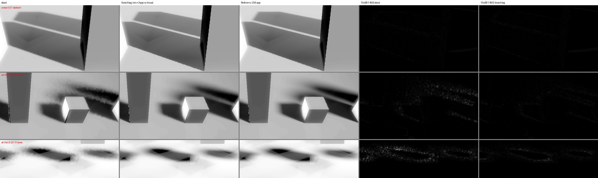

# GI-Schatten: Restflackern bei 1 spp — Messung, Optionen, Entwurf

Stand 03.10.2026, Zweig `claude/gi-schatten-restflackern-bei-1-spp-senken-mehr-strahlen-oder`
(Basis `9a1cc950` = main mit PR #81). Thema 134, Schritt 1: **Analyse und Entwurf, kein
Engine-Code geändert** außer zwei Dump-Knöpfen für den Messbau. Gemessen auf Apple M5
(Metal, Hardware-RT, macOS 27, Stromsparmodus an), Release-Build, 1280×720 → Maske 640×360.
Vorgeschichte: [gi-shadow-edge-noise-analysis-2026-10-02.md](gi-shadow-edge-noise-analysis-2026-10-02.md)
(Thema 131, RTX 4070). Dessen §7.6 (Metal-Lauf, Commit 77bb2a8e) war nicht in main
gelandet und ist hier per Cherry-pick enthalten (d21b8a23).

## Kurzfassung

1. **Das Restflackern ist bei stillstehender Kamera klein und bei bewegter Kamera groß.** Statisch
   (s6, 6°) liegt Stock bei Flackern 0.70 / p99 3.9. Bei einer gleichmäßigen Drehung von 0.25°
   pro Frame steigt es auf **2.11 / p99 11.8**, also auf das Dreifache. Dazu kommt ein
   systematischer Fehler gegen die Wahrheit, rmse 7.0 statt 1.6. Der alte Test mit einem einzigen
   Yaw-Schritt hat genau diesen Fall nicht gezeigt.
2. **Die Hauptursache unter Bewegung ist nicht 1 spp, sondern das Point-Sampling der History.**
   Bei einer Bewegung unter einem halben Texel pro Frame rundet der Lookup auf denselben Texel,
   der History-Inhalt wandert also nicht mit, und der Schatten zieht nach. Mehr Strahlen senken
   das Flackern, **verschlimmern aber den Fehler** (spp4 unter Pan: rmse 8.6). Ein höheres
   History-Gewicht verschlimmert ihn ebenfalls. **Bilineare History, als Bewegungsvektor relativ
   zur Pixelmitte reprojiziert**, senkt den Pan-Fehler von 7.0 auf 2.8 und kostet 0.05 ms.
3. **Bei der Default-Config (0.5°) und an Kontaktkanten ist der größte Fehler der 3×3-Box-Blur,
   nicht das Rauschen.** Stock liegt in s05 bei rmse 7.2, an den schärfsten Kanten bei 15.6
   Graustufen, und mehr Strahlen ändern daran nichts. Ein kantenerhaltender À-trous-Filter mit
   Werte-Stopp aus der Bernoulli-Varianz senkt das auf 1.5. Allein hebt er aber das Flackern an
   scharfen Kanten, denn wer nicht über die Kante mittelt, behält dort das zeitliche Rauschen.
4. **Entwurf, in dieser Reihenfolge:** (a) Bewegungsvektor-bilineare History, (b) 2 Strahlen
   pro Pixel, (c) À-trous mit 2 Iterationen statt der 3×3-Box, mit frühem Ausstieg. Alle drei
   zusammen gegen Stock:

   | Fall | Flackern | rmse gegen Referenz |
   |---|---|---|
   | s6 statisch, 6° | 0.70 → **0.42** | 1.56 → **1.21** |
   | s05 statisch, 0.5° | 0.21 → **0.16** | 7.20 → **1.53** |
   | c05 Kontakt, 0.5° | 0.115 → **0.100** | 3.91 → **0.68** |
   | Pan s6 | 2.11 → **0.93** | 7.03 → **2.43** |
   | Pan Kontakt c6 | 0.58 → **0.28** | 4.76 → **1.07** |
   | Seitwärtsfahrt Kontakt c6 | 0.37 → **0.35** | 3.62 → **0.83** |

   Die Mehrkosten liegen bei **~0.4 ms** (Maske 640×360, HW-RT, niedriger Takt). Mit SW-Strahlen
   sind es ~0.7 ms. Das Verdecker-Ghosting wird etwas schlechter (s6 0.635 → 0.693, s05 0.43 → 0.50).
5. **Abgelehnt:** History-Gewicht 0.95 (unter Bewegung schlechter, mehr Ghosting), Stratifizierung
   der Kegel-Samples (weniger Flackern, aber etwas mehr Fehler), À-trous ohne Werte-Stopp
   (rmse 11–23, verschmiert jeden Schatten), bilineare History mit absolutem UV (verschmiert
   statische Kontaktkanten, siehe §4.2).



*Spalten: Stock f60 | Vorschlag f60 | Referenz (256 spp, History 0.98, kein Filter) |
10×|f61−f60| Stock | 10×|f61−f60| Vorschlag. Zeilen: cnear statisch 0.5°, Kontakt-Pan 6°, Pan 6°.
Kontrast pro Zeile gleich gestreckt (1.–99.5. Perzentil der Referenz).*

## 1. Messbau

**Neu in diesem Schritt (Commit 708ce773):**

* `HE_DUMP_PANYAW` (Grad pro Frame) und `HE_DUMP_PANMOVE` (Welteinheiten pro Frame entlang der
  Kamera-Rechten): Die Kamera bewegt sich durch **alle** Settle-Frames, Frame i von N steht
  (N−1−i) Schritte zurück. Der Capture-Frame steht damit an der echten Pose, und zwei Captures mit
  60 und 61 Frames teilen Endpose und Bewegungsgeschichte. Ihre Differenz ist das Flackern einer
  fahrenden Kamera, so wie f60/f61 das einer stehenden ist. Die Endpose stimmt: Außerhalb des
  Kantenbands weichen Pan- und Standbild im Mittel um 0.03–0.16 Graustufen ab.
* `HE_DUMP_SHADOWINSTTEST=contact`: Die sieben Würfel **stehen** auf dem Boden, 1 / 2.5 / 4 m
  hoch. Jeder Schatten läuft von einer harten Kontaktkante am Fuß bis zu einem breiten Halbschatten
  am Ende. In der bisherigen Szene schweben alle Würfel 1–1.5 m über dem Boden, es gab dort keine
  einzige Kontaktkante.
* `cap_metal.sh` nimmt eine Config-Vorlage (`GI_CAP_CONFIG`, wie `cap.ps1 -Config`).
* `ana134.py` misst gegen eine **Referenz**. `ana.py` misst nur, wie stark sich ein Bild ändert
  (Flackern) und wie körnig es ist (hf). Ein breiterer Blur gewinnt beide Maße, indem er die Kante
  verschmiert. Deshalb hier zusätzlich der Fehler gegen ein konvergiertes Bild:
  `rmse` (Rauschen plus Bias eines Frames), `bias` (niederfrequenter Anteil, also eine
  verschobene oder verbreiterte Kante) und `sharp_rmse` (rmse im härtesten Zehntel des Bands,
  dort, wo ein kantenblinder Filter verschmiert). Die Referenz ist dieselbe Ansicht mit 256 spp,
  History 0.98 und ohne Ortsfilter. Ihr eigenes Flackern liegt bei 0.005–0.048.
* `run134.sh`: die Messmatrix (Fälle × Varianten, je f60/f61, zwei Läufe parallel).
* `proto134-metal.patch`: die Metal-Prototypen aller Optionen hinter `HE_GI_PROTO_*`-Schaltern.
  **Nicht angewendet**, nur zum Nachmessen (`git apply`, Release bauen). Die Schalter sind im
  Patch oben an `giProto()` dokumentiert.

**Fälle** (Szene `SKYTEST`, TOD 0.35, Forward, AA aus, `HE_SKY_TIME=30`):

| Fall | Szene | Radius | Kamera / Bewegung |
|---|---|---|---|
| s6, s05 | schwebende Reihe | 6° / 0.5° | Doku-Kamera aus Thema 131 (−3/3/−5, Pitch −40) |
| c6, c05 | stehende Reihe | 6° / 0.5° | über der Reihe (−3/6/−6, Pitch −50) |
| cnear | stehende Reihe | 0.5° | Nahaufnahme an zwei Würfelfüßen (−7/2.2/−9, Pitch −35) |
| pan6 / cpan6 | wie s6 / c6 | 6° | Drehung 0.25°/Frame über 60 Frames (≈ 15°/s bei 60 fps) |
| move6 / cmove6 | wie s6 / c6 | 6° | seitwärts 0.03 m/Frame (≈ 1.8 m/s) |
| s6/s05 old+mov | wie s6/s05 | 6° / 0.5° | Verdecker-Bewegung über `TODSTEP` 0.005 (`ana_motion.py`) |

Die Bewegungsfälle werden gegen die Referenz ihres statischen Zwillings gemessen (gleiche
Endpose). Eine unter Bewegung gerenderte Referenz würde selbst nachziehen.

**Rauschboden:** Auf dem M5 sind zwei Läufe desselben Binaries **nicht** bitgleich (im Mittel
0.0014 Graustufen, max 0.79). Unter Vulkan/D3D11 war das in Thema 131 exakt 0. Alle Unterschiede
unten liegen um zwei Größenordnungen darüber. Bei ausgeschaltetem Prototyp ist der Build mit Patch
innerhalb dieses Bodens gleich zum Stand ohne Patch (0.0009).

**Vergleich mit der RTX 4070:** Stock s6 liegt auf dem M5 bei Flackern 0.70 / p99 3.9 / hf 0.86,
auf Vulkan/RTX 4070 bei 1.02 / 4.9 / 0.64 (131 §7.2). Das Metal-Bild ist heller und
kontrastärmer (L im Band 200 statt 170), die Größenordnung stimmt. Die Bewegungsfälle sind neu
und nur auf dem M5 gemessen.

## 2. Wo der Fehler herkommt

Das Budget hat zwei Teile, und sie reagieren auf verschiedene Hebel:

* **Zeitliches Rauschen** (Flackern): 1 spp, EMA 0.9 (≈ 19 effektive Samples), 3×3-Box. Es sinkt
  mit mehr Strahlen (∝ 1/√N) und mit einem höheren Gewicht.
* **Bias** (eine verschobene oder verbreiterte Kante). Er hat zwei Quellen:
  * **statisch die 3×3-Box auf halber Auflösung.** Sie verbreitert jeden Halbschatten um ~3
    Bildpixel. Bei 6° fällt das nicht ins Gewicht, bei 0.5° und an Kontaktkanten ist sie der
    größte Einzelfehler (s05 sharp_rmse 15.6).
  * **unter Bewegung die Point-gesampelte History.** Der Lookup rundet die reprojizierte Stelle
    auf einen Texel. Liegt die Bewegung unter einem halben Texel pro Frame, ist das immer derselbe
    Texel: Der Inhalt bleibt im Bildraum stehen, und nur die 10 % neuer Strahl ziehen ihn nach.
    Der Nachlauf ist im Gleichgewicht ≈ v·α/(1−α), also etwa 9 v. Bei v = 0.3 Texel pro Frame
    sind das ~2.7 Texel. Deshalb **verschlimmern** ein höheres Gewicht und mehr Strahlen den
    Pan-Fehler: Beide machen die History stärker und den Nachlauf sauberer, aber nicht kürzer.

## 3. Ergebnisse

### 3.1 Statisch

`flicker / p99 / rmse / sharp_rmse` im Kantenband. Fett ist der Vorschlag.

| Variante | s6 (6°) | s05 (0.5°) | c05 (Kontakt 0.5°) | cnear (nah 0.5°) |
|---|---|---|---|---|
| stock | 0.703 / 3.9 / 1.56 / 2.43 | 0.209 / 1.7 / 7.20 / 15.6 | 0.115 / 1.0 / 3.91 / 7.82 | 0.142 / 1.0 / 3.83 / 6.20 |
| spp2 | 0.325 / 1.9 / 1.20 / 1.99 | 0.113 / 1.0 / 7.18 / 15.6 | 0.079 / 0.9 / 3.91 / 7.82 | 0.082 / 0.9 / 3.83 / 6.20 |
| spp4 | 0.206 / 1.0 / 1.05 / 1.65 | 0.076 / 0.9 / 7.18 / 15.6 | 0.068 / 0.9 / 3.90 / 7.81 | 0.080 / 0.9 / 3.83 / 6.20 |
| hist 0.95 | 0.358 / 2.0 / 1.29 / 1.92 | 0.105 / 1.0 / 7.18 / 15.6 | 0.070 / 0.9 / 3.91 / 7.79 | 0.092 / 0.9 / 3.82 / 6.20 |
| strat (3×3-periodisches R2) | 0.413 / 2.0 / 1.59 / 2.73 | 0.179 / 1.2 / 7.20 / 15.7 | 0.117 / 1.0 / 3.91 / 7.85 | 0.115 / 1.0 / 3.86 / 6.23 |
| À-trous 3, ohne Werte-Stopp | 0.156 / 1.0 / **10.8** / 18.3 | 0.041 / 0.7 / **23.0** / 30.5 | – | – |
| À-trous 2, Werte-Stopp 2σ | 0.697 / 3.9 / 1.63 / 2.66 | 0.315 / 3.7 / 1.86 / 3.95 | 0.171 / 2.0 / 0.89 / 1.62 | 0.199 / 2.0 / 0.93 / 1.07 |
| À-trous 2, Werte-Stopp 4σ | 0.493 / 2.9 / 1.70 / 2.50 | – | 0.146 / 1.2 / 1.28 / 1.41 | 0.174 / 1.8 / 0.88 / 0.61 |
| À-trous 1, Werte-Stopp 2σ | 0.876 / 4.9 / 1.71 / 2.85 | – | 0.160 / 1.9 / 0.55 / 0.98 | 0.200 / 2.0 / 0.62 / 0.67 |
| bilinear, absolutes UV | 0.701 / 3.9 / 1.56 / 2.43 | 0.208 / 1.7 / 7.43 / 15.8 | 0.102 / 1.0 / **5.61** / 10.9 | 0.142 / 1.0 / **6.32** / 7.71 |
| bilinear, Bewegungsvektor (mv) | 0.703 / 3.9 / 1.56 / 2.43 | 0.208 / 1.7 / 7.20 / 15.6 | 0.119 / 1.0 / 3.91 / 7.81 | 0.139 / 1.0 / 3.91 / 6.20 |
| 2 spp + À-trous 2 (Point-History) | 0.415 / 2.2 / 1.21 / 1.84 | 0.157 / 1.9 / 1.53 / 3.39 | 0.104 / 1.0 / 0.68 / 1.43 | 0.126 / 1.0 / 0.78 / 0.90 |
| **mv + 2 spp + À-trous 2 + früher Ausstieg** | **0.416 / 2.2 / 1.21 / 1.84** | **0.158 / 1.9 / 1.53 / 3.39** | **0.100 / 1.0 / 0.68 / 1.43** | **0.132 / 1.0 / 1.11 / 0.90** |
| mv + 4 spp + À-trous 2 | 0.317 / 1.9 / 1.03 / 1.59 | 0.105 / 1.0 / 1.08 / 2.32 | 0.077 / 1.0 / 0.50 / 0.98 | 0.102 / 1.0 / 1.00 / 0.65 |

Lesehilfen:
* **hf steigt mit dem À-trous bei 0.5° (s05 2.49 → 4.07)** und liegt dann nahe an der Referenz
  (3.90). Das ist keine Verschlechterung: hf misst Hochfrequenz, und die korrekt scharfe Kante
  *ist* Hochfrequenz. Bei scharfen Kanten ist hf kein Rauschmaß, rmse ist es.
* **mv kostet in cnear statisch etwas** (rmse 0.78 → 1.11 gegen dieselbe Kette mit
  Point-History, bias 0.17 → 0.22). Die Nahaufnahme unter flachem Winkel ist der einzige Fall, in
  dem die Bewegungsvektor-Reprojektion bei stillstehender Kamera messbar vom Identitäts-Lookup
  abweicht. Vermutet ist ein Rest der Half-Float-Quantisierung, nicht untersucht.
* **Außerhalb des Kantenbands** (Band um 6 px erweitert, Rest des Bodens, ~720 000 px) ist der
  Fehler des Vorschlags überall gleich oder kleiner als bei Stock (statisch mean |d| ≤ 0.014,
  max ≤ 3.0; unter Pan p99 0.72 statt 1.2–1.9). Der Filter zieht keine Schatten in flache Flächen.

### 3.2 Kamerabewegung

`flicker / p99 / rmse / bias` gegen die statische Referenz derselben Endpose.

| Variante | pan6 | move6 | cpan6 | cmove6 |
|---|---|---|---|---|
| stock | 2.107 / 11.8 / 7.03 / 4.90 | 1.319 / 7.1 / 2.35 / 1.21 | 0.582 / 4.9 / 4.76 / 2.08 | 0.374 / 2.9 / 3.62 / 1.18 |
| spp4 | 0.853 / 5.1 / **8.56** / 6.43 | 0.438 / 2.2 / 1.92 / 1.15 | 0.296 / 2.2 / **5.19** / 2.43 | 0.177 / 1.0 / 3.64 / 1.21 |
| hist 0.95 | 1.905 / 11.1 / **8.43** / 6.20 | 0.935 / 5.2 / 2.65 / 1.51 | 0.565 / 4.9 / **5.29** / 2.46 | 0.303 / 2.2 / 4.18 / 1.51 |
| 2 spp + À-trous 2 (Point-History) | 1.481 / 10.3 / 8.28 / 6.21 | 1.103 / 7.9 / 2.31 / 1.23 | 0.480 / 4.9 / 4.55 / 2.26 | 0.402 / 3.7 / 2.16 / 0.83 |
| bilinear, absolutes UV | 1.486 / 8.1 / 3.48 / 2.03 | 1.196 / 6.1 / 2.05 / 1.04 | 0.357 / 2.9 / 3.84 / 1.38 | 0.353 / 2.9 / 3.78 / 1.30 |
| mv | 1.435 / 8.1 / 2.79 / 1.51 | 1.208 / 6.1 / 1.96 / 0.93 | 0.336 / 2.7 / 2.99 / 0.80 | 0.354 / 2.9 / 2.80 / 0.65 |
| mv + 4 spp | 0.510 / 3.0 / 2.42 / 1.43 | 0.407 / 2.2 / 1.16 / 0.61 | 0.164 / 1.0 / 2.98 / 0.79 | 0.162 / 1.0 / 2.76 / 0.58 |
| **mv + 2 spp + À-trous 2 + früher Ausstieg** | **0.932 / 7.8 / 2.43 / 1.28** | **0.886 / 5.9 / 1.73 / 0.67** | **0.282 / 2.2 / 1.07 / 0.39** | **0.353 / 3.0 / 0.83 / 0.26** |
| mv + 4 spp + À-trous 2 | 0.662 / 3.9 / 1.82 / 1.02 | 0.677 / 3.9 / 1.27 / 0.53 | 0.247 / 2.0 / 0.99 / 0.33 | 0.292 / 2.2 / 0.75 / 0.23 |

(cmove6/move6 mit `mvp2at2l`, also ohne frühen Ausstieg. Der frühe Ausstieg ist in allen
gemessenen Fällen innerhalb von ±0.004 gleich, siehe §3.4.)

### 3.3 Verdecker-Bewegung (Ghost nach `TODSTEP` 0.005, `ana_motion.py`)

0 = der verschobene Schatten steht nach den zwei Frames am neuen Ort, 1 = unverändert alt.

| Variante | s6 (6°) | s05 (0.5°) |
|---|---|---|
| stock | 0.635 | 0.433 |
| spp4 | 0.703 | 0.464 |
| hist 0.95 | 0.726 | 0.482 |
| À-trous 2 | 0.665 | 0.478 |
| mv | 0.635 | 0.433 |
| **mv + 2 spp + À-trous 2** | **0.693** | **0.503** |
| mv + 4 spp + À-trous 2 | 0.716 | 0.501 |

Alle Varianten liegen innerhalb von +0.09 gegen Stock. Mit mehr Strahlen wird das Rohsignal
glatter, und die Clamp-Box aus den 3×3-Mittelwerten greift etwas später. Bei 0.5° sind die
À-trous-Zeilen nur bedingt vergleichbar: Die schärfere Kante überstreicht eine andere Fläche
(|old−new| 29 statt 23). Geprüft ist nur ein Sonnensprung von 0.005, kein bewegter Verdecker.

### 3.4 GPU-Kosten (M5, Maske 640×360, p50 über 60 Frames, Stromsparmodus an)

Gemessen mit `HE_GI_PROTO_BENCH=1`: Jede Stufe läuft in einem eigenen Command-Buffer mit
`waitUntilCompleted`. Das ergibt exklusive Zeiten pro Stufe, aber bei niedrigem GPU-Takt.
**Aussagekräftig sind die Deltas**, nicht die Summe. Die G-Buffer-Stufe schwankt zwischen
2.2 und 3.3 ms (8 Würfel!) und ist ein Messartefakt, vermutlich das Hochtakten beim ersten
Command-Buffer des Frames. Sie ist ungeklärt und hier nicht gejagt; zwischen den Varianten
ändert sie sich nicht.

| Stufe | Stock | Variante | Delta |
|---|---|---|---|
| Strahlen HW (`intersection_query`) | 0.44 | 2 spp 0.55 / 4 spp 0.74 | +0.10 / +0.30 |
| Strahlen SW (CPU-BVH, D3D11/GL/Vulkan ohne RT) | 0.42 | 2 spp 0.80 / 4 spp 1.54 | +0.37 / +1.11 |
| Temporal | 0.21 | mv (4 Taps) 0.26 | +0.05 |
| Filter | Box 0.11 | À-trous ×2 1.45 / mit frühem Ausstieg 0.37 | +1.34 / **+0.26** |

**Vorschlag gesamt: +0.41 ms (HW) bzw. +0.68 ms (SW)** bei 640×360. Die Kosten skalieren mit
der Pixelzahl der Maske (1080p ×2.25, 4K ×9). Die Strahlenkosten sind hier **zu niedrig**: Die
Szene hat 8 Boxen, und in echten Szenen wächst die Traversierung, vor allem auf dem SW-Pfad. Die
Filterkosten hängen nur von der Auflösung und vom Anteil an Halbschattenpixeln ab. Der frühe
Ausstieg spart hier 75 %, weil der Großteil des Bildes voll belichtet ist; in einer Szene mit
viel Halbschatten spart er weniger.

## 4. Optionen, bewertet

### 4.1 Mehr Strahlen pro Pixel

Wirkt wie erwartet auf das Rauschen: spp2 halbiert das Flackern etwa, spp4 drittelt es (s6
0.70 → 0.33 → 0.21). Gegen Bias wirkt es nicht. Bei 0.5° bleibt die Box-Verbreiterung
(rmse 7.2), und unter Bewegung **wächst** der Fehler (pan6 rmse 7.0 → 8.6), weil die Point-History
den Schatten sauberer, aber nicht weniger verschoben mitschleppt. Kosten auf HW-RT klein (+0.10 ms
für spp2), auf dem SW-Pfad linear (+0.37 ms pro Strahl bei 640×360). **Als zweiter Baustein
gewählt, mit 2 als Default.** 4 als Qualitätsstufe „Hoch“. Kosten/Nutzen in der vollen Kette
(mv + À-trous), 4 gegen 2 spp: Flackern −24 % in s6 und −29 % unter Pan, rmse −15 % (s6) bis
−27 % (c05), für +0.20 ms HW / +0.74 ms SW.

### 4.2 Bilineare History-Reprojektion (neu, nicht in der Themenstellung)

Trifft genau das gemeldete „wandert beim Bewegen“. Zwei Fassungen gemessen:

* **mit absolutem UV** (`prevUV` direkt bilinear): Unter Bewegung deutlich besser (pan6 rmse 7.0 →
  3.5), **statisch aber schlechter an Kontaktkanten** (c05 rmse 3.9 → 5.6, cnear 3.8 → 6.3). Die
  G-Buffer-Position liegt in RGBA16F. Bei ~10 m ist ein Half-Ulp 0.008 m, bei ~0.03 m pro
  Masken-Texel also ein Viertel Texel. Auch bei stehender Kamera landet `prevUV` deshalb neben der
  Texelmitte. Point-Sampling rundet das weg, bilinear mischt jeden Frame die Nachbarn ein, und das
  wirkt wie eine Diffusion, die scharfe Kanten auflöst. **Abgelehnt.**
* **als Bewegungsvektor** `rUV = uv + (P_prev(pos) − P_cur(pos))`: Beide Projektionen sehen
  dieselbe quantisierte Position, der Fehler hebt sich auf. Statisch gleich Stock (bis auf cnear,
  §3.1), unter Bewegung noch besser als die absolute Fassung (pan6 rmse 2.8, cpan6 3.0 statt 3.8).
  +0.05 ms. **Erster Baustein.**

Rest unter Pan: bias ~1.3–1.5 bleibt. Wiederholtes bilineares Resampling glättet die History über
die Frames. Ein Catmull-Rom-Lookup (9 oder 5 Taps) wäre der nächste Schritt, ist hier aber nicht
gemessen.

### 4.3 Kantenerhaltender Ortsfilter statt 3×3-Box

À-trous (B3-Spline 5×5, Lochabstand 1, 2, …) auf der Maske, mit drei Gewichten pro Tap:
Ebenenabstand `|n·(x_q − x_p)| / (σ_p · footprint)`, Normalen `max(n·n_q, 0)^32` und ein
**Werte-Stopp** `exp(−|v_q − v_p| / (σ_l · σ_B))`. Dabei ist σ_B = √(c(1−c)/N_eff) die
Standardabweichung, die eine Bernoulli-Sichtbarkeit mit Mittelwert c nach N_eff Samples hat
(N_eff = (1+α)/(1−α) · spp). Binäre Sichtbarkeit kennt ihre Varianz aus dem Mittelwert, ein
eigener Varianz-Puffer wie bei SVGF ist deshalb unnötig.

* **Ohne Werte-Stopp ist der Filter unbrauchbar** (rmse 10.8 in s6, 23.0 in s05). Er weicht jeden
  Schatten auf. Der Werte-Stopp ist Pflicht.
* **Mit Werte-Stopp 2σ** sinkt der Fehler bei 0.5° und an Kontaktkanten auf ein Fünftel (s05
  7.2 → 1.9, c05 3.9 → 0.9). Das Flackern **steigt** dabei an scharfen Kanten (s05 0.21 → 0.32),
  denn das Rauschen direkt an der Kante wird nicht mehr über die Kante gemittelt. Allein ist der
  Filter also kein Mittel gegen Flackern. Zusammen mit 2 spp gleicht sich das aus.
* 1 Iteration ist an Kontaktkanten genauer, flackert bei 6° aber stärker als Stock (0.88). 4σ statt
  2σ ist ein Zwischenpunkt ohne klaren Gewinn. **2 Iterationen, 2σ gewählt.**
* Teuer ohne frühen Ausstieg (+1.34 ms). Mit Ausstieg, wenn der Pixel und seine 4 Nachbarn im
  aktuellen Lochabstand voll belichtet bzw. voll verschattet sind, sind es +0.26 ms und das
  Ergebnis bleibt gleich (±0.004 in allen Maßen).

**Dritter Baustein.**

### 4.4 History-Gewicht 0.95

Statisch billig und wirksam (Flackern halbiert), unter Bewegung aber durchgehend schlechter (pan6
rmse 8.4 statt 7.0, cmove6 4.2 statt 3.6) und mehr Ghosting (0.726 statt 0.635). **Abgelehnt.**
Mit der Bewegungsvektor-History ließe es sich neu bewerten; nicht gemessen.

### 4.5 Stratifizierte Kegel-Samples

Jedes 3×3-Fenster nimmt 9 aufeinanderfolgende Punkte der R2-Folge, die Frames ziehen disjunkte
Blöcke (Index `x%3 + 3·(y%3) + 9·(frame·spp + k)`, exakt in `uint`-Arithmetik). Das senkt das
Flackern kostenlos, je nach Fall um 0 % (c05) bis 41 % (s6), erhöht aber leicht den Fehler (s6 rmse 1.56 → 1.59, sharp
2.43 → 2.73). **Abgelehnt**; mit À-trous statt Box verliert das 3×3-Raster ohnehin seinen Bezug.

## 5. Entwurf

Drei Bausteine, je einzeln messbar, in dieser Reihenfolge. Jeder geht in **alle** Kopien, und der
Drift-Guard in `tests/test_culling.cpp` („GI kernels: …“) muss die neuen Konstanten mitprüfen.

### 5.1 Baustein A: Bewegungsvektor-bilineare History (4 Temporal-Kopien)

Dateien: `shaders/gi_temporal.frag` (Vulkan), `HlslSources.h` `kGiTemporalHLSL` (D3D11/D3D12),
`OpenGLRenderer.cpp` `kGiTemporalFS`, `MetalRenderer.mm` `giShadowTemporal`, dazu die vier Hosts.

* Neu im UBO/cbuffer/Uniform: `curViewProj`, dieselbe Matrixfamilie wie `prevViewProj` (Vulkan
  mit `kVulkanClipFix`, Metal ohne `kMetalClipFix`). Den Wert hat jeder Host schon, er wird beim
  Schreiben von `m_giPrevViewProj` für den nächsten Frame benutzt.
* `rUV = uv + (prevUV − curUV)`, wobei `curUV` mit **derselben** Formel aus `curViewProj · pos`
  entsteht wie `prevUV` aus `prevViewProj · pos`. So bleibt jede Y-Konvention je Backend in sich
  konsistent.
* 4 Taps um `rUV · size − 0.5`, bilineare Gewichte. Jeder Tap wird nur genommen, wenn
  `length(pos − tap.rgb) < tolerance` (Toleranz wie heute, Thema 131 §7.1 C), danach renormiert.
  Bleibt kein Tap, ist `w = 0`. Der Neighbourhood-Clamp bleibt unverändert.
* Erwartung (M5): pan6 rmse 7.0 → 2.8, Flackern 2.11 → 1.44; statisch unverändert.

### 5.2 Baustein B: 2 Strahlen pro Pixel (7 Shadow-Kernel)

Dateien: `gi_shadow.comp`, `gi_shadow_hw.comp`, `gi_shadow_hw.hlsl`, `HlslSources.h`
`kGiShadowCSHLSL`, `OpenGLRenderer.cpp` `kGiShadowCS`, `MetalRenderer.mm` `kGIShadowMSL` und
`kGISWMSL`.

* Anzahl über `GIShadowParams.extra.y` (heute frei), Schleife um den Sonnen-Strahl, Mittelwert.
* Sample k: `giHash2(gid, seed·spp + k)`, also die R2-Folge des Pixels fortlaufend weiter. Der Seed
  läuft in [0, 1024) um, `seed·spp + k` bleibt bei spp ≤ 64 exakt.
* Einstellung `GIShadowQuality` (1/2/4, Default 2) in `EditorConfig`, Host setzt `extra.y`. Auf
  dem SW-Pfad kostet jeder Strahl so viel wie der erste. Ob der SW-Default 1 bleiben soll, ist
  eine Produktfrage für den Menschen, nicht hier entschieden.

### 5.3 Baustein C: kantenerhaltender À-trous statt 3×3-Box (4 Blur-Kopien)

Dateien: `shaders/gi_blur.frag` → neuer `gi_atrous.frag` (Vulkan, neue Pipeline),
`HlslSources.h` `kGiBlurHLSL`, `OpenGLRenderer.cpp` (Blur-String), `MetalRenderer.mm`
`giShadowBlur`, dazu eine zusätzliche R16F-Zwischentextur pro Backend.

* 2 Iterationen, Lochabstand 1 und 2, B3-Gewichte (1/16, 1/4, 3/8, 1/4, 1/16)².
  Iteration 1 liest `history.a`, Iteration 2 die Zwischentextur und schreibt das Ergebnis, das der
  Scene-Pass sampelt. **Die History bleibt ungefiltert** (kein Feedback wie bei SVGF), das hält
  den Bias aus der Akkumulation heraus.
* Gewichte wie §4.3, σ_p = 1, Normalen-Exponent 32, σ_l = 2, N_eff = (1+α)/(1−α) · spp.
* **Footprint zweiseitig mit `min` pro Achse, wie im Temporal-Pass.** Der Prototyp nimmt
  vereinfacht `max` der beiden einseitigen +x/+y-Schritte. An Würfel-Silhouetten, deren Deckel
  und Boden dieselbe Normale (+Y) haben, öffnet das den Ebenentest; der Werte-Stopp deckelt das
  Leck, deshalb ist es nicht nachgemessen. Die Umsetzung soll es richtig machen.
* Früher Ausstieg: Ist c < 1e-3 oder c > 1 − 1e-3 und sind die 4 Nachbarn im doppelten
  Lochabstand gleich, wird c durchgereicht.
* Für den Werte-Stopp und die Ebene braucht der Pass die G-Buffer-Normale. Die Strahl-Kernel lesen
  sie schon, also liegt sie in allen Backends vor.

### 5.4 Reihenfolge und Abnahme

1. **A zuerst.** Billigst, trifft das gemeldete „wandert beim Bewegen“, und es ist die
   Voraussetzung dafür, dass B unter Bewegung nicht schadet (§3.2, spp4 ohne mv).
2. **Dann B.** Senkt das Flackern überall; kein neuer Pass.
3. **Dann C.** C allein hebt das Flackern an scharfen Kanten, nach B nicht mehr.
4. Nach jedem Baustein auf dem Mac `run134.sh` (Fälle s6, s05, c05, cnear, pan6, cpan6, s6/s05
   old+mov) und auf NN-WS03 `cap.ps1` mit denselben `HE_DUMP_*`-Werten. Für `ana134.py` braucht es
   eine Referenz. Vorschlag für Baustein B: ein Debug-Schalter `HE_GI_REFERENCE=1` (spp 256,
   History 0.98, Filter aus), damit jedes Backend seine eigene Referenz rendert.
5. Abnahme-Messlatte (M5-Werte, andere GPUs relativ): Mit A+B+C liegt das Flackern in allen Fällen
   ≤ Stock, und rmse in s05, c05 und cpan6 bei ≤ 1/3 von Stock. Ghost s6 ≤ 0.72.

## 6. Grenzen

* **Nur eine GPU.** Gemessen auf dem M5 (Metal, HW- und SW-Strahlen). Die Themenstellung wollte
  mehrere GPUs. Die RTX 4070 steht an NN-WS03 und ist von diesem Rechner aus nicht bedienbar.
  Vergleichbar sind nur die Stock-Werte von s6 (§1). Die Prototypen gibt es nur für Metal.
* Stromsparmodus an, deshalb sind die Kosten bei niedrigem Takt gemessen; nur die Deltas gelten.
  Szene mit 8 Boxen, deshalb sind die Strahlenkosten untere Schranken.
* 1280×720, eine Szene in zwei Varianten, Kameras von Hand gewählt. Bewegung nur mit konstanter
  Geschwindigkeit (keine schnellen Schwenks, kein Anfahren, kein Disocclusion-lastiger Orbit um
  ein Objekt). Verdecker-Bewegung nur als Sonnensprung.
* Metal ist zwischen zwei Läufen nicht bitgleich (Rauschboden §1).
* Der Fehler-Rest von mv in cnear (§3.1) ist nicht untersucht.
* Vulkan: Der Fix „GI-Sonne einen Frame hinterher“ (c59f0bc4, Thema 131 Schritt 6) ist **nicht in
  main**. TODSTEP-Messungen auf Vulkan sind dort deshalb um einen Frame verfälscht, bis der
  Nachzug gemergt ist.
* `cap_metal.sh` hatte in dieser Sitzung vereinzelt Fehlstarts (Editor nach 5 s ohne Log
  beendet, mit identischem Aufruf danach sauber). `run134.sh` meldet jede Aufnahme mit `bmp=yes/no`;
  die Matrix war vollständig.

## 7. Nachmessen

Der Prototyp-Patch gilt für den Stand von Schritt 1 (`f62742aa`), nicht für den Zweigkopf:
dort gibt es `giShadowBlur` nicht mehr. Die `HE_GI_PROTO_*`-Varianten in `run134.sh` laufen
also nur auf einem Checkout von `f62742aa`; für die Umsetzung siehe §8 (ohne Patch).

```zsh
git apply scripts/gi-shadow-repro/proto134-metal.patch    # Prototypen, nur lokal
cmake --build out/build/macos-release -j8 --target HorizonEditor
export GI_CAP_OUT=/tmp/gi134
scripts/gi-shadow-repro/run134.sh s05 gt stock mvp2at2le   # Fälle/Varianten: Tabellen oben im Skript
/usr/local/bin/python3 scripts/gi-shadow-repro/ana134.py /tmp/gi134/s05__gt_f60.bmp \
    /tmp/gi134/s05__mvp2at2le_f60.bmp /tmp/gi134/s05__mvp2at2le_f61.bmp
# Bewegung gegen die statische Referenz: run134.sh pan6 …, dann ana134.py s6__gt_f60 pan6__V_f60 pan6__V_f61
# Kosten: cap_metal.sh NAME HE_DUMP_GI=1 HE_DUMP_SHADOWINSTTEST=1 HE_DUMP_FRAMES=240 HE_GI_PROTO_BENCH=1 …
#         → Logzeile „PROTO GI mask GPU ms p50 …“
git checkout src/HE_Rendering/src/Backends/Metal/MetalRenderer.mm
```

`python3` aus Homebrew hat hier kein numpy, `/usr/local/bin/python3` hat es.

## 8. Umsetzung (Schritt 2)

Alle drei Bausteine stehen in allen Backends, ohne Prototyp-Patch. Commits: A `fc7ed6e2`,
B `01442285`, C Metal `90da6aff`, C D3D11/D3D12/GL/Vulkan + Drift-Guard im selben Commit wie dieser Abschnitt.

| Baustein | Shader-Kopien | Host |
|---|---|---|
| A Bewegungsvektor-bilineare History | `gi_temporal.frag`, `kGiTemporalHLSL`, `kGiTemporalFS`, `giShadowTemporal` | `curViewProj` im Parameterblock (Reihenfolge prev, cur, blend) |
| B Strahlen pro Pixel | die 7 Kerne aus §5.2 | `.y` der Local-Extra-Zeile; `GISettings::shadowRays` |
| C À-trous statt Box | `gi_atrous.frag` (neu, `gi_blur.frag` entfällt), `kGiAtrousHLSL`, `kGiAtrousFS`, `giShadowAtrous` | R16F-Zwischenziel, 2 Pässe; Parameter aus `HE::GIShadowAtrousParams` (`GIJitter.h`) |

**Einstellungen.** `IRenderer::GISettings` hat jetzt `shadowRays` (Default 2), `shadowHistory`
(0.9, vorher in jedem Host hart verdrahtet) und `shadowFilter`. Der Editor bietet
*GI Shadow Quality* (Low/Medium/High = 1/2/4 Strahlen, Default Medium) in den Preferences, im
Settings-Katalog, in `config.json` (`GIShadowQuality`), im Export und im Spiel. Ob der
SW-Pfad (kein RT-Kern) einen anderen Default braucht, bleibt die offene Produktfrage aus §5.2.

**Dump-Schalter.** `HE_GI_REFERENCE=1` rendert die Referenz in jedem Backend selbst (256 Strahlen,
History 0.98, Filter aus); `HE_DUMP_GISHADOWRAYS=n` und `HE_DUMP_GISHADOWFILTER=0|1` für A/B.
`run134.sh` kennt dafür die Varianten `gtR`, `A`, `AB`, `ABC`, `ABCr1`, `ABCr4`, `ABnof`.
Die `HE_GI_PROTO_*`-Varianten brauchen weiter den Prototyp-Patch.

**Abweichungen vom Prototyp, gewollt:**
* Footprint im À-trous zweiseitig per `min` pro Achse (§5.3); im Messraster nicht vom
  Prototyp zu unterscheiden.
* Alle À-trous-Taps mit explizitem LOD 0 (`textureLod`/`SampleLevel`/`level(0)`): früher
  Ausstieg und Hintergrund-Skip machen die Taps divergent, FXC lehnt Gradienten dort ab.
* Ebenen-/Normalen-/Werte-Konstanten (1, 32, 2σ) stehen im Shader, nicht im Parameterblock,
  damit der Drift-Guard sie festhalten kann. Pro Pass wechseln nur Loch, Quelle und N_eff.

### 8.1 Gegenprobe auf dem M5 (Metal, HW-RT)

Gegen dieselbe 256-spp-Referenz wie §3. In Klammern der Prototyp (`mvp2at2le`, §3.1/§3.2);
die Abweichungen liegen im Rauschboden des M5.

| Fall | Flackern Stock → Umsetzung | rmse Stock → Umsetzung |
|---|---|---|
| s6 | 0.703 → **0.416** (0.416) | 1.56 → **1.21** (1.21) |
| s05 | 0.209 → **0.159** (0.158) | 7.20 → **1.53** (1.53) |
| c05 | 0.115 → **0.102** (0.100) | 3.91 → **0.68** (0.68) |
| cnear | 0.142 → **0.127** (0.132) | 3.83 → **1.11** (1.11) |
| pan6 | 2.107 → **0.933** (0.932) | 7.03 → **2.43** (2.43) |
| cpan6 | 0.582 → **0.288** (0.282) | 4.76 → **1.07** (1.07) |
| move6 | 1.319 → **0.886** (0.886) | 2.35 → **1.73** (1.73) |
| cmove6 | 0.374 → **0.362** (0.353) | 3.62 → **0.83** (0.83) |

Ghost (§3.3): s6 0.635 → **0.693**, s05 0.433 → **0.503**, gleich dem Prototyp.
Abnahme §5.4 Punkt 5: Flackern überall ≤ Stock, rmse s05/c05/cpan6 bei 21 % / 17 % / 23 % von
Stock (Grenze 33 %), Ghost s6 ≤ 0.72. **Erfüllt.**

Einzeln gemessen (je Baustein auf dem Stand davor): A allein pan6 rmse 7.03 → 2.79, statisch
unverändert (= `mv`); A+B Flackern s6 0.70 → 0.33, pan6 1.44 → 0.83 (= `spp2`).

**Qualitätsstufen** (Flackern / rmse):

| Fall | Low (1) | Medium (2, Default) | High (4) |
|---|---|---|---|
| s6 | 0.696 / 1.63 | 0.416 / 1.21 | 0.318 / 1.03 |
| s05 | 0.314 / 1.87 | 0.159 / 1.53 | 0.105 / 1.09 |
| c05 | 0.168 / 0.90 | 0.102 / 0.68 | 0.093 / 0.50 |
| pan6 | 1.400 / 2.88 | 0.933 / 2.43 | 0.662 / 1.82 |

Low flackert an scharfen Kanten stärker als Stock (s05 0.31 gegen 0.21, wie §4.3 für den
À-trous allein vorhergesagt) und liegt bei s6 knapp über dem Stock-Fehler (rmse 1.63 gegen
1.56); bei 0.5°, an Kontaktkanten und unter Bewegung ist der Fehler deutlich kleiner.

**Weitere Gegenproben:** SW-Pfad (`HE_GI_FORCE_SW=1`, `kGISWMSL`) gleich HW (s6 0.416 / 1.21).
`HE_GI_REFERENCE` gegen die Prototyp-Referenz: rmse 0.05 (s6) / 0.08 (c05), also im
Eigenrauschen der Referenz. Alle Läufe 0 Fehler im Log (MSL kompiliert zur Laufzeit).

### 8.2 Was nicht geprüft ist

* **D3D11, D3D12, Vulkan, OpenGL laufen hier nicht.** Geprüft sind die Shader offline
  (glslang: Vulkan-GLSL, GL-Strings, HLSL-Strings, `gi_shadow_hw.hlsl` mit gestubbtem DXR-Teil),
  `VulkanRenderer.cpp` per `clang -fsyntax-only` gegen die MoltenVK-Header (mit
  Negativkontrolle). D3D11/D3D12-Hosts sind nicht kompiliert; das macht die Windows-CI. Die
  GL-GI braucht Compute (GL 4.3), der macOS-Treiber hat 4.1.
* MSL ist nicht offline kompiliert (Metal-Toolchain fehlt in diesem Xcode), nur zur Laufzeit.
* Kosten nicht neu gemessen; der Prototyp hatte dieselben Pässe (§3.4: ~+0.4 ms HW).
* Nachmessen auf NN-WS03 (RTX 4070) mit `cap.ps1` und `HE_GI_REFERENCE=1` steht aus.
