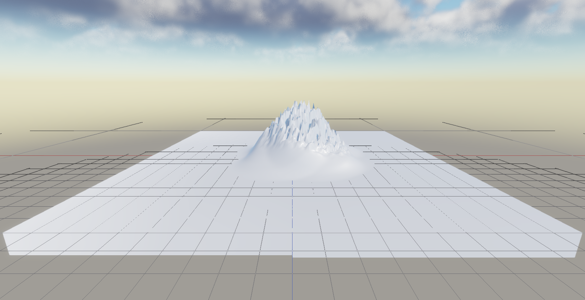

# Performance-Audit Schritt 1: Baseline Landscape + Himmel auf dem M5 (Rohdaten)

Thema 99, Schritt 1. Stand 27.09.2026, Zweig `claude/performance-audit-editor-runtime-auf-m5-macbook-landscape-hi`
(Basis `152659ff`). Dieses Dokument enthält **nur Messwerte und Messbedingungen**. Die Deutung
(Ursachen, Prioritäten, Vorschläge) gehört in die folgenden Schritte.

> **Vorbehalt für alle GPU-Zahlen:** Während *aller* Messungen lief ein verwaister Test-Editor
> (pid 72986, übrig aus einem automatisierten Collab-Lauf: `HOME=/private/tmp/ec3_collab_run1/b/home`,
> `HE_HIDDEN_WINDOW=1`, Deploy-Verzeichnis gelöscht). Er belegte die GPU allein zu **66–73 %**
> „Device Utilization“ bei schlafendem Display und zu **83–92 %** bei wachem Display (ioreg, je 3–5 Proben,
> während keiner meiner Läufe aktiv war), dazu 25–47 % CPU. Beenden durfte ihn weder dieser Arbeiter
> noch der Chefchen (Rechteprüfung). Die GPU-Zeiten unten sind daher **Obergrenzen unter Fremdlast**.
> Die Minimum-Spalten der Detailed-Capture kommen der unbelasteten Zeit am nächsten. CPU-Scopes und
> Zähler sind davon kaum betroffen. Eine saubere Wiederholung kostet etwa 20 Minuten (Befehle am Ende).

## 1. Messbedingungen

| Punkt | Wert |
|---|---|
| Gerät | MacBook Air `Mac17,4`, Apple M5 (4 Super- + 6 Effizienzkerne, 10 GPU-Kerne, Metal 4), 24 GB |
| OS | macOS 27.0 (Build 26A428) |
| Energie | Netzteil angeschlossen, Akku 90 %, **Stromsparmodus AN** (`pmset lowpowermode 1`; ohne sudo nicht umschaltbar) |
| Thermik | `thermal_state nominal`, SoC max. ~52 °C vor den Läufen |
| Speicher | 24 GB, davon ~0,7 GB frei und ~9,9 GB komprimiert vor den Läufen (weitere Claude-Instanzen, Browser usw.) |
| Display | internes Liquid Retina, 1440×932 pt, Dichte 2,0 (2880×1864 px), **60 Hz** (aus `SDL_GetCurrentDisplayMode`, in jedem Dump in `session.note`) |
| Display-Zustand | c0–c4: Display **schlief** (Bildschirm aus). Alle anderen Läufe: Display per `caffeinate -u` **wach** gehalten |
| Build | Release (`-DCMAKE_BUILD_TYPE=Release`, Ninja, `HE_PROFILING=ON`), eigener Worktree, deployte Binärdateien md5-gleich mit dem Build geprüft |
| Backend | Metal (`session.backend = "Metal"` in jedem Dump; RHI 4 in der privaten Config) |
| Programm | **Editor** (`HorizonEditor`), echter Hauptloop inkl. ImGui, Szenen-Tick und Present. Runtime (`HorizonGame`) **nicht gemessen**, siehe Abschnitt 6 |
| Fenster | angefordert 1600×900 pt, vom System auf **2840×1528 px** begrenzt (Log: `window 2840x1528`) |
| Szenen-Renderauflösung | Viewport-Panel **1718×884 px** bei Render-Scale 1,0 (Log `Metal: scene render size`); 859×442 bei 0,5; 3436×1768 bei 2,0 |
| Editor-Einstellungen | Editor-Voreinstellungen (private Config ohne CustomConfig-Einträge außer Kamera bzw. `--set`): Forward-Pfad, SSAO an (Hälfte der Auflösung), Bloom an, AntiAliasing 1, Render-Scale 1,0, GI/SSR/DoF/Motion Blur aus, GPU-Partikel an, Occlusion Culling aus, MaxFps 0 |
| Warmup / Aufnahme | 300 Frames Warmup, dann 600 Frames Aufnahme (`HE_PROFILE_WARMUP`/`HE_PROFILE_CAPTURE`) |
| vsync | „aus“ = wie F9 erzwungen aus; „an“ = `HE_PROFILE_VSYNC=keep`, Editor-Voreinstellung vsync an |

## 2. Vorhandene Profiling-Infrastruktur (gesichtet, wiederverwendet)

- `EngineProfiler` (`src/HE_Core/include/Diagnostics/EngineProfiler.h`): CPU-Scopes (`HE_PROFILE_SCOPE_N`),
  Thread-Timeline, Zähler (Draws/Dreiecke/sichtbar), JSON-Dump nach `<exe>/dumps/profile_*.json` mit
  Perzentilen, 1%-Lows und Hitch-Liste. F9 bzw. Editor-Fenster „Performance Profiler“.
- Metal-GPU-Timing (`MetalRenderer::EncodeFrame`): Whole-Frame-Spanne, Stage-Boundary-Counter
  (überlappen auf TBDR, im Dump als `gpuPassesOverlap` markiert) und **Detailed Capture**: ein Command-Buffer
  pro Pass mit `waitUntilCompleted` → exklusive, additive Pass-Zeiten (Selbstprüfung Σ Pässe / gpuMs = 1,000
  in *jedem* Detailed-Lauf unten erfüllt). Buckets: Shadow (inkl. Wolkenschatten und GPU-Partikel-Simulation),
  GIAccel, GIShadow, GIProbes, SSAO (inkl. Forward-SSR), Scene (Wolken-Prepass, Himmel, Wolken, Terrain,
  Velocity, Debug-Linien in einem Encoder), Bloom (inkl. DoF/Motion Blur), Tonemap (inkl. MetalFX/TAA/FXAA/UI
  im Offscreen-Pfad), Present (ImGui-Overlay und Drawable).
- Draw-Boundary-Counter werden von dieser GPU nicht unterstützt (Log: „counter sampling stage-boundary only“).
  Himmel/Wolken und Terrain liegen im selben Render-Encoder. Deren Aufteilung stammt deshalb aus
  **Szenenvarianten** (ohne Terrain, ohne Wolken), nicht aus zusätzlichen Pass-Grenzen.
- Headless-Dump (`HE_DUMP_*`, `scripts/he_shot.py`) wurde **nicht** für die Baseline verwendet: Er rendert fix
  1280×720 offscreen, ohne Szenen-Tick, ImGui und Present.

**Für diese Messung neu hinzugekommen** (reine Messinfrastruktur, keine Verhaltensänderung):

1. `HE_PROFILE_CAPTURE` / `_WARMUP` / `_DETAILED` / `_VSYNC=keep` / `_QUIT` / `_NOTE` in `Application::Run`:
   ein per Skript ausgelöstes F9 mit festem Warmup und fester Frame-Zahl, danach beendet sich die App.
   `toggleProfilerCapture(forceVsyncOff, note)` hat zwei Default-Parameter bekommen; F9 und der Editor-Knopf
   verhalten sich unverändert. Der Dump vermerkt jetzt den tatsächlichen vsync-Zustand und die Display-Rate.
2. Logzeile `Metal: scene render size WxH (output …, render scale …, window …)` bei jeder Änderung.
3. CPU-Unter-Scopes in `MetalRenderer::EncodeFrame`: `Metal::NextDrawable`, `Metal::EncodeShadowMap`,
   `Metal::EncodeCloudShadow`, `Metal::EncodeSSAO`, `Metal::EncodeScene`, `Metal::Overlay`, `Metal::Commit`.
   Ohne sie war `Render` eine einzige Eigenzeit von Ø 24 ms.
4. `scripts/he_perf_capture.py` (ein Lauf: private Config, Szenenvariante, Kamera, Dump, Zusammenfassung,
   RSS-Stichproben) und `scripts/he_perf_tables.py` (die Tabellen unten).

## 3. Testszenen

Grundlage ist das Projekt `~/HorizonEngineProjects/Test` (Kopie nach `/tmp/pa1/proj/Test`). Seine Startszene
enthält nur Sky (Environment), Weather, ein Terrain (100×100 m, Auflösung 129, gesculptet, 4 Layer) und World.
Keine weiteren Objekte, kein Spielercharakter. Die Varianten liegen in `docs/perf-audit/scenes/`.

| Name | Inhalt | Kamera |
|---|---|---|
| `base` (Läufe c*, d*, e*) | Originalszene. Das Terrain ist im Original um (61,6°, 40,4°, 4,8°) gedreht | Editor-Standardkamera. **Das Terrain ist dabei nicht im Bild**, siehe `defaultcam_view.png`. Das Bild mit Terrain ist identisch mit `skyonly` |
| `landscape` (Läufe L*) | wie base, Terrain-Rotation auf 0 | fest `--cam 0,25,90,0,-0.25` (Blick über das Terrain zum Horizont, Wolken im Bild), siehe `landscape_view.png` |
| `skyonly` | ohne Terrain-Entity | wie oben |
| `noclouds` / `landscape_noclouds` | `cloudCoverage = 0` | wie oben |
| `skyonly_noclouds` | beides | wie oben |

Umgebung laut Szene: `timeOfDay 0.5`, `cloudCoverage 0.5`, `cloudQuality 1`, `lowResClouds false`,
`cloudShadows true`, `cloudMode 0`, Nebel 0, Regen/Schnee 0, Wetter „Clear“.



## 4. Rohdaten

Aus `docs/perf-audit/raw/*.summary.json` mit `python3 scripts/he_perf_tables.py docs/perf-audit/raw`.
Pro Lauf liegen Zusammenfassung und Engine-Log im Repo. Die vollständigen Dumps (je 4–7 MB, mit jedem Frame
und der Thread-Timeline) liegen gzip-komprimiert außerhalb von git unter
`/Users/connorjansen/VSCode/HorizonEngine/out/perf-audit/2026-09-27-baseline/`.

### Tabelle A: Frame-Takt (Normalmodus, 600 Frames nach 300 Frames Warmup)

„CPU-Frame“ = `beginFrame`→`endFrame` im Hauptloop. „delta“ = Abstand zweier Frame-Anfänge. Bei allen
Läufen ist delta ≈ CPU-Frame, es gibt also keine Wartezeit außerhalb der gemessenen Spanne.

| Lauf | Display | vsync | FPS Ø | 1%-Low FPS | delta p50 / p95 ms | CPU-Frame p50 / p95 ms | davon Metal::NextDrawable p50 / p90 ms | CPU-Frame ohne NextDrawable p50 / p90 ms | GPU-Spanne p50 ms ¹ | RSS max MB |
|---|---|---|---|---|---|---|---|---|---|---|
| L1-landscape-vsyncoff-run1 | wach | aus | 46.2 | 14.0 | 19.61 / 60.10 | 19.36 / 60.10 | 16.98 / 46.28 | 2.40 / 2.66 | 44.78 | 295 |
| L1-landscape-vsyncoff-run2 | wach | aus | 46.9 | 13.9 | 18.49 / 60.60 | 18.49 / 60.60 | 16.29 / 48.26 | 2.41 / 2.66 | 44.00 | 325 |
| L2-landscape-vsynckeep-run1 | wach | an | 43.8 | 14.1 | 21.21 / 61.85 | 21.06 / 61.85 | 18.75 / 49.70 | 2.42 / 2.69 | 33.10 | 324 |
| L2-landscape-vsynckeep-run2 | wach | an | 44.0 | 13.7 | 19.18 / 62.63 | 19.18 / 62.63 | 16.86 / 51.17 | 2.43 / 2.70 | 32.35 | 309 |
| L4-skyonly-vsyncoff | wach | aus | 55.9 | 14.9 | 14.40 / 49.29 | 14.40 / 49.29 | 12.59 / 36.04 | 1.77 / 2.14 | 98.13 | 315 |
| L6-landscape-noclouds-vsynckeep | wach | an | 56.0 | 14.5 | 12.89 / 52.37 | 12.69 / 52.37 | 10.55 / 34.95 | 2.34 / 2.61 | 20.91 | 325 |
| L6-landscape-noclouds-vsyncoff | wach | aus | 65.0 | 18.1 | 11.87 / 35.45 | 11.87 / 35.45 | 10.03 / 32.63 | 2.32 / 2.57 | 26.33 | 324 |
| L8-landscape-scale050-vsyncoff | wach | aus | 50.7 | 14.4 | 10.80 / 63.77 | 10.75 / 63.76 | 8.41 / 52.17 | 2.44 / 2.77 | 15.63 | 324 |
| c0-base-vsyncoff-orphanRunning | schläft | aus | 40.9 | 12.7 | 10.85 / 66.23 | 10.85 / 66.35 | n/a (vor dem Scope-Split) | – | 9.37 | – |
| c1-base-vsyncoff-run1 | schläft | aus | 39.9 | 14.4 | 10.73 / 66.44 | 10.73 / 66.44 | n/a (vor dem Scope-Split) | – | 6.47 | – |
| c1-base-vsyncoff-run2 | schläft | aus | 39.2 | 14.4 | 10.82 / 66.72 | 10.86 / 66.72 | n/a (vor dem Scope-Split) | – | 5.50 | – |
| c3-base-vsynckeep-run1 | schläft | an | 39.2 | 14.5 | 10.58 / 67.00 | 10.67 / 67.00 | n/a (vor dem Scope-Split) | – | 9.98 | – |
| c3-base-vsynckeep-run2 | schläft | an | 37.7 | 14.2 | 10.19 / 67.18 | 9.98 / 67.17 | n/a (vor dem Scope-Split) | – | 7.12 | – |
| c4-base-vsyncoff-splitscopes-run1 | schläft | aus | 38.5 | 14.0 | 11.43 / 67.25 | 11.43 / 67.25 | 9.63 / 63.11 | 2.33 / 2.68 | 8.73 | – |
| c5-base-vsynckeep-displayAwake-run1 | wach | an | 50.0 | 14.3 | 13.33 / 58.26 | 13.21 / 58.26 | 11.01 / 46.14 | 2.38 / 2.66 | 24.90 | – |
| c5-base-vsyncoff-displayAwake-run1 | wach | aus | 59.9 | 14.3 | 11.36 / 41.84 | 11.41 / 41.84 | 9.23 / 33.06 | 2.35 / 2.65 | 32.84 | – |
| c5-base-vsyncoff-displayAwake-run2 | wach | aus | 59.2 | 14.8 | 11.45 / 43.64 | 11.50 / 43.64 | 9.18 / 33.07 | 2.36 / 2.59 | 33.29 | – |
| d2-skyonly-vsyncoff | wach | aus | 67.9 | 22.6 | 11.19 / 35.03 | 11.37 / 35.03 | 9.77 / 33.04 | 1.74 / 2.00 | 34.61 | – |
| e1-base-vsyncoff-run1 | wach | aus | 59.5 | 14.6 | 12.01 / 41.49 | 12.01 / 41.49 | 9.91 / 33.06 | 2.38 / 2.68 | 33.33 | 325 |
| e1-base-vsyncoff-run2 | wach | aus | 58.1 | 14.2 | 11.94 / 48.96 | 11.76 / 48.96 | 9.55 / 33.07 | 2.36 / 2.70 | 33.67 | 320 |
| e2-base-vsynckeep-run1 | wach | an | 51.2 | 14.4 | 15.89 / 57.55 | 15.88 / 57.55 | 13.97 / 42.31 | 2.41 / 2.69 | 23.54 | 324 |
| e2-base-vsynckeep-run2 | wach | an | 50.5 | 14.4 | 12.34 / 60.83 | 12.34 / 60.83 | 10.40 / 45.08 | 2.39 / 2.66 | 26.19 | 324 |

¹ Whole-Frame-Spanne GPUStartTime→GPUEndTime des einen Command-Buffers im Normalmodus. Gemessen unter
Fremdlast (pid 72986), enthält also auch Zeit, in der die GPU fremde Arbeit ausführt.

Jeder Normallauf meldet 64 Hitches, das ist die Obergrenze der Liste (Frames > 2× Median). Kürzeste Frames
liegen bei 0,85–1,2 ms, längste bei 64–74 ms.

### Tabelle B: Exklusive GPU-Zeit pro Pass (Detailed-Capture), ms als min / p10 / p50 über 600 Frames

Die Detailed-Capture serialisiert die GPU (`waitUntilCompleted` nach jedem Pass). FPS und CPU-Zeit dieser
Läufe sind deshalb nicht aussagekräftig und stehen nicht in Tabelle A. GI war in allen Läufen aus, daher
GIAccel/GIShadow/GIProbes = 0.

| Lauf | Shadow | GIAccel | GIShadow | GIProbes | SSAO | Scene | Bloom | Tonemap | Present | gpuMs p50 | Σ Pässe / gpuMs |
|---|---|---|---|---|---|---|---|---|---|---|---|
| L3-landscape-detailed-run1 | 1.20 / 1.42 / 2.02 | 0 | 0 | 0 | 0.33 / 0.60 / 5.12 | 3.41 / 4.01 / 6.27 | 0.62 / 2.15 / 6.95 | 0.18 / 0.26 / 0.82 | 0.32 / 0.37 / 0.67 | 31.05 | 1.000 |
| L3-landscape-detailed-run2 | 1.06 / 1.38 / 2.10 | 0 | 0 | 0 | 0.35 / 0.71 / 5.28 | 3.55 / 4.04 / 6.23 | 0.48 / 1.90 / 7.64 | 0.16 / 0.25 / 0.80 | 0.32 / 0.38 / 0.63 | 30.54 | 1.000 |
| L4-skyonly-detailed | 0.91 / 1.05 / 1.48 | 0 | 0 | 0 | 0 | 3.91 / 4.64 / 8.98 | 0.82 / 1.78 / 5.86 | 0.18 / 0.27 / 0.64 | 0.35 / 0.39 / 0.71 | 22.41 | 1.000 |
| L5-landscape-noclouds-detailed | 0.16 / 0.18 / 0.34 | 0 | 0 | 0 | 0.21 / 0.23 / 0.27 | 1.20 / 1.23 / 1.34 | 0.34 / 0.36 / 0.43 | 0.12 / 0.12 / 0.14 | 0.24 / 0.26 / 0.39 | 3.31 | 1.000 |
| L5-skyonly-noclouds-detailed | 0 | 0 | 0 | 0 | 0 | 1.33 / 1.34 / 1.50 | 0.34 / 0.36 / 0.44 | 0.12 / 0.12 / 0.15 | 0.24 / 0.26 / 0.43 | 3.00 | 1.000 |
| L7-landscape-aa0-detailed | 0.96 / 1.38 / 2.02 | 0 | 0 | 0 | 0.33 / 0.62 / 5.28 | 3.54 / 4.07 / 6.33 | 0.66 / 2.07 / 7.07 | 0.11 / 0.19 / 0.93 | 0.33 / 0.38 / 0.68 | 31.22 | 1.000 |
| L7-landscape-bloomoff-detailed | 1.10 / 1.45 / 6.53 | 0 | 0 | 0 | 0.38 / 0.52 / 3.38 | 3.61 / 4.04 / 5.61 | 0 | 0.19 / 0.27 / 0.67 | 0.32 / 0.38 / 0.70 | 21.27 | 1.000 |
| L7-landscape-ssaooff-detailed | 1.03 / 1.41 / 2.70 | 0 | 0 | 0 | 0 | 3.48 / 4.22 / 7.47 | 0.63 / 1.76 / 6.32 | 0.19 / 0.26 / 0.64 | 0.32 / 0.39 / 0.65 | 24.88 | 1.000 |
| L8-landscape-scale050-detailed | 0.79 / 1.30 / 1.90 | 0 | 0 | 0 | 0.12 / 0.38 / 4.54 | 1.11 / 1.45 / 2.37 | 0.19 / 0.98 / 4.21 | 0.10 / 0.20 / 0.61 | 0.27 / 0.36 / 0.63 | 20.53 | 1.000 |
| L8-landscape-scale200-detailed | 1.24 / 1.54 / 2.84 | 0 | 0 | 0 | 1.11 / 1.41 / 7.94 | 14.06 / 17.08 / 24.94 | 2.36 / 4.09 / 14.32 | 0.51 / 0.61 / 1.11 | 0.35 / 0.41 / 0.62 | 55.57 | 1.000 |
| c2-base-detailed-run1 (Display schläft) | 0.75 / 0.93 / 1.21 | 0 | 0 | 0 | 0.09 / 0.11 / 0.13 | 1.51 / 1.55 / 1.83 | 0.34 / 0.35 / 0.45 | 0.12 / 0.13 / 0.16 | 0.24 / 0.26 / 0.35 | 4.37 | 1.000 |
| c2-base-detailed-run2 (Display schläft) | 0.75 / 0.94 / 1.21 | 0 | 0 | 0 | 0.09 / 0.11 / 0.13 | 1.51 / 1.55 / 1.84 | 0.34 / 0.36 / 0.45 | 0.13 / 0.13 / 0.16 | 0.24 / 0.26 / 0.35 | 4.41 | 1.000 |
| d1-base-detailed-run1 | 1.05 / 1.37 / 2.60 | 0 | 0 | 0 | 0.12 / 0.30 / 4.69 | 1.86 / 2.18 / 3.38 | 0.60 / 1.63 / 6.91 | 0.17 / 0.25 / 0.72 | 0.33 / 0.37 / 0.59 | 26.87 | 1.000 |
| d1-base-detailed-run2 | 1.04 / 1.32 / 2.12 | 0 | 0 | 0 | 0.13 / 0.31 / 4.51 | 1.84 / 2.17 / 3.33 | 0.46 / 2.02 / 7.06 | 0.16 / 0.24 / 0.61 | 0.31 / 0.37 / 0.57 | 25.98 | 1.000 |
| d2-skyonly-detailed | 0.84 / 1.03 / 1.34 | 0 | 0 | 0 | 0 | 1.98 / 2.50 / 7.12 | 0.52 / 2.10 / 5.96 | 0.18 / 0.25 / 0.34 | 0.32 / 0.39 / 0.50 | 17.87 | 1.000 |
| d3-noclouds-detailed | 0.22 / 0.38 / 1.51 | 0 | 0 | 0 | 0.12 / 0.29 / 4.65 | 1.48 / 1.89 / 3.73 | 0.49 / 1.53 / 5.17 | 0.16 / 0.24 / 0.46 | 0.32 / 0.37 / 0.60 | 20.70 | 1.000 |
| d4-skyonly-noclouds-detailed | 0 | 0 | 0 | 0 | 0 | 1.73 / 1.93 / 2.54 | 0.63 / 3.81 / 8.97 | 0.18 / 0.25 / 0.31 | 0.33 / 0.38 / 0.45 | 15.80 | 1.000 |
| d5-base-ssaooff-detailed | 1.10 / 1.35 / 2.61 | 0 | 0 | 0 | 0 | 1.96 / 2.30 / 5.23 | 0.61 / 2.01 / 5.83 | 0.17 / 0.25 / 0.43 | 0.33 / 0.38 / 0.60 | 19.41 | 1.000 |
| d6-base-bloomoff-detailed | 0.79 / 0.95 / 1.37 | 0 | 0 | 0 | 0.09 / 0.11 / 0.26 | 1.51 / 1.55 / 1.95 | 0 | 0.13 / 0.13 / 0.23 | 0.24 / 0.26 / 0.42 | 11.56 | 1.000 |
| d7-base-aa0-detailed | 0.77 / 0.91 / 1.18 | 0 | 0 | 0 | 0.09 / 0.10 / 0.13 | 1.51 / 1.54 / 1.71 | 0.34 / 0.35 / 0.42 | 0.07 / 0.08 / 0.09 | 0.24 / 0.26 / 0.35 | 4.39 | 1.000 |
| d8-base-scale050-detailed | 0.73 / 0.85 / 1.17 | 0 | 0 | 0 | 0.04 / 0.05 / 0.09 | 0.42 / 0.44 / 0.47 | 0.14 / 0.14 / 0.26 | 0.10 / 0.10 / 0.10 | 0.24 / 0.25 / 0.38 | 2.52 | 1.000 |
| d9-base-scale200-detailed | 1.01 / 1.20 / 1.54 | 0 | 0 | 0 | 0.35 / 0.38 / 0.52 | 7.20 / 7.90 / 9.11 | 1.60 / 1.79 / 2.94 | 0.35 / 0.40 / 0.53 | 0.32 / 0.35 / 0.40 | 27.47 | 1.000 |
| e3-base-detailed | 1.01 / 1.31 / 2.03 | 0 | 0 | 0 | 0.13 / 0.29 / 4.82 | 1.96 / 2.17 / 3.30 | 0.46 / 1.51 / 6.70 | 0.16 / 0.24 / 0.70 | 0.31 / 0.37 / 0.58 | 26.27 | 1.000 |

„gpuMs p50“ ist der Median der Frame-Summen. Die Spalten-p50 addieren sich nicht zu ihm.

### Tabelle C: CPU-Scopes pro Frame (Summe je Frame; p50 / p90 ms), Landscape-Kamera

| Scope | L1 vsync aus #1 | L1 vsync aus #2 | L2 vsync an #1 | L2 vsync an #2 | L4 skyonly vsync aus | L6 ohne Wolken vsync an |
|---|---|---|---|---|---|---|
| Render | 18.727 / 47.791 | 17.649 / 49.655 | 20.148 / 50.947 | 18.280 / 52.487 | 13.583 / 37.014 | 11.765 / 36.251 |
| Metal::NextDrawable | 16.984 / 46.277 | 16.292 / 48.256 | 18.749 / 49.695 | 16.856 / 51.168 | 12.591 / 36.042 | 10.548 / 34.950 |
| Metal::EncodeShadowMap | 0.273 / 0.318 | 0.272 / 0.321 | 0.272 / 0.316 | 0.276 / 0.314 | 0.006 / 0.009 | 0.271 / 0.311 |
| Metal::EncodeCloudShadow | 0.038 / 0.045 | 0.039 / 0.045 | 0.039 / 0.045 | 0.039 / 0.045 | 0.054 / 0.079 | 0.000 / 0.000 |
| Metal::EncodeSSAO | 0.174 / 0.201 | 0.177 / 0.203 | 0.176 / 0.199 | 0.176 / 0.203 | 0.004 / 0.005 | 0.179 / 0.198 |
| Metal::EncodeScene | 0.102 / 0.120 | 0.103 / 0.120 | 0.103 / 0.118 | 0.104 / 0.118 | 0.013 / 0.016 | 0.103 / 0.118 |
| Metal::Overlay (ImGui) | 0.082 / 0.103 | 0.082 / 0.101 | 0.082 / 0.104 | 0.083 / 0.102 | 0.079 / 0.104 | 0.082 / 0.111 |
| Metal::Commit | 0.022 / 0.029 | 0.022 / 0.028 | 0.026 / 0.031 | 0.026 / 0.031 | 0.022 / 0.029 | 0.025 / 0.030 |
| OnRender (Editor-UI/ImGui-Aufbau, Szenen-Tick) | 0.981 / 1.124 | 0.986 / 1.123 | 0.999 / 1.156 | 1.000 / 1.155 | 0.892 / 1.119 | 0.979 / 1.140 |
| PollEvents (Input) | 0.072 / 0.110 | 0.071 / 0.111 | 0.073 / 0.113 | 0.074 / 0.113 | 0.072 / 0.109 | 0.070 / 0.105 |
| SceneSystemsTick (alle Szenensysteme) | 0.026 / 0.032 | 0.026 / 0.033 | 0.026 / 0.034 | 0.025 / 0.033 | 0.018 / 0.023 | 0.025 / 0.031 |
| RenderExtractor::extract (4×/Frame) | 0.172 / 0.198 | 0.172 / 0.199 | 0.174 / 0.201 | 0.176 / 0.201 | 0.023 / 0.031 | 0.172 / 0.197 |
| FrustumCuller::cull (5×/Frame) | 0.144 / 0.166 | 0.144 / 0.168 | 0.143 / 0.163 | 0.145 / 0.164 | – | 0.143 / 0.161 |
| Terrain | 0.006 / 0.008 | 0.005 / 0.007 | 0.005 / 0.008 | 0.005 / 0.007 | 0.001 / 0.002 | 0.005 / 0.007 |
| LOD | 0.006 / 0.007 | 0.005 / 0.007 | 0.006 / 0.007 | 0.006 / 0.007 | 0.001 / 0.001 | 0.005 / 0.006 |
| Weather | 0.002 / 0.002 | 0.002 / 0.002 | 0.002 / 0.002 | 0.002 / 0.002 | 0.002 / 0.003 | 0.001 / 0.002 |
| EnvironmentPush | 0.002 / 0.003 | 0.002 / 0.003 | 0.003 / 0.004 | 0.002 / 0.003 | 0.003 / 0.003 | 0.002 / 0.003 |
| GameLogicTick | 0.001 / 0.001 | 0.001 / 0.001 | 0.001 / 0.001 | 0.001 / 0.001 | 0.001 / 0.001 | 0.001 / 0.001 |
| SwapBuffers | 0.000 / 0.000 | 0.000 / 0.000 | 0.000 / 0.000 | 0.000 / 0.000 | 0.000 / 0.000 | 0.000 / 0.000 |

Im Editor-Bearbeitungsmodus sind Physik, Animation, Navigation, Partikel usw. eigene Unter-Scopes von
`SceneSystemsTick`. Jeder liegt bei ≤ 0,006 ms. Ein Physik-Scope taucht im Edit-Modus in keinem Dump auf;
die Play-Scopes (Physics/Audio/Scripts/Collision) wurden nicht gemessen, weil kein Lauf PIE startet. Die vollständige Liste steht in `cpuScopes` jeder `*.summary.json`.

### Tabelle D: Zähler (Frame aus der Mitte der Aufnahme)

| Lauf | Draws | Dreiecke | sichtbar/gesamt | Entities | Lichter | Partikel | GPU-Partikel |
|---|---|---|---|---|---|---|---|
| c1-base-vsyncoff-run1 | 4 | 34816 | 4/4 | 10 | 2 | 0 | 0 |
| L1-landscape-vsyncoff-run1 | 4 | 34816 | 4/4 | 10 | 2 | 0 | 0 |
| L4-skyonly-vsyncoff | 0 | 0 | 0/0 | 5 | 2 | 0 | 0 |
| L6-landscape-noclouds-vsyncoff | 4 | 34816 | 4/4 | 10 | 2 | 0 | 0 |

Der Zähler „Draws“ erfasst nur Szenen-Meshes (Terrain-Chunks), nicht Himmel, Fullscreen-Pässe oder ImGui.
VRAM-Felder sind auf Metal 0 (nicht befüllt). Speicher des Editor-Prozesses (RSS, 1-s-Stichproben):
max. **295–325 MB** in allen Läufen mit Messung.

### Weitere Beobachtungen (Messwerte, ohne Deutung)

- Der verwaiste Editor pid 72986 allein (verstecktes Fenster, keine Interaktion, bei uns gleiche Engine):
  GPU 66–73 % bei schlafendem Display, 83–92 % bei wachem; CPU 25–47 %.
- Detailed-Läufe bei schlafendem Display (c2) zeigen min ≈ p50 je Pass (eng). Bei wachem Display (d*, e3, L*)
  liegt p50 bei Bloom, SSAO und Scene das 3- bis 15-Fache über dem Minimum. Bei `*noclouds*`-Läufen
  mit Landscape-Kamera (L5) bleibt p50 nahe am Minimum.
- In allen Läufen mit Scope-Split macht die CPU-Arbeit ohne `Metal::NextDrawable` 1,7–2,4 ms (p50) bzw.
  2,0–2,8 ms (p90) pro Frame aus.
- vsync an bei 60-Hz-Panel: 43,8–51,2 FPS Ø (Landscape 44, Standardkamera 50–51, Landscape ohne Wolken 56).
- Render-Scale-Reihe (Detailed, Scene-Pass min): 0,5 → 1,11 ms, 1,0 → 3,41–3,55 ms, 2,0 → 14,06 ms (Landscape);
  0,42 / 1,51 / 7,20 ms (Standardkamera).
- Cloud-Shadow-Map-Encoder: CPU 0,04–0,05 ms. Mit Wolken liegt der Shadow-Pass bei min 0,91–1,20 ms,
  ohne Wolken bei 0,16 ms (mit Terrain) bzw. 0 (ohne Terrain).

## 5. Was diese Baseline (noch) nicht zeigt

- **Unbelastete GPU-Zeiten**: nicht messbar, solange pid 72986 läuft (siehe Vorbehalt).
- **Runtime (`HorizonGame`)**: nicht gemessen. Das Spiel braucht einen Export (`project.hcfg` + `.hpak`), und
  einen headless Export-Pfad gibt es nicht. Ein Export aus der Editor-GUI war in dieser Sitzung nicht möglich.
  Der Harness (`HE_PROFILE_CAPTURE`) sitzt in `Application::Run` und wirkt daher auch im Spiel, sobald ein
  Export vorliegt.
- **Sky vs. Wolken vs. Terrain innerhalb des Scene-Passes**: nur über Szenenvarianten (Tabelle B), nicht
  über Pass-Grenzen, weil Draw-Boundary-Counter fehlen und alles in einem Encoder liegt.
- **TAA/SSR/GI/Foliage**: in dieser Szene bzw. mit Editor-Voreinstellungen aus (AA-Modus 1, keine Foliage,
  GI/SSR aus). Die zugehörigen Buckets sind 0 bzw. nicht vorhanden.
- **Stromsparmodus aus**: nicht gemessen (braucht sudo bzw. den Menschen).

## 6. Nachmessen

```sh
# Build (eigener Worktree, Release): cmake-build-release, ninja -j8 HorizonEditor
# Szenen:   docs/perf-audit/scenes/*.hescene   Projekt: Kopie von ~/HorizonEngineProjects/Test
R() { python3 scripts/he_perf_capture.py --project /tmp/pa1/proj/Test/Test.heproj \
        --out docs/perf-audit/raw --cam 0,25,90,0,-0.25 "$@"; }
caffeinate -u -t 1200 &           # Display wach halten
R --label L1-landscape-vsyncoff-run1 --scene docs/perf-audit/scenes/landscape.hescene
R --label L2-landscape-vsynckeep-run1 --scene docs/perf-audit/scenes/landscape.hescene --vsync keep
R --label L3-landscape-detailed-run1 --scene docs/perf-audit/scenes/landscape.hescene --detailed
R --label L5-landscape-noclouds-detailed --scene docs/perf-audit/scenes/landscape_noclouds.hescene --detailed
R --label L7-landscape-ssaooff-detailed --scene docs/perf-audit/scenes/landscape.hescene --detailed --set SSAOEnabled=false
python3 scripts/he_perf_tables.py docs/perf-audit/raw
```

`--scene` überschreibt die Startszene der Projektkopie (die Szenen-Dateien im Repo bleiben unberührt).
Vorher prüfen, ob die GPU frei ist:
`ioreg -r -c IOAccelerator -d 1 | grep -o '"Device Utilization %"=[0-9]*'` sollte ohne laufenden Editor
im einstelligen Bereich liegen.
