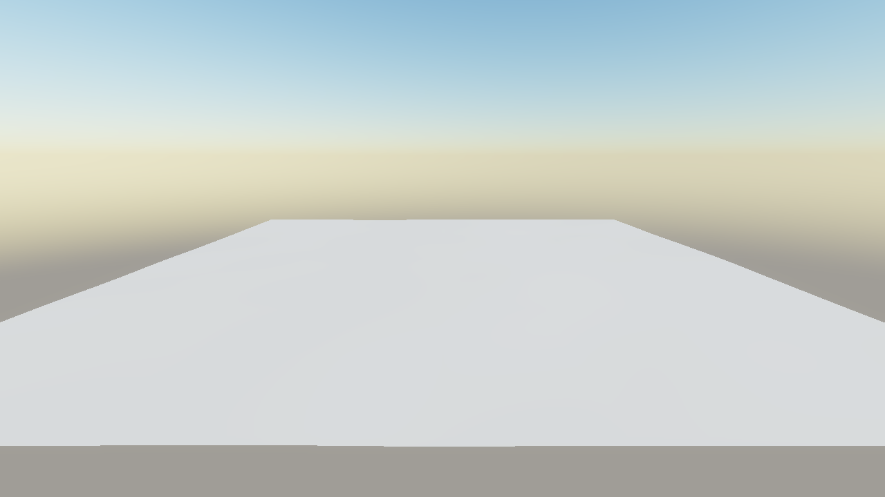
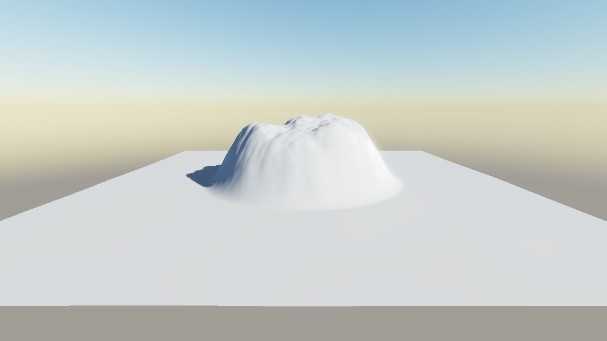

# Mountain-Werkzeug: Vorher/Nachher (Thema 100, Schritt 4)

Sichtprüfung von `TerrainGenerate::mountain` über den Headless-Dump des Editors
(Metal, Debug-Build, 27.09.2026).

| vorher | nachher |
|---|---|
|  |  |

Szene: `HE_DUMP_MOUNTAINTEST=before|after` in `EditorApplication::dumpFrameHeadless`.
Landschaft 240 × 240 m, Auflösung 257, leicht gewellte Grundfläche (seed 7,
heightScale 4) auf y=300. „after“ setzt einen Berg in einen Kreis um die Mitte:
Radius 60 m, maxHeight 40, falloff 30 m, roughness 0.5, seed 1.

Aufruf (entspricht `scripts/he_shot.py` mit diesen KEY=VAL):

```
HE_SKY_TIME=30 python3 scripts/he_shot.py OUT.png MOUNTAINTEST=after \
  TOD=0.35 COVERAGE=0 CLOUDMODE=0 CLOUDSHADOWS=0 RENDERPATH=0 AA=0 \
  CAMX=0 CAMY=345 CAMZ=180 PITCH=-12 YAW=0 RHI=Metal
```

Debug-Editor: `HE_SHOT_TIMEOUT=600` setzen, der Metal-Init braucht dort Minuten.
Bereich und Parameter lassen sich per `MTRADIUS`, `MTHEIGHT`, `MTFALLOFF`,
`MTROUGH` und `MTSEED` ändern, ohne neu zu bauen.

Befund:

- Logzeile (after): `ok=1 changed=12849 peakAdded=40.00 min=1.29 max=42.12 |
  added along +X: centre=37.70 r/2=34.60 mid-falloff=17.11 rim-1m=0.091 rim+2m=0.000`
- Pixeldiff vorher/nachher: jede geänderte Stelle liegt im Rechteck
  x 377–869, y 215–469 (Berg plus Schlagschatten). Außerhalb höchstens 1/255.
- Im Bild steht ein Berg mit rauem fBm-Gipfel, dessen Flanke ohne Stufe in die
  Ebene ausläuft. Beide Läufe: `draws=16 tris=139264 visible=16/16`.
