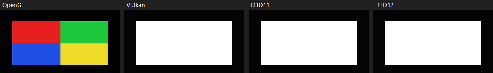
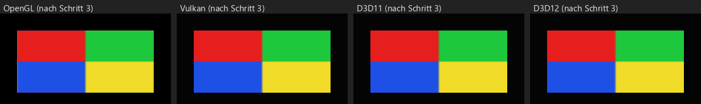

# UI-Bild-Quads auf Vulkan weiß: Ursache (Thema 157, Schritt 1)

Stand: 2026-10-07, NN-WS03 (RTX 4070), Release-Build des Zweigs auf `origin/main` 6866923d,
Baum `C:/hw157`, `DEPLOY_DIR=C:/hw157/deploy`.

## Ergebnis

Vulkans UI-Pass hat **keinen Textur-Pfad**. Die Bindung ist nicht kaputt und es greift kein Fallback auf eine
weiße Textur: `VulkanRenderer::runUIPass` liest `UIRenderObject::textureAssetId` überhaupt nicht. Ein
Image-Element wird deshalb als Vollton-Quad in seiner Tint-Farbe gezeichnet. Die Tint-Farbe steht per Vorgabe
auf Weiß (`UIImage::tint`), daher der weiße Quad. Mit einem anderen Tint wäre der Quad einfarbig in dieser Farbe.

Das ist keine Regression. In der Git-Historie kommt `textureAssetId` in `VulkanRenderer.cpp`,
`D3D11Renderer.cpp` und `D3D12Renderer.cpp` nie vor. Den Pfad haben nur OpenGL (`ResolveUITexture`, Modus 2),
Metal und der Software-Rasterizer. Thema 133 hat die Lücke schon benannt
(`docs/widgets-d3d-vulkan-analysis-2026-10-02.md`, „Was weiter fehlt“, Punkt 1), aber nicht gemessen, weil
der Zeuge keine Bild-Kachel hatte.

Im Widget-Designer ist das Bild trotzdem zu sehen, weil der Designer nicht durch den UI-Pass des Renderers
zeichnet. Er malt Image-Elemente mit ImGui (`dl->AddImage`, `src/HE_Editor/UIEditorPanel.cpp`, Fall
`UIWidgetType::Image`) und benutzt dafür das Textur-Handle aus `CreateImGuiTexture`. Das ist ein eigener Weg,
den jedes Backend hat.

## Was im Vulkan-Pfad fehlt, verglichen mit GL

| Stelle | OpenGL (Referenz) | Vulkan heute |
|---|---|---|
| Schleife im UI-Pass | `RenderUIPass`: bei `obj.type == 0 && obj.textureAssetId != 0` wird `ResolveUITexture` aufgerufen, die Textur auf Unit 0 gebunden und `uUIMode = 2` gesetzt | `runUIPass` (`VulkanRenderer.cpp`, Schleife über `m_renderWorld.uiObjects`): nur `params.x = type == 2 ? 1 : 0`, gebunden ist immer der Font-Atlas |
| Shader | `kUIFS` Modus 2: Textur × Tint, dieselbe SDF für runde Ecken | `shaders/ui.frag`: Modus 0 = Vollton plus Stil, Modus 1 = Glyphe (R8-Atlas). Es gibt keinen Texturzweig und nur den einen Sampler `uFontAtlas` (set 0, binding 0) |
| Asset → GPU-Textur | `ResolveUITexture`: eigener Cache `m_uiTexCache`, Upload **ohne** sRGB-Dekodierung (Thema 107: UI-Farben sind sRGB-Zahlen, sonst wird das Bild zu dunkel) | nichts. Es gibt nur `uiFontAtlasSet(key)` für R8-Atlanten. Der UI-Pool `m_uiAtlasDescPool` ist für Schriften bemessen (32 Sets) |
| Descriptor/Sampler | Textur und Sampler pro Draw an Unit 0 | Das Set-Layout `m_uiAtlasDSLayout` hat einen Combined-Sampler mit Immutable-Sampler für den Atlas. Ein RGBA8-Bild bräuchte ein eigenes Set pro Textur (gleiches Layout reicht, wenn der Sampler passt) |

Für Schritt 2 (Fix) heißt das, drei Teile sind neu:
1. ein Cache Asset → VkImage/VkImageView/Descriptor-Set für UI-Bilder, UNORM (nicht SRGB);
2. in `runUIPass` der Zweig `type == 0 && textureAssetId != 0`, der das Set bindet und Modus 2 schiebt;
3. in `ui.frag` ein Texturzweig (Textur × Tint, danach dieselbe Form/SDF wie Modus 0, wie `kUIFS`).
Der Pool muss mitwachsen oder einen eigenen bekommen. Die Push-Constants sind schon bei genau 128 B
(`static_assert` in `runUIPass`); der Modus passt aber in das vorhandene `params.x`.

## Reproduktion auf Hardware

Zeuge: `HE_DUMP_UITEST=image` (neu, `src/HE_Editor/EditorApplication.cpp`). Er zeigt die 12 Stil-Kacheln aus
Thema 133 und zusätzlich Kachel 12: ein `UIImage` bei x 60–300, y 590–700 mit einem erzeugten 64×64-Bild,
oben links rot, oben rechts grün, unten links blau, unten rechts gelb, Tint weiß. Die Textur wird unter dem
virtuellen Pfad `__uiImageWitness.hasset` registriert, weil das Widget sein Bild nur per Pfad kennt und
`WidgetManager` es beim Instanziieren neu auflöst. `HE_DUMP_UITEST=1` bleibt unverändert; die Messbasis von
Thema 133 gilt also weiter.

```powershell
& scripts\ui-image-repro\cap157.ps1 -Deploy C:\hw157\deploy -Shots C:\hw157\shots -Tag img
python scripts\ui-image-repro\ana157.py C:\hw157\shots img       # Exit = Zahl der Backends ohne Bild
```

| Backend | Kachel 0 (Kontrolle) | TL | TR | BL | BR | Urteil |
|---|---|---|---|---|---|---|
| OpenGL | (66,76,97) | (230,30,30) | (30,200,60) | (30,80,230) | (240,220,40) | **Bild** |
| Vulkan | (66,76,97) | (255,255,255) | (255,255,255) | (255,255,255) | (255,255,255) | **weiß** |
| D3D11 | (66,76,97) | (255,255,255) | (255,255,255) | (255,255,255) | (255,255,255) | **weiß** |
| D3D12 | (66,76,97) | (255,255,255) | (255,255,255) | (255,255,255) | (255,255,255) | **weiß** |



- GL ist die Positivkontrolle: Der Zeuge selbst funktioniert, die Farben kommen bytegenau an.
- Gegenprobe `HE_DUMP_UITEST=1` (ohne Bild-Kachel, Tag `plain`): An derselben Stelle steht der Hintergrund,
  GL (0,0,0), Vulkan (4,4,4). Das Skript meldet dort „missing“. Weiß heißt also wirklich „gezeichnet, aber
  ohne Textur“ und nicht „fehlt“.
- Vulkan lief auf der RTX 4070 mit aktivem Validation-Layer (`VulkanRenderer: validation layer ENABLED`, Khronos
  1.4.341). Der Debug-Callback schreibt Layer-Meldungen als `[ WARN]`/`[ERROR]` ins Log. Die
  Session-Zusammenfassung sagt „1 warning(s), 0 error(s)“, und die eine Warnung ist „No config file …“ (frisches
  APPDATA). Es gibt also **keine** Validation-Meldung. Das passt zu „nie gebaut“: Der Shader liest nichts außer
  dem gebundenen Atlas. Gegen eine falsche Bindung spricht das ebenfalls. Bei D3D11/D3D12 ist es genauso
  (D3D12 ohne `HE_GPU_DEBUG`, also ohne Debug-Layer).
- Die 12 Stil-Kacheln bleiben mit dem neuen Zeugen auf Vulkan, D3D11 und D3D12 bei 0 Fehlschlägen
  (`docs/widgets-d3d-vulkan-tiles.py`, Tags `plain` und `img`).

## D3D11/D3D12 (Nebenbefund für Schritt 3)

Beide zeigen denselben weißen Quad, gemessen im selben Lauf. Die Ursache ist dieselbe: `renderUIPass`
(D3D11) und `renderUIPass12` (D3D12) setzen `mode = type == 2 ? 1 : 0` und lesen `textureAssetId` nicht.
Thema 133 hat abgeschätzt, was dort jeweils fehlt: Auf D3D11 ist es klein (`graphTexCache`/`createAlbedoSRV`
gibt es schon). Auf D3D12 gehören die SRVs in den shader-sichtbaren UI-Heap (heute `k_maxUIFontAtlases`
Slots), dazu kommen Upload und Barrieren vor dem Pass.

## Auch betroffen (nicht gemessen)

`quad(..., textureAssetId)` ist nicht auf UIImage beschränkt. Auch Panel, Border, Button und weitere Elemente
mit gesetzter Textur geben `textureAssetId` mit (`UIElement.cpp`, Aufrufe von `quad`). Auf Vulkan, D3D11 und
D3D12 sind deren Texturen aus demselben Grund unsichtbar. Der Fix in Schritt 2 deckt sie mit ab, wenn er im
UI-Pass auf `type == 0 && textureAssetId != 0` prüft wie GL.

## Nicht geprüft

- Das exportierte Spiel (Swapchain-Pfad) ist nicht aufgenommen. `runUIPass` ist dieselbe Funktion für den
  Swapchain- und den Viewport-Pipeline-Pfad (`m_uiPipeline` / `m_uiViewportPipeline`), deshalb ist dort
  dasselbe zu erwarten. Gemessen ist es nicht.
- Metal ist nicht gemessen. Laut Code hat es `ResolveUITexture`.

## Schritt 2: Vulkan-Fix (2026-10-07)

Gebaut wie oben geplant, nur im Vulkan-Backend:
- `shaders/ui.frag`: Modus 2 = Bild × Tint, runde Ecken per SDF auf dem Alpha, Zeile für Zeile wie `kUIFS`.
  Der Glyphenzweig prüft jetzt `0.5 < x < 1.5` und nicht mehr `x > 0.5`, sonst liefe Modus 2 hinein.
- `VulkanRenderer::resolveUIImageSet`: eigener Cache `m_uiImageCache` (Schlüssel wie `m_graphTexCache`).
  Ein eigener Pool `m_uiImageDescPool` hat 256 Sets und das FREE-Bit. Die Sets haben das Layout des Font-Atlas,
  also dieselbe Pipeline und derselbe Immutable-Sampler. Hochgeladen wird über `uploadTextureImage(...,
  honourSrgb=false)`, also **UNORM**, auch wenn die Textur als sRGB markiert ist (Thema 107). Ein Fehlschlag
  wird gecacht wie bei GL, das Element zeichnet dann seinen Tint. `InvalidateTexture` wirft den Eintrag weg.
- `runUIPass`: Der Zweig `type == 0 && textureAssetId != 0` bindet das Set des Bilds und schiebt
  `params.x = 2`. Gebunden wird nach dem aktuell gebundenen Set, nicht mehr nach dem Atlas-Schlüssel.
- Der UI-Sampler filtert jetzt trilinear wie GL (`mipmapMode LINEAR`, `maxLod` offen). Ein Atlas hat nur eine
  Ebene, für ihn ändert sich nichts.
- Der Zeuge registriert sein Bild jetzt mit `srgb = true`, wie der Importer es bei jeder Farbtextur tut.
  GL bleibt bytegenau, weil sein UI-Pfad das Flag ignoriert.

Bildtest: `scripts/he_vk_imagetests.py --cases ui_image` (läuft in CI auf lavapipe mit). Er hat Leitkanal-
Sonden auf Rot, Grün und Blau und zusätzlich neu `colors`, also Sollfarben ±12 auf allen vier Quadranten.
Er ist in CI gelaufen (Run 37590519247, Job „Linux · Vulkan (lavapipe)“, llvmpipe LLVM 20.1.2) und
war grün: alle vier Quadranten bytegenau, 0 Validation-Meldungen, 6/6 Fälle.

| Lauf (RTX 4070, Vulkan 1.4.341, Validation an) | TL | TR | BL | BR | `ui_image` |
|---|---|---|---|---|---|
| vor dem Fix (Deploy 8501146e) | (255,255,255) | (255,255,255) | (255,255,255) | – | **rot**: Leitkanal 0 |
| Fix, aber Upload SRGB (`honourSrgb=true`, Gegenprobe) | (202,3,3) | (3,147,12) | (3,20,202) | (222,182,5) | **rot**: Leitkanal ok, Farbe 28–60 daneben |
| Fix | (230,30,30) | (30,200,60) | (30,80,230) | (240,220,40) | **grün**: 0 daneben |

- `ana157.py` (Tag `fix`): GL und Vulkan zeigen beide das Bild bytegenau. D3D11/D3D12 sind weiterhin
  weiß, das ist Schritt 3. Alle vier haben 0 `[ERROR]` und 0 `[ WARN]` außer dem Config-Hinweis.
- Vor/nach auf Vulkan: Im `image`-Bild ändern sich genau die 26 400 Pixel der Kachel 12 (240×110), sonst
  nichts. `HE_DUMP_UITEST=1` (Text plus Vollton, ohne Bild) ist md5-gleich mit Schritt 1.
- Deploy-Falle bestätigt: Nach der reinen Shader-Änderung hatten `deploy/Game` und `deploy/Editor/Game` noch
  die alte `ui.frag.spv`. Erst nach einem erzwungenen Neu-Linken von HorizonGame **und** HorizonEditor
  stimmten alle fünf Kopien überein. Für Schritt 4 (das laufende Spiel) also zuerst die Hashes prüfen.

## Schritt 3: D3D11 und D3D12 (2026-10-07)

Der Befund aus Schritt 1 stand schon fest: Beide D3D-Backends zeichneten den Bild-Quad weiß, und zwar aus demselben
Grund wie Vulkan. `renderUIPass` (D3D11) und `renderUIPass12` (D3D12) lasen `textureAssetId` nicht, und
`kUIHLSL`/`kUIHLSL12` hatten keinen Texturzweig. Es gab also weder einen falschen Slot noch eine kaputte SRV oder
einen Fallback, der Pfad fehlte ganz. Der Fix baut ihn nach, Zeile für Zeile wie GL `RenderUIPass`/`kUIFS` Modus 2:

- **Shader (beide):** Der Glyphenzweig prüft jetzt `0.5 < uMode < 1.5`. Modus 2 rechnet Bild × Tint und legt bei
  runden Ecken die SDF auf das Alpha. D3D11 sampelt `i.uv` (die UV-Interpolation passiert im VS) und nimmt `i.local`
  für die SDF. D3D12 sampelt `lerp(uUVRect, i.uv)`, und `i.uv` ist dort zugleich die quad-lokale Koordinate.
- **D3D11:** `createAlbedoSRV(tex, honourSrgb)`. Die UI lädt mit `false` hoch, also **UNORM** trotz sRGB-Flag
  (Thema 107). Dazu kommen ein eigener Cache `uiTexCache` (Schlüssel wie `graphTexCache`, ein Fehlschlag wird als
  null gecacht und das Element zeichnet dann seinen Tint) und `resolveUITexture`. Der Pass bindet das Bild auf t0
  und verwirft `boundAtlasKey`, die nächste Glyphe bindet ihren Atlas also neu. `InvalidateTexture` wirft auch den
  UI-Eintrag weg. Der Sampler war schon trilinear.
- **D3D12:** `uploadTexture2D(..., honourSrgb)`, `srvForTexture` übernimmt das UNORM-Format der Ressource.
  Während des UI-Passes ist nur `m_uiAtlasHeap` gebunden. Der Heap hat deshalb hinter den 16 Font-Slots eine eigene
  Bild-Region mit `k_maxUIImages = 240` Slots, und alle Slots starten als Null-SRV. Bild-Slots werden fortlaufend
  vergeben und **nicht** wiederverwendet: Eine invalidierte Textur geht in `m_retiredTextures`, der Slot bleibt
  liegen, denn ein Deskriptor, den eine Liste im Flug noch liest, darf nicht überschrieben werden.
  `uiImageSlotFor` zeichnet Kopie und Barriere auf, und zwar vor dem Pass-State, in derselben Vorschleife wie die
  Atlas-Uploads. Der statische Sampler bekommt `MaxLOD = D3D12_FLOAT32_MAX` (vorher 0, das hätte ein Bild mit
  Mip-Kette auf Ebene 0 festgenagelt; für Atlanten mit einer Ebene ändert das nichts). Beim Shutdown wird der
  Bild-Cache geleert, und beide Slot-Zähler stehen wieder auf 0.

Messung auf NN-WS03 (RTX 4070), Release-Baum `C:/hw157`, Deploy mit dem neuen `HorizonRendering.dll` (md5
`19739671…` an allen vier Stellen, also Baum, `deploy/Editor`, `deploy/Game` und `deploy/Editor/Game`, nach
erzwungenem Neu-Linken von HorizonGame und HorizonEditor):

```powershell
& scripts\ui-image-repro\cap157.ps1 -Deploy C:\hw157\deploy -Shots C:\hw157\shots -Tag fix3
python scripts\ui-image-repro\ana157.py C:\hw157\shots fix3          # Exit 0
& scripts\ui-image-repro\cap157.ps1 -Deploy C:\hw157\deploy -Shots C:\hw157\shots -Tag dbg3 -Rhis D3D12 `
    -Extra @{HE_GPU_DEBUG='1'; HE_GPU_GBV='1'}                         # neu: -Extra
```

| Backend | vor Schritt 3 (Tag `fix`) | nach Schritt 3 (Tag `fix3`): TL / TR / BL / BR | Urteil |
|---|---|---|---|
| OpenGL | Bild | (230,30,30) / (30,200,60) / (30,80,230) / (240,220,40) | **Bild** |
| Vulkan | Bild | (230,30,30) / (30,200,60) / (30,80,230) / (240,220,40) | **Bild** |
| D3D11 | (255,255,255) überall | (230,30,30) / (30,200,60) / (30,80,230) / (240,220,40) | **Bild** |
| D3D12 | (255,255,255) überall | (230,30,30) / (30,200,60) / (30,80,230) / (240,220,40) | **Bild** |
| D3D12 + Debug-Layer + GBV (`dbg3`) | – | (230,30,30) / (30,200,60) / (30,80,230) / (240,220,40) | **Bild**, 0 Meldungen „D3D12 debug layer:“ |



- Die Sollfarben kommen bytegenau an. Bei einem SRGB-Upload wären es (202,3,3) usw. (siehe Gegenprobe in
  Schritt 2), die Farben belegen also den UNORM-Pfad.
- Vor/nach (`fix` → `fix3`): Auf D3D11 und D3D12 ändern sich genau die 26 400 Pixel der Kachel 12
  (x 60–299, y 590–699), sonst kein einziges. Die 12 Stil-Kacheln und alle Glyphen sind also bytegleich geblieben.
  GL und Vulkan sind zwischen den beiden Läufen bytegleich.
- In der Kachel sind D3D11, D3D12 und Vulkan pixelgleich (max. Abweichung 0). Gegen GL weichen 912 Pixel ab, und
  zwar **alle** im äußeren 2-px-Rand der Kachel und keiner an den Quadranten-Nähten. GL lädt das Bild über
  `uploadTextureAssetGL` hoch, das keinen Wrap-Modus setzt, es gilt also der GL-Standard `GL_REPEAT`. Am Rand
  filtert GL deshalb die gegenüberliegende Bildkante ein, die anderen drei klemmen (Clamp). Das ist eine GL-Eigenheit am Rand und kein D3D-Fehler. Sie liegt außerhalb dieses Themas.
- Alle vier Logs haben 0 `[ERROR]` und 0 `[ WARN]` außer dem Config-Hinweis. Der D3D12-Lauf mit
  `HE_GPU_DEBUG=1` und `HE_GPU_GBV=1` meldet „GPU-based validation ENABLED“ und „GPU debug layer + DRED ENABLED“
  und hat keine einzige Debug-Layer-Zeile. Eine Gegenprobe, dass die InfoQueue-Leitung in diesem Dump-Lauf
  wirklich ankommt, habe ich nicht gemacht. D3D11 hat im Renderer keinen Schalter für den Debug-Layer.
- Test: `tests/test_culling.cpp`, „UI image quads have a texture path on D3D11 and D3D12 (Thema 157)“. Er pinnt
  Shaderzweig, Modus-Wahl, UNORM-Upload, Cache-Invalidierung und die D3D12-Heap-Region im Quelltext; eine GPU
  gibt es unter ctest nicht. Auf HEAD vor dem Fix kommt keiner der gepinnten Strings vor. Mit dem Fix ist der
  Test grün, zusammen mit allen 60 Fällen von `test_culling.cpp`. Die beiden UI-HLSL-Strings sind zusätzlich mit
  `fxc /Ges` gebaut (VS und PS, D3D11 und D3D12), und der Build-Schritt meldet „All 108 embedded shaders compile“.

Nicht gemessen:
- Runde Ecken an einem Bild (Modus 2 mit `cornerRadius > 0`). Der Zeuge hat Radius 0. Der Code ist derselbe wie
  bei GL/Vulkan, belegt ist er auf D3D aber nicht.
- Das exportierte Spiel (Swapchain-Pfad). Beide D3D-Backends rufen dort dieselbe Pass-Funktion auf (D3D11
  `Render`, D3D12 Swapchain-Zweig von `Render`). Das ist Schritt 4.
- Mehr als 240 verschiedene UI-Bilder in einer D3D12-Sitzung. Danach zeichnen weitere Bilder ihren Tint, ohne
  Meldung. Ein Bild, das per `InvalidateTexture` neu geladen wird, verbraucht jeweils einen neuen Slot.
