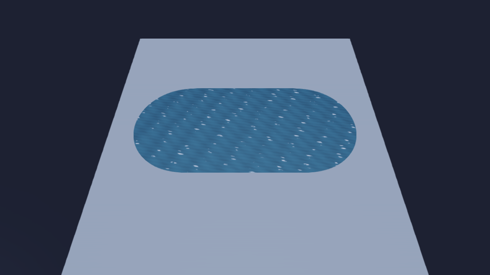
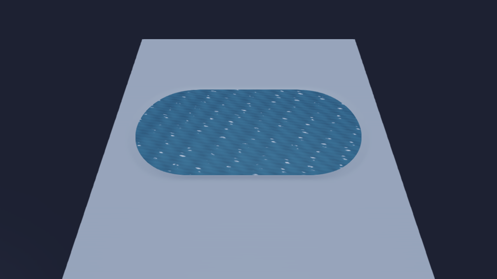

# Wasser-Pinsel: Wasser wie ein Sculpt-Werkzeug ins Landscape malen (Thema 174, Schritt 7)

Stand 09.10.2026, Windows (NN-WS03), Debug-Build. Schritt 3 lieferte das gemeinsame Wassermodell
(`HE::water::Field`), Schritt 4/5 die Fläche samt Ufer-Beschneidung. Dieser Schritt ist das zweite
Werkzeug, das in dasselbe Modell schreibt: ein Pinsel nach dem Vorbild des bestehenden Sculpt-Werkzeugs
(Cursor-Kreis, Radius, Stärke, Falloff, Ziehen malt), nicht die Spline/das Lake-Werkzeug (Schritt 8,
nicht angefasst).

Code: `src/HE_Scene/include/HorizonScene/WaterBrush.h` + `src/HE_Scene/src/WaterBrush.cpp` (der
Strich, ohne ImGui — `begin`/`dab`/`end`/`targetAt`), `src/HE_Scene/include/HorizonScene/TerrainSculpt.h`
+ `.cpp` (`lowerToFloor`, neu, fürs Absenken), `src/HE_Editor/TerrainTools.cpp` (Wasser als vierter
Landscape-Modus neben Sculpt/Paint/Foliage), `src/HE_Editor/EditorHelp.cpp` (Hilfetexte), Witness
`HE_DUMP_WATERBRUSH` in `src/HE_Editor/EditorApplication.cpp`. Tests in `tests/test_water_brush.cpp`
(16 Fälle: Datenmodell, Strich-Logik, Aushub, Undo, Speichern/Laden) und `tests/test_terrain_tools_ui.cpp`
(1 Fall: der echte Modus + Viewport headless, mit Panel-Screenshot).

## Ablauf in einem Absatz

Ein Strich ist `begin()`, beliebig viele `dab()`, `end()` — alles reine CPU-Funktionen auf
`TerrainComponent`, ohne ContentManager oder Renderer, wie `WaterField` und `TerrainSculpt` es schon
sind. `begin()` entscheidet, welcher Körper den Strich bekommt: liegt der erste Punkt auf Wasser
(`HE::water::bodyAt`), geht der Strich mit DESSEN Körper und Spiegel weiter — das ist die
Interoperabilität, die der Plan verlangt, ein Pinsel kann so später einen See (Schritt 8) verbreitern.
Liegt er auf trockenem Grund, legt `begin()` einen neuen Körper an, ohne Quell-Spline ("Pinselwasser").
Der Spiegel wird einmal, beim ersten Punkt, festgelegt und bleibt für den ganzen Strich fest (ein Zug
bergauf kippt das Wasser nicht): entweder die Geländehöhe unter dem ersten Punkt plus ein Versatz, oder
eine feste Zahl aus dem Panel. `dab()` ruft `water::addCircle`/`removeCircle` wie bisher, mit Radius/
Falloff/Stärke des Pinsels; im optionalen Grabmodus zusätzlich `TerrainSculpt::lowerToFloor` (neu, unten)
auf denselben Kreis. Der Editor (`TerrainTools.cpp`) nimmt dieselbe Mausführung wie Sculpt/Paint/
Foliage: ein Undo-Snapshot beim ersten Dab, `TerrainSystem::updateTerrains` nach jedem Dab, damit die
Fläche live mitwächst.

## Entscheidungen

| Frage | Entscheidung | Grund |
|---|---|---|
| Welcher Körper | unter dem ersten Punkt fortsetzen (`bodyAt`), sonst neu | Macht Pinsel und spätere Seen (Schritt 8) interoperabel, ohne dass der Nutzer eine Körper-Id wählen muss; ein Strich über zwei Gewässer hält sich an das erste. |
| Spiegel | beim ersten Punkt fest, aus Geländehöhe + Versatz ODER einer Zahl | Ein Zug über geneigtes Gelände darf das Wasser nicht kippen; "aus Gelände" ist der Normalfall (ein Klick ergibt sofort einen plausiblen Spiegel), die Zahl ist für einen zweiten Teich auf exakt demselben Niveau. |
| Löschen | eigener Stroke-Zustand (`erase`), beim ersten Dab fest, nicht pro Dab neu gelesen | Deckt sich damit, wie Shift im Editor einmal pro Frame gelesen wird, und mit dem Grow/Erase-Vorbild des Foliage-Pinsels: ein Strich ist entweder/oder. |
| Graben | eigene Funktion `TerrainSculpt::lowerToFloor`, nicht `excavatePolygon` | `excavatePolygon` ist Schritt 8s Werkzeug für ein festes Polygon; der Pinsel braucht denselben Kreis wie `addCircle`/`removeCircle` mit demselben Falloff, Dab für Dab. Gleicher Vertrag wie `excavatePolygon`s Floor-Modus: hebt nie, Gewicht 1 setzt exakt (bit-gleich), eine Böschung läuft über den Falloff aus. |
| Grenzfall: Strich ohne eine einzige nasse Zelle | Körper/Gitter wieder leeren | Ein Klick daneben oder ein Löschversuch ohne Wasser darf keinen leeren, aber zugewiesenen Körper oder ein allozierter-aber-leeres Gitter hinterlassen — sonst ist die Szene nicht mehr `pristine()`, obwohl nichts passiert ist. |
| Tempo | Stärke×dt, aber deutlich schneller als Sculpt/Paint (×1,0 statt ×0,16) | Eine Zelle existiert erst ab coverage ≥ `kWet` (128 von 255): bei der Paint-Pinsel-Rate bräuchte ein Strich mehrere Sekunden, bis überhaupt etwas sichtbar wird. Bei der Standard-Stärke (5) und 60 Hz ist eine Zelle in weniger als einer Sekunde nass. |

## Wie es aussieht

Zeuge `HE_DUMP_WATERBRUSH=paint|dig|undo` (`EditorApplication.cpp`): ein flaches 100×100-m-Gelände
bei y=300, ein Strich von 13 Dabs quer darüber, genau durch `HE::water::brush` — keine Abkürzung über
`addCircle`. `undo` nimmt den Strich über `EditorUndo` zurück. Kamera wie beim `HE_DUMP_WATERLAKE`-Zeuge
(CAMY=375 CAMZ=48 PITCH=-60), Rezept: `HE_CONFIG_DIR=<frisch> HE_COLLAB_OFFLINE=1 HE_DUMP_PATH=out.bmp
HE_DUMP_QUIT=1 HE_DUMP_SKYTEST=1 HE_DUMP_RHI=OpenGL HE_DUMP_WATERBRUSH=paint HE_DUMP_CAMY=375
HE_DUMP_CAMZ=48 HE_DUMP_PITCH=-60` auf dem deployten Editor. Die Logzeile trägt die Zahlen als
Zwilling zum Bild.

**paint** — ein neuer Körper, Spiegel 0,30 m (Gelände 0 + Standard-Versatz 0,3), 13 Dabs, 4462 nasse
Zellen, eine Fläche (280 Dreiecke):

**dig** — derselbe Strich mit "Dig Bed": dieselben 4462 nassen Zellen und dieselbe Fläche (das Graben
ändert, wo Wasser ist, nicht ob — es senkt nur den Boden darunter):

**undo** — derselbe Strich, dann ein Undo-Schritt: 0 Flächen, 0 Dreiecke, 0 nasse Zellen, das Gelände
wieder bloß:

## Validierung

- **Datenmodell** (`tests/test_water_brush.cpp`, 16 Fälle): welcher Körper ein Strich bekommt (neu vs.
  fortgesetzt, mit demselben Spiegel und derselben Quelle), Spiegel aus Gelände+Versatz vs. fester Zahl,
  der Eraser nimmt nur weg und lässt einen Seekörper unangetastet stehen, Graben hebt nie und läuft in
  einen Grenzwert statt endlos zu vertiefen, ein Strich ohne Treffer hinterlässt nichts, **Undo gibt
  Wasser UND Gelände bit-genau zurück**, **Speichern/Laden** rundet den Körper, seinen Spiegel und die
  Zellen exakt, und ein geladener Körper lässt sich weiter bemalen (Fortsetzung funktioniert nach dem
  Laden genauso wie vorher).
- **Editor-Verdrahtung** (`tests/test_terrain_tools_ui.cpp`): der echte `TerrainTools::renderPanel` +
  `sculptInViewport` headless, mit einem Software-ImGui — Wasser-Modus bewaffnen, ziehen, ein
  Undo-Schritt für den ganzen Strich, Shift löscht, Dig Bed senkt das Gelände, Undo lässt die
  Landschafts-eigenen Dirty-Flags unangetastet. Panel-Screenshot per `HE_UI_DUMP_DIR` (Software-
  Rasterizer, nicht `he_uishot.py`).
- **Pixel-Screenshot eines gemalten Wasserflecks** (dieses Dokument): oben, über den echten
  `HE::water::brush`-Pfad, auf OpenGL.
- **he_tests** auf macOS (Clang) und jetzt auch Windows (MSVC, dieser Build): `-tc="Water brush*,
  landscape ui*"` grün (19 Testfälle, 6639 Assertions). CI (GitHub Actions, Windows/macOS/Linux/Linux+
  Vulkan) läuft für diesen Commit.

## Was dieser Schritt nicht anfasst

Das Lake-Werkzeug (Schritt 8) — der Pinsel liest nur, ob ein Punkt schon Wasser ist (`bodyAt`), er
zeichnet keine Splines und kennt keine Polygone. D3D11/D3D12/Vulkan (Schritte 9/10) — die Fläche ist ein
gewöhnliches Mesh + Material, ohne Sonderpfad, aber nur auf Metal/OpenGL belegt. Neue Wasser-Shader-
Features, Strömung, Auftrieb — ausdrücklich außerhalb des Themas.
