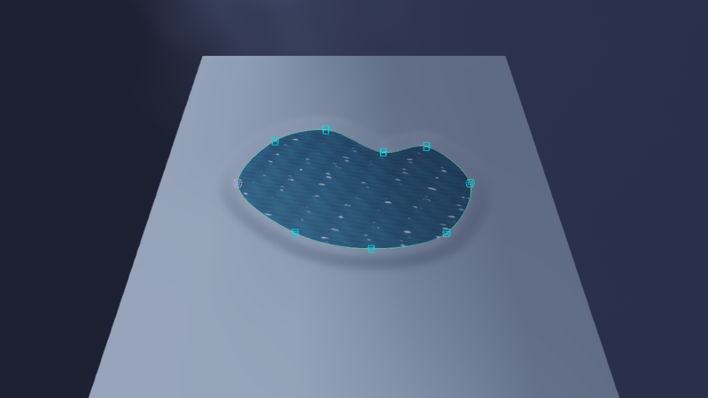
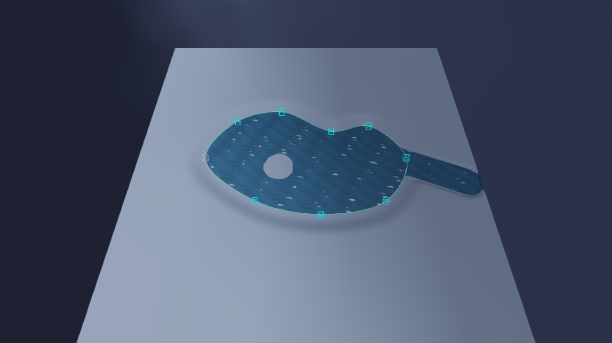
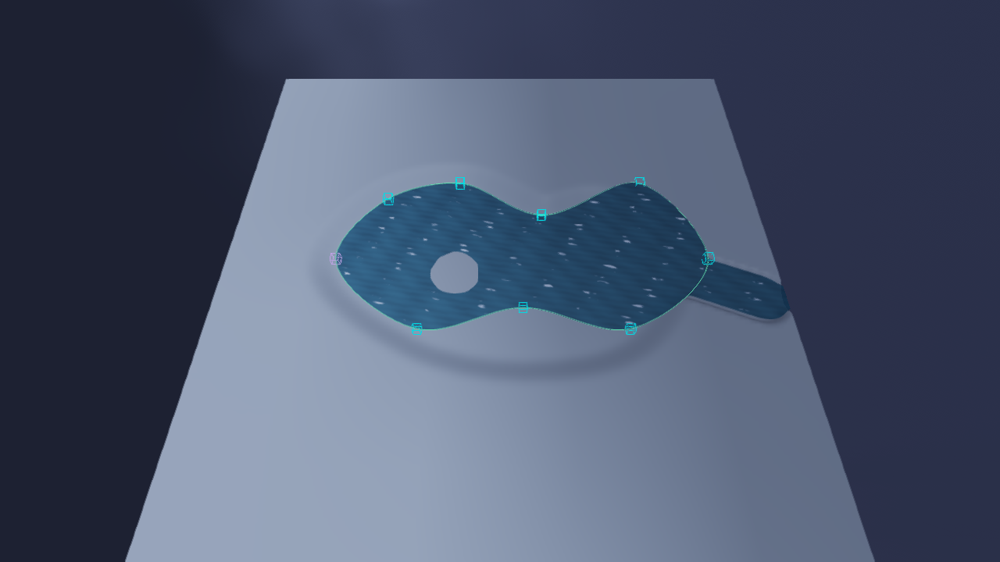
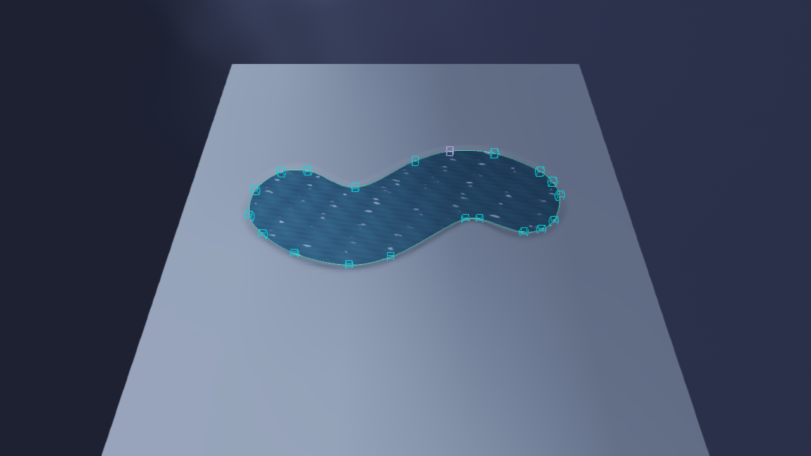
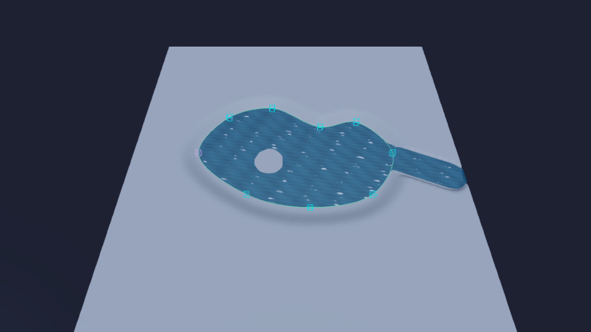

# Lake-Werkzeug und Interoperabilität mit dem Pinsel (Thema 174, Schritt 8)

Stand 10.10.2026, macOS (Metal und OpenGL), Debug-Build. Schritt 3 lieferte das gemeinsame Wassermodell
(`HE::water::Field`), Schritt 4/5 die Fläche samt Ufer-Beschneidung, Schritt 6 den Aushub unter einem Polygon,
Schritt 7 den Wasser-Pinsel. Dieser Schritt ist das zweite Werkzeug, das in dasselbe Modell schreibt: eine
**geschlossene Spline wird ein See**. Punkte verschieben formt nur das Wasser um, der Aushub ist eine eigene,
ausdrückliche Aktion, und was der Pinsel an einem See hinzugefügt oder weggenommen hat, bleibt beim Umformen
erhalten.

Code: `src/HE_Scene/include/HorizonScene/WaterLake.h` + `src/HE_Scene/src/WaterLake.cpp` (Kern, ohne ImGui;
`HE::water::lake`), `Body::polygon` in `WaterField.h` (+ Speichern in `SceneSerializer.cpp`, Schlüssel
`polygonB64`), der Sync in `TerrainSystem::updateTerrains` (vor `WaterSurface::update`), Editor in
`src/HE_Editor/SplineTool.cpp` (Abschnitt „Lake“ im Spline-Panel) und `TerrainTools.cpp` (Liste „Bodies“ mit
„To Lake“ im Wasser-Modus), Hilfetexte in `EditorHelp.cpp`, Engine-API `HE::api::water` in `EngineApi.cpp`
(14 Registry-Zeilen), MCP-Werkzeug `terrain_lake` in `McpToolsTerrain.cpp`, Zeuge `HE_DUMP_LAKEEDIT` in
`EditorApplication.cpp`. Tests: `tests/test_water_lake.cpp` (33 Fälle), `tests/test_water_lake_api.cpp` (7),
`tests/test_mcp_tools_terrain.cpp` (+6), `tests/test_spline_tool_ui.cpp` (+2) und `tests/test_terrain_tools_ui.cpp` (+1).

## So benutzt man es

1. **Zeichnen.** Im Spline-Modus eine Linie auf das Landscape klicken und mit „Closed“ schließen (mindestens
   drei Punkte). Die Punkte lassen sich jederzeit verschieben, einfügen und löschen, wie in Schritt 2.
2. **Lake-Abschnitt im Panel** (erscheint bei einer geschlossenen Spline über einem Landscape): *From Ground* /
   *Above Ground* oder *Level* (Wasserspiegel), *Dig Bed*, *Depth* (Tiefe), *Bank* (Randverlauf), dazu *Clip To
   Ground* und *Shore Overshoot* (Beschneidung). **Create Lake** gräbt das Bett und legt das Wasser darüber,
   in **einem** Undo-Schritt.
3. **Umformen.** Punkte ziehen, einfügen oder löschen, auch den ganzen Spline-Entity bewegen oder das Landscape
   verschieben: das Wasser folgt noch im selben Frame (`syncSplines`), der Boden bleibt, wie er ist. **Dig Again**
   gräbt das Bett unter der *aktuellen* Kontur neu, nur auf Knopfdruck, ein Undo-Schritt (und keiner, wenn nichts
   tiefer wurde). Der Wasserspiegel ist ein eigener Regler (ein Undo-Schritt je Zug).
4. **Mit dem Pinsel erweitern.** Ein Strich, der auf dem See beginnt, setzt diesen See fort (Schritt 7). Was er
   außerhalb der Kontur malt oder mit dem Radierer aus ihr herausschneidet, ist der *Pinsel-Anteil* und bleibt
   beim Umformen (Regel unten).
5. **Pinselwasser in einen See umwandeln.** Im Wasser-Modus des Landscape-Panels listet „Bodies“ jeden Körper:
   Teiche (Pinselwasser) haben **To Lake**, Seen **Select Spline**, Seen ohne Spline **Detach**. To Lake liest die
   Kontur des größten Wasserstücks, legt eine geschlossene Spline (höchstens 32 Punkte) als Kind des Landscape
   darum, schaltet auf den Spline-Modus und wählt sie aus. Ein Undo-Schritt.

## Daten: eine Kontur am Körper

`Body` bekam `polygon`: die Kontur (terrain-lokales XZ, ohne schließenden Doppelpunkt), aus der die Zellen
**zuletzt** gelegt wurden. Pinselwasser hat keine. Sie ist die Vergleichsbasis der Regel unten, und sie
ist bewusst *keine* zweite Rasterebene: eine Kontur ist wenige hundert Punkte klein, hängt nicht an der Auflösung
und wird mit der Szene gespeichert (`polygonB64`, rohe Float-Paare wie `sculptHeights`; `sanitize` verwirft
Nicht-Zahlen, Überlänge und eine Kontur an Pinselwasser). `syncKey` am Körper ist reine Laufzeit (nie gespeichert,
nie verglichen): der Fingerabdruck von Spline-Punkten, `closed` und beiden Weltmatrizen, mit dem der Sync merkt, dass
sich etwas bewegt hat. Neu geladen oder per Undo zurückgeholt ist er 0: der erste Blick **merkt sich nur**, er formt
nichts um.

## Die Regel: Pinsel-Anteil über Spline-Anteil

Zwei Anteile Wasser hat ein See. Der **Spline-Anteil** ist, was seine Kontur sagt. Der **Pinsel-Anteil** ist der
Unterschied zwischen den Zellen, wie sie jetzt sind, und dem, was die Kontur von damals (`Body::polygon`, „alt“) ergibt.
Er wird nicht mitgeführt, sondern beim Umformen aus den Zellen abgelesen. Mit `altR`/`neuR` als Kontur auf das Raster
des Feldes gebracht (anti-aliased, Deckung 0..255):

| Pinsel-Anteil | Wie er erkannt wird |
|---|---|
| **hinzugefügt** | Zelle, die der Körper besitzt, mit *mehr* Deckung als `altR` sagt |
| **weggenommen** | Zelle mit *weniger* Deckung als `altR` sagt, die der Körper noch besitzt oder die trocken ist (eine Zelle, die ein anderer Körper genommen hat, ist dessen, kein Radieren) |

**Neue Zellen = ( `neuR` ∪ hinzugefügt ) − weggenommen**, wobei ∪ die größere Deckung nimmt und − die Zelle auf das
herunterbringt, was der Pinsel dort stehen ließ (0 beim vollen Radieren, ein Zwischenwert beim weichen). Danach ist
die neue Kontur die Basis. Die sechs Folgen, jede ein Testfall in `tests/test_water_lake.cpp`:

1. Verkleinert man die Kontur, **trocknet** der Bereich, den nur die alte Kontur deckte.
2. Vergrößert man sie, **nimmt sie Pinselwasser auf**, das sie jetzt deckt; nichts verdoppelt sich.
3. Pinselwasser **außerhalb beider Konturen bleibt**, wo es gemalt wurde (eine Rinne aus dem Ufer heraus).
4. Eine **Kerbe**, die der Radierer innen schnitt, **bleibt eine Kerbe**, auch wenn die Kontur wächst oder wandert,
   solange sie innerhalb liegt.
5. Eine Zelle, die die neue Kontur ordentlich deckt (Deckung ≥ `kWet`), wird **einem anderen Körper abgenommen**,
   wie bei `addPolygon`: das Polygon ist maßgeblich.
6. Dieselbe Kontur noch einmal ändert **nichts** (`changed == 0`, Feld bit-gleich).

Was die Regel nicht kann (und dokumentiert statt gelöst ist): Eine Kerbe, die beim Umformen **außerhalb** der neuen
Kontur landet, ist danach trocken *und* außerhalb, es gibt nichts mehr zu vergleichen; wandert die Kontur zurück, ist
die Kerbe verheilt (Test 4b). Und `setResolution` tastet die Zellen neu ab, nicht die Basis; das nächste Umformen
danach kann einen dünnen Ring „Pinsel“ entlang des alten Ufers lesen. Beides verliert kein Wasser.

Pinsel über Wasser, das die Kontur schon deckt, fügt nichts hinzu (die Zelle ist schon nass): ein Strich, der
innen beginnt und innen endet, ist für die Regel unsichtbar. Das ist gewollt, es gibt nichts zu erhalten.

Das zweite Bild zeigt auch, was „nur das Wasser“ heißt: Wo die Kontur zurückgezogen wurde, bleibt die alte Grube
als trockene Mulde (dunkler Rand); wo sie vorgezogen wurde, liegt das Wasser flach auf ungegrabenem Boden, ohne Tiefe.
**Dig Again** gräbt beides nach, wenn man es will.

## Was welche Aktion anfasst

| Aktion | Wasser | Boden | Undo |
|---|---|---|---|
| Create Lake | ja | ja (`excavatePolygon`, Floor-Modus, nur Absenken) | 1 Schritt |
| Punkt ziehen / einfügen / löschen, Spline oder Landscape bewegen | ja, automatisch (`syncSplines`) | nein | der Schritt der Spline-Bearbeitung |
| Dig Again | nein | ja, unter der aktuellen Kontur | 1 Schritt, keiner ohne Änderung |
| Wasserspiegel | ja (`setLevel`) | nein | 1 Schritt je Zug |
| Remove Lake | ja | nein | 1 Schritt |
| To Lake | ja (Kontur ersetzt das Stück) | nein | 1 Schritt (Spline-Entity inklusive) |
| Beschneidung (Clip To Ground, Shore Overshoot) | Fläche, nicht Zellen | nein | 1 Schritt je Änderung |

Die **Beschneidung** ist eine Landscape-Einstellung (`Field::clipToGround`, Schritt 5), keine je See: sie gilt für
Seen und Pinselwasser gleichermaßen, weil sie im Netzbau sitzt, nicht in den Zellen. Das Lake-Panel zeigt sie, damit
man sieht, wie der See ans Ufer stößt; sie dort zu ändern ändert sie für das ganze Landscape.

**Wasserspiegel „aus dem Boden“** nimmt den tiefsten Boden unter der Kontur (vor dem Graben gelesen) plus *Above
Ground*. Das Bett liegt `Depth` darunter, die Böschung `Bank` Meter weit nach außen (Smoothstep).

## To Lake: Kontur extrahieren

`extractOutline` liest die Konturen des Körpers aus demselben Gitter, aus dem die Fläche gebaut wird
(Marching Squares), nimmt die äußere mit der größten Fläche, vereinfacht sie per Douglas-Peucker (Toleranz anfangs
eine Zelle, wächst, bis höchstens 32 Punkte übrig sind; eine Catmull-Rom-Spline durch 300 Punkte wäre unbenutzbar)
und zählt, was sie auslässt (`pieces`, `islands`). `adopt` macht den Körper zum See dieser Spline: das Hauptstück
(Kontur, eine Zelle weich erweitert) wird durch die Füllung der Spline-Kontur ersetzt, Spiegel und Id bleiben.
Bewusst:

- Der **ausgefranste Pinselrand wird zur glatten Spline**; kein Geisterrand, der beim Umformen als „Pinsel“ stehen bliebe.
- **Inseln werden gefüllt**; mit dem Radierer wieder herausschneiden, das bleibt dann bei jedem Umformen.
- Ein **getrenntes kleines Stück** desselben Körpers (weiter als eine Zelle weg) bleibt als Pinselwasser.

## Engine-API, HorizonCode, Lua/Python, MCP

Gruppe `water` in `HE::api` (Registry, `isScriptGroup("water")`, Anzeigenamen, `HcNodeDocs`, Tests), Koordinaten und
Spiegel in **Weltraum** wie die `nav`-Gruppe:

| Zeile | Art | Was |
|---|---|---|
| `water.createLake(terrain, spline, level, dig, depth, bank)` → body | exec | See aus geschlossener Spline, Spiegel als Welt-Y |
| `water.createLakeAtGround(terrain, spline, above, dig, depth, bank)` → body | exec | Spiegel = tiefster Boden unter der Kontur + `above` |
| `water.reshapeLake(spline)` → changed | exec | jetzt umformen (der Tick tut es ohnehin), −1 = kein See |
| `water.digLake(spline, depth, bank)` → lowered | exec | Bett neu graben |
| `water.setLakeLevel(spline, level)` / `water.removeLake(spline)` | exec | Spiegel (Welt-Y) / See entfernen |
| `water.convertToLake(terrain, body)` → spline | exec | Teich → See, legt die Spline an |
| `water.paint` / `water.erase (terrain, x, z, radius, falloff)` → cells | exec | ein Pinselklick (Welt-XZ) |
| `water.bodyAt`, `water.levelAt` (wet, level), `water.lakeBody`, `water.lakeSpline`, `water.wetCells` | pure | Fragen |

MCP: `McpToolsApi` macht nur **reine** Zeilen zu Werkzeugen (Exec-Zeilen schreiben ohne Undo), also sind die fünf
Fragen sofort als `api_water_*` da. Für das Anlegen und Umformen gibt es **`terrain_lake`** (`McpToolsTerrain.cpp`,
nach dem Muster von `terrain_sculpt`): Aktion `create | reshape | dig | level | remove`, die Spline als Entity-Uuid, alle
Höhen in Welt-Y; es arbeitet auf einer **Kopie** des Landscape, schreibt das Ergebnis über das Command-Gateway zurück
(ein Undo-Schritt für Wasser und Boden zusammen), meldet „nichts geändert“ ohne Undo-Eintrag und lehnt mit den Codes
ab, nach denen ein Client verzweigt (`invalid_payload`, `not_found`, `play_mode`). `body` bei `create` macht einen
vorhandenen Teich zum See dieser Spline.

## Entscheidungen

| Frage | Entscheidung | Grund |
|---|---|---|
| Wo steht die Vergleichsbasis | Kontur am Körper, nicht zweite Rasterebene | klein, auflösungsunabhängig, geht durch Szene und Undo ohne Sonderweg |
| Was heißt „Pinsel-Anteil“ | aus den Zellen abgelesen, nicht mitgeführt | der Pinsel (Schritt 7) bleibt unverändert; es gibt nichts, das aus dem Takt geraten kann |
| Wer löst das Umformen aus | Sync in `updateTerrains`, Fingerabdruck der Spline | geht für Gizmo, Details-Panel, MCP, Landscape verschieben, ohne dass jeder Weg daran denken muss |
| Erster Blick nach Laden/Undo | nur Fingerabdruck merken | Laden und Undo ändern kein Wasser; Gleitkommarauschen zwischen Maschinen formt nichts um |
| Aushub und Umformen | getrennt | verlangt der Plan; ein Bett, das bei jedem Ziehen mitgegraben würde, ließe sich nicht mehr aufräumen |
| Level-Standard | tiefster Boden unter der Kontur (vor dem Graben) | der See liegt im Becken, die höhere Seite wird von der Böschung gefasst |
| Dig Again ohne Änderung | kein Undo-Eintrag | die Welt wird vorher beiseite gelegt und nur bei Änderung als Schritt gebucht; die *Böschung* wird bei jedem Druck etwas tiefer (der Rand wird aus der Höhe von jetzt geblendet), das Bett selbst nicht |
| To Lake, Spline-Eltern | Kind des Landscape, Punkte im Landscape-Raum | wandert mit; keine Matrix-Umrechnung nötig |
| Beschneidung | Landscape-weit, im Lake-Panel gezeigt | die Einstellung sitzt im Netzbau (Schritt 5), „je See“ wäre eine zweite Wahrheit |

## Validierung

- **Datenmodell** (`tests/test_water_lake.cpp`, 33 Fälle): Anlegen, abgelehnte Eingaben (nichts entsteht), tiefster
  Boden, Aushub (nie heben, Böschung, tieferes Loch bleibt), die sechs Folgen der Regel einzeln, Umformen berührt den
  Boden nicht, abgelehntes Umformen lässt die Zellen bit-gleich, Detach, Kontur-Extraktion (Ring, Obergrenze, Inseln,
  mehrere Stücke), `adopt`, Entity-Ebene (`polygonOf` in jedem Raum, `create` mit Aushub, Plan/Apply), Sync (Punkt,
  Entity, Landscape bewegt, kurz nicht geschlossen, Spline gelöscht), **Rundreise Speichern/Laden** (Kontur, Link,
  Pinsel-Anteil überleben, danach formt der Sync weiter um, ohne die Rinne oder die Kerbe zu verlieren) und beschädigte
  Kontur, **Undo** (Wasser *und* Boden bit-genau, auch die Kontur samt Link nach Redo), die Fläche im selben
  `updateTerrains`.
- **Editor-Verdrahtung**: Spline-Panel headless (Create Lake = 1 Schritt, Undo/Redo, Dig Again, Remove Lake, Formular
  erscheint nur bei geschlossener Spline), Wasser-Panel (To Lake = 1 Schritt, Modus-Wechsel, Auswahl, Undo).
- **API/MCP**: 7 + 6 Fälle (Welt-Koordinaten, ein Teich-Strich verlängert den See, Teich → See, neutral ohne Welt,
  Verweigerungen, kein Undo-Eintrag ohne Änderung).
- **Zeuge** `HE_DUMP_LAKEEDIT=drawn|extended|reshaped|converted` (`EditorApplication.cpp`): echte Pfade
  (`lake::create`, `HE::water::brush`, der Sync in `updateTerrains`, `convertBody`), Spline-Hilfslinien darüber.
  Rezept: `HE_CONFIG_DIR=<frisch> HE_COLLAB_OFFLINE=1 HE_SKY_TIME=1.0 scripts/he_shot.py out.png LAKEEDIT=extended
  CAMY=375 CAMZ=48 PITCH=-60 RHI=Metal` (oder `OpenGL`). Die Logzeile ist der Zwilling zum Bild: *drawn* 2564 Zellen,
  4267 Vertices gegraben; *extended* 2771 (die Pinsel-Rinne setzte den See fort); *reshaped* 2771 → 2865, Rinne noch
  nass, Insel noch trocken; *converted* Teich 2287 Zellen → See 2275 Zellen mit 20 Punkten.

OpenGL zeichnet dieselbe Szene (nur die Beleuchtung weicht leicht ab):

## Was dieser Schritt nicht anfasst

D3D11/D3D12/Vulkan (Schritte 9 und 10): die Fläche ist ein gewöhnliches Mesh mit Material, hier nur auf Metal und
OpenGL gesehen. Handbuch-Eintrag und Gesamtabnahme (Schritt 11). Neue Wasser-Shader-Features, Strömung, Auftrieb:
außerhalb des Themas. Nicht gebaut: eine Anzeige der Kontur des Pinsel-Anteils im Viewport; die Spline-Hilfslinien
zeigen die Kontur, der Pinsel-Anteil ist an der Wasserfläche selbst zu sehen.
