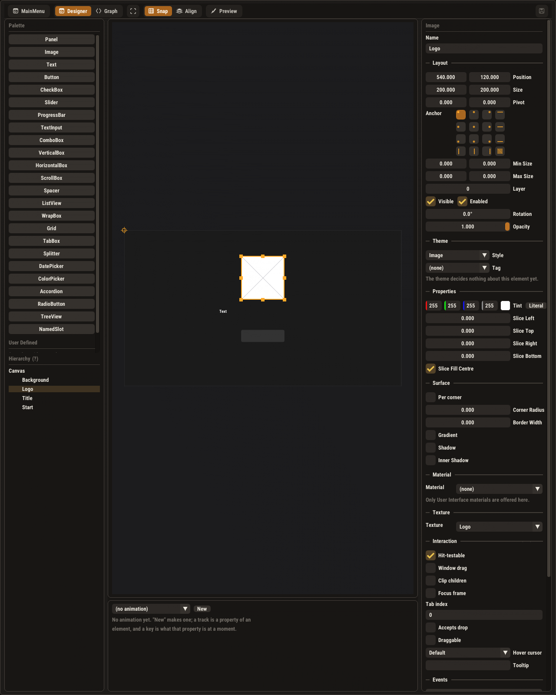
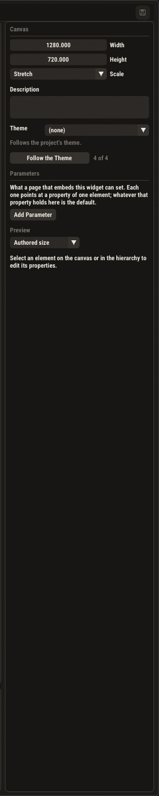

# Widget-Designer: Bestandsaufnahme (Stand 26.09.2026)

Thema 92, Schritt 1. Grundlage ist der Code auf `claude/widget-designer-ux` (Basis `152659ff`), ein
Debug-Build von `he_tests` in diesem Worktree und zwei neue Tests, die das Gesagte belegen:

- `tests/test_texture_orientation.cpp`: die Spiegel-Kette, Glied für Glied und einmal durchgehend
  über den Software-Rasterizer (4 Fälle, grün).
- `tests/test_widget_designer_ui.cpp`: der **echte** `UIEditorPanel::render` mit echtem `AppContext`
  headless gezeichnet, zwei Screenshots (grün). Zwei Symbole sind dafür gestubbt, siehe
  `tests/WidgetDesignerLinkStubs.cpp`.

```
HE_UI_DUMP_DIR=/tmp/ui ./build/tests/he_tests -tc="ui shot: widget designer*"
./build/tests/he_tests -tc="*Texture import stores*,*UI Image*"
```

Kein Lauf des Editors mit GPU. Was „auf Metal/GL" heißt, ist aus Shader- und Upload-Code gelesen,
nicht auf einem Bildschirm gesehen. Der Software-Rasterizer, über den der End-to-End-Test läuft, ist
ein Port von `uiFragment`/`kUIFS` und tastet genauso ab.

## Kurzfassung

| Punkt | Befund |
|---|---|
| (1) Details-Panel | Eine flache Liste aus 8–10 `SeparatorText`-Abschnitten, nichts einklappbar, drei verschiedene Label-Stellungen, feste 300 px Breite. Für ein Image passt sie auch bei 1600 px Höhe nicht auf den Schirm, und die Textur steht an vorletzter Stelle. |
| (2) Spiegel-Bug | **Reproduziert.** Ein importiertes Bild steht im UI **auf dem Kopf** (oben/unten vertauscht, links/rechts richtig). Ursache ist kein einzelner Fehler, sondern eine Konventionslücke: der Importer speichert Zeilen von unten nach oben (richtig für Meshes), der UI-Pfad liest sie von oben nach unten. |
| (3) Flip | Gibt es nicht, weder als Eigenschaft noch im Kontextmenü. Natürlicher Ort: zwei Bool-Eigenschaften am `UIImage`. |
| (4) Textur-Viewer | Gibt es nicht. Kein Import-Dialog, keine Vorschau, und ein Doppelklick auf ein Textur-Asset tut nichts. |

## (1) Details-Panel

Code: `drawDetails`, `src/HE_Editor/UIEditorPanel.cpp:1648–2442`, Spalte `##uiw_details` mit fester
Breite `rightW = 300` (`UIEditorPanel.cpp` im `render`, `leftW`/`rightW`).



Nichts ausgewählt (Canvas-Einstellungen), nur die Details-Spalte:



Abschnitte für ein ausgewähltes Image, in dieser Reihenfolge: Kopf (Typ, Name) → **Layout**
(Position, Size, Pivot, 4×4-Anker, Min/Max Size, Layer, Visible/Enabled, Rotation, Opacity) →
**Theme** (Style, Tag, Hinweis) → **Properties** (Tint als vier Zahlenfelder + „Literal", Slice
Left/Top/Right/Bottom als vier Zeilen, Slice Fill Centre) → **Surface** (Per corner, Corner Radius,
Border Width, Gradient, Shadow, Inner Shadow, aufgeklappt bis zu 14 Zeilen) → **Material** →
**Texture** → **Interaction** (8 Zeilen) → **Events**.

Warum es unübersichtlich wirkt, am Bild abgelesen:

1. **Nichts ist einklappbar.** `SeparatorText` statt `CollapsingHeader`, also immer alles sichtbar.
   Bei 1600 px Höhe ist „Events" schon abgeschnitten, auf einem Laptop sieht man etwa bis „Theme".
2. **Die Reihenfolge folgt der Klassenhierarchie, nicht der Aufgabe.** Für ein Image ist „welches
   Bild" die erste Frage. Der Texture-Slot steht aber an 7. Stelle hinter Layout, Theme, Properties,
   Surface und Material. Tint und 9-Slice (Properties) sind von der Textur getrennt, zu der sie
   gehören.
3. **Drei Label-Stellungen durcheinander.** `Name`, `Tab index`: Label oben (`EditorWidgets::Row`).
   `Material`, `Texture`, `Theme`: Label links (`assetSlot`). Alle `ImGui::Drag*`/`Combo`: Label
   rechts, in 300 px oft abgeschnitten („Corner Radius", „Hover cursor"). Das Auge findet keine
   Spalte.
4. **Zahlen ohne Bedeutung auf einen Blick.** Min/Max Size `0.000` heißt „keine Grenze", Slice
   `0.000` heißt „kein 9-Slice". Beides ist nur über die Hilfe (F1) erklärt. Die vier Slice-Felder
   sind auch ohne Textur da.
5. **Feste Breite.** Die Spalte lässt sich nicht verbreitern, obwohl die Mitte (Canvas) viel Platz hat.

Was gut ist und bleiben sollte: jede Zeile hat einen Hilfeeintrag (`helpForLabel`), die
Layout-Felder wechseln ihre Bedeutung mit dem Anker (Position ↔ Left/Right), und ein Feld erscheint
nur, wo die Layout-Regel es liest. Das darf beim Umbau nicht verloren gehen.

## (2) Der Spiegel-Bug

„Auf der X-Achse gespiegelt" verstehe ich als **an** der X-Achse gespiegelt, also oben/unten
vertauscht. Genau das zeigt der Code. Eine Links/rechts-Spiegelung gibt es nirgends in der Kette,
der Test belegt, dass die Spalten unangetastet bleiben. Falls links/rechts gemeint war, ist das nicht
reproduziert und braucht ein Beispielbild.

Die Kette (`tests/test_texture_orientation.cpp` pinnt jedes Glied):

1. **Import speichert von unten nach oben.** `TextureImporter::ImportSettings::flipVertically = true`
   (`src/HE_Tools/src/AssetImporter/TextureImporter.h:13`), per `stbi_set_flip_vertically_on_load`.
   Beide Import-Wege im Editor (Menü „Import Asset...", `EditorUI.cpp:2488`, und Content-Browser-
   Rechtsklick, `ContentBrowserPanel.cpp:2789`) rufen `Importer::importSource` mit den
   Default-Settings. **Das ist Absicht und tragend:** der glTF-Pfad (`ImporterCommon.cpp:284–288`)
   und Assimp drehen ihre V-Koordinate passend dazu. Ein Fix am Importer würde jedes texturierte Mesh
   umdrehen.
2. **Alle Backends laden die Daten 1:1 hoch**, Zeile 0 zuerst (Metal `uploadMetalTexture`,
   `MetalRenderer.mm:8506`; GL `glTexImage2D`). Texel-Zeile 0, also v = 0, ist damit überall die
   **Unterkante** des Bildes.
3. **Der UI-Pfad legt v = 0 an die Oberkante.** `UIImage::render` gibt uv (0,0)→(1,1) aus
   (`src/HE_Core/src/UIWidget/UIElement.cpp:1291ff`, Helfer `quad` bei `:1198`). Metal `uiVertex`
   (`MetalRenderer.mm:1282`) und GL `kUIVS` (`OpenGLRenderer.cpp:5098`) reichen das unverändert an
   den Sampler. → **Die Oberkante des Widgets zeigt die Unterkante des Bildes.**
4. **Die Designer-Vorschau erbt denselben Fehler:** sie zeichnet `AddImage(..., (0,0), (1,1))`
   (`UIEditorPanel.cpp:3331`) mit einem Handle aus `AssetThumbnailCache`, und
   `makeTextureThumbnail` (`AssetThumbnailCache.cpp:201`) liest die gespeicherten Zeilen ebenfalls
   von oben nach unten. **Auch die Content-Browser-Kacheln von Texturen stehen damit auf dem Kopf.**

End-to-End-Beleg (Test „UI Image end to end ..."): ein 2×2-Bild (oben rot/grün, unten blau/weiß)
wird importiert, von `UIImage::render` ausgegeben und vom Software-Rasterizer gezeichnet. Die linke
obere Ecke des Widgets ist **blau**, die linke untere **rot**.

Nebenbefunde:

- **Die Designer-Vorschau zeigt nicht die Textur, sondern ihr 128-px-Thumbnail**, letterboxed und
  mit eingebranntem Schachbrett (`AssetThumbnailCache.cpp:210–255`). Ein nicht quadratisches Bild
  bekommt im Widget also Balken, und der Hintergrund hinter Alpha ist grau-kariert statt
  durchsichtig. Das ist eine eigene Treue-Lücke neben der Orientierung.
- **D3D11, D3D12 und Vulkan zeichnen texturierte UI-Quads gar nicht** (kein `textureAssetId` im
  UI-Pass). UI-Bilder gibt es also nur auf Metal, GL und im Software-Rasterizer. Das ist nicht Teil
  dieses Themas, aber ein Fix „in allen UI-Shadern" hätte dort nichts, woran er ansetzen könnte.
- Das `.hthumb`-Plattencache (`AssetThumbnailCache.cpp:~830`) hält die umgedrehten Kacheln. Ein Fix
  am Thumbnail muss es invalidieren (Versionsnummer im Kopf), sonst bleiben alte Kacheln falsch.

## (3) Flip im Designer

Gibt es nicht. `UIImage` hat Tint und 9-Slice (`src/HE_Core/include/UIWidget/UIElements.h:42–72`,
Eigenschaftstabelle `UIElement.cpp:626`). Es gibt keine Transform-Eigenschaft mit Skalierung, mit
der man per −1 spiegeln könnte, nur `rotation`.

Natürlicher Ort: **zwei Bool-Eigenschaften „Flip Horizontal"/„Flip Vertical" in
`UIImage::propTable()`.** Dadurch erscheinen sie automatisch im Details-Panel
(`drawPropertyWidget`), sind aus Graphen per Name setzbar und landen über `writeJson`/`readJson` in
der Datei. Umsetzung: in `render` uv0/uv1 der betroffenen Achse tauschen. Beim 9-Slice werden die
`us[]`/`vs[]`-Kanten gespiegelt, damit der linke Rand links bleibt. Die Designer-Vorschau
(`drawElementPreview`, `UIEditorPanel.cpp:3315–3370`) macht dasselbe. Ein Kontextmenü-Eintrag
(„Flip Horizontal" auf dem Canvas) kann danach dieselben Eigenschaften setzen, er ist aber nicht
nötig.

**Zusammenhang mit dem Bug:** Die fehlende Flip-Funktion und der Spiegel-Bug sind zwei
verschiedene Dinge, hängen aber in der Reihenfolge zusammen. Wer heute ein Bild mit „Flip Vertical"
geraderücken könnte, hätte nach dem Bugfix ein kopfstehendes Bild. **Deshalb Fix vor Feature.**

## (4) Textur-Viewer

Gibt es nicht:

- Kein Import-Dialog. Beide Import-Wege gehen ohne Rückfrage durch `Importer::importSource`, ohne
  Vorschau und ohne Optionen. `flipVertically` und `srgb` sind aus dem Editor nicht erreichbar
  (manueller Import ist immer linear, siehe Kommentar `TextureImporter.h:14–20`).
- Kein Asset-Editor für Texturen. `openAssetTab` (`ContentBrowserPanel.cpp:1282–1312`) zählt alle
  Typen mit eigenem Tab auf, Texture fehlt, der Doppelklick ist ein No-op („no dedicated editor for
  this type").
- Die einzige Ansicht einer Textur ist die 128-px-Kachel im Content Browser, und die steht auf dem
  Kopf (siehe (2)).

## Plan für Schritte 2–6

Die Reihenfolge auf dem Brett passt. Die Abhängigkeiten:

**Schritt 2 – Fix Orientierung (zuerst, alles andere baut darauf).**
- Nicht am Importer ändern (Glied 1 ist tragend für Meshes).
- Den UI-Konsumenten angleichen. Empfehlung: **an einer Stelle in HE_Core beim Ausgeben der UVs für
  texturierte UI-Quads** (`quad`-Helfer bzw. `UIImage::render`/Panel-Textur: v → 1 − v). Das deckt
  Metal, GL und den Software-Rasterizer auf einmal und lässt die Bedeutung von „Slice Top" als
  „Oberkante des Bildes" stehen. Glyph-Quads (type 2, Atlas-UVs) und Material-Quads nicht mit
  umdrehen; der Material-Pfad hat eine eigene v-Konvention (`MaterialGraph.cpp:1212–1225`), die
  vorher zu prüfen ist. Alternative wäre die Umkehr im textured-Zweig von `uiFragment`/`kUIFS` plus
  Software-Port. Das sind drei Stellen statt einer.
- `makeTextureThumbnail` liest Zeilen von unten (`sy → h − 1 − sy`), `.hthumb`-Version erhöhen.
  Damit stimmen Content Browser **und** Designer-Vorschau.
- Die Ist-Zustand-Tests in `tests/test_texture_orientation.cpp` umdrehen: der
  UIImage-uv-Fall und der End-to-End-Fall erwarten dann rot oben links. Die Import-Fälle bleiben.

**Schritt 3 – Flip-Feature (nach 2).** Wie unter (3): Bool-Eigenschaften am `UIImage`, uv-Tausch
in `render` und Vorschau, 9-Slice-Kanten mitspiegeln. Test: End-to-End-Fall mit Flip H/V über den
Software-Rasterizer, der die Farben in den Ecken prüft. Offen für den Chefchen: ob „Flip" auch an
Panel/Button mit Textur-Slot soll (`hasTextureSlot`). Ich würde es auf Image beschränken.

**Schritt 4 – Textur-Viewer (nach 2, unabhängig von 3).** Ein Asset-Tab `TextureViewerPanel`
nach dem Muster der anderen Asset-Tabs, in `openAssetTab` eingetragen: volle Auflösung statt
Thumbnail (`renderer->CreateImGuiTexture` mit den Zeilen von unten gelesen, wie in 2), Zoom/Pan,
Schachbrett nur **hinter** dem Bild, Kanäle R/G/B/A, Info (Größe, Format, sRGB, Mips). „Beim
Bildimport": nach einem Import einer einzelnen Textur den Tab öffnen. Das ist billiger und
ehrlicher als ein modaler Dialog vor dem Import. sRGB als Schalter mit Re-Import wäre der
naheliegende nächste Schritt, gehört aber nicht zwingend dazu. Vorher mit Thema 82 abgleichen
(sRGB-Durchreichung).

**Schritt 5 – Details-Panel (zuletzt, weil 3 dort neue Zeilen hinzufügt).** Vorschläge, die die
Screenshots oben begründen:
- `CollapsingHeader` statt `SeparatorText`, Zustand pro Abschnitt gemerkt; Surface, Interaction und
  Events standardmäßig zu.
- Für Image: ein Abschnitt **„Image"** direkt nach dem Namen mit Texture, Tint, Flip und darunter
  eingeklappt „9-Slice" (die vier Ränder als eine `DragFloat4`-Zeile, nur mit Textur aktiv).
  Material danach.
- Eine Label-Stellung für alles (Label links, Wert rechts, wie `EditorWidgets::Row`). Das behebt
  die abgeschnittenen Labels bei 300 px.
- Details-Spalte in der Breite ziehbar (Splitter zur Canvas).
- Werkzeug für die Zwischenstände: `tests/test_widget_designer_ui.cpp`. Jede Stufe als
  Vorher/Nachher-PNG ins Thema, **vor** dem Merge auf Rückmeldung warten (steht so im Schritt).
  Die Hilfe-Abdeckung (`scripts/editor_help_audit.py`) nach dem Umbau laufen lassen, neue Labels
  brauchen Einträge.

**Schritt 6 – Vollbau + volle Testsuite**, dazu die Screenshots aus Schritt 5 noch einmal
erzeugen.
