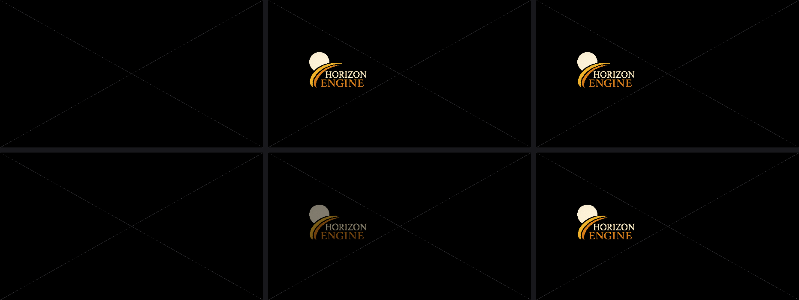
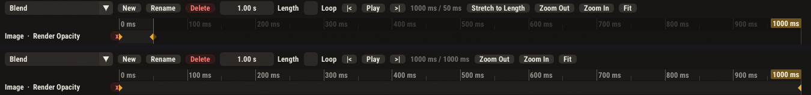

# Widget-Designer: vier Befunde, Diagnose (Thema 107, Schritt 1)

Stand 29.09.2026, Basis `9c4aeeb1` (main). Nur Diagnose, **kein Fix**. Belege:
Code-Stellen unten, die echten Assets des Menschen im Projekt
`~/HorizonEngineProjects/Catania` (`UI/Startup.hasset`, `UI/Source/HE_Logo.hasset`),
zwei Repro-Tests in `tests/test_widget_designer_ui.cpp` und Bilder unter
`docs/img/widget-designer-bugs-107/`.

Nachtrag Schritt 2: Fix für **(1) + (4)** umgesetzt, siehe „Fix (Schritt 2, umgesetzt)“ im
Abschnitt (1) + (4).
Nachtrag Schritt 3: Fix für **(2)** umgesetzt, siehe „Fix (Schritt 3, umgesetzt)“ im Abschnitt (2).
Nachtrag Schritt 5: Fix für **(3)** umgesetzt, siehe „Fix (Schritt 5, umgesetzt)“ im Abschnitt (3).
Nachtrag Schritt 6: Vollbau, volle Suite und Gesamtprüfung aller vier Fixes, siehe
„Gesamtprüfung (Schritt 6)“ am Ende.

## Kurzfassung

| # | Befund | Ursache | Pfad | Hängt zusammen mit |
|---|--------|---------|------|--------------------|
| 1 | Karo statt Transparenz | Leinwand zeichnet das Content-Browser-Tile, in das das Karo **eingebacken** ist (Alpha auf 255 gezwungen) | Editor, Designer-Leinwand | **4** (gleiche Ursache) |
| 4 | Vorschau niedrig aufgelöst | dasselbe Tile: 128 × 128 px, aus 1024 × 1024 herunterskaliert | Editor, Designer-Leinwand | **1** |
| 2 | Logo orange (Designer) vs. rot (Spiel) | Spiel-UI-Pass tastet eine `_sRGB`-Textur ab (Hardware dekodiert nach linear) und schreibt in ein **Unorm**-Ziel, ohne zurückzukodieren. **Falsch ist das Spiel**, der Designer zeigt die richtigen Farben | Laufzeit-Renderer (Metal **und** GL) | unabhängig |
| 3 | Opacity-Animation poppt | keine fehlende Interpolation: der zweite Key des Menschen liegt bei **t = 0,0503 s** in einem 1-s-Clip, und ein Clip endet an seinem letzten Key → Blende nach 3 Frames fertig | Autorendaten + Timeline-UX (Editor), Laufzeit verhält sich gleich | unabhängig |

Also: **1 + 4 haben eine Wurzel**, **2** und **3** sind voneinander und von 1/4 unabhängig.
Die Nähe von 2 zum „Spiegel-Bug“ aus Thema 92 ist nur thematisch. Jener war die
Zeilenreihenfolge (Kopfstand), das hier ist der Farbraum.

---

## (1) + (4) Die Leinwand malt das Content-Browser-Tile

**Wo.** `src/HE_Editor/UIEditorPanel.cpp:4141-4142` (`drawElementIn`) holt das Bild eines
Elements über `AssetThumbnailCache::get(contentRoot + "/" + n.texture)`. Das ist derselbe
Cache, der die Kacheln im Content Browser füllt. Genutzt für die Seite selbst (`:4507`) und für
eingebettete Widgets (`:4302`). Gezeichnet wird mit `dl->AddImage(..., uv 0..1, tint)` in
`drawElementPreview` (`:3489`, `:3493`).

**Was das Tile ist.** `src/HE_Editor/AssetThumbnailCache.cpp:201-265` (`makeTextureThumbnail`):
- `kThumbSize = 128` (`:35`): das 1024er-Logo kommt mit 1/8 der Kantenlänge an → **Befund 4**.
  Box-Filter mit höchstens 4 × 4 Abtastungen pro Zielpixel.
- `:254-261`: jedes Pixel wird **über ein Karo komponiert** (`bg = 90 / 130`, 16-px-Felder),
  danach `dst[3] = 255` → **Befund 1**. Die Transparenz ist beim Erzeugen des Tiles schon
  „verbraucht“, die Leinwand kann nicht mehr durchscheinen.
- Letterbox (`:212-218`): ein nicht quadratisches Bild liegt mittig in einem quadratischen Tile
  mit leeren Rändern (Alpha 0). Da `drawElementPreview` das **ganze** Tile mit UV 0..1 auf das
  Element legt (`UIEditorPanel.cpp:3493`), wird ein nicht quadratisches Bild im Designer
  zusätzlich **gestaucht und mit Rand** gezeigt. Nebenbefund, gleiche Ursache.

**Ist das Karo Absicht?** Ja, **für die Kachel im Content Browser**: Kommentar
`AssetThumbnailCache.h:78-82` („otherwise a transparent texture reads as half-missing on the
dark tile“). Dort ist es richtig. Der Bug ist, dass die Designer-Leinwand sich **dieses Tile
ausleiht**, statt die Textur selbst zu zeigen. Der Textur-Viewer aus Thema 92 macht es richtig:
Karo nur *hinter* dem Bild, volle Auflösung (`TextureViewerPanel.cpp`, `toDisplayRgba`).

**Reproduziert.**
- Test `repro 107: designer canvas draws the thumbnail tile, checker and all` (standardmäßig
  `skip`, weil er den Bug festnagelt). Echter `UIEditorPanel::render` mit einem Stub-Renderer,
  dessen `CreateImGuiTexture` in den Software-Rasterizer lädt. Der Cache lädt also *wirklich* hoch,
  und die Leinwand zeigt genau sein Bild. Prüft: hochgeladen wurde 128 × 128, nichts ≥ 1024. Die
  Karo-Grautöne 90/130 tauchen auf der Leinwand auf und fehlen in der Negativkontrolle (gleicher
  Designer ohne Renderer).
  `HE_UI_DUMP_DIR=/tmp/ui HE_REPRO107_LOGO=~/HorizonEngineProjects/Catania/Content/UI/Source/HE_Logo.hasset ./build/tests/he_tests -tc="repro 107*" --no-skip`
  Ergebnis am 29.09. (Debug, macOS, selbst gelesen): Upload **128x128** (einziger), Karo-Grau
  90/130 auf **12533/12748** Pixeln, in der Kontrolle **0/0**. 10/10 Assertions grün, ebenso mit
  dem generierten 1024er-Bild ohne `HE_REPRO107_LOGO`.
- Bilder (echter `UIEditorPanel::render`, headless):
  `designer-canvas-catania-logo.png` (ganzes Panel, echtes Catania-Logo),
  `designer-canvas-catania-logo-zoom.png` (Ausschnitt 3x: Karo, Treppenkanten des 128er-Tiles),
  `designer-canvas-generiertes-bild.png`, `designer-canvas-kontrolle-ohne-textur.png`.
- `logo-designer-vs-soll-vs-spiel.png` (links) und `logo-aufloesung-ausschnitt.png`: CPU-Nachbildung
  aus den echten Logo-Bytes. Das Tile wurde exakt nach `makeTextureThumbnail` nachgebaut und auf
  550 px (Elementgröße in Catania) hochskaliert.

**Fix (Schritt 2, umgesetzt).** Neuer Eintrag `AssetThumbnailCache::image(absPath)`: Level 0 der
Textur in voller Auflösung, Zeilen über `TextureViewerPanel::toDisplayRgba` gedreht, echtes Alpha,
nichts hineinkomponiert, roh als RGBA8-Unorm-ImGui-Textur (also weiter die Bytes des Designers, kein
sRGB-Format, siehe (2)). Eigene Map neben den Tiles, ohne Disk-Cache und ohne Budget pro Frame (das
Budget füllt nur `beginFrame` des Content Browsers auf, den man verbergen kann). Re-Stat wie ein Tile,
also aktualisiert ein Re-Import die Leinwand. Ein Bild, nach dem 5 s lang keiner fragt, wird wieder
freigegeben. `drawElementIn` (`UIEditorPanel.cpp`) fragt jetzt `image()` statt `get()`; das deckt Seite,
eingebettete Widgets und Flächen mit Textur. Das Content-Browser-Tile ist unverändert. Der Letterbox-
Nebenbefund ist damit mit weg (das Bild hat sein eigenes Seitenverhältnis). Der Repro-Test ist zum
Regressionstest umgedreht (`repro 107: designer canvas draws the texture itself, not the thumbnail tile`,
läuft normal mit): Upload 1024 × 1024, kein 128er-Tile, Karo-Grau 0/0, Alpha im Upload erhalten, Logo-
Orange auf der Leinwand. Gegenprobe mit dem alten `get()`: 5 Fehler. Nachher-Bilder:
`designer-canvas-catania-logo-nachher.png`, `designer-canvas-catania-logo-zoom-nachher.png` (3x, gleiche
Stelle wie der Vorher-Zoom). Farbabweichung (2) und Opacity (3) sind davon nicht berührt.

**Hinweis für den Fix (Stand Diagnose).** Die Leinwand braucht eine Textur in voller Auflösung
mit echtem Alpha, getrennt vom Tile-Cache. Das Tile muss für den Content Browser bleiben, wie es ist.
Ein Karo, falls überhaupt gewünscht, gehört höchstens *hinter* die Leinwandfläche (wie im
Textur-Viewer), nicht ins Bild. Vorsicht Speicher: eine 4K-Textur pro Bildelement als ImGui-Textur.

## (2) Farben: Designer orange, Spiel rot

**Asset.** `Catania/Content/UI/Source/HE_Logo.hasset`, TXMI: 1024 × 1024, RGBA8, 1 Mip,
**`srgb = 1`**. (Die Kopie in `CollabTest/Content/UI/Images/HE_Logo.hasset` hat `srgb = 0` und
zeigt den Fehler deshalb nicht.) Der Import-Dialog (`TextureColourSpaceDialog`) schlägt für Bilder
per Dateiname sRGB vor (`ImporterCommon.cpp:190` `suggestTextureSrgb`, `:727`). Jedes seit dem Dialog
importierte UI-Bild ist also betroffen, ältere nicht. Deshalb wirkt der Fehler neu.

**Spiel-Pfad (falsch).**
- Metal: `EncodeUIPass` bindet für ein Bild-Quad `ResolveGraphTexture(obj.textureAssetId)`
  (`MetalRenderer.mm` ≈ `:12443-12449`) → `uploadMetalTexture` → `metalTexPixelFormat` wählt bei
  `tex->srgb` **`MTLPixelFormatRGBA8Unorm_sRGB`** (`:8482-8490`). Der Sampler dekodiert dadurch nach
  linear. `uiFragment` Modus 2 (`:1344-1352`) gibt `color.rgb * t.rgb` unverändert aus. Die UI-Pipeline
  schreibt nach `kSwapchainFormat = BGRA8Unorm` (`:176`, `:6586`), also **ohne** sRGB-Kodierung beim Schreiben.
  Ergebnis: linear dekodierte Werte landen als wären sie sRGB → Mitteltöne viel dunkler und satter.
- OpenGL: gleich. `ResolveGraphTexture` (`OpenGLRenderer.cpp:7215-7217`) → `GL_SRGB8_ALPHA8`
  (`:7684`), während des UI-Passes ist `GL_FRAMEBUFFER_SRGB` aus (`:11345`).
- Einfarbige UI-Flächen, Text und Farbverläufe sind **nicht** betroffen: ihre Farben gehen roh als
  sRGB-Zahlen durch, genau wie im Designer. Nur **texturierte** Quads mit `srgb = 1`.
- D3D11/D3D12/Vulkan zeichnen UI-Bild-Quads laut Thema 92 gar nicht texturiert (nur Vollfarbe), dort
  zeigt sich der Fehler deshalb nicht.

**Designer-Pfad (richtig).** Das Tile wird aus den rohen Bytes gebaut (`makeTextureThumbnail`
ignoriert `srgb`) und per `CreateImGuiTexture` als **`RGBA8Unorm`** hochgeladen
(`MetalRenderer.mm:16782`). ImGui schreibt roh ins Unorm-Ziel. Bytes rein = Bytes raus.

**Zahlen (echte Logo-Pixel).** Orange (216,128,24) → im Spiel (175,55,2), Gelb (240,176,40) →
(222,111,5), Creme (253,242,215) → (250,226,173). Genau „orange wird rot“.
Bild: `logo-designer-vs-soll-vs-spiel.png`, rechts. CPU-Nachbildung der Dekodierung aus den echten
Bytes, **kein** GPU-Screenshot (headless gibt es keinen Metal-UI-Pass).

**Hinweis für den Fix (nicht umgesetzt).** `ResolveGraphTexture` / `m_graphTexCache` wird **auch vom
Material-Graphen** benutzt. Dort ist die lineare Dekodierung einer sRGB-Farbtextur **richtig**
(Beleuchtung rechnet linear, der Tonemapper kodiert am Ende). Man darf deshalb nicht global das
Upload-Format umstellen. Möglichkeiten: im UI-Pass eine Unorm-Sicht der Textur benutzen (Metal
`newTextureViewWithPixelFormat:` braucht `MTLTextureUsagePixelFormatView`; GL `glTextureView` erst
ab 4.3, macOS-GL ist 4.1, also dort eher `GL_TEXTURE_SRGB_DECODE_EXT`/Sampler-Parameter), oder
im `uiFragment` Modus 2 zurückkodieren (billig, aber doppelte Rundung in 8 Bit), oder ein eigener
UI-Upload ohne sRGB-Flag. UI-Materialien (Domain UI) prüfen: die tasten ebenfalls Graph-Texturen ab.

**Fix (Schritt 3, umgesetzt).** Gewählt ist der eigene UI-Upload ohne sRGB-Flag. Nur er ist
bitgleich mit dem Designer: rohe Bytes als Unorm, gefiltert im sRGB-Raum. Er braucht keine
Erweiterung (macOS-GL 4.1) und keine Metal-Textur-Sicht. Zurückkodieren im Shader hätte im linearen
Raum gefiltert und an Kanten vom Designer abgewichen.
- Metal: `uploadMetalTexture(device, tex, honourSrgb = true)`. Mit `false` nimmt es den Unorm-Zwilling
  (`metalTexPixelFormat` kennt ihn auch für ASTC/BC7/BC3). Neu ist `MetalRenderer::ResolveUITexture` mit
  eigenem `m_uiTexCache` (gleiche Schlüssel wie `m_graphTexCache`). Das Bild-Quad in `EncodeUIPass`
  bindet jetzt `ResolveUITexture` statt `ResolveGraphTexture`.
- OpenGL: gleich, `uploadTextureAssetGL(tex, honourSrgb = true)` → `GL_RGBA8` statt
  `GL_SRGB8_ALPHA8`, `OpenGLRenderer::ResolveUITexture` + `m_uiTexCache`, Bild-Quad im UI-Pass.
- Freigabe beim Herunterfahren und die Invalidierung bei Re-Import/Überschreiben
  (`m_pendingTexInvalidations`) räumen beide Caches. Ein neu importiertes UI-Bild erscheint also auch
  im Spiel neu.
- `m_graphTexCache` ist **unverändert**: Materialien tasten dieselbe Textur weiter linear ab, das ist
  dort richtig. Belegt eine Textur Material *und* UI, liegt sie zweimal im Speicher, einmal pro
  Farbraum.
- Mitgenommen: Die Widget-Kachel im Content Browser (`RenderWidgetThumbnail` → `EncodeUIPass`) zeigt
  Bilder jetzt ebenfalls in den Designer-Farben.
- **Nicht geändert: UI-Materialien (Domain UI).** Die Designer-Leinwand rendert sie nicht, sie zeigt nur
  einen Platzhalter mit dem Materialnamen (`UIEditorPanel.cpp:3523-3532`). Es gibt also keine
  Designer-Farbe, an die man angleichen könnte. Ein Material, das eine sRGB-Textur abtastet und direkt
  ausgibt, zeigt im Spiel weiterhin die dunkleren, linear dekodierten Werte. Ob UI-Materialien im
  sRGB-Zahlenraum (roh) oder linear abtasten sollen, muss der Mensch entscheiden. Es würde bestehende
  UI-Materialien sichtbar ändern.
- D3D11/D3D12/Vulkan: nichts zu tun, dort zeichnen UI-Bild-Quads nicht texturiert (siehe oben).

Test: `UI image quads sample their texture undecoded on Metal and GL (Thema 107)` in
`tests/test_culling.cpp` (Quelltext-Pin wie die übrigen Backend-Drift-Wächter dort; unter ctest gibt es
keine GPU und headless keinen Metal-UI-Pass). Er prüft pro Backend: Das Bild-Quad nutzt
`ResolveUITexture` und nicht `ResolveGraphTexture`, der Upload läuft mit `honourSrgb=false`, der Helfer
wertet den Schalter aus und die Invalidierung räumt beide Caches. Gegenprobe mit dem alten Aufruf in
Metal: 2 Fehler. **Nicht** auf echter GPU gegen das Catania-Logo gesehen: Ein Spiel-Screenshot mit
UI gibt es headless nicht. Erwartet nach dem Fix: Orange (216,128,24) bleibt (216,128,24), statt
(175,55,2) zu werden.

## (3) Render-Opacity-Animation poppt

**Daten des Menschen.** `Catania/Content/UI/Startup.hasset`, Clip „Blend“: `duration = 1.0`, eine
Spur `Render Opacity` an Element 1 (dem Logo), Keys **(0,0 s → 0,0)** und
**(0,050314 s → 1,0)**. Der Graph spielt ihn beim `Construct` vorwärts, nach `Delay 4 s`
rückwärts (`widget.playAnimation`, `direction Forward/Backward`).

**Auswertung ist in Ordnung.** `uiAnimEvaluate` (`UIWidgetAnim.cpp:153-188`) interpoliert Floats
linear mit Easing. Die Designer-Vorschau (`ScrubPreview`, `UIEditorPanel.cpp:4317-4350`) und die
Laufzeit (`WidgetManager.cpp:2378-2396`) benutzen denselben Auswerter. `uiAnimPlayEnd`
(`UIWidgetAnim.cpp:112-123`) beendet einen Clip an seinem **letzten Key**, nicht an `duration`. Das ist
gewollt und festgenagelt (`tests/test_ui_widgets.cpp:6950`, „the runtime ends one at its last key“).

**Folge.** Die Blende dauert 50 ms = 3 Frames bei 60 Hz, vorwärts wie rückwärts. Sie sieht aus wie
Rein-/Rausspringen, im Designer genauso wie im Spiel.

**Reproduziert.** Test `repro 107: the user's Render Opacity clip is over in three frames`
(läuft normal mit, er prüft Fakten und keinen Bug): gleiche Keys, echter `WidgetManager`,
60-Hz-Ticks. Gemessen am 29.09.:
- Key bei 0,0503 s: `f1=0.33 f2=0.66 f3=0.99 f4=1.00 … f60=1.00`
- Key bei 1,0 s: `f1=0.02 f4=0.07 f10=0.17 f30=0.50 f60=1.00`

**Wie kam der Key auf 0,05 s?** Aus einer **Maus-Geste in Spur oder Lineal**: Key-Ziehen bzw.
Scrubben mit anschließendem „Key“ setzt `view.tOf(mouse.x)` (`UIEditorPanel.cpp:2976`, `:3032`).
0,0503144654 = 40/795, also etwa 40 px auf einer rund 795 px breiten Spur bei Zoom 1.
Das „Time“-Feld im Key-Editor (`:2615`, `DragFloat(..., 0.005f, ..., "%.3f s")`) scheidet aus: ImGui
rundet beim Ziehen auf das Anzeigeformat (`imgui_widgets.cpp:2621`, kein `NoRoundToFormat`), dort
wäre exakt 0,050 herausgekommen, nicht 0,050314…. Vermutlich wurde der zweite Key knapp neben dem
ersten angelegt oder beim Anklicken ein Stück mitgezogen (Schwelle `IsMouseDragging`, wenige Pixel),
statt ans Ende der 1-s-Spur gesetzt zu werden.

Dazu kommt ein Darstellungsproblem: Die Timeline zeigt die volle `duration` (1 s). Dass der Clip
schon bei 0,05 s endet, sieht man nicht, obwohl die Laufzeit dort aufhört.
Nebenbefund (nicht die Ursache hier): Das „Value“-Feld für Float-Keys zieht mit 0,5 pro Pixel und
ohne Grenzen (`:2634`). Für Render Opacity (0..1) springt ein Key damit leicht auf −7 oder 12, und
`setPropAny` klemmt (`UIElement.cpp:1028`). Das würde ebenfalls wie ein Pop aussehen.

**Für den Fix-Schritt zu entscheiden (Mensch).** Soll ein Clip bis `duration` laufen
(dann änderte sich festgenagelte Semantik), oder soll die Timeline das Clip-Ende am letzten Key
sichtbar machen und das Setzen eines End-Keys erleichtern (z. B. „Key am Ende“, Time-Feld mit
feinerer Zieh-Geschwindigkeit relativ zur Clip-Länge, Value-Feld mit den Grenzen der Eigenschaft)?

**Fix (Schritt 5, umgesetzt).** Gewählt ist (a): Die Timeline macht den sauberen End-Key leicht.
Die Laufzeit-Semantik bleibt, wie sie ist.

*Warum die Laufzeit nicht geändert wird.* Der Mensch hatte freigegeben, dass ein Clip künftig bis
`duration` läuft. Das träfe aber nicht die Ursache. Mit Keys (0 s → 0) und (0,05 s → 1) dauert die
Blende auch dann 50 ms: vorwärts 50 ms Blende und danach 950 ms Stillstand, rückwärts erst 950 ms
Stillstand und dann 50 ms Blende. Das bleibt ein Pop, nur später. Interpoliert wird zwischen Keys,
nicht über die Länge. Solange der zweite Key bei 0,05 s liegt, hilft keine Laufzeit-Regel. Die bestehende
Regel („ein Clip endet an seinem letzten Key“, `test_ui_widgets.cpp`) hat dagegen einen eigenen Grund:
Ein Graph, der auf „fertig“ wartet, wäre sonst um den leeren Rest zu spät. Sie bleibt deshalb.

*Was der Editor jetzt tut* (`UIEditorPanel.cpp`, `drawTimeline`/`drawKeyEditor`):
- **„Key at End“** neben „Key“: ein Key exakt auf `duration` in der gewählten Spur. Er ist ausgewählt,
  der Playhead steht darauf, das Value-Feld darunter ist also schon der End-Zustand. Eine Blende sind
  damit vier Klicks ohne Zielen: Add Track, Value, Key at End, Value.
- **`|<` und `>|`** am Transport: Playhead an den Anfang bzw. exakt ans Ende der Länge (nicht an den
  letzten Key). Mit „Key“ dahinter ist das der zweite Weg zum End-Key.
- **Einrasten** beim Scrubben im Lineal und beim Ziehen eines Keys: Liegt der Zeiger höchstens 6 px
  neben Anfang, Ende oder einem anderen Key, landet er genau dort (`HE::Ed::uiTimelineSnap` in
  `UITimelineMath.h`, Toleranz in Pixeln, also bei jedem Zoom gleich). Alt schaltet das Einrasten ab.
  Das fängt den Fall „knapp neben dem Ende losgelassen“. Einen Key 40 px vor dem Ende, wie beim
  Menschen, fängt es **nicht**, das ist eine echte Wahl und bleibt eine. Dafür sind „Key at End“ und
  `>|` da.
- **Greif-Versatz beim Key-Ziehen:** Der Key bewegt sich um den Weg des Zeigers und springt nicht mit
  seiner Mitte unter den Zeiger, sobald die Zieh-Schwelle überschritten ist. Ein Klick neben die Mitte
  verschiebt ihn also nicht mehr.
- **Time-Feld** zieht relativ zur Länge (`duration / 200` pro Pixel statt fest 5 ms). **Value-Feld**
  für Floats nimmt die Grenzen der Eigenschaft (`UIPropDesc::minV/maxV`, Render Opacity 0..1) mit
  `AlwaysClamp` und zieht über 200 px den ganzen Bereich. Der Nebenbefund (Opacity springt auf −7
  oder 12 und wird geklemmt) ist damit weg.
- **„Stretch to Length“** in der Transport-Leiste, nur sichtbar, solange der letzte Key vor der Länge
  liegt (also der Rest der Spur grau ist). Ein Klick multipliziert alle Key-Zeiten aller Spuren mit
  `duration / uiAnimPlayEnd()`, der letzte Key landet exakt auf der Länge, die Abstände behalten ihre
  Verhältnisse. Undo nimmt es zurück. Logik: `HE::uiAnimStretchToLength` (`UIWidgetAnim.cpp`).
- Hilfe-Einträge für `|<`, `>|`, „Key at End“ und „Stretch to Length“, der Eintrag zu „Key“ nennt das
  Einrasten.

*Die Daten des Menschen* (`~/HorizonEngineProjects/Catania/Content/UI/Startup.hasset`, nicht in
diesem Repository) sind nicht angefasst. Reparatur im Designer: Clip „Blend“ öffnen und
„Stretch to Length“ drücken (Key von 0,05 s auf 1,0 s). Alternativ den Key ans Ende ziehen (er rastet
ein) oder in sein Time-Feld 1 tippen.

*Tests.* `Clips: stretching to the length puts the last key on the end` (`test_ui_widgets.cpp`, der
Clip des Menschen: Key danach exakt bei 1,0, Mittel-Key bei 0,5, Opacity bei 0,5 s = 0,5; nichts zu tun
bei Key schon am Ende, nur Key bei 0 oder ohne Keys), `Timeline snap: a pointer near a moment people aim at lands on it (Thema 107)`
(`test_ui_widgets.cpp`, reine Arithmetik) und `repro 107: the timeline puts an end key exactly at the end`
(`test_widget_designer_ui.cpp`, echte Timeline headless bedient). Der zweite öffnet den Clip über die
Combo, wählt die Spur und drückt „Key at End“ (Key exakt bei 1,0). Dann zieht er den Key weg, mit Alt
zurück bis 3 px vor das Ende (bleibt bei ≈ 0,994 s, die Kontrolle), klickt ohne Weg (Key bleibt liegen)
und zieht ohne Alt wieder hin (rastet auf 1,0). Der Fakten-Test `repro 107: the user's Render Opacity
clip is over in three frames` bleibt unverändert grün, weil die Laufzeit sich nicht geändert hat.

## Unabhängigkeit

- 1 und 4: **eine** Ursache (Leinwand ← `AssetThumbnailCache`). Ein Fix trifft beide, dazu den
  Letterbox-Nebenbefund.
- 2: unabhängig, liegt im **Laufzeit**-Renderer. Ein Fix von 1/4 ändert daran nichts. Umgekehrt: Würde
  der Designer künftig eine GPU-Textur mit sRGB-Format zeigen, müsste er ebenfalls in einer Unorm-Sicht
  abtasten, sonst kippt er auf dieselbe Seite wie das Spiel.
- 3: unabhängig, Autorendaten plus Timeline-UX.

## Gesamtprüfung (Schritt 6)

Stand 29.09.2026, Zweig auf `4bcf020c` plus der Test unten. Debug, macOS, alles im Vordergrund
abgewartet und selbst gelesen.

**Vollbau.** `cmake --build build -j8`, rc = 0, 0 Fehler. Alle Objekte der geänderten Quellen sind
jünger als ihre Quellen, es gibt also keine veralteten `.o`.

**Volle Suite.** `ctest -j4` im Build-Verzeichnis: **100 % bestanden, 220 von 220**. Übersprungen sind
nur die drei `runtime_size*`, wie immer im Debug-Build. Laufzeit 691 s. Nach dem neuen Fall liefen
`test_widget_designer_ui`, `test_ui_widgets` und `test_culling` noch einmal, 3 von 3 grün, diesmal ohne
`HE_REPRO107_LOGO`, also mit dem generierten Bild wie auf CI.

**Alle vier auf einer Leinwand.** Neuer Fall `repro 107: all four fixes together on one canvas`
(`tests/test_widget_designer_ui.cpp`). Die einzige Stelle, an der sich die Fixes treffen können, ist
die Leinwand: Die Deckkraft der Blende (3) läuft als Tint-Alpha (`uiElementEffectiveOpacity`) über den
neuen Bildpfad `AssetThumbnailCache::image` (1 + 4). Der Fall baut die Catania-Seite nach, mit dem Logo
550 × 550 und dem Clip „Blend“ des Menschen mit Key (0 s → 0) und (0,0503 s → 1). Dann bedient er den
echten Designer wie ein Mensch: Clip über die Combo öffnen, `|<`, `Play`, etwa eine halbe Sekunde
laufen lassen, `Stop`, `>|`. Das geschieht einmal wie authored und einmal nach „Stretch to Length“.
Gemessen wird nur im Leinwand-Fenster. Pixel, die sich zwischen Anfang und Ende um mehr als 24 ändern,
müssen zur halben Zeit zwischen beiden liegen.

Ergebnis mit dem echten Catania-Logo (`HE_REPRO107_LOGO=…/Catania/Content/UI/Source/HE_Logo.hasset`):

| Zustand | Pixel, die die Blende ändert | echt dazwischen | außerhalb | mittlerer Fortschritt zur Hälfte |
|---|---|---|---|---|
| wie authored (Key bei 50 ms) | 14343 | 0 | 0 | 1,00 (nach 0,5 s schon ganz da, der Pop) |
| nach „Stretch to Length“ (Key bei 1000 ms) | 14343 | 14343 | 0 | **0,51** (bei 517 ms) |

Dazu: hochgeladen wurde 1024 × 1024 und kein 128er-Tile. Das Karo-Grau 90/130 liegt in keinem der drei
Momente über der Schwelle, und nach dem Strecken liegt der Key exakt bei 1,0 s. Mit dem generierten
Bild ist der Fall ebenso grün.

- `schritt6-leinwand-blende-vorher-nachher.png`: Leinwand-Ausschnitt bei 0 ms, etwa 0,5 s und am Ende,
  oben wie authored, unten gestreckt. Oben ist das Logo zur Hälfte schon voll da, unten halb durchsichtig.
- `schritt6-timeline-vorher-nachher.png`: die Transport-Leiste. Vorher steht dort „50 ms / 50 ms“, der
  Rest der Spur ist grau und „Stretch to Length“ ist zu sehen. Nachher „517 ms / 1000 ms“, der End-Key
  sitzt am Ende und der Knopf ist weg.
- `schritt6-zoom-ende-3x.png`: Logo-Kante am Ende, 3-fach. Die Kanten sind scharf, das Leinwand-Raster
  scheint zwischen den Buchstaben durch, es gibt kein Karo und die Farben sind die des Designers.
- `schritt6-designer-halbe-sekunde.png`: der ganze Designer bei 517 ms, 1920 × 1200.

**(2) in dieser Prüfung.** Headless gibt es keinen Metal- oder GL-UI-Pass. Die Spielseite von (2) ist
hier deshalb **nicht** als Bild gesehen. Belegt ist sie durch den Quelltext-Wächter in `test_culling`
(grün) und durch die Bestätigung des Menschen am echten Zweig. Dass sich (2) und (1 + 4) nicht stören,
ergibt sich aus dem Code, nicht aus einem Bild: Die Designer-Leinwand (`image()` → `CreateImGuiTexture`,
RGBA8-Unorm) und der Spiel-UI-Pass (`ResolveUITexture`, `honourSrgb = false`) laden beide die rohen
Bytes als Unorm. Beide Seiten zeigen also dieselben Zahlen.

**Nebenbefund (nicht behoben).** „Stretch to Length“ steht ganz rechts auf der Transport-Leiste, hinter
der Zeitanzeige, deren Breite mit dem Playhead wächst. Bei einem 1280 px breiten Designer ist die mittlere
Spalte etwa 700 px breit, und die Leiste endet hinter `>|`. Der Knopf, und auch „Zoom Out/In/Fit“, liegt
dann unsichtbar außerhalb, und die Leiste scrollt nicht. Das zeigt der erste Lauf dieses Falls, der deshalb
jetzt mit 1920 px schießt. Ganz sichtbar ist der Knopf nach Augenmaß ab etwa 1450 px Designer-Breite. Auf
einem kleinen Laptop-Bildschirm ist der Reparatur-Knopf also womöglich gar nicht zu sehen. „Key at End“
und `>|` bleiben erreichbar, sie stehen weiter links. Umstellen, etwa in die Zeile mit „Key at End“, ist
eine eigene Entscheidung.

## Wieder geöffnet: „poppt im Spiel weiterhin“ (Schritt 10, nur Diagnose)

**Frage.** Interpoliert die Laufzeit Render Opacity überhaupt, oder setzt sie nur den nächsten Key bzw.
den Endzustand? Und läuft Opacity durch denselben Pfad wie Position, Rotation, Size und Farbe?

**Antwort: Die Laufzeit interpoliert, für jede Eigenschaft auf demselben Weg. Es poppt, weil die Daten des
Menschen nie repariert wurden.**

*Der Weg im Spiel, Glied für Glied:*
- HC-Knoten `widget.playAnimation` → `HE::api::widget::playAnimation` (`EngineApi.cpp:1396`) →
  `ScriptApi::playClipAsAuthored` (`ScriptApi.cpp:338`) → `WidgetManager::playAnimation`
  (`WidgetManager.cpp:2183`). Die Richtung wird per Name übergeben, einen Sonderfall gibt es nicht.
- `GameApplication.cpp:3008` ruft jeden Frame `widgets().tick(deltaTime)` auf, mit rohem dt. dt ist auf 0,25 s
  gedeckelt (`Application.h:251`, `Application.cpp:304`). Ein langer erster Frame nach dem Laden frisst
  also höchstens eine Viertelsekunde, einen Pop über mehrere Sekunden erklärt er nicht.
- `WidgetManager::tick` (`:2354-2428`): `p.t += dt`, dann `uiAnimEvaluate(clip, uiAnimDirectedTime(...))`,
  jede Probe per `setPropAny` zurück. Eine Weiche nach Eigenschaft oder Typ gibt es nicht.
- `uiAnimEvaluate`/`between` (`UIWidgetAnim.cpp:146-204`): Der Wert wird zwischen dem letzten Key ≤ t und
  dem ersten Key > t bestimmt, das Easing gehört zum Ziel-Key.

  | Typ | Eigenschaften (Beispiele) | Laufzeit |
  |---|---|---|
  | Float | Render Opacity, Rotation, Shadow Blur | linear + Easing |
  | Vec2 | Position, Size, Shadow Offset | linear + Easing |
  | Color | Tint, Shadow Color | linear + Easing, auf [0,1] geklemmt |
  | Int/Bool/String | Visible, Tab Index, Text | springt auf den nächsten Key (`default: return b.value`) |

  Int/Bool/String bietet „Add Track“ gar nicht an (`UIEditorPanel.cpp:3216`), die gibt es also nur in
  einer von Hand bearbeiteten Datei. Render Opacity ist ein Float (`UIElement.cpp:967`), der Setter klemmt
  auf 0..1 (`:1028`).
- `WidgetManager::extract` (`:6190`) multipliziert `uiElementEffectiveOpacity` in `color.a` **jedes** Quads,
  das das Element ausgibt. Der Metal-UI-Shader (`uiFragment`, `MetalRenderer.mm:1331`) und GL
  (`OpenGLRenderer.cpp:2943/2949`) nehmen `color.a` in allen drei Modi mit: Fläche, Glyphe und
  Bild (`color.a * t.a`). D3D/Vulkan sind nicht gelesen, der Mensch spielt auf macOS.
  Einzige Ausnahme: ein Image mit **eigenem Material** geht über die Material-Pipeline, dort
  bekommt der Material-Shader `u.color` und ist selbst fürs Alpha zuständig. Das Catania-Logo hat nur
  eine Textur und kein Material, es ist hier also nicht die Ursache.

*Repro mit frischem Clip.* `repro 107: a multi-key Render Opacity clip interpolates in the game path`
(`tests/test_widget_designer_ui.cpp`): 3 s, Render Opacity 0 → 1 (Out Quad) → 0,25 → 1 bei 0/1/2/3 s,
dazu Position, Size, Rotation und Tint auf demselben texturierten Image. Er läuft über `playAnimation`,
`tick(1/60)` und `extract`, vorwärts und rückwärts. Gemessen am 30.09.:
- vorwärts: `f1=0.033 f15=0.438 f30=0.750 f60=1.000 f90=0.625 f120=0.250 f150=0.625 f180=1.000`
- rückwärts: `f1=0.988 f30=0.625 f60=0.250 f90=0.625 f120=1.000 f150=0.750 f180=0.000`
- 179 verschiedene Alpha-Werte in 180 Frames, größter Schritt 0,033 pro Frame. Quad-Alpha ist genau die
  Element-Opacity, die Abweichung zum Evaluator liegt bei höchstens 4·10⁻⁶. Bei 1,5 s stehen Position,
  Size, Rotation und Tint jeweils genau auf der Hälfte.

*Die Daten des Menschen, Stand 30.09.* `~/HorizonEngineProjects/Catania/Content/UI/Startup.hasset`,
geändert am **28.09. 13:52**. Clip „Blend“ hat unverändert Keys **(0 s → 0)** und **(0,050314 s → 1)**.
„Stretch to Length“ ist am 29.09. 21:52 dazugekommen (`4bcf020c`), gemergt um 23:12 (`088424dd`). Die
Datei ist also älter als die Reparatur und wurde danach nie wieder gespeichert. Damit endet der Clip bei
0,05 s: vorwärts beim `Construct` 3 Frames Blende, nach dem `Delay` rückwärts wieder 3 Frames. Das ist
genau das berichtete Rein/Raus, im Spiel wie im Designer. Es ist das einzige Widget mit Clips in
`~/HorizonEngineProjects`.

Womöglich hat der Mensch den Knopf nie gesehen. „Stretch to Length“ liegt unter etwa 1450 px
Designer-Breite außerhalb der Transport-Leiste (Nebenbefund Schritt 6, oben), und ein MacBook-Air-Display
erreicht das im Designer-Layout kaum.

**Nicht gesehen:** Pixel aus einem laufenden Spiel. Headless gibt es keinen Metal/GL-UI-Pass (siehe (2)).
Belegt ist die GPU-Seite deshalb durch den Shader-Quelltext, nicht durch ein Bild.

**Entscheidungshilfe.** Den Clip reparieren: „Stretch to Length“ (oder den Key auf 1,0 s ziehen bzw. in
sein Time-Feld 1 tippen), **speichern**, das Spiel neu starten. Poppt es danach im Spiel immer noch, bitte
die gespeicherte `Startup.hasset` anhängen. Erst dann wäre die Laufzeit wieder verdächtig, mit der
heutigen Datei erklären die Daten allein alles. Kein Fix in diesem Schritt.

## Catania-Clip repariert (Schritt 11)

**Was geändert wurde.** `~/HorizonEngineProjects/Catania/Content/UI/Startup.hasset`, Clip „Blend“: der zweite
Render-Opacity-Key liegt jetzt bei **1,0 s** statt 0,0503 s, Länge weiter 1 s. Sonst nichts: gleiche UUID,
dieselben Elemente, derselbe Graph. Die Datei war am 30.09. um 11:15 gespeichert, md5 vorher
`596ad7843f51960a3c337c3eb45f496c`, nachher `f7e845fc94aec892d8431a72ae08628e`.

**Warum „Stretch to Length“ und kein neuer Endkey.** Der Graph spielt „Blend“ beim `Construct` vorwärts, wartet
4 s (`Delay`) und spielt ihn rückwärts, beide Male mit `restoreAfterCompleted = false`. Gemeint ist also: Logo
über eine Sekunde einblenden, stehen lassen, über eine Sekunde ausblenden. Der Clip ist schon 1 s lang, es fehlt
nur der Key am Ende. Ein zusätzlicher Endkey (1 s → 1) hätte den 0,05-s-Sprung am Anfang behalten, das Strecken
verteilt die eine Blende über die ganze Sekunde.

**Wie.** Mit dem Werkzeug aus Schritt 5, nicht von Hand (die `.hasset` hat einen Binärkopf mit Längenfeldern).
Der Test `repro 107: the Catania Startup widget repaired in the designer` öffnet die Datei im Widget-Designer
(headless, `UIEditorPanel`), wählt „Blend“ im Clip-Combo, klickt „Stretch to Length“ und speichert
(`UIEditorPanel::save` → `saveState` → `ContentManager::saveAsset`, derselbe Weg wie der Speichern-Knopf).
Standardmäßig läuft er auf einer Kopie der Originalbytes (`tests/fixtures/catania_startup_107.h`). Mit
`HE_REPAIR107_CONTENT=<Projekt>/Content` arbeitet er in der Projektdatei selbst. So ist die Catania-Datei einmal
repariert worden. Ein zweiter Lauf auf der reparierten Datei prüft nur und schreibt nichts (md5 unverändert).

**Geprüft, nach dem Speichern, mit frischem ContentManager von der Platte:**
- UUID gleich, Keys (0 s → 0) und (1 s → 1), Länge 1 s. Der Baum ist genau der, den Stretch aus dem alten macht,
  der Graph ist inhaltlich gleich (siehe Nebenbefund).
- Spielpfad (`playAnimation`, `tick(1/60)`, `extract`, Alpha des Logo-Quads), vorwärts:
  `f1=0.017 f2=0.033 f3=0.050 f10=0.167 f20=0.333 f30=0.500 f40=0.667 f50=0.833 f60=1.000 f70=1.000`,
  rückwärts spiegelbildlich bis `f60=0.000`. 59 Stufen, größter Schritt 1/60. Vorher war dieselbe Kurve nach
  4 Frames bei 1.
- Designer-Leinwand mit dem echten Catania-Logo, Momente |<, 0,5 s Play, >|: Von den 14 539 Pixeln, die die
  Blende ändert, lagen bei 0,5 s vorher **0** zwischen Anfang und Ende (Mittel 1,0, der Pop), nachher **alle
  14 539** (Mittel 0,51).

*Oben die Fassung vom 28.09., unten die reparierte, jeweils Start, 0,5 s und Ende.*

*Oben der Key bei 50 ms, grauer Rest und „Stretch to Length“ angeboten. Unten der Key bei 1000 ms, Knopf weg.*

Vorher- und Nachher-Datei liegen unter `img/widget-designer-bugs-107/catania/`. Catania ist kein Git-Repo, das
dort ist die einzige versionierte Sicherung.

**Nicht gesehen:** ein Bild aus dem laufenden Spiel. Headless gibt es keinen Metal/GL-UI-Pass (siehe (2)), belegt
ist der Spielpfad bis zum Quad-Alpha, das der Shader multipliziert.

**Achtung, laufender Editor.** Als repariert wurde, lief ein Editor mit Catania offen. Sein ContentManager lädt die
Datei nach ≤ 1,5 s nach (Hot-Reload, `EditorApplication.cpp:2812`), PIE sieht den Fix also. Ein **offener**
Designer-Tab „Startup“ hält aber seinen eigenen Baum. Speichern dort (auch „Save All“) schreibt die alte
0,05-s-Fassung zurück. Den Tab ohne Speichern schließen und neu öffnen, oder den Editor neu starten.

**Nebenbefund (nicht behoben).** `HorizonCode::Node::pinDefaults` ist eine `std::unordered_map<int, Value>`
(`HorizonCode.h:553`). `toJson` schreibt die Pin-Defaults deshalb in Hash-Reihenfolge, und die kippt bei jedem
Laden und Speichern (hier 3,2,1 → 1,2,3 → 3,2,1). Inhaltlich ändert sich nichts, aber jede `.hasset` und
`.hcode` mit Pin-Defaults bekommt bei jedem Speichern einen Diff, auch ohne Änderung. Das stört in
Git-Projekten. Abhilfe wäre, in `toJson` nach Pin-Index sortiert zu schreiben.
